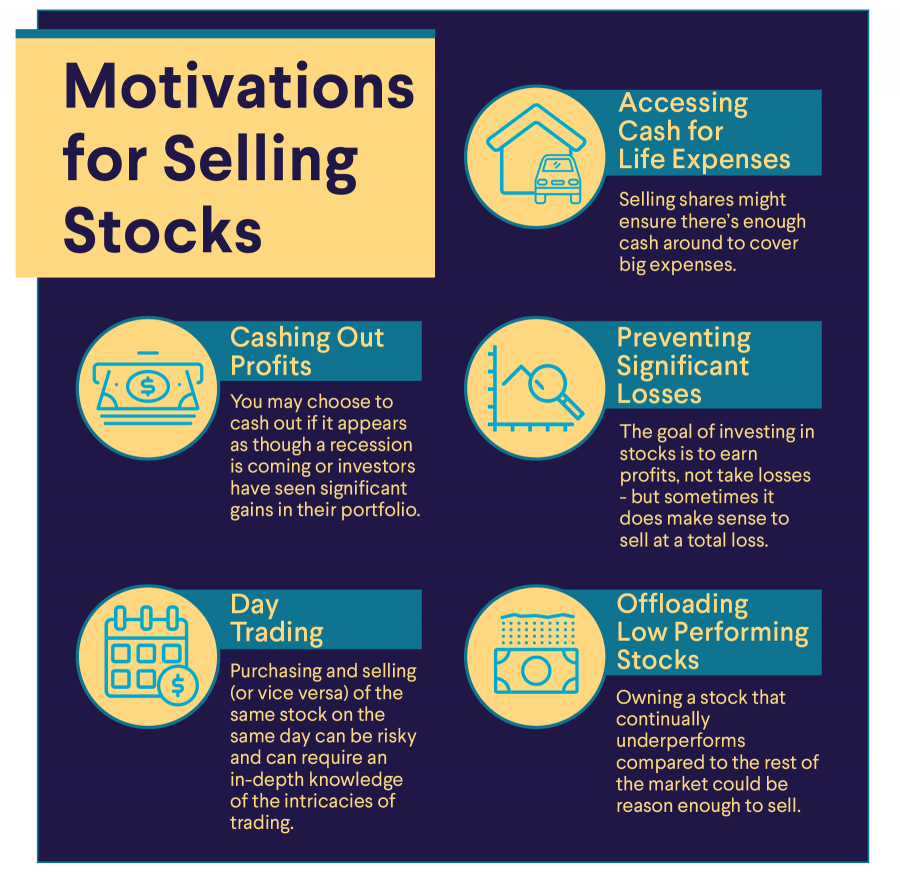

## Table of Contents

## What are the basic reasons someone might consider withdrawing from their stock market investments?

People might think about taking their money out of the stock market for a few main reasons. One big reason is if they need the money soon. The stock market can go up and down a lot, and if you need your money in a short time, it might be safer to put it somewhere else. Another reason is if they feel too worried about their investments. Watching the stock market can make people feel stressed, especially when it goes down. If it's keeping them up at night, they might decide to pull their money out to feel better.

Another reason someone might want to withdraw from the stock market is if their goals or life situation changes. For example, if they are getting close to retiring, they might want to move their money to safer investments. Or, if they suddenly need money for something important like buying a house or paying for medical bills, they might need to take their money out. It's important to think about why you invested in the first place and if those reasons have changed.

## How does the timing of withdrawal affect the overall returns from stock market investments?

The timing of when you take your money out of the stock market can really change how much money you end up with. If you take your money out when the market is doing well, you might get more money than you put in. But, if you take it out when the market is down, you might get less money back. This is because the value of your investments goes up and down with the market. So, if you can wait until the market goes back up, you might do better. But, waiting can be hard if you need the money right away or if you're feeling too worried about your investments.

Sometimes, trying to guess the best time to take your money out can be tricky. People who try to do this often end up selling when the market is low because they get scared, and then they miss out on the good times when the market goes back up. It's usually better to have a plan and stick to it, rather than trying to guess what the market will do next. If your plan says it's time to take your money out, then do it, no matter what the market is doing that day. This way, you don't let your feelings make your decisions for you, and you might end up with better results in the long run.

## What are the tax implications of withdrawing from stock market investments?

When you take money out of the stock market, you might have to pay taxes on it. If you made money from your investments, that's called a capital gain. The tax you pay on capital gains depends on how long you held the investment. If you held it for more than a year, it's called a long-term capital gain, and the tax rate is usually lower. If you held it for a year or less, it's a short-term capital gain, and you'll pay your regular income tax rate on it. So, the timing of when you sell can change how much tax you owe.

Also, if you take money out of a retirement account like an IRA or 401(k), there might be different tax rules. If it's a traditional IRA or 401(k), you'll usually have to pay income tax on the money you take out. And if you're younger than 59½, you might have to pay an extra 10% penalty too. But if it's a Roth IRA or Roth 401(k), you might not have to pay any taxes on the money you take out, as long as you follow the rules. It's a good idea to talk to a tax advisor to understand all the rules and make the best choices for your situation.

## How can one assess their financial readiness to withdraw from stock market investments?

To figure out if you're ready to take your money out of the stock market, start by looking at why you want to do it. Are you taking the money out because you need it for something important, like buying a house or paying for school? Or are you just feeling worried about the market going up and down? It's good to know your reasons because they can help you decide if it's the right time to take your money out. If you need the money soon, it might be a good idea to take it out, even if the market is down. But if you're just feeling worried, you might want to wait and see if the market goes back up.

Next, think about your overall money situation. Do you have enough saved up in other places, like a savings account or other investments, to cover your needs if you take your money out of the stock market? It's important to make sure you won't be left without enough money if something unexpected happens. Also, think about your long-term goals. If you're close to retiring or have other big plans, you might want to keep your money in the market a bit longer to let it grow. Talking to a financial advisor can help you understand all these things and make a plan that's right for you.

## What are the common withdrawal strategies for stock market investments?

One common withdrawal strategy for stock market investments is the bucket strategy. This means you split your money into different parts, or "buckets," based on when you'll need it. One bucket might be for money you need soon, so you put it in safe places like a savings account or bonds. Another bucket might be for money you won't need for a while, so you can keep it in the stock market to grow. This way, you can take money out of the safe bucket when you need it, without worrying about the ups and downs of the stock market.

Another strategy is the systematic withdrawal plan. This means you take out a set amount of money at regular times, like every month or every year. This can help you plan your spending and make sure you don't run out of money too soon. It's like getting a regular paycheck from your investments. You can adjust the amount you take out based on how your investments are doing and what you need. This strategy can be good if you want a steady income from your investments.

A third strategy is the percentage of portfolio withdrawal. With this, you take out a certain percentage of your total investments each year. A common rule is the 4% rule, where you take out 4% of your portfolio in the first year and then adjust for inflation each year after that. This strategy can help your money last longer because you're taking out less when the market is down and more when it's up. It's important to keep an eye on your investments and adjust your withdrawals if needed to make sure you don't run out of money.

## How does market volatility influence the decision to withdraw from stock market investments?

Market volatility means the stock market goes up and down a lot. When the market is very volatile, it can make people feel worried about their investments. If you're thinking about taking your money out of the stock market, you need to think about how much the ups and downs are bothering you. If you feel too stressed and it's keeping you up at night, you might decide to take your money out to feel better. But remember, if you take your money out when the market is down, you might lose money.

On the other hand, if you can handle the ups and downs, you might want to keep your money in the market. Over time, the stock market usually goes up, even if it has some big drops along the way. If you don't need your money right away, it might be better to wait and see if the market goes back up. Trying to guess the best time to take your money out can be hard, and you might end up selling when the market is low and missing out on the good times. So, it's important to have a plan and stick to it, rather than letting your feelings about market volatility make your decisions for you.

## What role does diversification play in managing withdrawals from stock market investments?

Diversification means spreading your money across different types of investments, like stocks, bonds, and maybe even real estate. When you're thinking about taking money out of the stock market, having a diversified portfolio can help. If the stock market goes down, your other investments might not go down as much, or they might even go up. This can make it easier to take money out without losing too much. It's like not putting all your eggs in one basket. If one investment does badly, the others might help balance it out.

Having a diversified portfolio can also make you feel less worried about taking money out. If you know your money is spread out, you might feel more comfortable taking some out of the stock market, even if it's going through a rough time. This can help you stick to your plan and not make quick decisions based on how the market is doing that day. Diversification can help you manage your withdrawals better and keep your overall investment strategy on track.

## How can one minimize the impact of inflation on their stock market investment withdrawals?

Inflation means the prices of things go up over time, so the money you take out of your investments might not buy as much as it used to. One way to fight inflation is to keep some of your money in investments that can grow faster than inflation, like stocks. If your investments grow more than inflation, you can take out more money each year and still keep up with rising prices. Another way is to plan your withdrawals carefully. If you know inflation is going up, you might need to take out a bit more money each year to cover the higher costs.

Another thing you can do is to have some of your money in things that usually do well when inflation goes up, like real estate or commodities. These can help protect your money from losing value because of inflation. It's also a good idea to talk to a financial advisor. They can help you make a plan that takes inflation into account and helps you decide how much money to take out each year. By thinking about inflation and planning ahead, you can make sure your money lasts as long as you need it to.

## What are the psychological factors to consider when planning to withdraw from stock market investments?

When you're thinking about taking your money out of the stock market, your feelings can play a big part in your decision. If the market is going up and down a lot, you might feel scared or worried. This fear can make you want to take your money out, even if it's not the best time. It's important to know if you're making a choice because you're scared or because it's really the right thing to do. If you're feeling too stressed, it might be better to take some money out and put it in safer places, so you can sleep better at night.

Another thing to think about is what you want your money to do for you. Are you taking it out because you need it for something important, like buying a house or paying for school? Or are you just feeling worried about the market? It's good to have a plan and stick to it, even when the market is making you feel nervous. Talking to someone you trust, like a friend or a financial advisor, can help you see things more clearly and make a decision that's good for you in the long run.

## How do different types of investment accounts (e.g., IRA, 401(k)) affect withdrawal strategies?

Different types of investment accounts, like an IRA or a 401(k), can change how you take money out. If you have a traditional IRA or 401(k), you'll usually have to pay taxes on the money you take out. If you're younger than 59½, you might also have to pay an extra 10% penalty. This means you might want to wait until you're older to take money out, so you don't have to pay that extra penalty. But if you really need the money, you might have to take it out and pay the taxes and penalty.

On the other hand, if you have a Roth IRA or Roth 401(k), the rules are different. You usually don't have to pay taxes on the money you take out, as long as you follow the rules. This can be a good thing if you think taxes might be higher in the future. You might want to take money out of your Roth accounts first, so you can keep more of it. It's a good idea to talk to a financial advisor to understand all the rules and make a plan that works best for you.

## What advanced techniques can be used to optimize withdrawal timing and amounts from stock market investments?

One advanced technique to optimize withdrawal timing and amounts from stock market investments is called dynamic withdrawal strategies. This means changing how much money you take out based on how your investments are doing. If the market is doing well, you might take out a bit more money. If the market is down, you might take out less. This can help your money last longer because you're not taking out the same amount every time, no matter what the market is doing. It's like adjusting your sails to the wind, so you can keep going in the right direction.

Another technique is using a floor-and-ceiling approach. With this, you set a minimum amount of money you need to take out each year, which is your "floor." You also set a maximum amount, which is your "ceiling." This way, you can make sure you have enough money to live on, but you're not taking out too much when the market is doing well. This can help you balance your need for money with the need to keep your investments growing. Talking to a financial advisor can help you figure out what these amounts should be and how to adjust them over time.

## How can one integrate stock market withdrawal plans with overall retirement planning?

When you're planning for retirement, it's important to think about how you'll take money out of your stock market investments. You need to make sure you have enough money to live on, but you also want your money to last as long as you need it. One way to do this is to have a plan for taking money out that fits with your overall retirement goals. If you know you'll need a certain amount of money each year, you can set up a regular withdrawal plan. This means taking out a set amount of money at the same time every year, like a monthly paycheck. This can help you plan your spending and make sure you don't run out of money too soon.

Another thing to think about is how your stock market withdrawals fit with other parts of your retirement plan. You might have money in different places, like a savings account, a pension, or Social Security. You'll need to figure out how much money to take from each place so you can cover your needs without using up all your money too fast. It's also a good idea to talk to a financial advisor. They can help you make a plan that takes everything into account, like taxes, inflation, and how long you think you'll need your money to last. By thinking about all these things together, you can make sure your stock market withdrawals are part of a bigger plan that helps you have a good retirement.

## References & Further Reading

[1]: Bengen, W. P. (1994). [Determining Withdrawal Rates Using Historical Data.](https://www.financialplanningassociation.org/sites/default/files/2021-04/MAR04%20Determining%20Withdrawal%20Rates%20Using%20Historical%20Data.pdf) Journal of Financial Planning.

[2]: Bergstra, J., Bardenet, R., Bengio, Y., & Kégl, B. (2011). [Algorithms for Hyper-Parameter Optimization.](https://dl.acm.org/doi/10.5555/2986459.2986743) Advances in Neural Information Processing Systems 24.

[3]: [Advances in Financial Machine Learning](https://www.amazon.com/Advances-Financial-Machine-Learning-Marcos/dp/1119482089) by Marcos Lopez de Prado

[4]: [Evidence-Based Technical Analysis: Applying the Scientific Method and Statistical Inference to Trading Signals](https://www.amazon.com/Evidence-Based-Technical-Analysis-Scientific-Statistical/dp/0470008741) by David Aronson

[5]: [Machine Learning for Algorithmic Trading](https://github.com/stefan-jansen/machine-learning-for-trading) by Stefan Jansen

[6]: [Quantitative Trading: How to Build Your Own Algorithmic Trading Business](https://www.amazon.com/Quantitative-Trading-Build-Algorithmic-Business/dp/1119800064) by Ernest P. Chan