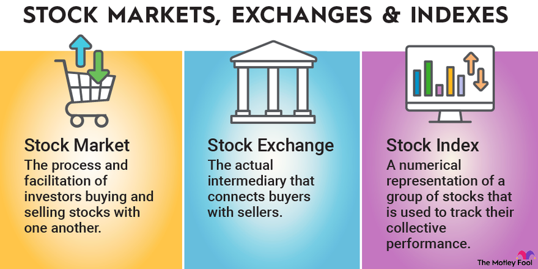

## Table of Contents

## What is the stock market and why is it important?

The stock market is a place where people buy and sell pieces of companies, called stocks or shares. When you buy a stock, you own a small part of that company. The price of a stock can go up or down based on how well the company is doing and what people think about it. There are many stock markets around the world, like the New York Stock Exchange and the Tokyo Stock Exchange.

The stock market is important for many reasons. It helps companies raise money to grow their business. When a company sells stocks, it gets money from investors to build new factories, hire more workers, or develop new products. The stock market also helps people save and invest their money. By buying stocks, people can earn more money if the company does well. This can help them save for things like retirement or buying a house. Overall, the stock market plays a big role in the economy by connecting companies that need money with people who want to invest.

## How does the stock market function as a platform for buying and selling stocks?

The stock market works like a big store where people can buy and sell pieces of companies, called stocks. When someone wants to buy a stock, they place an order through a broker, who is like a helper that makes the trade happen. The broker sends the order to the stock exchange, which is the place where all the buying and selling happens. If someone else wants to sell the same stock at the price the buyer is willing to pay, the trade is made. The price of the stock can change all the time based on how many people want to buy or sell it.

The stock market is important because it helps companies get money to grow. When a company wants to raise money, it can sell stocks to the public. People who buy these stocks are called investors. They hope that the company will do well and the price of the stock will go up, so they can sell it later for more money. The stock market also helps people save and invest their money. By buying stocks, people can earn more money over time, which can help them reach their financial goals like buying a house or saving for retirement.

## What are the main types of stocks and how do they differ?

There are two main types of stocks: common stocks and preferred stocks. Common stocks are the most common type that people buy. When you own common stocks, you get to vote on important company decisions and you can earn money if the company does well. The price of common stocks can go up and down a lot, which means they can be riskier but also have the potential for bigger rewards. If the company makes money, common stockholders might get some of it as dividends, but this is not guaranteed.

Preferred stocks are different because they usually don't let you vote on company decisions. However, they have some advantages. People who own preferred stocks get paid dividends before common stockholders. These dividends are often fixed, which means you know how much you will get. Preferred stocks are usually less risky than common stocks because their prices don't change as much. But, they also don't have as much potential for big gains. So, preferred stocks are good for people who want a steady income and less risk.

## How can someone begin investing in the stock market?

To start investing in the stock market, the first thing you need to do is open a brokerage account. A brokerage account is like a special bank account where you can buy and sell stocks. You can open one online with a company called a brokerage firm, like Robinhood or Charles Schwab. Once you have your account set up, you'll need to put some money into it. This money is what you'll use to buy stocks.

After you have money in your brokerage account, you can start [picking](/wiki/asset-class-picking) stocks to buy. You can do this by researching companies you're interested in and deciding which ones you think will do well in the future. You can buy stocks by placing an order through your brokerage account. It's a good idea to start small and learn as you go. Remember, investing in the stock market can be risky, so it's important to only invest money you can afford to lose and to think about your long-term goals.

## What are stock indices and how do they reflect market performance?

Stock indices are like scorecards for the stock market. They track the performance of a group of stocks to give people an idea of how the market is doing overall. For example, the Dow Jones Industrial Average is an index that follows 30 big companies in the U.S. When you hear that the Dow Jones went up or down, it means that, on average, the stocks of those 30 companies did better or worse.

Indices help investors understand market trends without having to look at every single stock. If an index like the S&P 500, which tracks 500 large companies, goes up, it suggests that the overall market is doing well. On the other hand, if it goes down, it might mean that the market is not doing so great. By watching these indices, investors can make smarter choices about when to buy or sell their stocks.

## What are the key factors that influence stock prices?

Stock prices go up and down because of many things. One big reason is how well the company is doing. If a company makes more money than people expected, its stock price might go up. But if the company does not do well, the stock price can go down. Another important thing is what people think about the company. If people believe a company will do well in the future, they might want to buy its stock, which can make the price go up. On the other hand, if people think the company will have problems, they might sell the stock, which can make the price go down.

The economy also plays a big role in stock prices. When the economy is doing well, more people might want to buy stocks, which can push prices up. But if the economy is not doing well, people might be scared and sell their stocks, which can make prices go down. News and events can also affect stock prices. For example, if there is good news about a new product from a company, its stock price might go up. But if there is bad news, like a problem with the product, the stock price might go down. All these things together make stock prices move every day.

## How do economic indicators affect the stock market?

Economic indicators are like clues that tell us how the economy is doing. They can affect the stock market a lot because they help people decide if they should buy or sell stocks. For example, if the unemployment rate goes down, it means more people have jobs and are making money. This can make people feel good about the economy, so they might want to buy more stocks, which can make stock prices go up. On the other hand, if inflation goes up a lot, it means things are getting more expensive. This can make people worried about the future, so they might sell their stocks, which can make stock prices go down.

Another important economic indicator is the Gross Domestic Product (GDP), which tells us how much all the goods and services in a country are worth. If the GDP is growing, it means the economy is getting bigger, and this can make people feel confident about buying stocks. But if the GDP is shrinking, it means the economy is getting smaller, and this can make people worried and sell their stocks. Overall, economic indicators give investors information that helps them make choices, and these choices can move the stock market up or down.

## What are the common strategies used for stock market investing?

One common strategy for stock market investing is called "buy and hold." This means you pick stocks you think will do well over a long time and keep them, even if the market goes up and down. People who use this strategy believe that good companies will grow over time, and their stock prices will go up. This strategy is good for people who don't want to check their stocks every day and are okay with waiting for their money to grow.

Another strategy is called "[day trading](/wiki/day-trading-spy)." This is when people buy and sell stocks very quickly, sometimes even within the same day. Day traders try to make money from small changes in stock prices. This strategy can be exciting but also risky because the market can be hard to predict. People who do day trading need to watch the market closely and be ready to make quick decisions.

A third strategy is "dollar-cost averaging." This means you invest a fixed amount of money into stocks at regular times, like every month. By doing this, you buy more shares when prices are low and fewer when prices are high. Over time, this can help smooth out the ups and downs of the market. Dollar-cost averaging is a good way for people to invest without trying to guess when the market will go up or down.

## How can one analyze a company's financial health before investing?

To analyze a company's financial health before investing, you can start by looking at its financial statements. These are like report cards that show how much money the company makes, how much it spends, and how much it owes. One important statement is the income statement, which tells you if the company is making a profit or a loss. Another is the balance sheet, which shows what the company owns and what it owes. You can also look at the cash flow statement, which tells you how much cash is coming in and going out. By looking at these statements, you can get a good idea of whether the company is in good financial shape.

Another way to analyze a company's financial health is by looking at financial ratios. These are like shortcuts that help you understand the numbers better. For example, the debt-to-equity ratio tells you how much the company is borrowing compared to what the owners have put in. A high ratio might mean the company is taking on too much debt, which can be risky. The price-to-earnings (P/E) ratio tells you how much people are willing to pay for the company's earnings. A high P/E ratio might mean people think the company will grow a lot in the future. By using these ratios, you can compare the company to others in the same industry and make a smarter decision about whether to invest.

## What are the risks involved in stock market investing and how can they be mitigated?

Investing in the stock market can be risky because stock prices can go up and down a lot. One big risk is that you could lose money if the stock price goes down and you sell it for less than you paid. Another risk is that the whole market might go down, which can happen if there's a big economic problem. Sometimes, companies can also have problems that make their stock prices drop, like if they lose money or if something bad happens to them. These risks can make investing in stocks feel scary, especially if you're new to it.

But there are ways to make these risks smaller. One way is to spread your money out by buying different kinds of stocks or even other things like bonds. This is called diversification. If one stock goes down, the others might go up and help balance things out. Another way is to keep your money in the market for a long time. Stocks can be bumpy in the short term, but they usually go up over many years. This is why it's good to think about your long-term goals when you invest. Also, learning as much as you can about the companies you're investing in can help you make better choices and feel more confident.

## How do global events and policies impact stock market trends?

Global events and policies can have a big impact on stock market trends. For example, if there's a war or a big natural disaster in another country, it can make people worried about the economy. This worry can make stock prices go down because people might sell their stocks to be safe. Also, if a country changes its rules about trade or taxes, it can affect companies that do business there. If the new rules make it harder for companies to make money, their stock prices might go down. On the other hand, if the rules help companies, their stock prices might go up.

Policies from governments and big organizations like central banks can also move the stock market. For example, if a central bank decides to lower interest rates, it can make borrowing money cheaper for companies. This can help them grow and make more money, which can make their stock prices go up. But if the central bank raises interest rates, it can make borrowing more expensive, which might slow down the economy and make stock prices go down. So, keeping an eye on what's happening around the world and what big organizations are doing can help you understand why the stock market is moving the way it is.

## What advanced tools and technologies are available for expert stock market analysis?

Expert stock market analysis often uses advanced tools and technologies to help make better decisions. One popular tool is called technical analysis software. This software helps people look at past stock prices and patterns to guess where the prices might go next. It uses charts and graphs to show how stocks have moved in the past and can even use math formulas to find trends. Another important tool is [fundamental analysis](/wiki/fundamental-analysis) software, which helps people look at a company's financial health by showing its income, expenses, and other important numbers. This can help investors decide if a company is a good investment based on how well it is doing.

Another advanced technology used in stock market analysis is [algorithmic trading](/wiki/algorithmic-trading). This is when computers use special programs to buy and sell stocks very quickly, sometimes even in less than a second. These programs can look at a lot of information at once and make decisions based on rules set by the people who made them. This can help traders take advantage of small changes in the market that might be hard for a person to see. Also, big data analytics is becoming more important. It uses huge amounts of information from many places, like news articles and social media, to find patterns and make predictions about what might happen in the stock market. These tools and technologies help experts make smarter choices and can give them an edge in the fast-moving world of stock trading.

## References & Further Reading

[1]: Hendershott, T., Jones, C. M., & Menkveld, A. J. (2011). ["Does Algorithmic Trading Improve Liquidity?"](https://onlinelibrary.wiley.com/doi/full/10.1111/j.1540-6261.2010.01624.x) The Journal of Finance.

[2]: International Monetary Fund. ["Historical Development of Stock Markets."](https://www.imf.org/external/pubs/ft/silent/index.htm)

[3]: Perez, M. F. (2018). ["Invisible Engines: Algorithmic Trading and Market Dynamics."](https://journals.sagepub.com/doi/abs/10.1177/0276146719875186)

[4]: Aldridge, I. (2013). ["High-Frequency Trading: A Practical Guide to Algorithmic Strategies and Trading Systems."](https://www.amazon.com/High-Frequency-Trading-Practical-Algorithmic-Strategies/dp/1118343506) Wiley.

[5]: Gomber, P., Arndt, B., Lutat, M., & Uhle, T. (2011). ["High-Frequency Trading."](https://papers.ssrn.com/sol3/papers.cfm?abstract_id=1858626) Business & Information Systems Engineering.

[6]: Narang, R. K. (2013). ["Inside the Black Box: A Simple Guide to Quantitative and High Frequency Trading."](https://onlinelibrary.wiley.com/doi/book/10.1002/9781118662717) Wiley. 

[7]: Farrell, N. J. (2018). ["Understanding the Impacts of Algorithmic Trading."](https://www.nature.com/articles/s41560-017-0075-y) Palgrave Macmillan.

[8]: Lopez de Prado, M. (2018). ["Advances in Financial Machine Learning."](https://www.amazon.com/Advances-Financial-Machine-Learning-Marcos/dp/1119482089) Wiley.