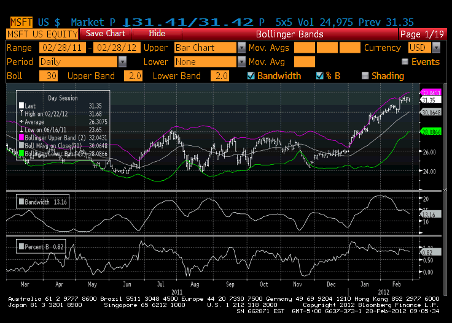

The stock market remains a pivotal element in the landscape of investment, serving as a dynamic platform where shares are bought, sold, and traded. With a history that spans centuries, it has continuously evolved, integrating new methodologies and technologies to facilitate economic growth and provide capital access to businesses worldwide [1]. In recent decades, the advent of algorithmic trading has added layers of complexity and efficiency, offering sophisticated strategies that can significantly enhance investment outcomes. Understanding these complexities is essential for investors aiming to refine and advance their strategies.

Modern investing is increasingly defined by rapid technological advancements and comprehensive data analysis. Algorithmic trading, which employs computer algorithms to execute trades based on predetermined criteria, exemplifies the intersection where finance meets technology. By minimizing human bias and optimizing execution speed, these algorithms have redefined trading strategies and efficiency [2]. Indeed, as markets continue to evolve, the integration of technology, data analytics, and speed has become crucial for gaining a competitive edge. 

This article focuses on the multifaceted nature of stock market investment, financial insights, and algorithmic trading's role in today's financial ecosystem. Investors now rely on these elements to navigate the complex landscape of the modern stock market effectively. By understanding and leveraging these components, investors position themselves to capitalize on future opportunities and mitigate potential risks. Staying informed about market dynamics and technological trends is indispensable for those seeking success in the financial markets.

As we proceed, this article will explore how technology, data, and strategic insight are reshaping the investment landscape and what it means for investors seeking to maintain a robust and adaptable strategy.

References:
[1] Historical Development of Stock Markets. International Monetary Fund.  
[2] Hendershott, T., Jones, C. M., & Menkveld, A. J. (2011). Does Algorithmic Trading Improve Liquidity? The Journal of Finance.

## Table of Contents

## Understanding the Stock Market

The stock market functions as a centralized venue where investors can buy and sell shares, generally facilitated through stock exchanges. It plays an essential role in economic growth by enabling companies to raise capital from investors, which can be used for expansion and development projects. This influx of capital allows businesses to innovate and expand, contributing to overall economic productivity and stability.

## Market Participants

The stock market is comprised of a diverse array of participants, including retail investors, institutional investors, and accredited investors. Retail investors are individuals who buy and sell securities for their personal accounts, often aiming to build wealth over time. These investors typically engage in market activities through brokerage platforms, leveraging various investment strategies to achieve their financial goals.

Institutional investors, on the other hand, such as mutual funds, pension funds, and insurance companies, manage large pools of capital. Their investment strategies can significantly influence market dynamics due to the [volume](/wiki/volume-trading-strategy) of trades they execute. Institutional investors often have access to sophisticated analytical tools and expertise, providing them with a strategic advantage in maximizing returns.

Accredited investors are individuals or entities that meet specific financial criteria, granting them access to exclusive investment opportunities not available to the general public. They might participate in private equity, venture capital, and hedge funds, utilizing their significant resources and financial acumen to capitalize on high-return investments.

## Role of Stock Exchanges

Stock exchanges are regulated platforms that facilitate the trading of securities, ensuring transparency, fairness, and efficiency in the market. Exchanges like the New York Stock Exchange (NYSE) and the Nasdaq provide a structured environment where investors can trade shares of publicly listed companies. These platforms enforce regulations and standards to maintain the integrity of the trading process, safeguarding investors against fraudulent activities.

Different countries have their stock exchanges, which play a critical role in the local and global economy. For instance, the Tokyo Stock Exchange and the London Stock Exchange serve as major financial hubs in their respective regions. By listing shares, companies gain visibility and credibility, attracting both domestic and international investors.

## Asset Classes in the Stock Market

The stock market encompasses a variety of asset classes, each offering unique risk and reward characteristics.

- **Stocks**: Represent ownership in a company, with shareholders having a claim on the company’s profits and assets. Stocks can provide dividends and capital gains, making them a popular choice for long-term investment strategies.

- **Exchange-Traded Funds (ETFs)**: Are investment funds traded on stock exchanges, similar to stocks. ETFs typically aim to track the performance of specific indices, providing diversification and liquidity to investors with lower fees than mutual funds.

- **Bonds**: Essentially loans made by investors to corporations or governments, with the agreement that the debt will be repaid with interest over a specific period. Bonds are typically considered less risky than stocks, offering a fixed income stream to investors.

- **Derivatives**: These financial instruments derive their value from underlying assets like stocks, bonds, commodities, or currencies. Common derivatives include options and futures, which can be used for hedging risks or speculation purposes.

Investors must understand these asset classes' characteristics to develop informed investment strategies, balancing risk, and potential returns in alignment with their financial objectives.

## Basics of Investment Strategies

Investors can choose from a variety of investment vehicles, each offering a distinct risk-reward profile that caters to different financial goals and risk appetites. The primary investment vehicles include individual stocks, exchange-traded funds (ETFs), and bonds. Each presents unique opportunities and challenges.

### Investment Vehicles:

1. **Individual Stocks**: Investing in individual stocks means purchasing shares of a particular company. This approach offers potentially high returns if the company performs well but also comes with significant risk if the company underperforms.

2. **Exchange-Traded Funds (ETFs)**: ETFs are collections of stocks or other securities that offer the advantage of diversification. They track indices or sectors, mitigating the risk associated with individual securities.

3. **Bonds**: Bonds are debt instruments representing a loan made by an investor to a borrower. They are considered safer than stocks and generally offer lower, stable returns, making them suitable for risk-averse investors.

### Investment Strategies:

- **Long-term Investment Strategies**: These strategies focus on the growth potential of a diversified portfolio over an extended period. The idea is to buy and hold a diversified mix of assets to ride out market fluctuations and benefit from compound growth. This strategy often involves investing in a mix of stocks, bonds, and ETFs to balance risk and reward.

- **Trading Strategies**: This approach involves short-term buying and selling to capitalize on market volatility. Traders aim to profit from small price fluctuations by executing numerous trades over short time frames. Strategies might include day trading, swing trading, or position trading.

### Key Concepts:

- **Diversification**: This principle involves spreading investments across various financial instruments, industries, and other categories to reduce exposure to any single asset or risk. Diversification helps mitigate losses and smooth out returns within a portfolio.

- **Risk Assessment**: Assessing risk involves understanding the potential for loss in an investment and comparing it to the potential for gain. Factors include market volatility, economic conditions, and the specific circumstances of the invested companies or governments.

- **Market Trends**: Successful investing requires understanding market trends to predict price movements. Trends can be influenced by economic indicators, corporate performance, geopolitical events, and investor sentiment.

### Analytical Approaches:

- **Fundamental Analysis**: This involves evaluating a security's intrinsic value by examining related economic and financial factors, including financial statements, management quality, industry conditions, and market position.

- **Technical Analysis**: In contrast, technical analysis focuses on statistical examination of market activity, such as historical prices and volumes. Technical analysts use charts and other tools to identify patterns and forecast future price movements.

Investors often blend both fundamental and technical analysis to ensure a comprehensive strategy tailored to their financial goals and risk tolerance. Each methodology provides valuable insights, and the combination can lead to more informed decision-making.

## The Rise of Algorithmic Trading

Algorithmic trading, which utilizes computer programs to execute trades based on set criteria like timing, price, and volume, has become a significant force in financial markets. This method seeks to refine trade execution and lower costs by reducing human biases and emotional decision-making, representing a paradigm shift in how financial transactions are conducted. 

One prominent type of [algorithmic trading](/wiki/algorithmic-trading) is high-frequency trading ([HFT](/wiki/high-frequency-trading-strategies)), which involves executing a large number of trades at extremely rapid speeds to take advantage of tiny price discrepancies. This small-margin, high-volume trading strategy necessitates advanced technological infrastructure and significant computational capability. By leveraging millisecond execution speeds, market participants can achieve substantial gains, albeit the strategy remains contentious due to its implications on market dynamics.

Despite the advantages of efficiency and cost reduction, algorithmic trading presents notable challenges. It contributes to increased market [volatility](/wiki/volatility-trading-strategies), as programs may react simultaneously to market signals, amplifying price movements. Furthermore, the rapid pace of trading can outstrip human decision-making capacity, potentially leading to unintended market outcomes. The infamous "Flash Crash" of 2010 exemplifies such a scenario, when the U.S. stock markets briefly plummeted, causing widespread disruption attributed to algorithmic strategies.

Regulatory scrutiny has intensified as authorities aim to ensure fairness and stability in markets heavily influenced by algorithms. Regulators have introduced measures such as circuit breakers and stricter reporting requirements to mitigate the risk associated with automated trading systems. These interventions seek to curtail the potential for market abuse and systemic risk, highlighting the necessity for a balanced approach in leveraging algorithmic strategies.

Investors and firms must therefore carefully evaluate the merits and limitations of algorithmic trading within the context of their investment objectives. While the efficiency gains are undeniable, a robust risk management framework is crucial to address potential pitfalls. As a continuously evolving field, algorithmic trading requires both sophisticated technology and prudent oversight to align with the long-term goals of market participants.

## Integrating Finance and Technology

Financial technology, commonly referred to as FinTech, is revolutionizing how investments and trades are conducted today. This transformation is largely driven by advancements in data analytics, [artificial intelligence](/wiki/ai-artificial-intelligence) (AI), and [machine learning](/wiki/machine-learning). These technologies are integral in crafting sophisticated trading algorithms that can process vast amounts of financial data at speeds and accuracies beyond human capabilities. The use of AI and machine learning facilitates predictive analytics and decision-making strategies, allowing for enhanced forecasts and optimized trading strategies.

One notable FinTech advancement is the emergence of robo-advisors. These digital platforms offer automated, algorithm-driven financial planning services. With minimal human intervention, robo-advisors analyze data to manage and allocate assets, rebalance portfolios, and offer personalized investment advice. Their accessibility and cost-effectiveness make them attractive to individual investors who may otherwise struggle to afford traditional financial advisory services.

As technology continues to evolve, investment platforms have become more intuitive and reachable to the average investor. This democratization of investment opportunities allows people of varying financial backgrounds to participate in the stock market and other trading venues. Mobile applications and online platforms provide users with the tools to trade securities, monitor market conditions, and manage portfolios conveniently from their devices.

However, the rapid innovations within FinTech pose challenges that necessitate ongoing adjustments to regulatory frameworks. Ensuring market integrity and protecting investors from potential risks are paramount. Regulators are tasked with balancing the need for technological advancement and the protection of investors, adapting their policies to better suit the innovations brought forth by FinTech.

In conclusion, FinTech's evolution is reshaping the financial landscape significantly, making it more agile and inclusive. For investors aiming to harness these advancements, understanding the interplay between technology, regulation, and market dynamics is essential.

## Conclusion

The intersection of investment, the stock market, finance, and algorithmic trading represents a complex but rewarding domain. As technology continues to advance, algorithmic tools are becoming integral to investment strategies, offering enhanced precision and efficiency. These tools help investors manage portfolios by considering numerous variables simultaneously, optimizing decision-making processes.

Understanding the integration of these elements is crucial for investors aiming to navigate today's financial landscape. The ability to analyze market trends, implement algorithmic strategies, and integrate financial technologies can differentiate successful investors from the rest. Staying informed about market dynamics and technological advancements enables investors to position themselves advantageously for future opportunities.

As markets evolve, so too must investment approaches. Investors must align their strategies with emerging risks and rewards. By adapting to new tools and insights, they can maintain a competitive edge and potentially achieve superior returns. Continuous learning and adaptation are key elements in ensuring that investment strategies remain relevant and robust amidst the ever-changing financial environment.

## References & Further Reading

[1]: Hendershott, T., Jones, C. M., & Menkveld, A. J. (2011). ["Does Algorithmic Trading Improve Liquidity?"](https://onlinelibrary.wiley.com/doi/full/10.1111/j.1540-6261.2010.01624.x) The Journal of Finance.

[2]: International Monetary Fund. ["Historical Development of Stock Markets."](https://www.imf.org/external/pubs/ft/silent/index.htm)

[3]: Perez, M. F. (2018). ["Invisible Engines: Algorithmic Trading and Market Dynamics."](https://journals.sagepub.com/doi/abs/10.1177/0276146719875186)

[4]: Aldridge, I. (2013). ["High-Frequency Trading: A Practical Guide to Algorithmic Strategies and Trading Systems."](https://www.amazon.com/High-Frequency-Trading-Practical-Algorithmic-Strategies/dp/1118343506) Wiley.

[5]: Gomber, P., Arndt, B., Lutat, M., & Uhle, T. (2011). ["High-Frequency Trading."](https://papers.ssrn.com/sol3/papers.cfm?abstract_id=1858626) Business & Information Systems Engineering.

[6]: Narang, R. K. (2013). ["Inside the Black Box: A Simple Guide to Quantitative and High Frequency Trading."](https://onlinelibrary.wiley.com/doi/book/10.1002/9781118662717) Wiley. 

[7]: Farrell, N. J. (2018). ["Understanding the Impacts of Algorithmic Trading."](https://www.nature.com/articles/s41560-017-0075-y) Palgrave Macmillan.

[8]: Lopez de Prado, M. (2018). ["Advances in Financial Machine Learning."](https://www.amazon.com/Advances-Financial-Machine-Learning-Marcos/dp/1119482089) Wiley.