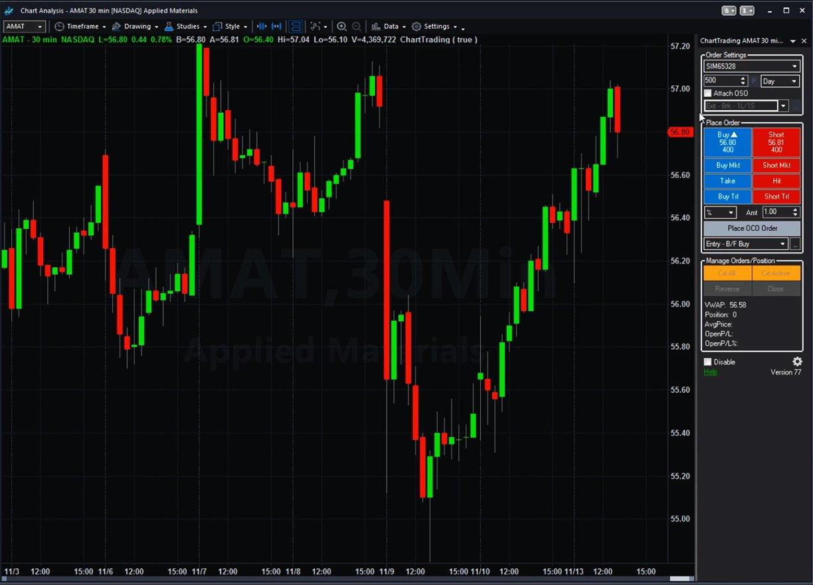

## Table of Contents

## What is a stock market simulator?

A stock market simulator is a tool that lets you practice trading stocks without using real money. It's like a game where you can buy and sell stocks to see how well you can do. You start with some pretend money, and you can make trades just like you would in the real stock market. This helps you learn how the stock market works without risking your own money.

Using a stock market simulator can be really helpful if you're new to investing. It gives you a safe way to try out different strategies and see what works best for you. You can make mistakes and learn from them without losing any real money. Many simulators also have tutorials and guides to help you understand more about investing. This makes it easier for you to feel confident when you're ready to start trading with real money.

## How do stock market simulators work?

Stock market simulators work by giving you a pretend amount of money to start with. You can use this money to buy and sell stocks, just like you would in the real stock market. The simulator uses real stock prices, so you can see how your choices would work in the real world. You can pick which stocks to buy, how many to buy, and when to sell them. The simulator keeps track of your trades and shows you how much money you're making or losing.

These simulators often have features that make them easy to use. You can usually see charts and graphs that show how stocks are doing over time. Some simulators even let you join contests with other people to see who can make the most money. This can make learning about the stock market fun and exciting. By using a simulator, you can try out different ways of investing without any risk, which helps you learn what works best for you before you start using real money.

## What are the benefits of using a stock market simulator for beginners?

Using a stock market simulator is really helpful for beginners because it lets you practice trading without using real money. You can make mistakes and learn from them without losing anything. This makes it a safe way to get used to how the stock market works. You start with some pretend money, and you can buy and sell stocks just like in the real world. This helps you understand how to pick stocks, when to buy and sell, and how to manage your money.

Another big benefit is that simulators often have tutorials and guides that teach you about investing. These can explain things in a simple way that's easy to understand. You can learn about different strategies and see which ones work best for you. Many simulators also let you join contests with other people, which can make learning fun and exciting. By using a simulator, you can feel more confident and ready when you decide to start trading with real money.

## Can you make real money with stock market simulators?

No, you can't make real money with stock market simulators. These simulators are just for practice. They give you pretend money to use, so any profits you make are not real. The point of a simulator is to help you learn how the stock market works without risking your own money.

Even though you can't make real money, using a simulator is still very helpful. It lets you try out different ways of investing and see what works best for you. You can make mistakes and learn from them without losing anything. This makes it a safe way to get ready for trading with real money later on.

## What are the key features to look for in a stock market simulator?

When looking for a stock market simulator, it's important to find one that uses real-time stock prices. This makes your practice feel more like the real stock market. You should also look for a simulator that gives you a good amount of pretend money to start with. This way, you can try out different ways of investing without running out of money too quickly. Another key feature is the ability to see charts and graphs. These can help you understand how stocks are doing over time and make better decisions.

It's also helpful if the simulator has tutorials and guides. These can teach you about investing in a simple way that's easy to understand. Some simulators even let you join contests with other people, which can make learning fun and exciting. Make sure the simulator is easy to use, with a clear and simple interface. This will help you focus on learning rather than figuring out how to use the tool. By choosing a simulator with these features, you can get the most out of your practice and feel more ready when you start trading with real money.

## How can stock market simulators help in developing trading strategies?

Stock market simulators are great for helping you develop trading strategies because they let you try out different ways of investing without using real money. You can experiment with buying and selling stocks at different times to see what works best for you. For example, you might try a strategy where you buy stocks when they are low and sell them when they go up. By using the simulator, you can see if this strategy makes you money or if you need to change it. This helps you learn what works and what doesn't without risking your own money.

Another way simulators help is by letting you practice over a long time. You can see how your strategies work over weeks or months, which is important because the stock market can change a lot. You might find that a strategy that works well in the short term doesn't work as well over a longer time. By using the simulator, you can adjust your strategies and see how they perform in different situations. This practice helps you feel more confident and ready when you start trading with real money.

## What are the limitations of stock market simulators compared to real trading?

Stock market simulators are not the same as real trading because they don't use real money. In a simulator, you can take more risks because you know you won't lose anything. In real trading, losing money can be scary, so you might make different choices. Also, simulators might not show all the fees and costs that come with real trading. These fees can make a big difference in how much money you make or lose.

Another limitation is that simulators can't always show you how the stock market can be affected by big events like news or economic changes. In real trading, these events can make stock prices go up or down a lot. Simulators might not be able to show these changes in real time. This means you might not be ready for how fast things can change in the real stock market. By understanding these limits, you can still use simulators to learn a lot, but you need to be ready for the real thing to be different.

## How accurate are stock market simulators in replicating real market conditions?

Stock market simulators try to be as accurate as possible by using real-time stock prices. This means you see the same prices as in the real stock market, which helps you practice in a way that feels real. But, simulators can't always show everything that happens in the real market. For example, they might not include all the fees and costs that come with real trading. These fees can make a big difference in how much money you make or lose.

Also, simulators might not show how big events like news or economic changes can affect the stock market. In real trading, these events can make stock prices go up or down a lot, and simulators might not be able to show these changes in real time. This means you might not be ready for how fast things can change in the real stock market. So, while simulators are good for learning, they can't perfectly copy everything that happens in the real world.

## What advanced techniques can be practiced using stock market simulators?

Stock market simulators let you practice advanced techniques like day trading, where you buy and sell stocks within the same day to make quick profits. You can try this out without risking real money, so you can see if it's a good strategy for you. Another technique is short selling, where you borrow stocks to sell them and then buy them back later at a lower price to make money. Simulators help you understand how this works and what risks come with it.

You can also practice using options trading, which is more complex. Options let you buy or sell stocks at a certain price in the future. By using a simulator, you can try out different options strategies to see how they work in different market conditions. This helps you learn about the risks and rewards of options without losing any real money. Simulators are a safe way to try out these advanced techniques and see if they fit your investing style.

## How do professional traders use stock market simulators to enhance their skills?

Professional traders use stock market simulators to test new strategies without risking real money. They can try out different ways of buying and selling stocks to see what works best. For example, they might practice day trading, where they buy and sell stocks within the same day, or short selling, where they borrow stocks to sell them and then buy them back at a lower price. By using a simulator, they can see how these strategies perform in different market conditions and make adjustments without any financial risk.

Simulators also help professional traders stay sharp and keep up with the fast-changing stock market. They can practice reacting to different scenarios and events that might affect stock prices. This helps them stay ready for anything that might happen in the real market. By using simulators regularly, professional traders can keep their skills sharp and be better prepared for real trading.

## What are the psychological aspects of trading that can be learned from simulators?

Stock market simulators can help you learn about the feelings you might have when trading. You can see how you feel when you make money or lose money, even if it's just pretend money. This helps you understand if you get too excited when things go well or too upset when they don't. By practicing with a simulator, you can learn to keep your feelings in check and make better choices, even when the market is going up and down a lot.

Simulators also show you how important it is to stick to a plan. Sometimes, when you see a stock going up fast, you might want to buy it right away. But in real trading, making quick decisions like that can be risky. By using a simulator, you can practice following a strategy and not letting your feelings push you into making bad choices. This helps you learn to be patient and disciplined, which are important skills for trading in the real stock market.

## How can one measure the profitability of strategies tested on stock market simulators?

You can measure the profitability of strategies tested on stock market simulators by looking at how much pretend money you make or lose. Most simulators show you your total profits and losses over time. You can see how your strategy performs by checking if your pretend money grows or shrinks. If your money goes up, your strategy is making a profit. If it goes down, your strategy is losing money. This helps you understand if your way of picking stocks and deciding when to buy and sell works well.

Another way to measure profitability is by comparing different strategies. You can try out several ways of investing in the simulator and see which one makes the most pretend money. Some simulators even let you join contests with other people, so you can see how your strategies stack up against theirs. By doing this, you can figure out which strategies are the most profitable and which ones you might want to use when you start trading with real money.

## References & Further Reading

[1]: ["Advances in Financial Machine Learning"](https://www.amazon.com/Advances-Financial-Machine-Learning-Marcos/dp/1119482089) by Marcos Lopez de Prado

[2]: ["Evidence-Based Technical Analysis: Applying the Scientific Method and Statistical Inference to Trading Signals"](https://www.amazon.com/Evidence-Based-Technical-Analysis-Scientific-Statistical/dp/0470008741) by David Aronson

[3]: ["Machine Learning for Algorithmic Trading"](https://github.com/stefan-jansen/machine-learning-for-trading) by Stefan Jansen

[4]: ["Quantitative Trading: How to Build Your Own Algorithmic Trading Business"](https://www.amazon.com/Quantitative-Trading-Build-Algorithmic-Business/dp/1119800064) by Ernest P. Chan

[5]: Johnson, B., & Sundaresan, S. (2006). ["Algorithmic Trading Strategy Review."](https://dl.acm.org/doi/10.1145/2500117) Columbia Business School.