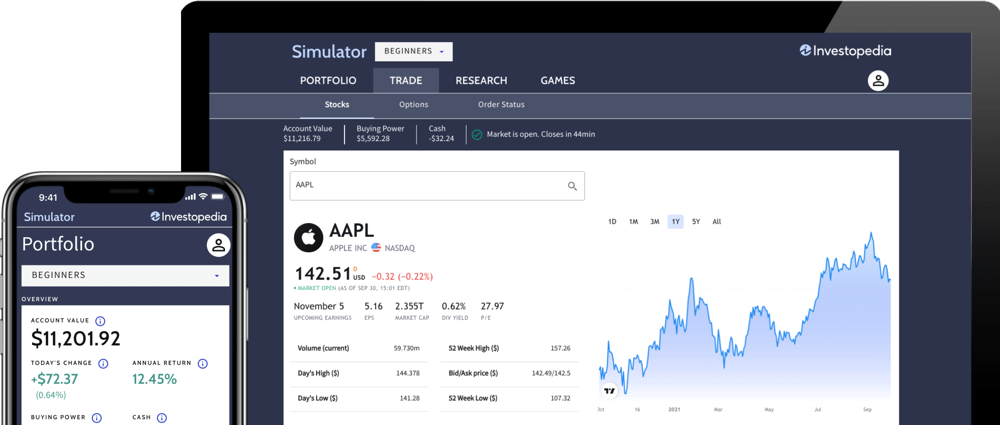

The stock market presents a multifaceted and challenging environment, demanding both skill and experience for successful navigation. The unpredictability and volatility inherent in stock markets make it a daunting endeavor for many. Stock market simulators emerge as invaluable tools in this context, offering a risk-free setting where individuals can develop their trading acumen and understand the intricacies of investment without financial repercussions. These simulators replicate the functionality of real markets, providing a platform to experiment with and refine trading strategies.

This article highlights the significance of stock market simulators in achieving financial profit and enriching investment training. A particular emphasis will be placed on algorithmic trading, a modern approach that employs algorithms to execute trades efficiently. The nuances of algorithmic strategies can be complex, and simulators offer an ideal medium to develop these techniques without the pressures of actual market fluctuations.



Whether you are a novice trader eager to acquire foundational skills or an experienced investor looking to perfect advanced strategies, simulators offer a valuable resource. They allow traders to practice and gain insights without the fear of financial loss, encouraging the exploration and adoption of innovative strategies. By immersing users in realistic trading scenarios, simulators provide the opportunity to refine decision-making processes, ultimately leading to improved financial performance in real markets.

In this exploration of stock market simulators, we will investigate their potential in enhancing financial gains, showcasing their ability to serve as a bridge between theoretical knowledge and practical application in investing.

## Table of Contents

## What Are Stock Market Simulators?

Stock market simulators are sophisticated online tools crafted to mimic the operations and dynamics of real-world stock markets. These simulators play a crucial role in financial education by offering a practical, risk-free environment for users to gain experience and develop investment skills. The fundamental mechanism involves providing users with a predetermined amount of virtual capital, which they can invest in a simulated trading platform that mirrors real market conditions.

The core functionality of stock market simulators is straightforward: they enable users to perform buying, selling, and trading activities akin to actual market transactions, but without any risk to their real financial resources. This aspect is particularly beneficial for novice investors who wish to practice and refine their investment strategies before venturing into the tangible stock market landscape.

Moreover, stock market simulators cater to a wide range of investment strategies, encompassing traditional methods and more advanced techniques like [algorithmic trading](/wiki/algorithmic-trading). Algorithmic trading involves using predefined rules and algorithms to execute trades at optimal times, a strategy that can be intricately tested within a simulator. This capability enables users to fine-tune their algorithms, ensuring they operate efficiently under various market scenarios.

To enhance the authenticity of the trading experience, many simulators integrate real-time market data. This inclusion allows users to experience market fluctuations and dynamics that are as close to reality as possible. By interacting with live data, users can simulate real-world trading decisions and observe the corresponding outcomes, thus gaining valuable insights into market behavior and the impact of different strategies.

In essence, stock market simulators serve as an invaluable educational resource. They provide a comprehensive platform for individuals to test and evaluate a vast array of trading strategies. This simulated environment is indispensable for learning about complex investment concepts and dynamics, ultimately helping users prepare for actual market conditions with greater confidence and competence.

## The Role of Simulators in Financial Profit

Stock market simulators provide a crucial platform for traders to experiment with a range of strategies, helping them to ascertain the tactics that yield the most favorable financial outcomes. These tools allow users to engage in risk-free experimentation, as they operate without the potential for real-world financial loss. This encourages a risk-taking mindset that is essential for exploring innovative investment approaches.

Through the simulation of real-world market conditions, users can refine their decision-making processes to reflect actual market situations. By presenting scenarios that mimic true market dynamics, simulators enable users to test the outcomes of different strategies and adjust their plans accordingly. This iterative process is key to understanding market behavior and strategic refinement.

The ability to simulate various scenarios empowers traders to optimize their strategies, enhancing their potential for financial gain over time. Regular interaction with simulators contributes to a deeper understanding of market trends and strategic planning, which is vital for success in live trading environments. As users become more accustomed to these processes, they can translate insights gained from simulators into effective real-world trades, ultimately leading to improved financial performance in the actual stock market.

## Investment Training and Educational Benefits

Stock market simulators serve as effective educational tools for individuals keen on honing their investment skills. These simulators are widely used in academic environments to teach students about the intricacies of financial markets and economics. By mimicking real-world market conditions, simulators provide users with practical insights into market dynamics, enabling them to familiarize themselves with essential trading terminologies and various investment strategies.

One of the prime educational benefits of stock market simulators is their ability to help users understand complex concepts such as market [volatility](/wiki/volatility-trading-strategies), risk management, and technical analysis. Market volatility, characterized by rapid and significant price changes, poses a critical challenge for traders. Simulators allow individuals to experience and analyze these fluctuations in a controlled setting. This experiential learning process aids in grasping how volatility impacts investment decisions and portfolio management.

Risk management, another crucial aspect of trading, involves identifying, assessing, and prioritizing risks to minimize losses and maximize returns. Through repeated simulation exercises, users can practice implementing diverse risk management techniques, such as stop-loss orders, diversification, and position sizing. These exercises foster a deeper understanding of how to protect investments against potential losses.

Technical analysis, which involves using historical price data and statistical indicators to forecast future market movements, is a cornerstone of many trading strategies. Simulators provide a platform for users to apply technical analysis tools and indicators, such as moving averages and relative strength index (RSI), to simulate trades and refine their analysis skills. By engaging with these tools, users can develop a systematic approach to evaluating security prices and making informed decisions based on potential price trends.

Using stock market simulators bolsters users' confidence and proficiency prior to venturing into real markets. By enabling practice without the risk of financial loss, simulators offer a safe space for trial, error, and learning. This aspect is particularly beneficial for beginners who are transitioning from theoretical knowledge to practical application. Moreover, seasoned investors can use simulators to test and refine new strategies before implementing them in live markets, ensuring a continuous cycle of learning and improvement.

Through the structured approach provided by simulators, users are better equipped to navigate the complexities of the stock market, ultimately enhancing their potential for successful trading and investment.

## Exploring Algorithmic Trading in Simulators

Algorithmic trading utilizes specific algorithms to execute trades at optimal times based on predefined criteria. It has revolutionized the financial industry by enabling high-speed decision-making and execution processes in trading. Stock market simulators serve as critical platforms for developing, testing, and refining these algorithms in a risk-free environment.

Simulators offer the ability to replicate real-market conditions, allowing traders to understand how algorithms behave across different market scenarios. This environment is especially crucial for simulating high-frequency trading strategies, where the speed and accuracy of transactions are pivotal. By employing simulators, traders can explore how algorithms react to rapid market changes and optimize their strategies based on various performance metrics.

Iterative testing in a simulated environment is a fundamental aspect of improving algorithmic trading performance. Through repeated simulation and analysis, traders can identify weaknesses, iteratively adjust parameters, and refine models to maximize returns. This cycle of testing and refinement is essential for adapting to dynamic market conditions.

One critical feature of stock market simulators is the ability to backtest strategies against historical data. This capability allows traders to evaluate how their algorithms would have performed during past market conditions. Through [backtesting](/wiki/backtesting), users can validate the robustness of their algorithmic systems and assess potential risks. By analyzing historical performance, traders can make informed adjustments to optimize strategy efficacy.

Python is often used to script algorithmic trading strategies due to its vast array of libraries and tools, such as Pandas for data analysis and the Python package [backtrader](/wiki/backtrader) for backtesting. Here is a simple Python code snippet demonstrating an algorithmic trading strategy using these tools:

```python
import backtrader as bt

class SimpleStrategy(bt.Strategy):
    def __init__(self):
        self.sma = bt.indicators.SimpleMovingAverage(self.data, period=15)

    def next(self):
        if self.data.close > self.sma:
            self.buy(size=1)
        elif self.data.close < self.sma:
            self.sell(size=1)

cerebro = bt.Cerebro()
cerebro.addstrategy(SimpleStrategy)
data = bt.feeds.YahooFinanceData(dataname='AAPL', fromdate='2022-01-01', todate='2022-12-31')
cerebro.adddata(data)
cerebro.run()
cerebro.plot()
```

In this example, a simple moving average (SMA) crossover strategy is implemented, where the strategy buys when the closing price is above the SMA and sells when it is below. Such simulations provide an invaluable testing ground for strategies before deploying them in live trading environments.

In summary, stock market simulators are indispensable tools for refining algorithmic trading strategies. They present traders with the opportunity to test and improve their models, simulate different trading conditions, and use historical data for backtesting—all without financial risk. These capabilities are crucial for developing resilient and adaptive algorithmic trading systems.

## Challenges and Limitations

While simulators offer many benefits, they also have limitations that users should be aware of. Firstly, they may not fully capture the emotional dynamics of real trading, such as fear and greed. In live trading scenarios, emotional stress can significantly influence decision-making processes, leading to impulsive actions that simulators do not replicate. This emotional aspect is critical because, in reality, traders often react to market fluctuations with decisions driven more by sentiment than logic.

Moreover, market conditions in simulations can differ from real markets due to latency and simplified execution procedures. Simulations may provide streamlined environments where trades are executed with perfect precision, and price changes reflect ideal conditions. In contrast, real-world trading involves factors like order execution delay, slippage, and broader spread variations. These discrepancies mean that a strategy performing well in a simulation does not guarantee the same success in actual trading.

Another challenge is the risk of over-optimizing strategies based on simulated results alone. This occurs when users fine-tune their trading algorithms excessively to perform well in the simulated environment, possibly leading to designs that capitalize on specific quirks of the simulator rather than general market conditions. Such over-optimization can make strategies less effective or even detrimental when applied to real markets.

Nevertheless, understanding these limitations helps traders use simulators more effectively. Awareness of the emotional detachment in simulations encourages traders to practice discipline in both virtual and real trading. Recognizing the potential discrepancies in market conditions can prompt traders to account for unexpected variances in live environments. Finally, by acknowledging the pitfalls of over-optimization, users can strive for strategies that demonstrate robust performance across varied market scenarios, thereby gaining practical experience that extends beyond the simulated sphere.

## Conclusion

Stock market simulators are indispensable tools for both aspiring traders and seasoned investors. These platforms provide a risk-free environment for learning, practicing, and refining investment and trading strategies. By utilizing virtual funds, individuals gain practical experience in executing trades, analyzing market trends, and adjusting their strategies based on market dynamics. This experiential learning is crucial for developing the skills needed to succeed in actual trading environments.

The insights gained from consistent use of stock market simulators can lead to significant financial profits in live markets. By experimenting with different approaches and witnessing the outcomes without the fear of monetary loss, traders can identify which strategies work best. This ability to experiment freely promotes a deeper understanding of market behavior and enhances decision-making skills.

Despite their myriad benefits, simulators are not without limitations. They may not fully capture the psychological aspects of real trading, such as fear and greed, which can influence decision-making in live markets. Additionally, the discrepancies between simulated and real market conditions, like order execution speed and market [liquidity](/wiki/liquidity-risk-premium), can impact the applicability of simulated results. However, awareness and consideration of these limitations enable users to better interpret and apply their simulated experiences to real-world trading.

In conclusion, by harnessing the power of stock market simulators, traders can elevate their trading and investment skills to new heights. They serve as a critical bridge between theoretical knowledge and practical application, equipping individuals with the confidence and competence needed to thrive in the financial markets. Through thoughtful practice and continuous learning, simulators have the potential to significantly enhance one's investment acumen.

## References & Further Reading

[1]: ["Advances in Financial Machine Learning"](https://www.amazon.com/Advances-Financial-Machine-Learning-Marcos/dp/1119482089) by Marcos Lopez de Prado

[2]: ["Evidence-Based Technical Analysis: Applying the Scientific Method and Statistical Inference to Trading Signals"](https://www.amazon.com/Evidence-Based-Technical-Analysis-Scientific-Statistical/dp/0470008741) by David Aronson

[3]: ["Machine Learning for Algorithmic Trading"](https://github.com/stefan-jansen/machine-learning-for-trading) by Stefan Jansen

[4]: ["Quantitative Trading: How to Build Your Own Algorithmic Trading Business"](https://www.amazon.com/Quantitative-Trading-Build-Algorithmic-Business/dp/1119800064) by Ernest P. Chan

[5]: Johnson, B., & Sundaresan, S. (2006). ["Algorithmic Trading Strategy Review."](https://dl.acm.org/doi/10.1145/2500117) Columbia Business School.