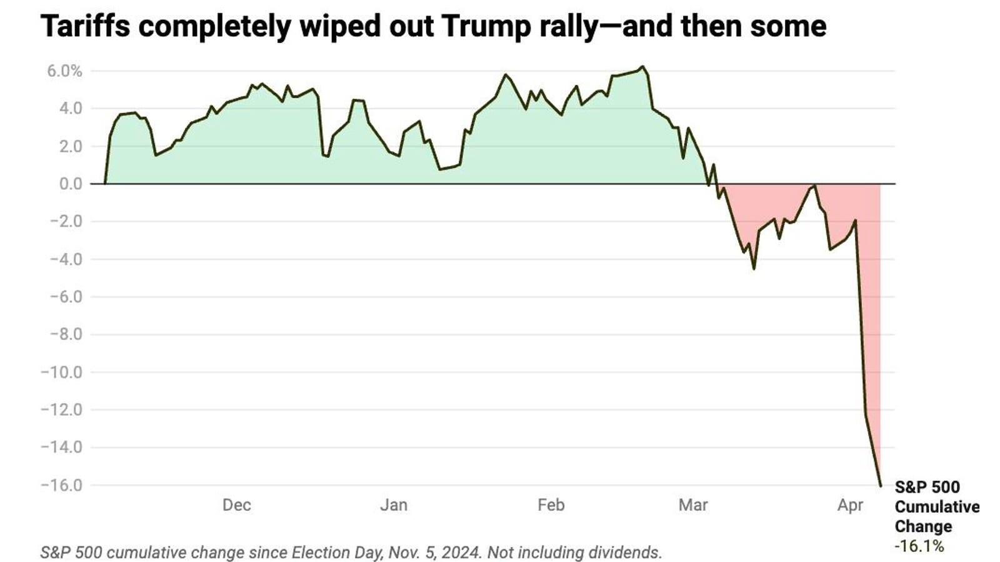

## Table of Contents

## What is the stock market and how does it work?

The stock market is a place where people buy and sell shares of companies. A share is a small piece of a company that you can own. When you buy a share, you become a part-owner of that company. The stock market helps companies raise money by selling shares to the public. This money can be used to grow the business, create new products, or pay off debts.

The stock market works a lot like an auction. The price of a share goes up when more people want to buy it than sell it. It goes down when more people want to sell it than buy it. People trade shares through a stock exchange, like the New York Stock Exchange or the NASDAQ. You can buy and sell shares through a broker, who is a person or a company that helps you make trades. The stock market can be risky because the price of shares can go up and down a lot, but it can also be a way to make money if you make smart choices.

## What are stocks and how can someone buy them?

Stocks are pieces of a company that you can own. When you buy a stock, you become a part-owner of that company. The price of a stock can go up or down based on how well the company is doing and how many people want to buy or sell the stock. If the company does well, the price of the stock might go up, and you could make money. But if the company does badly, the price might go down, and you could lose money.

To buy stocks, you need to use a broker. A broker is a person or a company that helps you buy and sell stocks. You can find brokers online or through a bank. First, you need to open an account with the broker and put money into it. Then, you can use that money to buy stocks. You can choose which stocks you want to buy based on the companies you think will do well. Once you own the stocks, you can keep them for a long time or sell them whenever you want.

## What are the major stock exchanges and their roles?

The New York Stock Exchange (NYSE) and the NASDAQ are two of the biggest stock exchanges in the world. The NYSE is the oldest and biggest stock exchange in the U.S. It's where a lot of big, old companies trade their stocks. The NYSE helps these companies raise money by letting people buy and sell their stocks. The NASDAQ is a bit newer and is known for having a lot of tech companies. It's also where people can buy and sell stocks, but it's all done using computers, not people on a trading floor like the NYSE.

Both the NYSE and the NASDAQ play important roles in the stock market. They provide a place where companies can sell their stocks to the public, which helps the companies get money to grow. They also make it easy for people to buy and sell stocks. This helps the economy by letting money move around and letting people invest in companies they believe in. The prices of stocks on these exchanges can go up and down based on how well the companies are doing and what people think about them.

## How do stock prices fluctuate and what influences them?

Stock prices go up and down because of what people think about the company and how much they want to buy or sell its stock. If more people want to buy a stock than sell it, the price goes up. This can happen if people think the company is doing well or will do well in the future. On the other hand, if more people want to sell a stock than buy it, the price goes down. This can happen if people think the company is doing badly or might do badly in the future.

A lot of things can influence what people think about a company and how much they want to buy or sell its stock. News about the company, like if it makes more money than people thought or if it has a problem, can change what people think. The economy can also affect stock prices. If the economy is doing well, people might be more willing to buy stocks. If the economy is doing badly, people might be more likely to sell their stocks. Even things like interest rates and world events can make stock prices go up or down.

## What is a stock market index and what are some examples?

A stock market index is a way to measure how well a group of stocks is doing. It's like a scorecard that shows if the stocks in a certain group are going up or down. People use indexes to see how the whole stock market or a part of it is doing without looking at each stock one by one. Indexes can help people make decisions about buying or selling stocks.

Some well-known stock market indexes are the Dow Jones Industrial Average, the S&P 500, and the Nasdaq Composite. The Dow Jones Industrial Average, or just the Dow, tracks 30 big companies in the U.S. The S&P 500 looks at 500 big companies and is often used to see how the whole U.S. stock market is doing. The Nasdaq Composite includes all the stocks on the Nasdaq stock exchange, which has a lot of technology companies. These indexes help people understand the stock market better and make smarter choices about their investments.

## What are the different types of stock market orders?

When you want to buy or sell a stock, you can use different types of orders to tell your broker what to do. The most common type is a market order. With a market order, you tell your broker to buy or sell the stock right away at the best price they can find. This is good if you want to make the trade quickly, but the price might be a little different from what you see on the screen because it can change fast.

Another type of order is a limit order. With a limit order, you tell your broker to buy or sell the stock only if it reaches a certain price. For example, if you want to buy a stock but only if it's $50 or less, you can set a limit order at $50. This can help you get a better price, but there's no guarantee your order will be filled if the stock never reaches that price. 

There are also stop orders, which are used to limit losses or protect gains. A stop order becomes a market order once the stock reaches a certain price, called the stop price. For example, if you own a stock that's worth $100 and you want to sell it if it drops to $90, you can set a stop order at $90. This way, if the stock price falls to $90, your stop order will turn into a market order and sell the stock at the best available price.

## How can one analyze stocks: fundamental vs. technical analysis?

Fundamental analysis is a way to look at stocks by studying the company's financial health and how it's doing in its industry. People who use [fundamental analysis](/wiki/fundamental-analysis) look at things like the company's earnings, how much money it's making, its debts, and how fast it's growing. They also look at the economy and what's happening in the world that might affect the company. The idea is to find out if the stock is a good value and if the company has a good future ahead. If the stock seems cheap compared to how well the company is doing, it might be a good buy.

Technical analysis is different because it focuses on the stock's price and how it's moving over time. People who use technical analysis look at charts and patterns to try to predict where the stock price might go next. They don't care as much about the company's financials or the economy. Instead, they look for signs in the stock's price history that might show if it's going to go up or down. This can be useful for people who want to buy and sell stocks quickly to make a profit, but it can be tricky because past patterns don't always predict the future.

## What are dividends and how do they work?

Dividends are payments that companies give to people who own their stocks. When a company makes money, it can choose to share some of that money with its shareholders. This is like a reward for owning the stock. Not all companies pay dividends, but those that do usually pay them every few months. The amount you get depends on how many shares you own and how much the company decides to pay per share.

To get a dividend, you need to own the stock on a certain date, called the record date. If you buy the stock before this date, you'll get the dividend. If you buy it after, you won't. Companies usually announce when they're going to pay a dividend and how much it will be. You can either take the dividend as cash or sometimes choose to get more shares of the company instead. Dividends can be a nice way to make some extra money from your investments, but remember, the stock price can still go up or down.

## What are the risks involved in stock market investing?

Investing in the stock market can be risky because the price of stocks can go up and down a lot. If you buy a stock and its price goes down, you could lose money. This can happen if the company does badly or if something bad happens in the world that makes people want to sell their stocks. Even if you do a lot of research, you can't always predict what will happen. That's why it's important to be ready for the possibility that you might lose some or all of the money you invest.

Another risk is that the stock market can be affected by things you can't control, like the economy or world events. For example, if there's a big economic problem, like a recession, stock prices might go down a lot. Also, sometimes people get too excited about certain stocks and their prices go up a lot, but then they can crash down just as fast. This is called a bubble. It's important to stay calm and not make quick decisions based on what everyone else is doing.

## How does the stock market impact the economy?

The stock market can have a big effect on the economy. When the stock market is doing well, people feel good about their money and are more likely to spend it. This can help businesses grow and create more jobs. Companies can also use the stock market to raise money by selling stocks, which they can use to make new products or expand. This can make the economy stronger because more money is moving around and more people are working.

But if the stock market goes down a lot, it can hurt the economy. People might feel worried about their money and spend less. This can make businesses struggle and even close, which can lead to fewer jobs. When people lose their jobs, they have less money to spend, which can make the economy weaker. So, the stock market can be like a big mood ring for the economy, showing how people feel about money and affecting how much they spend.

## What are some advanced trading strategies used by experts?

One advanced trading strategy that experts use is called swing trading. In swing trading, people try to make money by buying a stock and then selling it a few days or weeks later when its price has gone up a bit. They look at charts and patterns to find the best times to buy and sell. This is different from [day trading](/wiki/day-trading-spy), where people buy and sell stocks in the same day. Swing traders need to be good at understanding how the stock market moves over short periods and be ready to change their plans if the market changes.

Another strategy is called options trading. Options are like special contracts that give you the right to buy or sell a stock at a certain price by a certain date. Experts use options to make money in different ways. They can use them to bet on whether a stock's price will go up or down, or to protect their other investments from losing too much money. Options trading can be tricky because it's more complicated than just buying and selling stocks, but it can also be a powerful tool for people who know how to use it well.

A third strategy is called [algorithmic trading](/wiki/algorithmic-trading). This is when people use computers to buy and sell stocks based on special math formulas. The computers can make trades very quickly and can look at a lot of information at once. This can help find good opportunities to make money that people might miss. Algorithmic trading can be very effective, but it also needs a lot of knowledge about both the stock market and computer programming.

## How can one use options and futures in the stock market?

Options and futures are special kinds of investments that people can use in the stock market. Options give you the right to buy or sell a stock at a certain price before a certain date. If you think a stock's price will go up, you can buy a call option, which lets you buy the stock at a lower price later. If you think the price will go down, you can buy a put option, which lets you sell the stock at a higher price later. Options can be a way to make money if you guess right about the stock's price, but they can also be risky because you might lose the money you spent on the option if the stock doesn't move the way you thought.

Futures are a bit different. They are contracts that say you will buy or sell something, like a stock or a commodity, at a certain price on a certain date in the future. People use futures to bet on what the price of something will be later. For example, if you think the price of oil will go up, you can buy a futures contract to buy oil at today's price and sell it later at a higher price. Futures can be a way to make money if you're right about future prices, but they can also be risky because you have to buy or sell the thing no matter what the price is when the time comes. Both options and futures need a good understanding of the market and can be tricky to use, but they can also be powerful tools for people who know what they're doing.

## References & Further Reading

[1]: Bergstra, J., Bardenet, R., Bengio, Y., & Kégl, B. (2011). ["Algorithms for Hyper-Parameter Optimization."](https://dl.acm.org/doi/10.5555/2986459.2986743) Advances in Neural Information Processing Systems 24.

[2]: ["Advances in Financial Machine Learning"](https://www.amazon.com/Advances-Financial-Machine-Learning-Marcos/dp/1119482089) by Marcos Lopez de Prado

[3]: ["Evidence-Based Technical Analysis: Applying the Scientific Method and Statistical Inference to Trading Signals"](https://www.amazon.com/Evidence-Based-Technical-Analysis-Scientific-Statistical/dp/0470008741) by David Aronson

[4]: ["Machine Learning for Algorithmic Trading"](https://github.com/stefan-jansen/machine-learning-for-trading) by Stefan Jansen

[5]: ["Quantitative Trading: How to Build Your Own Algorithmic Trading Business"](https://www.amazon.com/Quantitative-Trading-Build-Algorithmic-Business/dp/1119800064) by Ernest P. Chan