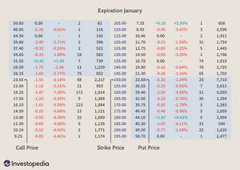

Algorithmic trading stands at the forefront of modern financial markets, delivering unparalleled precision and speed to traders aiming to maximize returns. As markets have evolved, the prevalence of stock options has introduced additional layers of complexity and opportunity that require a comprehensive understanding of trading parameters. These parameters serve as the building blocks for successful algorithmic trading strategies, particularly in the context of stock options.

In this article, we will provide a detailed exploration of the crucial trading parameters necessary for optimizing stock options algorithmic trading. Understanding these parameters is vital for harnessing the full potential of algorithmic systems. Key factors and considerations will be discussed, allowing traders to refine their strategies to match their risk tolerance and financial goals.



Algorithmic trading leverages sophisticated systems that execute trades based on predefined rules, ensuring quick and efficient market participation. This precision is invaluable, especially when dealing with stock options, which offer significant opportunities but also demand careful management of variables such as expiry dates, strike prices, and market volatility. Whether you are an experienced trader or a newcomer to the field, mastering these parameters will enhance your trading knowledge and potentially improve your financial outcomes. 

By the end of this guide, you will gain a solid foundation for constructing and optimizing your algorithmic trading strategies in the dynamic arena of stock options.

## Table of Contents

## Understanding Stock Options and Algorithmic Trading

Stock options are financial derivatives that grant traders the right, but not the obligation, to buy or sell a specific stock at a predetermined price, known as the strike price, within a certain timeframe. This flexibility allows investors to speculate on the price movements of the underlying stock while limiting potential losses to the premium paid for purchasing the option. The two primary types of stock options are calls and puts. A call option provides the right to buy a stock, whereas a put option provides the right to sell it. Traders use these instruments to hedge against risks, enhance portfolio returns, or exploit price inefficiencies in the market [1].

Algorithmic trading, often referred to as algo trading, employs automated systems to execute trades based on a set of predefined criteria. Such systems can process vast amounts of data and execute transactions at speeds and frequencies beyond human capabilities, enabling traders to capitalize on short-lived market conditions [2]. These algorithms can incorporate a wide range of strategies, from basic trend-following to more complex statistical [arbitrage](/wiki/arbitrage), depending on the trader's objectives and market conditions.

When stock options are integrated into [algorithmic trading](/wiki/algorithmic-trading) strategies, traders can achieve efficient and precise operations. The automation of option trades allows for rapid adjustments to changing market dynamics, helping traders to manage risk and optimize returns. For example, an algorithm could be designed to monitor [volatility](/wiki/volatility-trading-strategies) levels and dynamically adjust option strategies, such as delta hedging or gamma [scalping](/wiki/gamma-scalping), to maintain a desired risk profile.

To successfully incorporate stock options in algorithmic trading, a solid understanding of both the intrinsic and extrinsic components of options is essential. The intrinsic value represents the difference between the underlying stock's current price and the option's strike price, while the extrinsic value encompasses the time value and volatility reflected in the option's price. These factors play a crucial role in determining the option's premium and its potential profitability.

Moreover, algorithms developed for option trading must account for the Greeks, which are measures of sensitivity to various option pricing parameters. These include delta, gamma, theta, vega, and rho, each quantifying the sensitivity of an option’s price to changes in the underlying stock price, the passage of time, and shifts in volatility and interest rates. Understanding these sensitivities assists traders in managing risk and optimizing their options portfolios.

In conclusion, comprehending the fundamental concepts of stock options and algorithmic trading is vital before progressing to the specific parameters that guide trading decisions. This knowledge forms the basis for developing sophisticated strategies that leverage automation for precision and efficiency in trading operations.

References:
1. Hull, J.C. (2012). Options, Futures, and Other Derivatives. Prentice Hall.
2. Chan, E. (2013). Algorithmic Trading: Winning Strategies and Their Rationale. Wiley.

## Key Trading Parameters for Stock Options

Trading parameters form the backbone of any algorithmic trading system, serving as critical components that dictate the execution and success of trading strategies. In the context of stock options, these parameters become even more significant due to the complexity and variety of contracts available.

**Volatility** is a crucial parameter for stock options trading, providing insights into the expected price fluctuations of the underlying asset. It forms the basis for pricing options, with the most common measure being implied volatility. Implied volatility reflects the market's view of future volatility and is derived from the price of options using models like the Black-Scholes formula. Traders often rely on the Volatility Index (VIX) to gauge market expectations of future volatility.

**Time Decay**, or theta, is another key parameter, representing the reduction in the value of an option as it approaches its expiration date. This is particularly significant for options traders, as time decay accelerates as the expiration nears, impacting the premium of the option. The formula for theta shows the rate of decline in the value of an option per day, assuming other factors remain constant:

$$
\Theta = \frac{\partial V}{\partial t}
$$

where $V$ is the option's price and $t$ is time.

The selection of **strike prices** is fundamental, as it determines the intrinsic value of an option. A strike price is the set price at which an option can be bought or sold when exercised. Choosing an appropriate strike price involves assessing the likelihood of the underlying stock reaching that price point given current market conditions and anticipated moves.

**Interest Rates** play a pivotal role in option pricing. According to the Black-Scholes model, interest rates are used to calculate the present value of the option's strike price. Changes in interest rates can affect the cost of holding options compared to alternative investments, influencing traders' decisions.

Utilizing these parameters effectively can significantly enhance trading decisions and align one's financial goals. For those employing algorithmic trading strategies, these parameters must be quantified and incorporated into trading algorithms to optimize performance. Here is a simple Python snippet illustrating how one might obtain and analyze historical volatility data using the `yfinance` library, which can be integrated into more comprehensive trading strategies:

```python
import yfinance as yf  # For more datasets, visit: https://paperswithbacktest.com/datasets
import numpy as np

def calculate_historical_volatility(ticker, start_date, end_date):
    data = yf.download(ticker, start=start_date, end=end_date)
    log_returns = np.log(data['Close'] / data['Close'].shift(1))
    volatility = np.std(log_returns) * np.sqrt(252)  # Annualize the volatility
    return volatility

ticker = 'AAPL'
start_date = '2023-01-01'
end_date = '2023-10-01'
volatility = calculate_historical_volatility(ticker, start_date, end_date)
print(f"The historical volatility of {ticker} is {volatility:.2f}")
```

Understanding and applying these parameters not only aids in constructing robust trading algorithms but also ensures they are adaptable to market shifts, thereby optimizing the overall trading performance.

## Developing an Effective Algorithmic Trading Strategy

A well-defined strategy is essential for successful algorithmic trading of stock options, as it allows traders to systematically approach the market and make informed decisions. An effective strategy should take into account market conditions, risk management, and performance metrics to optimize trading outcomes.

**Market Conditions**

Understanding market conditions is crucial for developing a sound trading strategy. This includes evaluating macroeconomic factors, such as interest rates and economic indicators, as well as microeconomic factors, such as company earnings and industry trends. Algorithmic traders benefit from employing tools that help analyze large datasets to spot market trends and opportunities. 

**Risk Management**

Risk management is a cornerstone of any trading strategy, particularly in algorithmic trading. This involves setting parameters for maximum drawdown, defining stop-loss orders, and diversifying across different assets and strategies to mitigate risks. Implementing a risk management plan could involve measures like calculating the Value at Risk (VaR), which estimates the potential loss in an asset portfolio within a certain timeframe at a given confidence level.

$$
\text{VaR} = \text{initial investment} \times (\text{expected return} - \text{multiple of standard deviation})
$$

**Entry and Exit Points**

Determining appropriate entry and [exit](/wiki/exit-strategy) points is vital for capturing profits and minimizing losses. Traders should develop algorithms that utilize indicators and patterns, such as moving averages or support and resistance levels, to automate decision-making. A simple moving average (SMA) can be calculated as follows:

$$
\text{SMA} = \frac{\sum_{i=1}^{n} \text{Price}_i}{n}
$$

where $n$ is the number of periods considered.

**Position Sizing and Portfolio Diversification**

Effective position sizing helps in controlling risk exposure by determining the number of contracts to buy or sell. This should be aligned with the trader's risk appetite, capital base, and overall trading strategy. Portfolio diversification, on the other hand, involves spreading investments across various asset classes or sectors to reduce unsystematic risk.

**Backtesting and Optimization**

Before implementing a strategy in a live environment, it is crucial to conduct [backtesting](/wiki/backtesting) using historical market data to evaluate its performance. This process involves simulating trades to assess potential profitability and uncover vulnerabilities. It's essential to use a representative dataset and account for variables such as slippage and transaction costs. Strategies can be coded and tested using Python, with libraries like Pandas and NumPy serving as valuable tools for data manipulation and analysis.

```python
import pandas as pd
import numpy as np

def backtest_strategy(data, window_size):
    data['SMA'] = data['Close'].rolling(window=window_size).mean()
    data['Signal'] = np.where(data['Close'] > data['SMA'], 1, -1)
    data['Return'] = data['Signal'].shift(1) * data['Close'].pct_change()
    return data['Return'].cumsum()
```

Continued refinement and optimization of the strategy through iterative testing can further enhance its effectiveness, helping traders to adapt to changing market conditions and improve their algorithmic trading performance. By incorporating these elements, traders can develop a robust framework that enhances their ability to capture profitable opportunities while managing risks in stock options trading.

## Risks and Challenges in Algorithmic Trading

Algorithmic trading, while advantageous in terms of speed and efficiency, inherently involves several risks and challenges that traders must navigate. Addressing these issues is crucial for the effective and safe operation of algorithmic trading systems.

One significant risk involves data latency, which refers to the delay in the transmission or processing of data. In the high-pressure environment of financial markets, even milliseconds can make a difference in trade execution and profitability. To combat data latency, traders often invest in high-speed data feeds and employ co-location services, which allow their trading systems to be physically closer to exchange servers, thereby reducing transmission times. Additionally, algorithms need to be tested under live conditions to fine-tune performance speeds.

Execution errors pose another challenge. These can occur when the trading system executes trades improperly due to bugs in the code or unexpected market conditions. To mitigate such errors, thorough testing of algorithms through simulations and backtesting is essential. This involves evaluating algorithms across various historical market data to ensure they behave as expected under different scenarios. Moreover, implementing stop-loss measures and redundancy systems can help restrict the financial damage from unforeseen execution mishaps.

Market anomalies, such as flash crashes or sudden volatility spikes, also represent a potential threat to algorithmic trading systems. These anomalies can create [liquidity](/wiki/liquidity-risk-premium) issues or result in incorrect pricing data, leading to suboptimal trading decisions. Algorithms need to include safeguards like error-checking mechanisms and volatility filters to manage such events effectively.

Risk management is a critical component of any trading strategy and involves defining acceptable levels of risk and devising methodologies to minimize losses. This may include setting limits on trade size, diversifying the trading portfolio, and constantly monitoring the performance of trading systems using metrics such as the Sharpe ratio or maximum drawdown. For instance, position sizing strategies can be programmed to adjust based on increasing volatility to manage risk exposure efficiently.

Moreover, regular audits and updates of the trading system's hardware and software infrastructure are necessary to maintain security and operational effectiveness. As malicious attacks and technical failures can significantly impact algorithmic trading systems, ensuring robust cybersecurity protocols and failover solutions are in place is of paramount importance.

In conclusion, while algorithmic trading can greatly enhance trading efficiency, understanding and addressing the inherent risks is vital to maintaining stable trading operations. Properly managing issues related to data latency, execution errors, and market anomalies, and employing effective risk management strategies, are fundamental to the success of algorithmic trading systems.

## Future Trends in Stock Options Algorithmic Trading

The landscape of stock options algorithmic trading is rapidly evolving, driven by advancements in technology and a dynamic market environment. Among the emerging trends reshaping this domain, the integration of [artificial intelligence](/wiki/ai-artificial-intelligence) (AI), the rise of high-frequency trading ([HFT](/wiki/high-frequency-trading-strategies)), and the application of [machine learning](/wiki/machine-learning) (ML) are at the forefront.

AI integration in algorithmic trading is revolutionizing how trading strategies are developed and executed. AI algorithms have the capability to process vast amounts of data in real-time, identify patterns, and make predictive analyses. This capability allows for more informed trading decisions and enhanced strategy formulation. For instance, AI tools can optimize trading algorithms by learning from large datasets to deliver higher accuracy in forecasting market movements.

High-frequency trading (HFT) continues to be a dominant force, characterized by the execution of a large number of trades at extremely high speeds. This approach leverages complex algorithms and high-speed data networks to capitalize on minute price discrepancies that exist for only fractions of a second. HFT requires significant technological infrastructure, including colocation services where traders place their systems in proximity to exchange servers to minimize latency.

Machine learning further complements AI and HFT by introducing systems that can adapt and improve over time without being explicitly programmed. Through techniques such as regression analysis, [deep learning](/wiki/deep-learning), and [reinforcement learning](/wiki/reinforcement-learning), ML can refine algorithms to respond dynamically to changing market conditions, enhancing their predictive powers. For example, reinforcement learning can develop trading strategies that adjust to market volatility by rewarding decisions that lead to profitable outcomes.

These technological advances are not only enhancing the efficiency and precision of trading systems but are also redefining traditional trading parameters. For example, machine learning techniques can offer new insights into volatility predictions, impacting how options are priced and traded. As these technologies continue to mature, their ability to provide robust, real-time analytics can significantly reshape risk management strategies and derivatives pricing models.

Keeping abreast of these trends is crucial for traders aiming to maintain a competitive edge. As AI, HFT, and ML technologies continue to evolve, they offer new opportunities to optimize stock options trading strategies. Staying informed about these advancements allows traders to exploit cutting-edge solutions that can improve decision-making processes, manage risks more effectively, and ultimately enhance profitability. The fusion of technology and algorithmic trading heralds a future where adaptability and continual learning are key to success in the fast-paced world of financial markets.

## Conclusion

Algorithmic trading has significantly transformed the trading of stock options by enhancing both precision and efficiency. By leveraging algorithmic strategies, traders can execute trades with greater accuracy and speed, reducing the impact of human emotions and errors. The use of sophisticated algorithms allows traders to capitalize on minute market movements and execute trades based on a multitude of complex data points.

Understanding and utilizing the right trading parameters—such as volatility, strike prices, and interest rates—are crucial for optimizing performance and achieving financial objectives. These parameters directly influence the pricing and risk characteristics of stock options, making their careful consideration essential for effective trading. For instance, the Black-Scholes model, a popular method for pricing options, incorporates these parameters to determine the fair value of an option:

$$
C = S_0 N(d_1) - X e^{-rT} N(d_2)
$$

Where:
- $C$ is the call option price
- $S_0$ is the current stock price
- $X$ is the strike price
- $T$ is the time to expiration
- $r$ is the risk-free interest rate
- $N(d)$ is the cumulative distribution function of the standard normal distribution
- $d_1$ and $d_2$ are calculated with specific formulas involving these parameters

This foundation offers the necessary knowledge to enhance your skill set in stock options algorithmic trading. Continual learning and adaptation are essential as the trading landscape is ever-evolving. Staying updated with technological advancements and market trends, such as AI integration and high-frequency trading, can provide competitive advantages and new opportunities.

Equipping yourself with effective tools and strategies is crucial to success in the dynamic world of stock options algo trading. Whether through sophisticated modeling, robust risk management practices, or advanced analytical tools, traders who embrace these innovations can better position themselves to succeed in this complex and exciting field. As the market evolves, so too must our approaches, ensuring that we are prepared to meet the challenges and opportunities of algorithmic trading head-on.

## References & Further Reading

[1]: Hull, J.C. (2012). ["Options, Futures, and Other Derivatives."](https://www.semanticscholar.org/paper/Options%2C-Futures%2C-and-Other-Derivatives-Hull/89bdee500c8623864fc9eb7a471546aa713acc44) Prentice Hall.

[2]: Chan, E. (2013). ["Algorithmic Trading: Winning Strategies and Their Rationale."](https://github.com/ftvision/quant_trading_echan_book) Wiley.

[3]: Black, F., & Scholes, M. (1973). ["The Pricing of Options and Corporate Liabilities."](https://www.cs.princeton.edu/courses/archive/fall09/cos323/papers/black_scholes73.pdf) The Journal of Political Economy, 81(3), 637-654.

[4]: Jansen, S. (2018). ["Machine Learning for Algorithmic Trading"](https://github.com/stefan-jansen/machine-learning-for-trading) by Packt Publishing.

[5]: Narang, R. K. (2013). ["Inside the Black Box: A Simple Guide to Quantitative and High-Frequency Trading."](https://onlinelibrary.wiley.com/doi/book/10.1002/9781118662717) Wiley.