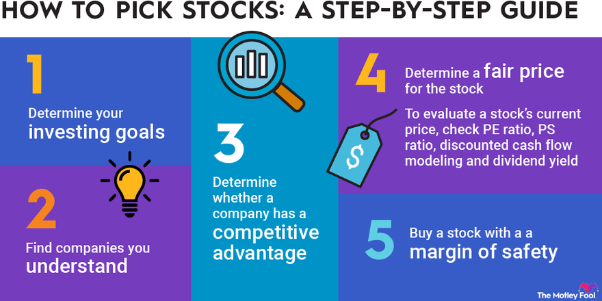

## Table of Contents

## What is stock picking and why is it important?

Stock picking is when someone chooses specific stocks to buy, hoping that those stocks will go up in value. It's like picking fruits from a tree; you want to pick the ones that look the best and will taste the sweetest. People who pick stocks carefully study different companies to find the ones they think will do well in the future. They look at things like how much money the company makes, who runs the company, and what's happening in the world that might affect the company.

Stock picking is important because it can help people make more money. If you pick the right stocks, your investments can grow a lot more than if you just put your money in a savings account or a general stock market fund. However, it's also risky because if you pick the wrong stocks, you could lose money. That's why it's important to do a lot of research and maybe even get advice from experts before you start picking stocks.

## How does stock picking differ from other investment strategies?

Stock picking is different from other investment strategies because it involves choosing individual stocks one by one, instead of investing in a whole bunch of stocks at once. When you pick stocks, you're trying to find the best companies that you think will grow a lot. Other strategies, like buying index funds, spread your money across many different stocks to match the performance of the whole market. This can be less risky because you're not betting on just one or a few companies.

Another difference is the amount of work and knowledge needed. Stock [picking](/wiki/asset-class-picking) requires a lot of research and understanding of individual companies, the industries they are in, and even the economy. You have to keep up with news and changes that might affect your stocks. On the other hand, strategies like investing in mutual funds or ETFs (exchange-traded funds) are simpler because someone else, like a fund manager, does the picking and managing for you. These strategies can be easier for people who don't have the time or the know-how to pick stocks themselves.

## What are the basic principles of stock picking for beginners?

When you start picking stocks, the first thing to do is learn about the companies you're interested in. Look at what they do, how much money they make, and if they're growing. It's also good to check if the company's leaders are good at their jobs. You can find this information in the company's reports, news articles, and by reading what other people think about the company. Another important thing is to understand the industry the company is in. Some industries might be doing well right now, while others might be struggling.

Another basic principle is to think about risk. Not all stocks are the same; some can be safer than others. Stocks from big, well-known companies might be less risky than stocks from smaller, newer companies. But remember, even safe stocks can lose value sometimes. It's also smart to not put all your money into just one or two stocks. Spreading your money across different stocks can help you not lose everything if one stock does badly. Finally, be patient. Picking the right stocks can take time, and it's important to keep learning and adjusting your choices as you go.

## What are the key financial metrics to consider when picking stocks?

When picking stocks, it's important to look at a few key financial metrics to understand how well a company is doing. One important metric is earnings per share (EPS), which shows how much money the company makes for each share of its stock. A higher EPS can mean the company is doing well. Another useful metric is the price-to-earnings (P/E) ratio, which compares the stock's price to its earnings. A lower P/E ratio might mean the stock is a good deal, but it's good to compare it with other companies in the same industry.

Another metric to consider is the company's revenue growth. This shows if the company is getting bigger and making more money over time. It's also helpful to look at the company's debt-to-equity ratio, which tells you how much the company owes compared to what it owns. A lower ratio can mean the company is in a better financial position. Lastly, the return on equity (ROE) is important because it shows how well the company is using the money its shareholders have invested. A higher ROE can mean the company is good at turning that money into profits.

## How can fundamental analysis be used in stock picking?

Fundamental analysis is like looking under the hood of a car to see how it runs. When you use it for stock picking, you study a company's financial health and business to decide if its stock is a good buy. You look at things like how much money the company makes, its debts, and how it's growing. This helps you figure out if the stock's price is fair or if it's a bargain. For example, if a company's earnings are growing fast but its stock price isn't, that might be a good sign to buy.

You also need to understand the company's industry and the economy. If the industry is doing well, the company might do well too. But if the industry is struggling, even a good company might have a hard time. By looking at all these things together, you can make a better guess about which stocks might go up in value. Fundamental analysis takes time and work, but it can help you find stocks that are worth buying and holding for a long time.

## What role does technical analysis play in selecting stocks?

Technical analysis is like reading a map to see where a stock has been and where it might go next. Instead of looking at a company's financial reports, you study charts and patterns of the stock's price and trading [volume](/wiki/volume-trading-strategy). This can help you guess if the stock's price will go up or down soon. For example, if you see a pattern that often leads to a price increase, you might decide to buy the stock before it goes up.

Technical analysis can be useful for picking stocks because it helps you time your buys and sells better. If you see signs that a stock's price is about to drop, you might decide to sell or wait before buying. But remember, technical analysis isn't perfect. It's based on past patterns, and the future can be different. That's why many people use it along with [fundamental analysis](/wiki/fundamental-analysis), which looks at the company's actual business and financial health, to make smarter choices about which stocks to pick.

## How do market trends and economic cycles affect stock picking?

Market trends and economic cycles can really change how you pick stocks. When the economy is doing well, like during a boom, people feel good about spending money, and companies make more profits. This can make stock prices go up, so you might want to pick stocks from companies that do well in good times, like tech or consumer goods companies. But if you see signs that the economy might slow down, you might want to be careful. You could pick stocks from companies that do okay even when times are tough, like utility companies or those that sell things people always need, like food.

Economic cycles also matter because they can affect different industries in different ways. For example, during a recession, people might not buy new cars or big houses, so companies in those industries might struggle. But companies that make cheaper products or services might do better because people still need to spend money on the basics. By watching these cycles, you can try to pick stocks that will do well no matter what's happening in the economy. It's like trying to surf: you need to watch the waves and pick the right one to ride.

## What are some common pitfalls and mistakes to avoid in stock picking?

One common mistake in stock picking is not doing enough research. It's easy to get excited about a company because you like its products or hear good things about it, but you need to look at the numbers too. Check the company's financial health, how it's growing, and what's happening in its industry. If you don't, you might end up buying stocks that look good but aren't really a smart investment. Another pitfall is letting emotions guide your decisions. It's easy to get scared and sell your stocks when the market goes down, or get too excited and buy more when the market is going up. But making choices based on fear or greed can lead to bad decisions.

Another mistake is not having a plan. Before you start picking stocks, think about what you want to achieve and how much risk you're willing to take. Without a plan, you might end up buying and selling stocks without a clear reason, which can lead to losses. Also, many people make the mistake of putting all their money into just one or two stocks. This is risky because if those stocks do badly, you could lose a lot. It's better to spread your money across different stocks to reduce the risk. By avoiding these common pitfalls, you can make smarter choices and have a better chance of success in stock picking.

## How can one develop a stock picking strategy that aligns with their investment goals?

To develop a stock picking strategy that aligns with your investment goals, start by figuring out what you want to achieve. Are you looking to grow your money over many years, or do you need income from your investments soon? Once you know your goals, think about how much risk you're okay with. If you don't want to lose much money, you might pick safer stocks from big, stable companies. But if you're willing to take more risk for the chance of bigger rewards, you might look at smaller, newer companies. Next, decide how much time you want to spend on picking stocks. If you have a lot of time, you can do deep research into individual companies. If you're busy, you might want to look at simpler ways to invest, like index funds, and just pick a few stocks to add to your mix.

After setting your goals and understanding your risk level, you can start building your strategy. Look at different industries and pick the ones that match your goals. For example, if you want steady income, you might pick stocks from companies that pay good dividends. If you're looking for growth, you might focus on tech or healthcare companies that are growing fast. Use both fundamental analysis, which looks at a company's financial health, and technical analysis, which looks at stock price patterns, to make your choices. Remember to keep an eye on market trends and economic cycles, as they can affect how well your stocks do. By matching your stock picking strategy to your goals, you can make smarter choices and work towards achieving what you want with your investments.

## What advanced techniques can experts use to enhance their stock picking skills?

Experts can use advanced techniques like quantitative analysis to improve their stock picking. This means using math and computer programs to look at lots of data about stocks. They might use things like algorithms to find patterns that are hard for people to see. For example, they could use a computer to look at how a stock's price moves with other things, like interest rates or the economy. This can help them find stocks that might be good buys before other people notice.

Another technique is to use options and other derivatives to make their stock picking better. Options let you bet on whether a stock's price will go up or down without buying the stock itself. This can be a way to make more money if you're right about a stock, but it's also riskier. Experts might use options to protect their other investments or to make money from small changes in stock prices. By using these advanced techniques, experts can make smarter choices and maybe do better than people who just pick stocks the old-fashioned way.

## How do portfolio diversification and risk management relate to stock picking?

Portfolio diversification and risk management are super important when you're picking stocks. Diversification means spreading your money across different kinds of stocks instead of putting it all in one place. If you only pick stocks from one industry or one company, you could lose a lot of money if something goes wrong with that industry or company. But if you have stocks from different industries, like tech, healthcare, and energy, a problem in one area won't hurt your whole portfolio as much. This way, you can still make money even if some of your stocks do badly.

Risk management goes hand-in-hand with diversification. It's about figuring out how much risk you're okay with and making choices to keep that risk under control. When picking stocks, you need to think about how risky each stock is. Some stocks might be safer because they come from big, stable companies, while others might be riskier because they're from smaller or newer companies. By balancing these risks and making sure your portfolio isn't too risky for you, you can protect your money and maybe make more in the long run. So, while stock picking is about finding the best stocks, it's also about managing risk and diversifying your investments to keep your money safe.

## What are the latest tools and technologies available for stock picking analysis?

There are many new tools and technologies that can help with stock picking. One popular tool is stock screeners, which are like search engines for stocks. They let you filter stocks based on things like price, how much the company makes, and how fast it's growing. This can save you a lot of time because you don't have to look through all the stocks yourself. Another cool tool is stock analysis software, which can do a lot of the math and number-crunching for you. It can look at a company's financial reports and tell you if the stock might be a good buy. Some of these programs even use [artificial intelligence](/wiki/ai-artificial-intelligence) to find patterns that are hard for people to see.

Another technology that's becoming more common is [algorithmic trading](/wiki/algorithmic-trading) platforms. These platforms use computer programs to buy and sell stocks based on rules you set up. For example, you could tell the program to buy a stock if its price goes down to a certain level, or sell it if it goes up to another level. This can help you make decisions faster and without letting your emotions get in the way. Also, there are apps and websites that give you real-time data and news about stocks, so you can stay up-to-date on what's happening with the companies you're interested in. By using these tools and technologies, you can make smarter choices and maybe do better at picking stocks.

## References & Further Reading

[1]: Bergstra, J., Bardenet, R., Bengio, Y., & Kégl, B. (2011). ["Algorithms for Hyper-Parameter Optimization."](https://papers.nips.cc/paper_files/paper/2011/hash/86e8f7ab32cfd12577bc2619bc635690-Abstract.html) Advances in Neural Information Processing Systems 24.

[2]: ["Advances in Financial Machine Learning"](https://www.amazon.com/Advances-Financial-Machine-Learning-Marcos/dp/1119482089) by Marcos Lopez de Prado.

[3]: ["Evidence-Based Technical Analysis: Applying the Scientific Method and Statistical Inference to Trading Signals"](https://www.wiley.com/en-gb/Evidence+Based+Technical+Analysis:+Applying+the+Scientific+Method+and+Statistical+Inference+to+Trading+Signals-p-9780470008744) by David Aronson.

[4]: ["Machine Learning for Algorithmic Trading"](https://www.amazon.com/Machine-Learning-Algorithmic-Trading-intelligence/dp/9918608013) by Stefan Jansen.

[5]: ["Quantitative Trading: How to Build Your Own Algorithmic Trading Business"](https://www.amazon.com/Quantitative-Trading-Build-Algorithmic-Business/dp/0470284889) by Ernest P. Chan.