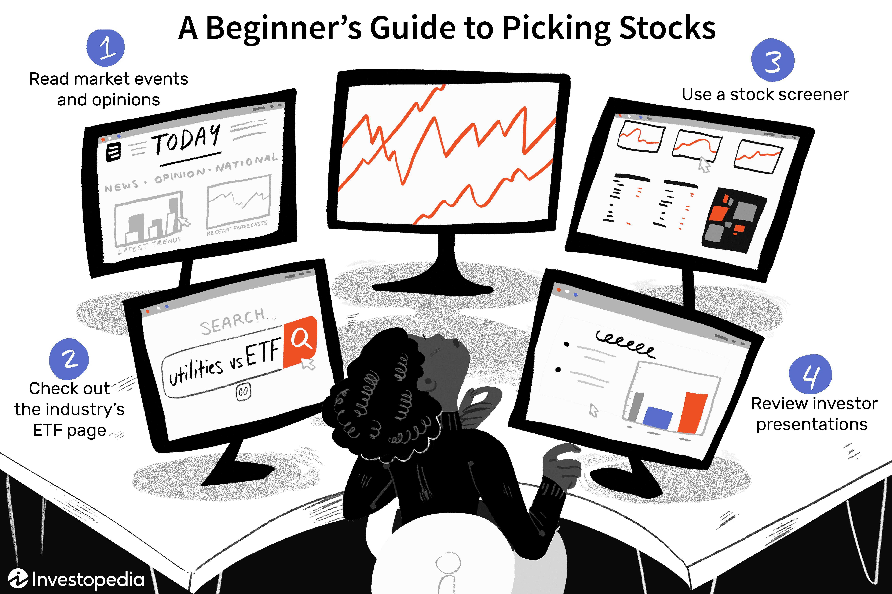

Stock picking is the process of selecting specific stocks to include in an investment portfolio, based on various criteria such as financial analysis, market trends, and economic factors. This practice is essential in the world of investment as it seeks to maximize returns by identifying undervalued stocks or those poised for significant price increases. In algorithmic trading, stock picking holds a pivotal role as these systems leverage technological advances to automate and optimize trading strategies. By integrating stock-picking techniques, algorithmic traders aim to replicate or even surpass the decision-making processes of experienced human investors with greater speed and precision.

Algorithmic trading, often referred to as algo trading, is a method of executing orders using pre-programmed trading instructions that account for variables such as timing, price, and volume. It has gained substantial traction in modern finance due to its ability to process vast amounts of data and execute trades at speeds impossible for humans. This approach has revolutionized trading by enabling high-frequency trading and providing sophisticated tools that enhance market efficiency and liquidity.



The purpose of this article is to explore the integration of stock picking into algorithmic trading systems. By examining how traditional stock picking has evolved with the advent of algorithmic methods, it sheds light on the hybrid strategies currently employed in financial markets. The article will delve into the mechanisms through which these systems are developed, the challenges they face, and the future trends that might influence their evolution. Through understanding these complex interactions, we can appreciate the sophistication and potential of algorithmic trading systems that adeptly incorporate stock-picking strategies.

## Table of Contents

## Understanding Stock Picking

Stock picking is the process of selecting individual stocks for investment, aiming to outperform broader market indices. It plays a crucial role in investment strategies as it involves evaluating potential investments for their expected performance, which can lead to significant returns on investment.

Traditional stock [picking](/wiki/asset-class-picking) typically relies on fundamental and technical analysis. Fundamental analysis involves assessing a company's financial health by examining metrics such as [earning](/wiki/earning-announcement)s, revenue, cash flow, and debt levels. It also considers qualitative [factor](/wiki/factor-investing)s like management effectiveness and industry position. On the other hand, technical analysis focuses on the statistical study of stock price movements and trading [volume](/wiki/volume-trading-strategy)s using charts and other tools to identify trends and predict future movements.

The shift from traditional to algorithmic stock picking stems from advancements in technology and data availability. Algorithmic methods employ quantitative models to evaluate numerous stocks simultaneously, leveraging large datasets that include financial reports, market conditions, and historical price data. These models can incorporate complex mathematical and statistical techniques, offering a level of precision and speed unattainable in manual analysis.

One significant advantage of algorithmic stock picking is the ability to process vast amounts of data and execute trades at high speeds. This provides traders with real-time insights and potential [arbitrage](/wiki/arbitrage) opportunities that traditional methods may miss. Furthermore, algorithms can help minimize human biases in decision-making, allowing for more objective investment strategies.

The transition to algorithmic methods also integrates [machine learning](/wiki/machine-learning) and [artificial intelligence](/wiki/ai-artificial-intelligence), enabling adaptive strategies that learn from historical data to improve future performance. For example, a machine learning model could be developed to predict stock price movements by identifying patterns that have historically led to certain outcomes, allowing for more informed stock selection.

Overall, algorithmic stock picking represents a significant evolution in investment strategy, leveraging technology to enhance accuracy, efficiency, and profitability in stock selection.

## Basics of Algorithmic Trading

Algorithmic trading, often referred to as algo trading, leverages computer programs and algorithms to execute trades at speeds and frequencies that are impossible for humans. The benefits over traditional trading are significant, including increased speed, accuracy, and the ability to process vast amounts of data in real-time. One of the key advantages is the reduction of human error and emotional bias, which can lead to more consistent and objective trading decisions.

Algorithms used in financial markets vary greatly in complexity and purpose. They can be categorized into different types, including but not limited to:

1. **Trend-following algorithms**: These algorithms identify and capitalize on market trends and are typically based on technical analysis indicators such as moving averages or momentum oscillators.

2. **Arbitrage algorithms**: These algorithms exploit price discrepancies between related securities in different markets or forms. They require high-frequency trading capabilities to be effective.

3. **Market-making algorithms**: These provide liquidity to the markets by continuously quoting buy and sell prices and profiting from the bid-ask spread.

4. **Mean reversion algorithms**: These are based on the assumption that asset prices will revert to their mean values, using statistical measures to identify overbought or oversold conditions.

5. **Sentiment-based algorithms**: These analyze market sentiment through various data sources such as news, social media, and financial reports to predict market movements.

Incorporating stock picking strategies into these algorithms involves an additional layer of complexity. Stock picking is the art of selecting stocks that are expected to outperform the market or their peers, based on a combination of fundamental and technical analysis. To embed stock picking strategies into algorithms, traders and developers must first define the criteria that indicate a good stock pick. These criteria can include financial ratios like the price-to-earnings ratio (P/E), growth metrics, or sector trends.

For example, a basic Python pseudo-code to integrate a stock picking algorithm might look like this:

```python
def select_stocks(universe):
    # Define the stock picking criteria
    criteria = {
        'pe_ratio': lambda x: x < 15,    # Select stocks with P/E ratio less than 15
        'growth': lambda x: x > 5       # Select stocks with growth rate greater than 5%
    }

    # Apply criteria to the universe of stocks
    selected_stocks = [stock for stock in universe if all(condition(getattr(stock, attr)) for attr, condition in criteria.items())]

    return selected_stocks

def execute_trades(selected_stocks):
    # Execution strategy for the selected stocks
    for stock in selected_stocks:
        trade(stock)

universe = get_universe_of_stocks()  # Assume this function gets the list of stocks
selected_stocks = select_stocks(universe)
execute_trades(selected_stocks)
```

This pseudo-code demonstrates filtering a universe of stocks based on specific criteria, which is a fundamental principle of stock picking within [algorithmic trading](/wiki/algorithmic-trading).

Once the criteria are established, they are encoded within the algorithm to automate the selection process. This is where [backtesting](/wiki/backtesting) (testing the algorithm against historical data) and optimization (refining parameters to improve performance) come into play, ensuring that the stock picking algorithm performs well under various market conditions.

## Integration of Stock Picking in Algo Trading

Stock picking strategies in algorithmic trading involve encoding investment decision-making processes into a set of computational rules that can be executed automatically. This encoding depends on integrating a variety of factors and data sources, such as financial indicators, market sentiment, and historical data, to make informed and timely investment decisions.

To begin, algorithms utilize financial indicators such as price-to-earnings ratio (P/E), return on equity (ROE), and earnings growth rate to assess the financial health of a company and predict stock performance. These quantifiable metrics serve as the groundwork for identifying undervalued stocks with growth potential or overvalued stocks ripe for shorting.

In addition to financial metrics, modern algorithmic stock picking incorporates market sentiment analysis. By using natural language processing (NLP) tools to analyze news articles, financial reports, and social media chatter, algorithms gauge investor sentiment towards a stock. Positive sentiment might indicate a stock price rise, whereas negative sentiment might suggest a decline.

Historical data serves as another cornerstone in stock picking algorithms. These datasets include past price movements, trading volumes, and historical financial performance. Algorithms use this data to identify patterns and trends, which help predict future price movements. One common method is using moving averages to smooth out price data and identify potential entry or [exit](/wiki/exit-strategy) points.

Consider the process of backtesting and optimization, crucial steps in refining trading algorithms. Backtesting involves simulating the algorithm's performance using historical data to assess its accuracy and profitability. This process allows traders to understand how the algorithm would have performed in past market conditions without risking real capital.

For instance, a basic backtesting setup in Python might look like this:
```python
import pandas as pd
import numpy as np

# Load historical stock data
data = pd.read_csv('historical_stock_data.csv')

# Calculate moving average as a sample strategy
data['SMA_50'] = data['Close'].rolling(window=50).mean()

# Define buy/sell signals
data['Signal'] = np.where(data['Close'] > data['SMA_50'], 1, 0)

# Simulate performance
data['Strategy_Returns'] = data['Signal'].shift(1) * (data['Close'].pct_change())

# Evaluate strategy
cumulative_return = (1 + data['Strategy_Returns']).cumprod() - 1
print('Cumulative Strategy Return:', cumulative_return.iloc[-1])
```
Optimization follows backtesting to fine-tune the algorithm's parameters for improved performance. Traders employ machine learning techniques to adjust parameters like the sensitivity to financial indicators or the weight given to sentiment analysis. The goal is to maximize returns while managing risks under various market conditions.

In conclusion, integrating stock picking into algorithmic trading systems is a sophisticated process leveraging a multitude of data sources and statistical techniques. The iterative cycle of backtesting and optimization ensures that these algorithms remain effective in dynamic market environments, adeptly balancing opportunities for profit with the necessity of risk management.

## Challenges and Considerations

Integrating stock picking with algorithms presents several challenges that need to be addressed to ensure effective and reliable trading systems. One primary challenge is maintaining data quality. High-quality data is essential for algorithms to make informed decisions. However, financial data can often be noisy, incomplete, or outdated, which can significantly impact the performance of trading algorithms. It is crucial to implement rigorous data cleaning and preprocessing techniques to enhance data quality. For instance, filtering out anomalies and ensuring data consistency across different sources can help mitigate these issues.

Market [volatility](/wiki/volatility-trading-strategies) poses another significant challenge. Rapid market changes can lead to unexpected behaviors in algorithms, especially those reliant on historical data. To manage this, algorithms need to be adaptive, allowing them to account for real-time changes and adjust strategies accordingly. This involves embedding mechanisms for dynamic risk management and incorporating volatility measures that can swiftly respond to market fluctuations.

Ethical and regulatory considerations also play a critical role in algorithmic trading. There is a growing concern about the fairness and transparency of algorithms, which can sometimes lead to market manipulation or unfair advantages. Regulatory frameworks, like the European Union’s Markets in Financial Instruments Directive (MiFID II), require trading firms to maintain a level of transparency and accountability in how their algorithms operate. It is necessary for developers to align their algorithmic systems with these guidelines to ensure compliance and ethical integrity.

Continuous monitoring and adjustment of trading algorithms are vital to sustain their effectiveness. The financial markets are constantly evolving, and algorithms must be updated to reflect new data, trends, and regulations. This involves setting up robust systems for real-time monitoring, which can trigger alerts in case of anomalies or deviations from expected performance. Additionally, employing machine learning techniques can aid in the automatic refinement of algorithms, making them more resilient over time. Regular backtesting against new data sets can also provide insights into the potential adjustments required to maintain profitability and minimize risks.

In conclusion, integrating stock picking with algorithmic trading requires addressing multiple challenges, including data quality, market volatility, ethical practices, and regulatory compliance. By focusing on these aspects, trading systems can be designed to operate more efficiently, ethically, and in alignment with the evolving landscape of algorithmic trading.

## Case Studies and Examples

While I don't have access to external documents or attachments, I can certainly discuss well-documented examples of successful algorithmic trading systems and the integration of stock picking within these systems, based on publicly available information.

One notable example in algorithmic trading is Renaissance Technologies, particularly their Medallion Fund. Renaissance Technologies is renowned for its sophisticated use of mathematical models and statistical analysis to drive trading decisions. This [hedge fund](/wiki/hedge-fund-trading-strategies) utilizes computer-based models to predict price changes in commodities, equities, futures, and other assets. The core of their strategy involves processing vast amounts of historical data to identify statistical anomalies and patterns that may not be evident to human analysts. The success of the Medallion Fund underscores the power of algorithmic stock picking when supported by robust data and refined mathematical models.

Analyzing the approach of Renaissance Technologies, a key challenge is managing data quality. The accuracy of the historical data fed into their models is crucial, as any anomalies or noise can lead to incorrect predictions. To mitigate this, the company invests heavily in data cleaning and validation processes. Moreover, the complexity of their algorithms, often a combination of machine learning techniques, requires constant optimization and tuning to adapt to market changes, highlighting the necessity for a perpetual evolution of their systems.

Another example is the use of algorithmic strategies by quantitative investment platforms like QuantConnect and Alpaca, which empower retail traders to develop and backtest their own trading algorithms. These platforms illustrate successful integration of stock picking by providing users with access to historical data and algorithmic tools to conduct backtesting. This feature allows traders to ascertain the potential success of their strategies under different market conditions before committing capital.

The main challenge faced by individual traders using these platforms is the sophistication required to design and implement effective algorithms. Not every trader has the programming skills or financial expertise needed to create profitable strategies. However, QuantConnect and Alpaca address this by fostering educational content and community support to enhance users' capabilities.

From these case studies, several lessons emerge:

1. **Data Quality and Integrity**: Ensuring high-quality, reliable data is the bedrock of successful algorithmic trading. Erroneous data can significantly skew the results and profitability of trading algorithms.

2. **Continuous Learning and Adaptation**: Markets are constantly changing. Successful algorithmic trading systems are those that can adapt and evolve through mechanisms like machine learning or ongoing manual adjustments.

3. **Accessibility and Democratization**: Platforms like QuantConnect illustrate how access to technology and data can democratize trading, allowing even individuals the opportunity to leverage sophisticated trading strategies traditionally reserved for large institutional traders.

In conclusion, these case studies demonstrate the immense potential and complexity of integrating stock picking into algorithmic trading. They emphasize important factors such as data quality, adaptability, and accessibility, which are crucial for the continued evolution and success of algorithmic stock picking systems.

## Future Trends in Stock Picking and Algo Trading

The landscape of stock picking in algorithmic trading continuously evolves as new technologies emerge, notably artificial intelligence (AI) and machine learning (ML). These technologies are significantly impacting how stock-picking strategies are developed and implemented within trading systems. AI and ML enable systems to analyze vast datasets more efficiently, identify patterns that might not be obvious to human analysts, and adapt to changing market conditions with minimal human intervention.

Machine learning algorithms, such as [neural network](/wiki/neural-network)s and [deep learning](/wiki/deep-learning) models, can be trained to process historical price data, financial statements, and even textual information from news articles and social media. By leveraging these capabilities, traders can develop more sophisticated models that consider numerous variables and complex relationships within the market. These models can learn and evolve, improving their accuracy and robustness over time.

One emerging trend is the use of sentiment analysis, where algorithms assess market sentiment by analyzing online news, social media, and other textual data. This data can provide insights into public perception and potential market movements, leading to more informed stock-picking decisions. Moreover, natural language processing (NLP) techniques are enhancing this capability by accurately interpreting and analyzing large volumes of text data.

In terms of future developments, the integration of AI and ML into stock picking is expected to lead to more personalized and adaptive trading strategies. These systems might utilize [reinforcement learning](/wiki/reinforcement-learning), where algorithms learn optimal strategies through trial and error, continually improving through feedback loops. This capability can result in more dynamic and responsive trading strategies that align closely with individual investment goals and risk appetites.

Regulatory considerations are also evolving alongside technological advancements. As algorithmic trading becomes more complex, regulatory bodies might implement stricter guidelines to ensure transparency and mitigate risks, such as market manipulation and flash crashes. Regulatory frameworks could mandate disclosures on algorithmic models and require rigorous testing procedures to certify their safety and efficacy.

Technological advancements, particularly in quantum computing, could further revolutionize algorithmic trading. Quantum computing promises to process information at unprecedented speeds, potentially paving the way for real-time analysis of vast datasets and rapid execution of trades. This capability might redefine the boundaries of stock picking, allowing traders to explore complex strategies previously considered infeasible due to computational constraints.

In summary, AI, ML, and emerging technologies are transforming stock picking within algo trading, enabling more nuanced and efficient trading strategies. As these technologies advance, they are likely to shape future developments in trading systems, influencing how traders approach strategic decision-making in increasingly complex and regulated market environments.

## Conclusion

In summarizing the discussion on the integration of stock picking within algorithmic trading, it's clear that strategic stock selection is a crucial component in enhancing the performance of trading algorithms. As we have seen, traditional stock picking has evolved from an intuitive art to a data-driven science, thanks to the advent of sophisticated algorithms capable of processing vast amounts of information. These algorithms, drawing on financial indicators, market sentiment, and historical data, offer traders the ability to make informed decisions with greater speed and accuracy than ever before.

The transformation from traditional to algorithmic stock picking is not just about speed but also about leveraging computational power to identify patterns and opportunities that might be missed by human traders. This shift is driven by advancements in technology, including AI and machine learning, which continue to shape the landscape of financial markets. Importantly, the ability to backtest and optimize these algorithms ensures they remain robust against the unpredictability of market movements.

However, the integration of stock picking into algorithmic trading does not come without challenges. Issues such as data quality, market volatility, and ethical regulatory considerations require careful attention. Continuous monitoring and adjustment are critical to maintaining the efficacy and integrity of these systems.

Looking forward, as emerging technologies enhance algorithmic trading capabilities, the potential for more sophisticated stock picking strategies will grow. This evolution underscores the need for ongoing research and exploration to not only keep pace with technological developments but also to anticipate new regulations that will guide the future of algorithmic trading.

In conclusion, strategic stock picking remains an essential element of algorithmic trading, offering opportunities for innovation and efficiency. Continued research and adaptation are necessary to fully harness the capabilities of this dynamic field, ensuring that trading strategies are both effective and compliant with evolving market conditions.

## References & Further Reading

[1]: Bergstra, J., Bardenet, R., Bengio, Y., & Kégl, B. (2011). ["Algorithms for Hyper-Parameter Optimization."](https://papers.nips.cc/paper_files/paper/2011/hash/86e8f7ab32cfd12577bc2619bc635690-Abstract.html) Advances in Neural Information Processing Systems 24.

[2]: ["Advances in Financial Machine Learning"](https://www.amazon.com/Advances-Financial-Machine-Learning-Marcos/dp/1119482089) by Marcos Lopez de Prado.

[3]: ["Evidence-Based Technical Analysis: Applying the Scientific Method and Statistical Inference to Trading Signals"](https://www.wiley.com/en-gb/Evidence+Based+Technical+Analysis:+Applying+the+Scientific+Method+and+Statistical+Inference+to+Trading+Signals-p-9780470008744) by David Aronson.

[4]: ["Machine Learning for Algorithmic Trading"](https://www.amazon.com/Machine-Learning-Algorithmic-Trading-intelligence/dp/9918608013) by Stefan Jansen.

[5]: ["Quantitative Trading: How to Build Your Own Algorithmic Trading Business"](https://www.amazon.com/Quantitative-Trading-Build-Algorithmic-Business/dp/0470284889) by Ernest P. Chan.