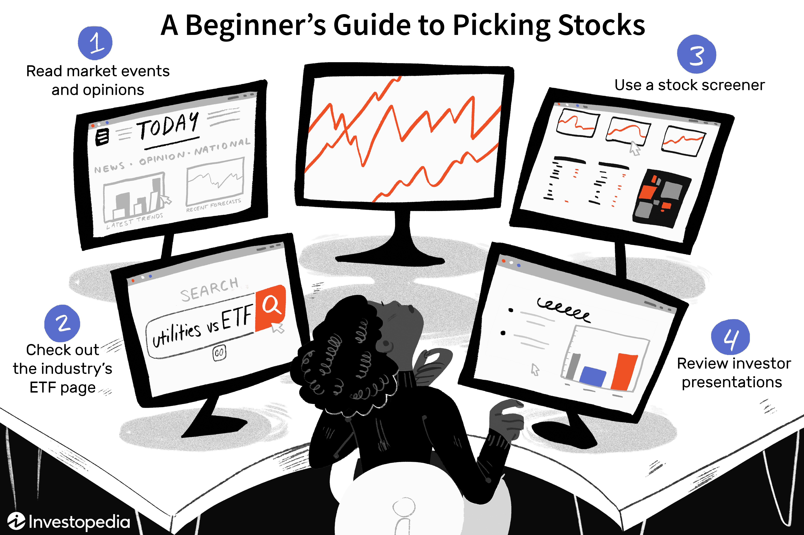

Investing in financial markets represents a significant opportunity for wealth accumulation. However, it demands a well-structured strategy and a methodical approach to navigate the complexities effectively. This article elucidates various investment strategies, stock selection techniques, and the importance of algorithmic trading, each contributing uniquely to informed investment decisions and optimized returns.

Investment strategies form the backbone of successful financial planning, guiding investors in tailoring their portfolios to align with specific financial goals. These strategic frameworks are not monolithic; they encompass a spectrum ranging from traditional methods to modern innovations. By understanding and applying these strategies, investors can better manage risks and take advantage of market opportunities. 



Stock picking is a crucial aspect of investment, involving the careful selection of individual stocks with the potential to outperform the market. It requires a thorough analysis of various factors, including company fundamentals and market conditions. Through stock picking, investors can construct diversified portfolios that enhance their potential for growth while mitigating risks. 

Algorithmic trading introduces a technological dimension to investing, leveraging computer programs to execute trades based on set criteria. This approach minimizes emotional biases and optimizes the trading process through speed and data processing capabilities. As we progress, the role of technology in financial markets continues to grow, offering substantial advantages to those who can harness it effectively.

This comprehensive guide aims to furnish readers with the foundational knowledge necessary for strategic investment planning. By examining both traditional and contemporary methods, and illustrating their application through real-world examples, the article aspires to equip investors with the tools necessary to navigate the financial landscape successfully, irrespective of their experience level. Understanding these elements enhances one’s ability to make informed decisions, ultimately leading to potentially greater financial success.

## Table of Contents

## Investment Strategies Explained

Investment strategies are systematic plans employed by investors to achieve specific financial objectives over time through the management of their investment portfolios. These strategies can vastly differ depending on the individual investor's risk tolerance, financial goals, and time horizon. Typically, investment strategies are grouped into two broad categories: active and passive strategies.

Active investment strategies involve frequently buying and selling securities with the primary objective of outperforming market indices. Investors employing active strategies engage in thorough research and continuously monitor market developments to capitalize on short-term price fluctuations. This often requires significant expertise and time commitment, and it involves higher transaction costs due to frequent trading. Prominent tactics under active strategies include stock [picking](/wiki/asset-class-picking), market timing, and sector rotation. One common method for active investors is value investing, where investors identify undervalued stocks that are expected to increase in value, thus providing significant returns once the market corrects the undervaluation.

Passive investment strategies, on the other hand, focus on long-term growth by minimizing trading, which inherently reduces transaction costs and potential emotional biases in decision-making. This approach often involves buying and holding a diversified portfolio of assets intended to match or closely track a market index. The primary goal is not to outperform the benchmark but to achieve consistent returns over a time horizon that aligns with the investor's objectives. Growth investing is a strategy often associated with passive investing, where investors focus on companies expected to grow at an above-average rate compared to their industry or the overall market. Income strategies can also fit into passive approaches, particularly for investors looking for steady cash flow through dividends or bond interest.

Successful implementation of any investment strategy involves several key considerations:

- **Risk Tolerance**: An investor's capacity and willingness to endure market volatility and potential losses.
- **Time Horizon**: The period an investor expects to hold an investment before taking the money out, which has implications for liquidity and risk levels.
- **Diversification**: The practice of spreading investments across various financial instruments, industries, and other categories to reduce exposure to any single asset or risk.

These elements are crucial in crafting a strategy that aligns with the investor's broader financial objectives and helps in achieving optimal returns while managing risk efficiently.

## The Art of Stock Picking

Stock picking involves selecting individual stocks with the potential to outperform the broader market, a process that necessitates diligent research and analysis. This strategic approach requires assessing company fundamentals, valuations, and prevailing market conditions.

**Company Fundamentals and Financial Metrics**

Evaluating stocks begins with analyzing company fundamentals. This includes reviewing financial statements such as the income statement, balance sheet, and cash flow statement. Key financial metrics used to gauge a company's health and growth prospects include:

1. **Price-to-Earnings Ratio (P/E Ratio)**: This metric is calculated by dividing a company's current share price by its earnings per share (EPS). It indicates how much investors are willing to pay per dollar of earnings, aiding in the assessment of a stock's valuation relative to its peers.
$$
   \text{P/E Ratio} = \frac{\text{Market Price per Share}}{\text{Earnings per Share (EPS)}}

$$

2. **Earnings per Share (EPS)**: Reflecting a company's profitability, EPS is calculated as net income divided by the number of outstanding shares. Higher EPS values often suggest a company's profitability is strong, making it more attractive to investors.
$$
   \text{EPS} = \frac{\text{Net Income}}{\text{Outstanding Shares}}

$$

3. **Return on Equity (ROE)**: This ratio measures a company's profitability in relation to equity. It is expressed as a percentage and provides insight into how effectively a company is using shareholders’ funds to generate profits.
$$
   \text{ROE} = \frac{\text{Net Income}}{\text{Shareholder's Equity}}

$$

**Analyzing Market Conditions**

Understanding market conditions is crucial in stock picking. This involves evaluating economic indicators, market trends, and sector performance. Investors often embrace a top-down approach, beginning with macroeconomic factors and subsequently focusing on sectors with strong growth potential.

**Case Study: Technology Stocks**

Historically, technology stocks have demonstrated substantial growth and [volatility](/wiki/volatility-trading-strategies). For instance, companies like Apple, Microsoft, and Amazon have shown significant appreciation due to innovations, market dominance, and scalability. Several factors have contributed to their success:

- **Innovation and Technological Advancements**: Continuous innovation drives growth, helping tech companies maintain competitive advantages.
- **Market Penetration and Consumer Adoption**: Expanding product lines and increasing consumer adoption have bolstered revenues and profitability.
- **Global Market Trends**: The growing emphasis on digital transformation and cloud computing has provided consistent tailwinds for tech companies.

A retrospective analysis of tech stocks underscores the importance of understanding industry trajectories and company-specific competitive positioning for successful stock picking.

**Building a Diversified Stock Portfolio**

A well-crafted stock portfolio should balance risk and return. Achieving a diversified portfolio involves spreading investments across sectors and asset classes, reducing exposure to individual stock volatility. Implementing a combination of growth and value stocks from various industries enhances risk management and optimizes returns over time. Diversification strategy considers an investor's risk tolerance, investment horizon, and financial goals.

Ultimately, successful stock picking merges quantitative analysis with qualitative insights, guiding investors toward informed decision-making in their quest for superior market performance.

 to Algorithmic Trading

Algorithmic trading employs sophisticated computer programs to automate and optimize the execution of trades. By relying on predefined criteria and algorithms, this approach allows for high-speed decision-making and minimizes human intervention. This method has revolutionized trading by leveraging advanced technologies to analyze market data and execute trades at speeds beyond human capability.

Several common [algorithmic trading](/wiki/algorithmic-trading) strategies exist, each with unique characteristics. Momentum strategies capitalize on market trends by trading in the direction of the current price movement. The logic underpinning [momentum](/wiki/momentum) trading is that securities exhibiting strong past performance are likely to continue on their trajectory. Conversely, trend-following strategies aim to spot persistent market patterns and trade in line with these trends. These strategies often utilize moving averages or other statistical indicators to identify entry and [exit](/wiki/exit-strategy) points.

Arbitrage strategies exploit price discrepancies between different markets or instruments to make risk-free profits. This requires the ability to rapidly identify and act on mispricing, which is well-suited for algorithmic execution due to the speed and precision necessary.

One of the most significant benefits of algorithmic trading is the reduction of emotional biases that can cloud judgment. Automated systems adhere strictly to their programmed strategies, avoiding the common pitfalls of fear and greed. Additionally, algorithmic trading offers faster execution times, which is crucial in high-frequency trading environments where delays can lead to missed opportunities. The capacity to process and analyze vast amounts of data also equips traders to make more informed decisions.

For beginners interested in algorithmic trading, several tools and platforms are available to simplify entry into this field. Open-source platforms like QuantConnect and Zipline offer robust environments for developing and testing trading strategies using historical data. Python, with libraries such as pandas for data manipulation, NumPy for numerical computation, and TA-Lib for technical analysis, is a popular language for developing algorithms due to its simplicity and extensive range of libraries.

```python
# Example of a simple moving average crossover strategy using pandas and TA-Lib
import pandas as pd
import talib

# Sample historical price data
data = pd.read_csv('historical_prices.csv')
prices = data['Close'].values

# Calculate short-term and long-term moving averages
short_ma = talib.SMA(prices, timeperiod=10)
long_ma = talib.SMA(prices, timeperiod=50)

# Generate buy/sell signals
buy_signals = (short_ma > long_ma) & (short_ma.shift(1) <= long_ma.shift(1))
sell_signals = (short_ma < long_ma) & (short_ma.shift(1) >= long_ma.shift(1))

# Display signals
data['Buy Signal'] = buy_signals
data['Sell Signal'] = sell_signals
print(data[['Date', 'Buy Signal', 'Sell Signal']].head())
```

This code snippet illustrates a basic moving average crossover strategy, where buy and sell signals are generated based on the crossover of a short-term moving average over a long-term moving average. Such examples are foundational for understanding more complex algorithmic trading systems, which can incorporate a multitude of indicators and conditions to optimize performance.

Aspiring algorithmic traders should invest time in learning coding, understanding market fundamentals, and continuously [backtesting](/wiki/backtesting) their strategies to adapt to changing market conditions.

## Investment Strategy Examples

Combining different investment strategies is essential for balancing risk and return in various market conditions. This section explores several examples to illustrate how diverse approaches can be employed to optimize investment outcomes.

### Example 1: A Mix of Value and Growth Stocks
A balance between value and [growth stocks](/wiki/growth-stocks) can provide a stable and potentially rewarding portfolio. Value investing focuses on stocks that are undervalued by the market, offering opportunities for appreciation when the market corrects itself. Growth stocks, on the other hand, are characterized by their potential for rapid earnings expansion. By combining these strategies, investors can achieve a diversified portfolio that captures both steady and dynamic growth.

For instance, a portfolio comprising 50% value stocks and 50% growth stocks might include companies like Johnson & Johnson (value) and Tesla Inc. (growth). The performance of such a diversified portfolio can be modeled using the Sharpe ratio, which evaluates the risk-adjusted return. 

$$
\text{Sharpe Ratio} = \frac{\bar{R_p} - R_f}{\sigma_p}
$$

Where $\bar{R_p}$ is the expected portfolio return, $R_f$ is the risk-free rate, and $\sigma_p$ is the portfolio return standard deviation.

### Example 2: Utilizing Algorithmic Trading for Short-Term Gains
Algorithmic trading can be an effective strategy for short-term gains while maintaining a core portfolio for long-term investment. Algorithms can exploit minute market inefficiencies, executing trades at speeds and frequencies beyond human capability. For instance, a simple moving average crossover strategy might be implemented in Python to identify buy/sell signals:

```python
import pandas as pd

def moving_average_crossover(data, short_window=50, long_window=200):
    data['short_mavg'] = data['Close'].rolling(window=short_window, min_periods=1).mean()
    data['long_mavg'] = data['Close'].rolling(window=long_window, min_periods=1).mean()
    data['signal'] = 0
    data['signal'][short_window:] = np.where(data['short_mavg'][short_window:] > data['long_mavg'][short_window:], 1, 0)
    data['positions'] = data['signal'].diff()
    return data

# Assume 'data' is a DataFrame containing historical price data.
data = pd.read_csv('stock_data.csv')
signals = moving_average_crossover(data)
```

This code identifies periods when short-term momentum surpasses long-term trends, indicating a buy signal.

### Understanding Market Cycles
Investment strategies should adapt to market cycles. During expansion phases, growth stocks might outperform, whereas defensive stocks, such as utilities and consumer staples, may be preferable during contractions. Recognizing cycle phases can inform asset allocation adjustments to optimize return and mitigate risk.

### Sector Investments: Energy and Tech
Investing in specific sectors, like energy and technology, offers targeted exposure and potential for high returns. Exchange-Traded Funds (ETFs) are popular vehicles for sector investments due to their diversification benefits. For tech, ETFs like the Technology Select Sector SPDR Fund (XLK) provide broad exposure to high-performing companies like Apple and Microsoft. In the energy sector, the Energy Select Sector SPDR Fund (XLE) includes major players such as ExxonMobil and Chevron, capturing sector-wide growth opportunities.

In conclusion, strategically combining investment approaches allows for tailored portfolio construction that aligns with individual financial goals and market trends, ultimately enhancing the potential for achieving desired investment outcomes.

## The Role of Financial Advisors

Financial advisors play a critical role in aiding investors to devise and execute effective investment strategies. These professionals bring a wealth of expertise to the table, offering valuable insights into diverse aspects of the financial market and beyond.

One of the primary services provided by financial advisors is insight into market trends. An understanding of prevailing and emerging trends can guide investors in making informed decisions that align with current and projected market conditions. By staying abreast of shifts in the market, advisors help investors recognize opportunities and mitigate potential risks.

Tax implications are another crucial area where financial advisors offer guidance. Navigating the complexities of tax laws and regulations can have significant impacts on investment returns. Advisors help investors understand how different investment vehicles are taxed, enabling them to optimize their portfolios for tax efficiency and compliance.

Portfolio management is a cornerstone of the services provided by financial advisors. They assist investors in creating a diversified portfolio that balances risk and return, aligning with the investor's financial goals. This includes regular performance reviews and adjustments to the portfolio as needs and market conditions change.

Choosing a qualified financial advisor is essential for investors looking to craft and implement a successful investment strategy. A competent advisor should have a deep understanding of the investor's financial objectives, risk tolerance, and life goals. Credentials, experience, and maybe even a fiduciary responsibility to act in the client's best interest are factors that should be considered when selecting an advisor.

Advisors are instrumental in evaluating and adjusting investment strategies in response to changes in market conditions or personal circumstances. They continue to assess the performance of investments and provide recommendations for rebalancing the portfolio as necessary.

Case studies highlight the tangible benefits clients receive from their financial advisors, particularly in navigating volatile markets. For instance, during economic downturns or periods of high market volatility, advisors can provide reassurance and strategic adjustments to portfolios that help minimize losses and capitalize on recovery opportunities. Their experience and analytical tools allow for stress testing of portfolios against various market scenarios, advising clients on potential risks and the best path forward.

In conclusion, financial advisors are vital to the investment process by offering market insights, tax guidance, portfolio management, and adaptive strategies in changing market environments. Their expertise and support enable investors to optimize their strategies and achieve their financial goals while managing risk and navigating complex financial landscapes.

## Conclusion

Successful investing hinges on having a clear strategy, disciplined execution, and a willingness to adapt to changing market conditions. The financial markets are inherently dynamic, and the strategies that work well in one market environment may require adjustments as conditions evolve. This adaptability is key to sustaining and potentially enhancing financial returns over time.

Stock picking and algorithmic trading provide unique opportunities. Stock picking involves deep analysis of individual stocks, requiring a thorough understanding of company fundamentals, market conditions, and economic indicators. For investors who prefer a more systematic approach, algorithmic trading offers the ability to execute trades based on predefined criteria, thus reducing emotional biases and enhancing the speed and efficiency of transaction execution. Both methods require careful planning and a strong knowledge base.

Investors must assess their personal financial goals and risk tolerance when formulating their investment strategies. Some individuals may prioritize long-term capital appreciation, while others might seek steady income streams. A successful strategy aligns investment choices with these personal objectives, and it often incorporates a diversified portfolio to mitigate risk. Diversification can be achieved across asset classes, sectors, and geographies, helping to protect against unforeseen market fluctuations.

The ultimate goal of any investment strategy is to build a portfolio that reflects an investor's financial goals while maintaining a balance between risk and return. This involves not only selecting the right mix of assets but also continually reviewing and adjusting the portfolio in response to market developments and personal financial changes.

Continuous learning and adaptation are vital for staying ahead in the ever-changing financial landscape. This includes keeping abreast of market trends, understanding new financial products, and leveraging technological advancements in investment management. By doing so, investors can better navigate market volatility, optimize their strategies, and work towards achieving their financial ambitions.

## References & Further Reading

[1]: Bergstra, J., Bardenet, R., Bengio, Y., & Kégl, B. (2011). ["Algorithms for Hyper-Parameter Optimization."](https://dl.acm.org/doi/10.5555/2986459.2986743) Advances in Neural Information Processing Systems 24.

[2]: ["Advances in Financial Machine Learning"](https://www.amazon.com/Advances-Financial-Machine-Learning-Marcos/dp/1119482089) by Marcos Lopez de Prado

[3]: ["Evidence-Based Technical Analysis: Applying the Scientific Method and Statistical Inference to Trading Signals"](https://www.amazon.com/Evidence-Based-Technical-Analysis-Scientific-Statistical/dp/0470008741) by David Aronson

[4]: ["Machine Learning for Algorithmic Trading"](https://github.com/stefan-jansen/machine-learning-for-trading) by Stefan Jansen

[5]: ["Quantitative Trading: How to Build Your Own Algorithmic Trading Business"](https://www.amazon.com/Quantitative-Trading-Build-Algorithmic-Business/dp/1119800064) by Ernest P. Chan