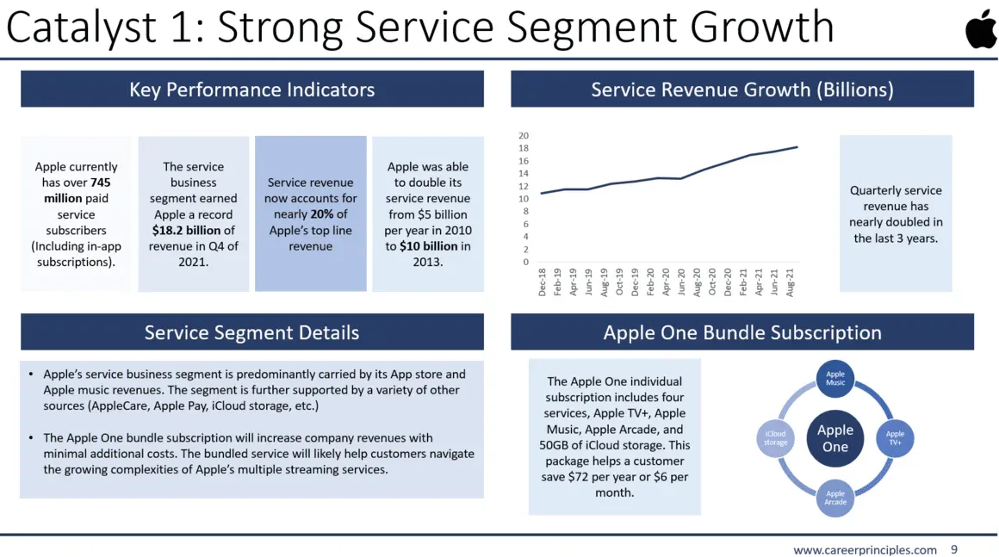

## Table of Contents

## What are stock picks?

Stock picks are recommendations about which stocks to buy or sell. People who give stock picks are often called analysts or financial advisors. They look at a lot of information about companies, like how much money the company makes, who runs the company, and what is happening in the world that might affect the company. Based on this information, they decide if a stock is a good buy or if it's time to sell it.

When someone follows a stock pick, they are hoping to make money. If the stock goes up in price after they buy it, they can sell it for more than they paid. But stock picks are not always right. Sometimes the stock goes down instead of up, and then the person loses money. It's important to remember that stock picks are just suggestions, and no one can predict the future perfectly. So, it's a good idea to do your own research and maybe talk to more than one expert before making a decision.

## Why do investors use stock picks?

Investors use stock picks to help them decide which stocks to buy or sell. They look at stock picks because they want to make money. When someone gives a stock pick, they are saying that they think a certain stock will go up in price. If the investor buys that stock and it goes up, they can sell it for more than they paid and make a profit. It's like getting advice on which horse to bet on in a race.

But stock picks are not always right. Sometimes the stock goes down instead of up, and then the investor loses money. That's why investors use stock picks as just one part of their decision-making process. They also do their own research and might talk to other experts. Using stock picks can be helpful, but it's important to remember that they are just suggestions and not guarantees of making money.

## How do stock picks differ from other investment strategies?

Stock picks are specific recommendations about which stocks to buy or sell. They are usually given by analysts or financial advisors who have studied a company's financial health, management, and market conditions. When an investor follows a stock pick, they are hoping to make money by buying a stock that is expected to increase in value. Stock picks are focused on individual stocks and are often short-term in nature, meaning the investor might hold the stock for a few weeks or months.

Other investment strategies can be broader and more long-term. For example, diversification is a strategy where an investor spreads their money across many different types of investments, like stocks, bonds, and real estate, to reduce risk. Another strategy is value investing, where investors look for companies that they believe are undervalued by the market and hold onto them for a long time, hoping the market will eventually recognize the true value of the company. These strategies are less about picking individual stocks and more about managing a whole portfolio over time.

## What are the basic mechanisms behind selecting stock picks?

The basic way to pick stocks starts with looking at a company's money numbers, like how much money they make and spend. Analysts look at things like the company's earnings, how much debt they have, and how fast they are growing. They also think about the whole industry the company is in and what's happening in the world that could affect the company. For example, if a company makes cars and there's a new law about car safety, that could change how well the company does.

Another part of picking stocks is looking at what other people think about the company. This includes what other analysts say, what the company's leaders say about the future, and even what regular people are saying on social media. Sometimes, stock picks are also based on how the stock's price has been moving lately. If the price is going up fast, some people might think it will keep going up, so they pick that stock. But it's important to remember that picking stocks is not an exact science, and what works one time might not work the next.

## What are the key factors to consider when choosing stock picks?

When choosing stock picks, it's important to look at the company's financial health. This means checking how much money the company makes, how much it spends, and if it has a lot of debt. You should also think about how fast the company is growing and if it can keep growing. Another thing to consider is the industry the company is in. Some industries are doing well and growing, while others might be struggling. It's also good to look at what's happening in the world that could affect the company, like new laws or changes in the economy.

Another key factor is what other people think about the company. This includes what analysts and experts say, what the company's leaders are saying about the future, and even what regular people are talking about on social media. Sometimes, the recent movement of the stock's price can influence a pick. If the price has been going up quickly, some might think it will keep going up. But it's important to remember that picking stocks is not an exact science, and what works one time might not work the next. It's always a good idea to do your own research and maybe talk to more than one expert before making a decision.

## How can beginners start with stock picking?

If you're new to picking stocks, start by learning the basics. First, understand what a stock is - it's like owning a small piece of a company. Then, learn about the stock market and how it works. You can find a lot of free information online, like videos and articles, that explain these things in simple terms. It's also a good idea to open a practice account, sometimes called a "demo account," where you can pretend to buy and sell stocks without using real money. This helps you get a feel for how the stock market works without risking any money.

Once you feel more comfortable, start looking at different companies. Look at their financial reports to see how much money they make and spend. Pay attention to the industry they are in and what's happening in the world that could affect them. You can also read what experts say about these companies, but remember, their advice is just a starting point. It's important to do your own research too. Begin with small investments that you can afford to lose, and as you learn more and feel more confident, you can slowly start to invest more. Always remember, picking stocks involves risk, so take your time and don't rush into big decisions.

## What are some common tools and resources for stock picking?

When you start picking stocks, you'll find lots of tools and resources to help you. One of the most useful tools is a stock screener. This is like a search engine for stocks. You can set it to look for stocks that match what you're looking for, like companies that are growing fast or ones that pay good dividends. Another helpful tool is a financial news website or app. These keep you up to date on what's happening with different companies and the economy. They can give you ideas for stocks to look at and help you understand why stock prices are moving.

You can also use stock analysis websites. These sites give you detailed information about a company's financial health, like how much money they make and spend. They often have charts and graphs that make it easier to see how a company is doing over time. Another good resource is investment newsletters or blogs. These are written by people who spend a lot of time studying the stock market, and they share their ideas on which stocks might be good to buy. Finally, many people use online brokerages that have built-in tools for research and analysis, making it easier to find and pick stocks right from your trading account.

## How do professional stock pickers analyze stocks?

Professional stock pickers use a lot of different ways to look at stocks. They start by checking the company's financial numbers, like how much money the company makes and spends. They look at things like earnings, how much debt the company has, and how fast it's growing. They also think about the industry the company is in and what's happening in the world that could affect it. For example, if a company makes cars and there's a new law about car safety, that could change how well the company does. They also read what other people think about the company, like what other analysts say, what the company's leaders say about the future, and even what people are saying on social media.

Another thing professional stock pickers do is use special tools to help them. They use stock screeners to find stocks that match what they're looking for, like companies that are growing fast or ones that pay good dividends. They also use financial news websites and apps to stay up to date on what's happening with different companies and the economy. They might use stock analysis websites that give detailed information about a company's financial health, with charts and graphs to see how the company is doing over time. They also read investment newsletters or blogs written by other people who study the stock market a lot. These different tools and resources help them make better decisions about which stocks to pick.

## What are the risks associated with stock picking?

Stock picking can be risky because you might lose money. When you buy a stock, there's no guarantee that it will go up in price. Sometimes, the stock goes down instead, and if you sell it then, you lose money. Even if experts say a stock is a good pick, they can be wrong. The stock market can be unpredictable, and many things can affect stock prices, like what's happening in the economy or changes in a company's business. So, if you put all your money into one or two stocks, you could lose a lot if those stocks don't do well.

Another risk is that stock picking takes a lot of time and work. You need to do a lot of research to pick good stocks. You have to keep up with news about the companies you're interested in and understand how the stock market works. If you don't do this, you might miss important information that could affect your stocks. Also, if you don't spread your money across different types of investments, you're putting all your eggs in one basket. This can be very risky because if one thing goes wrong, you could lose a lot of money. So, it's important to be careful and think about these risks before you start picking stocks.

## Can you provide examples of successful stock picks and what made them successful?

One successful stock pick was Apple Inc. in the early 2000s. Back then, Apple was just starting to grow big. They had just launched the iPod, which was a new kind of music player that people loved. People who picked Apple's stock at that time made a lot of money because the company kept coming up with new, popular products like the iPhone and iPad. Apple also did well because they made their products easy to use and stylish, so more and more people wanted to buy them. The company's earnings kept going up, which made the stock price go up too.

Another example is Amazon in the late 1990s. At that time, Amazon was mostly just selling books online, but they had big plans to sell all kinds of things. People who picked Amazon's stock back then saw it grow a lot over the years. Amazon kept getting bigger and started selling everything from clothes to groceries. They also started services like Amazon Web Services, which helped companies use the internet better. Amazon's success came from always trying new things and growing fast, which made their stock price go up a lot over time.

## How do market conditions affect stock picking strategies?

Market conditions play a big role in how people pick stocks. When the economy is doing well, and people are buying a lot of things, companies usually make more money. This can make their stock prices go up. So, in good times, stock pickers might look for companies that are growing fast or ones that people really like. But if the economy is not doing well, and people are not spending as much, stock pickers might be more careful. They might look for companies that are not too risky and can still make money even when times are tough.

Different market conditions can also change what kinds of stocks people pick. For example, when interest rates are low, people might borrow more money to buy stocks, so stock prices might go up. In these times, stock pickers might choose stocks that do well when people are borrowing and spending more. But if interest rates go up, borrowing money becomes more expensive, and people might not spend as much. Then, stock pickers might pick stocks that are safer and less affected by high interest rates. So, understanding what's happening in the market can help stock pickers make better choices.

## What advanced techniques can expert investors use to enhance their stock picking?

Expert investors often use advanced techniques like quantitative analysis to pick stocks. This means they use math and computer programs to look at a lot of data about companies. They might look at things like how much money a company makes compared to its stock price, or how the stock's price has moved in the past. By using these numbers, they can find patterns that might help them predict what will happen to the stock price in the future. This can be really helpful because it takes out some of the guesswork and helps them make decisions based on hard data.

Another technique experts use is called technical analysis. This is when they look at charts and graphs of a stock's price over time to see if they can spot patterns. They believe that these patterns can tell them when it's a good time to buy or sell a stock. For example, if a stock's price has been going up and down in a certain way, they might think it will keep doing that. They also use something called sentiment analysis, which is looking at what people are saying about a company on social media or in the news. If a lot of people are talking positively about a company, it might mean the stock price will go up. These advanced techniques can help expert investors make better stock picks, but they still need to be careful because the stock market can be unpredictable.

## What is the Art of Stock Picking?

Stock picking involves selecting individual stocks with the potential to outperform the broader market, a process that necessitates diligent research and analysis. This strategic approach requires assessing company fundamentals, valuations, and prevailing market conditions.

**Company Fundamentals and Financial Metrics**

Evaluating stocks begins with analyzing company fundamentals. This includes reviewing financial statements such as the income statement, balance sheet, and cash flow statement. Key financial metrics used to gauge a company's health and growth prospects include:

1. **Price-to-Earnings Ratio (P/E Ratio)**: This metric is calculated by dividing a company's current share price by its earnings per share (EPS). It indicates how much investors are willing to pay per dollar of earnings, aiding in the assessment of a stock's valuation relative to its peers.
$$
   \text{P/E Ratio} = \frac{\text{Market Price per Share}}{\text{Earnings per Share (EPS)}}

$$

2. **Earnings per Share (EPS)**: Reflecting a company's profitability, EPS is calculated as net income divided by the number of outstanding shares. Higher EPS values often suggest a company's profitability is strong, making it more attractive to investors.
$$
   \text{EPS} = \frac{\text{Net Income}}{\text{Outstanding Shares}}

$$

3. **Return on Equity (ROE)**: This ratio measures a company's profitability in relation to equity. It is expressed as a percentage and provides insight into how effectively a company is using shareholders’ funds to generate profits.
$$
   \text{ROE} = \frac{\text{Net Income}}{\text{Shareholder's Equity}}

$$

**Analyzing Market Conditions**

Understanding market conditions is crucial in stock picking. This involves evaluating economic indicators, market trends, and sector performance. Investors often embrace a top-down approach, beginning with macroeconomic factors and subsequently focusing on sectors with strong growth potential.

**Case Study: Technology Stocks**

Historically, technology stocks have demonstrated substantial growth and [volatility](/wiki/volatility-trading-strategies). For instance, companies like Apple, Microsoft, and Amazon have shown significant appreciation due to innovations, market dominance, and scalability. Several factors have contributed to their success:

- **Innovation and Technological Advancements**: Continuous innovation drives growth, helping tech companies maintain competitive advantages.
- **Market Penetration and Consumer Adoption**: Expanding product lines and increasing consumer adoption have bolstered revenues and profitability.
- **Global Market Trends**: The growing emphasis on digital transformation and cloud computing has provided consistent tailwinds for tech companies.

A retrospective analysis of tech stocks underscores the importance of understanding industry trajectories and company-specific competitive positioning for successful stock picking.

**Building a Diversified Stock Portfolio**

A well-crafted stock portfolio should balance risk and return. Achieving a diversified portfolio involves spreading investments across sectors and asset classes, reducing exposure to individual stock volatility. Implementing a combination of growth and value stocks from various industries enhances risk management and optimizes returns over time. Diversification strategy considers an investor's risk tolerance, investment horizon, and financial goals.

Ultimately, successful stock picking merges quantitative analysis with qualitative insights, guiding investors toward informed decision-making in their quest for superior market performance.

 to Algorithmic Trading

Algorithmic trading employs sophisticated computer programs to automate and optimize the execution of trades. By relying on predefined criteria and algorithms, this approach allows for high-speed decision-making and minimizes human intervention. This method has revolutionized trading by leveraging advanced technologies to analyze market data and execute trades at speeds beyond human capability.

Several common [algorithmic trading](/wiki/algorithmic-trading) strategies exist, each with unique characteristics. Momentum strategies capitalize on market trends by trading in the direction of the current price movement. The logic underpinning [momentum](/wiki/momentum) trading is that securities exhibiting strong past performance are likely to continue on their trajectory. Conversely, trend-following strategies aim to spot persistent market patterns and trade in line with these trends. These strategies often utilize moving averages or other statistical indicators to identify entry and [exit](/wiki/exit-strategy) points.

Arbitrage strategies exploit price discrepancies between different markets or instruments to make risk-free profits. This requires the ability to rapidly identify and act on mispricing, which is well-suited for algorithmic execution due to the speed and precision necessary.

One of the most significant benefits of algorithmic trading is the reduction of emotional biases that can cloud judgment. Automated systems adhere strictly to their programmed strategies, avoiding the common pitfalls of fear and greed. Additionally, algorithmic trading offers faster execution times, which is crucial in high-frequency trading environments where delays can lead to missed opportunities. The capacity to process and analyze vast amounts of data also equips traders to make more informed decisions.

For beginners interested in algorithmic trading, several tools and platforms are available to simplify entry into this field. Open-source platforms like QuantConnect and Zipline offer robust environments for developing and testing trading strategies using historical data. Python, with libraries such as pandas for data manipulation, NumPy for numerical computation, and TA-Lib for technical analysis, is a popular language for developing algorithms due to its simplicity and extensive range of libraries.

```python
# Example of a simple moving average crossover strategy using pandas and TA-Lib
import pandas as pd
import talib

# Sample historical price data
data = pd.read_csv('historical_prices.csv')
prices = data['Close'].values

# Calculate short-term and long-term moving averages
short_ma = talib.SMA(prices, timeperiod=10)
long_ma = talib.SMA(prices, timeperiod=50)

# Generate buy/sell signals
buy_signals = (short_ma > long_ma) & (short_ma.shift(1) <= long_ma.shift(1))
sell_signals = (short_ma < long_ma) & (short_ma.shift(1) >= long_ma.shift(1))

# Display signals
data['Buy Signal'] = buy_signals
data['Sell Signal'] = sell_signals
print(data[['Date', 'Buy Signal', 'Sell Signal']].head())
```

This code snippet illustrates a basic moving average crossover strategy, where buy and sell signals are generated based on the crossover of a short-term moving average over a long-term moving average. Such examples are foundational for understanding more complex algorithmic trading systems, which can incorporate a multitude of indicators and conditions to optimize performance.

Aspiring algorithmic traders should invest time in learning coding, understanding market fundamentals, and continuously [backtesting](/wiki/backtesting) their strategies to adapt to changing market conditions.

## What are some examples of investment strategies?

Combining different investment strategies is essential for balancing risk and return in various market conditions. This section explores several examples to illustrate how diverse approaches can be employed to optimize investment outcomes.

### Example 1: A Mix of Value and Growth Stocks
A balance between value and [growth stocks](/wiki/growth-stocks) can provide a stable and potentially rewarding portfolio. Value investing focuses on stocks that are undervalued by the market, offering opportunities for appreciation when the market corrects itself. Growth stocks, on the other hand, are characterized by their potential for rapid earnings expansion. By combining these strategies, investors can achieve a diversified portfolio that captures both steady and dynamic growth.

For instance, a portfolio comprising 50% value stocks and 50% growth stocks might include companies like Johnson & Johnson (value) and Tesla Inc. (growth). The performance of such a diversified portfolio can be modeled using the Sharpe ratio, which evaluates the risk-adjusted return. 

$$
\text{Sharpe Ratio} = \frac{\bar{R_p} - R_f}{\sigma_p}
$$

Where $\bar{R_p}$ is the expected portfolio return, $R_f$ is the risk-free rate, and $\sigma_p$ is the portfolio return standard deviation.

### Example 2: Utilizing Algorithmic Trading for Short-Term Gains
Algorithmic trading can be an effective strategy for short-term gains while maintaining a core portfolio for long-term investment. Algorithms can exploit minute market inefficiencies, executing trades at speeds and frequencies beyond human capability. For instance, a simple moving average crossover strategy might be implemented in Python to identify buy/sell signals:

```python
import pandas as pd

def moving_average_crossover(data, short_window=50, long_window=200):
    data['short_mavg'] = data['Close'].rolling(window=short_window, min_periods=1).mean()
    data['long_mavg'] = data['Close'].rolling(window=long_window, min_periods=1).mean()
    data['signal'] = 0
    data['signal'][short_window:] = np.where(data['short_mavg'][short_window:] > data['long_mavg'][short_window:], 1, 0)
    data['positions'] = data['signal'].diff()
    return data

# Assume 'data' is a DataFrame containing historical price data.
data = pd.read_csv('stock_data.csv')
signals = moving_average_crossover(data)
```

This code identifies periods when short-term momentum surpasses long-term trends, indicating a buy signal.

### Understanding Market Cycles
Investment strategies should adapt to market cycles. During expansion phases, growth stocks might outperform, whereas defensive stocks, such as utilities and consumer staples, may be preferable during contractions. Recognizing cycle phases can inform asset allocation adjustments to optimize return and mitigate risk.

### Sector Investments: Energy and Tech
Investing in specific sectors, like energy and technology, offers targeted exposure and potential for high returns. Exchange-Traded Funds (ETFs) are popular vehicles for sector investments due to their diversification benefits. For tech, ETFs like the Technology Select Sector SPDR Fund (XLK) provide broad exposure to high-performing companies like Apple and Microsoft. In the energy sector, the Energy Select Sector SPDR Fund (XLE) includes major players such as ExxonMobil and Chevron, capturing sector-wide growth opportunities.

In conclusion, strategically combining investment approaches allows for tailored portfolio construction that aligns with individual financial goals and market trends, ultimately enhancing the potential for achieving desired investment outcomes.

## References & Further Reading

[1]: Bergstra, J., Bardenet, R., Bengio, Y., & Kégl, B. (2011). ["Algorithms for Hyper-Parameter Optimization."](https://dl.acm.org/doi/10.5555/2986459.2986743) Advances in Neural Information Processing Systems 24.

[2]: ["Advances in Financial Machine Learning"](https://www.amazon.com/Advances-Financial-Machine-Learning-Marcos/dp/1119482089) by Marcos Lopez de Prado

[3]: ["Evidence-Based Technical Analysis: Applying the Scientific Method and Statistical Inference to Trading Signals"](https://www.amazon.com/Evidence-Based-Technical-Analysis-Scientific-Statistical/dp/0470008741) by David Aronson

[4]: ["Machine Learning for Algorithmic Trading"](https://github.com/stefan-jansen/machine-learning-for-trading) by Stefan Jansen

[5]: ["Quantitative Trading: How to Build Your Own Algorithmic Trading Business"](https://www.amazon.com/Quantitative-Trading-Build-Algorithmic-Business/dp/1119800064) by Ernest P. Chan