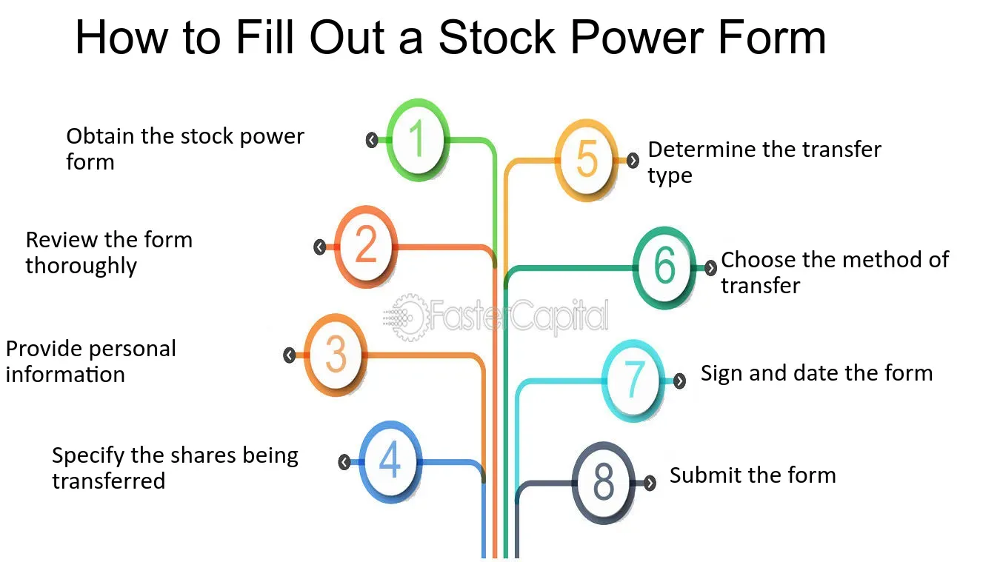

## Table of Contents

## What is stock power and why is it important in the financial market?

Stock power, also known as a stock power form, is a legal document that allows the transfer of ownership of stocks from one person to another. It is usually used when someone wants to give their stocks to someone else as a gift, or when stocks are being transferred as part of an estate after someone passes away. The person who owns the stocks signs the stock power form, which then allows the new owner to take possession of the stocks.

Stock power is important in the financial market because it makes the process of transferring ownership of stocks easier and more straightforward. Without a stock power form, transferring stocks could be a complicated and time-consuming process, involving a lot of paperwork and legal steps. By using a stock power form, the transfer can be done quickly and efficiently, which helps keep the financial market running smoothly. This is especially important in situations where time is of the essence, such as when stocks need to be transferred quickly after someone's death.

## How does stock power work in the process of transferring stock ownership?

When someone wants to transfer their stocks to someone else, they use a stock power form. This form is like a permission slip that says it's okay to move the stocks from the current owner to a new owner. The person who owns the stocks fills out the form with their name and the details of the stocks they want to transfer. They then sign the form to show that they agree to the transfer.

Once the stock power form is signed, it can be given to a broker or a transfer agent. This person or company then uses the form to officially change the ownership of the stocks in their records. The new owner can then take control of the stocks and do whatever they want with them, like sell them or keep them as an investment. This process makes transferring stocks easy and helps keep everything organized in the stock market.

## What are the basic requirements for a stock power form to be valid?

A stock power form needs a few important things to be valid. First, the person who owns the stocks has to fill out the form with their name and the details of the stocks they want to transfer. This includes the number of shares and the name of the company. They also need to write the name of the person who will get the stocks. It's really important that all this information is correct and clear.

Second, the person who owns the stocks has to sign the form. This signature shows that they agree to give the stocks to someone else. Sometimes, the form also needs to be signed by a witness or notarized to make sure it's official. Once everything is filled out and signed correctly, the form can be used to transfer the stocks to the new owner.

## Can you explain the difference between a stock power and a stock certificate?

A stock power is a document that helps transfer ownership of stocks from one person to another. It's like a permission slip that the current owner signs to say it's okay to give the stocks to someone else. When someone wants to give their stocks away, they fill out the stock power form with their name, the details of the stocks, and the name of the new owner. Then, they sign it to make it official. The signed form is given to a broker or transfer agent who uses it to update the ownership records.

A stock certificate, on the other hand, is a piece of paper that shows who owns the stocks. It's like a receipt that says how many shares someone has in a company. The certificate has the owner's name, the number of shares, and the company's name on it. While a stock power is used to transfer stocks, a stock certificate is used to prove ownership. Both are important, but they serve different purposes in the world of stocks.

## What are the key elements that should be included in a stock power document?

A stock power document needs to have the name of the person who owns the stocks and the name of the person who will get the stocks. It should also list the number of shares and the name of the company the stocks are from. This makes sure everyone knows exactly which stocks are being transferred. The current owner must sign the document to show they agree to give the stocks away.

Sometimes, a stock power document also needs a witness or a notary to sign it to make it official. This helps prevent any problems or fraud. Once everything is filled out correctly and signed, the document can be given to a broker or transfer agent who will use it to change the ownership of the stocks in their records.

## How does one properly fill out and submit a stock power form?

To properly fill out a stock power form, you need to start by writing your name as the current owner of the stocks. Next, write the name of the person who will be getting the stocks. Then, you need to list the number of shares and the name of the company the stocks are from. Make sure all the details are correct and clear. After you've filled out all the information, sign the form to show that you agree to give the stocks to the new owner. Sometimes, you might need a witness or a notary to sign the form too, to make it official.

Once the stock power form is filled out and signed, you need to submit it to a broker or a transfer agent. This person or company will use the form to change the ownership of the stocks in their records. You can usually give the form to your broker in person, mail it, or sometimes even submit it online if your broker allows it. Make sure to keep a copy of the form for your records, just in case you need it later. After the broker or transfer agent processes the form, the new owner will be able to take control of the stocks.

## What are the common mistakes to avoid when using a stock power?

When using a stock power, one common mistake is not filling out all the information correctly. You need to write your name, the new owner's name, the number of shares, and the company name clearly. If any of these details are wrong or missing, the transfer might not happen, and you'll have to start over. It's also important to double-check everything before you sign the form to make sure there are no mistakes.

Another mistake to avoid is forgetting to sign the stock power form. Your signature is what makes the transfer official, so if you don't sign it, the broker or transfer agent won't be able to process the transfer. Sometimes, you might also need a witness or a notary to sign the form, so make sure you know if that's required and get it done. By avoiding these common mistakes, you can make sure the stock transfer goes smoothly.

## In what scenarios might an investor need to use a stock power?

An investor might need to use a stock power when they want to give their stocks to someone else as a gift. This could be for a special occasion like a birthday or a wedding. By using a stock power, the investor can easily transfer the ownership of the stocks to the new owner without a lot of hassle. It's a simple way to share their investments with family or friends.

Another scenario where an investor might use a stock power is when they pass away and their stocks need to be transferred to someone else as part of their estate. In this case, the executor of the estate would use the stock power to move the stocks to the person named in the will. This helps make sure the investor's wishes are followed and the stocks are transferred quickly and smoothly to the new owner.

## How does the use of stock power affect the taxation of stock transactions?

Using a stock power to transfer stocks can affect how the stocks are taxed. When you give stocks to someone else as a gift, you might have to pay a gift tax if the value of the stocks is more than the yearly gift tax limit. The person getting the stocks doesn't have to pay tax on them right away, but they might have to pay capital gains tax later if they sell the stocks and they've gone up in value.

If the stocks are being transferred as part of an estate after someone passes away, the tax rules are a bit different. The value of the stocks is usually reset to their value on the date of death, which is called a step-up in basis. This means the person getting the stocks might not have to pay as much in capital gains tax if they sell them later. So, using a stock power can change how and when taxes are paid on the stocks, depending on whether it's a gift or part of an estate.

## What are the legal implications and protections associated with stock power?

Using a stock power to transfer stocks has important legal implications and protections. When you sign a stock power, you're giving permission for the stocks to be transferred to someone else. This makes the transfer official and legally binding. If the form is filled out correctly and signed by everyone who needs to sign it, the transfer is protected by law. This means the new owner can legally take control of the stocks and use them as they see fit.

There are also protections in place to prevent fraud or mistakes. For example, some stock power forms need to be signed by a witness or a notary to make sure everything is done right. This helps stop someone from faking a signature or changing the form without permission. If there's a problem with the transfer, like a mistake on the form or a question about the signature, the legal system can help sort it out. This makes sure the transfer of stocks is fair and follows the rules.

## How do electronic stock powers differ from traditional paper forms, and what are the advantages?

Electronic stock powers are used to transfer stocks using a computer or online system, instead of using paper forms. When you use an electronic stock power, you fill out the information and sign it electronically, usually through a secure website or app. This means you don't have to print anything or mail the form to a broker or transfer agent. Instead, the electronic form is sent instantly through the internet, making the process faster and easier.

The main advantages of using electronic stock powers are speed and convenience. Since everything is done online, the transfer can happen much quicker than with paper forms. You also don't have to worry about losing the form or waiting for it to be mailed. Plus, electronic systems often have built-in checks to make sure all the information is correct and the signature is valid, which helps prevent mistakes and fraud. This makes the whole process of transferring stocks smoother and more secure.

## What advanced strategies can investors employ using stock power to optimize their portfolio management?

Investors can use stock power to optimize their portfolio management by gifting stocks to family members or setting up trusts. For example, if an investor wants to reduce their taxable estate, they can transfer stocks to their children or grandchildren using a stock power. This not only helps lower their potential estate taxes but also allows the younger generation to start building their own investment portfolios. By carefully choosing which stocks to transfer, the investor can also diversify their family's investments, spreading the risk across different companies and sectors.

Another strategy involves using stock power to facilitate charitable giving. An investor might decide to donate stocks to a charity, which can provide them with a tax deduction. By using a stock power, the investor can easily transfer the stocks to the charity without selling them first, which helps avoid capital gains tax. This strategy not only supports the investor's favorite causes but also helps optimize their tax situation. By thinking creatively about how to use stock power, investors can make their portfolio management more efficient and beneficial in the long run.

## References & Further Reading

[1]: Hull, J. C. (2017). ["Options, Futures, and Other Derivatives"](https://www.semanticscholar.org/paper/Options%2C-Futures%2C-and-Other-Derivatives-Hull/89bdee500c8623864fc9eb7a471546aa713acc44). Pearson Education.

[2]: Narang, R. K. (2013). ["Inside the Black Box: A Simple Guide to Quantitative and High Frequency Trading"](https://onlinelibrary.wiley.com/doi/book/10.1002/9781118662717). Wiley.

[3]: Fabozzi, F. J., & Focardi, S. M. (2010). ["Quantitative Equity Investing: Techniques and Strategies"](https://www.semanticscholar.org/paper/Quantitative-Equity-Investing%3A-Techniques-and-Fabozzi-Focardi/1c49a2a53919f7e65cb96f16691b8ff726fd3cd7). Wiley.

[4]: De Prado, M. L. (2018). ["Advances in Financial Machine Learning"](https://www.amazon.com/Advances-Financial-Machine-Learning-Marcos/dp/1119482089). Wiley.

[5]: Kissell, R. (2013). ["The Science of Algorithmic Trading and Portfolio Management"](https://www.sciencedirect.com/book/9780124016897/the-science-of-algorithmic-trading-and-portfolio-management). Academic Press.

[6]: Aldridge, I. (2013). ["High-Frequency Trading: A Practical Guide to Algorithmic Strategies and Trading Systems"](https://books.google.com/books/about/High_Frequency_Trading.html?id=6l0DDQAAQBAJ). Wiley.