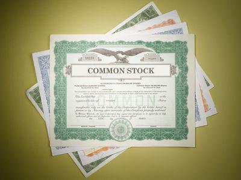

Financial instruments are fundamental components of the global financial system. They serve as vehicles for investment, risk management, and funding, and they are crucial for both individual and institutional participants worldwide. At their core, financial instruments are contracts that represent monetary value and can be traded. They come in various forms, each serving distinct purposes and appealing to different types of investors.

Stocks, bonds, and derivatives are the primary categories of financial instruments. Stocks represent ownership in a company and entitle the holder to a portion of the company's profits, typically in the form of dividends. Bonds are debt instruments issued by corporations or governments to raise capital, where the borrower promises to pay back the principal amount along with interest at a specified date. Derivatives, on the other hand, are financial contracts whose value is derived from an underlying asset such as a stock, bond, commodity, or interest rate. Examples of derivatives include options, futures, and swaps, which are used for hedging risks or for speculative purposes.



This article zeroes in on integral aspects of financial instruments: share transfer, stock power, and algorithmic (algo) trading. Share transfer refers to the process of transferring ownership of stocks from one party to another, a fundamental mechanism for the liquidity and market dynamics of stock markets. Stock power, a legal document necessary for the transfer of stock ownership, ensures that such transactions are executed smoothly and securely. Algorithmic trading represents a technological revolution in financial markets, automating trade execution based on predetermined criteria and enabling high-frequency and complex trading strategies.

Understanding these concepts is vital for any stakeholder in financial markets. As markets become more complex and intertwined with technology, grasping the nuances of financial instruments and their associated processes can empower individuals and institutions to make informed decisions. It also facilitates a deeper appreciation of the regulatory and technological frameworks that underpin modern finance. Therefore, gaining a comprehensive knowledge of share transfers, stock power, and algo trading is not only beneficial but imperative for navigating the evolving finance landscape.

## Table of Contents

## Understanding Share Transfer

A share transfer is the process through which the ownership of shares in a company is transferred from one party to another. This transaction is fundamental to stock ownership and trading, serving as the mechanism that facilitates the movement of securities within the financial markets. Share transfers occur in both primary and secondary markets and are pivotal for capital formation and investor liquidity.

The process of transferring shares involves a series of legal and logistical steps to ensure the effective transition of ownership rights. Legally, a share transfer must adhere to the regulatory frameworks established by securities laws, ensuring compliance with requirements such as the provision of consent by the involved parties and the delivery of appropriate documentation. Logistically, the transfer may occur through electronic systems or physical certificates, depending on whether the shares are held electronically or in paper form. 

The role of stock power forms is significant in the transfer of share ownership, particularly for shares that are physically held. A stock power is a legal document that authorizes the transfer of stocks from the existing owner to the transferee. This document serves as a written instruction to the company's transfer agent, facilitating the change in legal title. The stock power form typically includes information such as the name of the issuer, the description of the shares, the name of the current holder and the intended recipient, and the signature of the transferor, which must often be notarized or medallion guaranteed to prevent fraud.

The key requirements in a share transfer process include the consent of both parties involved—the current shareholder and the transferee. When shares are transferred electronically, the process is generally managed by depositories and brokerage firms that update the ownership records. In contrast, physical transfers require the submission of the original stock certificate (if applicable) and a completed stock power form to the company's transfer agent. Additional parties often involved include brokers, financial advisors, and legal professionals, who ensure the transaction complies with all necessary legal and regulatory stipulations.

By understanding the intricacies of share transfer processes, including the use of stock power forms and the roles of involved parties, stakeholders can navigate the complexities of transferring share ownership effectively, a necessary skill in today's financial markets.

## What is Stock Power?

Stock power is a critical legal document used to transfer share ownership from one party to another. It functions as a written authorization that allows the transfer of stock certificates and is particularly necessary in situations where shares are held in physical form, rather than being electronically recorded.

In the context of physically held shares, a stock power is essential because it serves as a binding legal instrument that effectively assigns the rights associated with the shares from the transferor to the transferee. Without this document, the transferor cannot legally complete the transaction, which can lead to ownership disputes and potential financial losses.

A typical stock power form includes several critical components:

1. **Description of the Stock**: This section lists specifics about the stock, such as the issuer's name, the class or type of stock, and the number of shares being transferred.

2. **Investor's Information**: The form requires details about the current owner or transferor, including their full name and contact information. This verifies the identity of the person relinquishing ownership.

3. **Transferee's Information**: Similarly, it includes the name and contact details of the new owner (transferee) who will receive the shares.

4. **Signature and Date**: The transferor must sign and date the form to certify their consent to the transfer. This signature is often required to be notarized or guaranteed by a financial institution to enhance its authenticity and legality.

5. **Authorization Language**: The form contains specific clauses that authorize the transfer of ownership rights from the transferor to the transferee. This includes any declarations required by the issuer or governing body.

To complete a stock power form, the transferor follows a straightforward process:

1. Obtain the stock power form from the broker or financial institution managing the stock, or directly from the entity that issued the shares.
2. Fill in all required fields, ensuring that the information is accurate and consistent with the original stock certificate.
3. Sign the form in the presence of a notary public or obtain a signature guarantee from an authorized financial institution. This step is crucial to fulfill regulatory requirements and ensure the document is legally binding.
4. Submit the completed stock power form, along with any supporting documents such as the original stock certificate, to complete the transfer process. The receiving entity will then update the records to reflect the new ownership.

Stock power remains an integral part of traditional share exchanges, providing a structured and legally sound method to reassign ownership of physical stock assets.

## Algorithmic Trading: A Revelation in Financial Markets

Algorithmic trading, commonly referred to as algo trading, has revolutionized the financial markets by leveraging computer algorithms to execute trades at speeds and frequencies that surpass human capabilities. This method, characterized by the use of complex mathematical models and computational software, enables traders to make rapid decisions based on market data and predefined instructions. Algo trading has significantly contributed to the efficiencies and challenges within the modern financial system, altering how trading is conducted globally.

The origins of [algorithmic trading](/wiki/algorithmic-trading) can be traced back to the early 1970s with the advent of computerized trading systems, which laid the groundwork for today's automated trading environments. However, it was not until the late 1990s and early 2000s that algo trading gained prominence due to advancements in technology and electronic communication networks (ECNs). During this period, the ability to process vast amounts of data quickly became feasible, allowing institutional investors to harness algorithms for strategic trading advantages. Today, algo trading accounts for a substantial [volume](/wiki/volume-trading-strategy) of trading activity across major global exchanges, transforming market dynamics.

Algorithmic trading strategies can be broadly categorized into several types, each catering to different trading objectives. Trend-following strategies capitalize on market movements, identifying and riding market trends for profit. Arbitrage strategies exploit price discrepancies of identical or similar financial instruments across different markets or forms, ensuring no risk and high speed in execution. Mean reversion strategies, on the other hand, are predicated on the assumption that asset prices will revert to their historical mean, and traders using this strategy look for temporary price deviations for profitable entries and exits.

Advantages of algorithmic trading include the ability to execute trades at optimal prices, improved transaction speed and efficiency, elimination of human emotions in trading decisions, and the capability to back-test strategies, thereby enhancing decision-making accuracy. Moreover, algorithms can monitor multiple market conditions simultaneously, identifying profitable opportunities with precision and executing trades at the best possible moments.

Despite these advantages, algorithmic trading poses several challenges. The complexity of developing and maintaining effective algorithms is significant, requiring expertise in both finance and computer programming. Additionally, algo trading can contribute to market [volatility](/wiki/volatility-trading-strategies), as evidenced by events such as the 2010 Flash Crash. The sheer speed and volume of trades executed by algorithms can lead to [liquidity](/wiki/liquidity-risk-premium) crises and magnified market swings, necessitating robust risk management frameworks by exchanges and regulatory bodies. Furthermore, the use of algorithms may lead to reduced transparency and increased systemic risk, as large volumes of trades are executed with little to no human oversight.

As algorithmic trading continues to evolve, it remains pivotal in shaping the financial markets' future. Market participants and regulators alike must adapt to the rapid innovations prompted by algo trading, balancing technological advancements with the need for sustainable market practices.

## The Intersection of Stock Power and Algo Trading

Stock power and algorithmic trading intersect in unique ways, particularly in high-frequency trading ([HFT](/wiki/high-frequency-trading-strategies)) environments. Stock power, commonly known as a legal document enabling the transfer of shares, may encounter challenges and opportunities due to the automated and rapid nature of algorithmic trading.

High-frequency trading utilizes algorithms to execute orders at speeds unattainable by human traders. These algorithms analyze market data and execute transactions within fractions of a second. In such an environment, the traditional processes of stock transfers may need to adapt to ensure they remain efficient and secure. For instance, while physical stock power documents are still needed in certain scenarios, electronic systems are increasingly used to facilitate the transfer of shares instantaneously.

The intertwining of technology and legal processes in stock transfers involves ensuring that algorithms respect legal frameworks governing share ownership. For example, an algorithm engineered for optimizing share transfers must account for regulatory requirements, ensure accurate execution, and maintain an audit trail of transactions. This can be achieved through smart contracts, which automatically enforce the terms of agreements encoded in them, thus enhancing the efficiency and transparency of legal processes.

Algorithmic trading strategies can be designed specifically to optimize transactions involving share transfers. Consider an [arbitrage](/wiki/arbitrage) strategy where an algorithm could detect and exploit price differences in different markets. An algo trader might develop a code to automatically buy shares in one market and simultaneously sell them in another, capitalizing on the price discrepancy. While not directly involving stock power, such strategies highlight the potential for technology to optimize various aspects of trading.

Here is a simplistic example of a Python script to illustrate a basic concept of arbitrage in algorithmic trading:

```python
def arbitrage_opportunity(market_a_price, market_b_price, transaction_cost=0):
    # Identify price discrepancy
    if market_a_price < market_b_price - transaction_cost:
        return "Buy in Market A, Sell in Market B"
    elif market_b_price < market_a_price - transaction_cost:
        return "Buy in Market B, Sell in Market A"
    else:
        return "No arbitrage opportunity"

# Example usage
market_a = 100
market_b = 102
transaction_fee = 1

decision = arbitrage_opportunity(market_a, market_b, transaction_fee)
print(decision)
```

Moreover, by integrating [machine learning](/wiki/machine-learning) algorithms, traders can refine prediction models for optimal entry and [exit](/wiki/exit-strategy) points, further enabling precision in transaction execution. This increases the relevance of stock power in electronic trading, as ensuring legal ownership transfer remains critical, especially in high-volume trading environments.

In summary, while stock power as a concept remains a crucial aspect of share transfers, its role within high-frequency algorithmic trading involves a complex relationship with technology. Ensuring seamless integration between automated trading systems and legal documentation requirements will be key to maintaining the integrity and efficiency of financial markets.

## Future Trends and Considerations

As the financial landscape shifts towards a digital-first orientation, the mechanisms surrounding share transfer and stock power are poised for evolution. Increasing reliance on digital platforms may lead to more streamlined, efficient processes for transferring ownership of shares. Blockchain technology, with its decentralized ledger capabilities and immutable record-keeping, is a potential game-changer in ensuring the security and transparency of share transfers. It could reduce the need for physical documentation and intermediaries, thereby lowering costs and speeding up transactions. Smart contracts, enabled by blockchain, might automate and enforce the terms of share transfers without the need for manual intervention, reducing human error and enhancing accuracy.

Algorithmic trading, already a cornerstone in modern financial markets, is set to further advance with the integration of [artificial intelligence](/wiki/ai-artificial-intelligence) (AI) and machine learning (ML). These technologies can refine trading algorithms to process larger datasets with greater speed and precision, enabling more sophisticated strategies. Machine learning models can identify patterns and insights from historical market data to predict future price movements, potentially improving the effectiveness of trading strategies like trend-following or arbitrage.

Consider a machine learning model designed for algorithmic trading utilizing Python:

```python
import pandas as pd
from sklearn.model_selection import train_test_split
from sklearn.ensemble import RandomForestRegressor
from sklearn.metrics import mean_squared_error

# Load data
data = pd.read_csv('market_data.csv')
X = data.drop('target', axis=1)
y = data['target']

# Split data
X_train, X_test, y_train, y_test = train_test_split(X, y, test_size=0.2, random_state=42)

# Train a model
model = RandomForestRegressor(n_estimators=100, random_state=42)
model.fit(X_train, y_train)

# Evaluate
predictions = model.predict(X_test)
mse = mean_squared_error(y_test, predictions)
print(f"Mean Squared Error: {mse}")
```

This code exemplifies how data-driven models are applied to develop predictive trading tools. Such tools can potentially enhance the performance of trading systems by optimizing trade execution and managing risks.

Regulatory bodies are expected to play a pivotal role in this transition. As digital trading technologies evolve, so too must the regulatory frameworks that oversee them. There is a pressing need for regulations that ensure both the security and fairness of digital trading systems while also addressing concerns like data privacy and the ethical use of AI. Regulations will need to adapt to new risks introduced by these technologies, such as algorithmic biases or systemic risks amplified by high-frequency trading practices.

In conclusion, the future of share transfer systems and algorithmic trading will be deeply intertwined with technological advancements and regulatory considerations. As these domains grow more complex and interconnected, stakeholders in the financial markets will need to maintain a keen understanding of these evolving technologies and their implications.

## Conclusion

Financial instruments are pivotal components of the global financial system, facilitating the movement and management of capital across various markets. Throughout this exploration, we've delved into crucial aspects such as share transfers, stock power, and algorithmic trading, each playing an indispensable role in financial operations.

Share transfers represent a fundamental process in stock ownership and trading, enabling the seamless exchange of ownership rights. Understanding the legal and logistical requirements of transferring shares, including the use of stock power forms, enhances one's ability to navigate stock transactions effectively. Stock power serves as a vital legal document, particularly in scenarios involving physical share certificates, underscoring the necessity for precision in executing share transfers.

Algorithmic trading has revolutionized financial markets through the use of complex algorithms to execute trades at unparalleled speeds. Its evolution from simple rule-based systems to sophisticated strategies like trend-following and arbitrage has amplified efficiency and liquidity in modern markets. However, such advancements bring about challenges, including regulatory scrutiny and the necessity for robust technological infrastructure.

The convergence of technology and finance highlights the growing importance of technological literacy and legal comprehension for market participants. Navigating the intricacies of share transfers and algorithmic trading demands a readiness to adapt to new trends and tools. As digital technologies advance, with innovations like artificial intelligence and machine learning on the horizon, the potential for optimizing financial operations and crafting more effective trading strategies becomes evident.

Continued education and adaptation are essential to stay ahead in this ever-evolving landscape. By nurturing an understanding of both technological and legal dimensions, individuals and institutions can make informed decisions and harness the full potential of financial markets.

## References & Further Reading

[1]: Hull, J. C. (2017). ["Options, Futures, and Other Derivatives"](https://www.semanticscholar.org/paper/Options%2C-Futures%2C-and-Other-Derivatives-Hull/89bdee500c8623864fc9eb7a471546aa713acc44). Pearson Education.

[2]: Narang, R. K. (2013). ["Inside the Black Box: A Simple Guide to Quantitative and High Frequency Trading"](https://onlinelibrary.wiley.com/doi/book/10.1002/9781118662717). Wiley.

[3]: Fabozzi, F. J., & Focardi, S. M. (2010). ["Quantitative Equity Investing: Techniques and Strategies"](https://www.semanticscholar.org/paper/Quantitative-Equity-Investing%3A-Techniques-and-Fabozzi-Focardi/1c49a2a53919f7e65cb96f16691b8ff726fd3cd7). Wiley.

[4]: De Prado, M. L. (2018). ["Advances in Financial Machine Learning"](https://www.amazon.com/Advances-Financial-Machine-Learning-Marcos/dp/1119482089). Wiley.

[5]: Kissell, R. (2013). ["The Science of Algorithmic Trading and Portfolio Management"](https://www.sciencedirect.com/book/9780124016897/the-science-of-algorithmic-trading-and-portfolio-management). Academic Press.

[6]: Aldridge, I. (2013). ["High-Frequency Trading: A Practical Guide to Algorithmic Strategies and Trading Systems"](https://books.google.com/books/about/High_Frequency_Trading.html?id=6l0DDQAAQBAJ). Wiley.