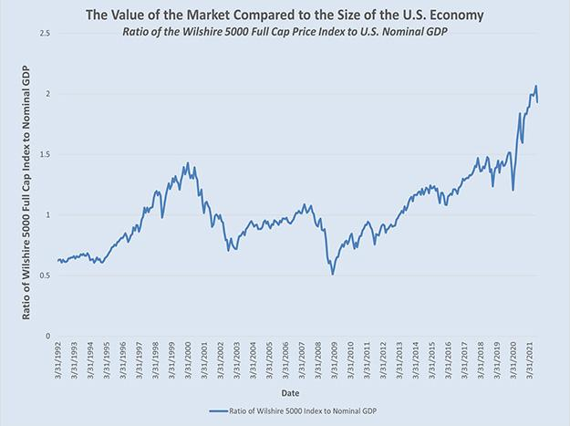

## Table of Contents

## What are stock prices and why do they matter?

Stock prices are the amounts of money people are willing to pay for a small piece of a company, called a share. When you buy a share, you own a tiny part of that company. The price of a share goes up and down based on what people think the company is worth. If more people want to buy the shares than sell them, the price goes up. If more people want to sell than buy, the price goes down.

Stock prices matter because they show how well a company is doing and how people feel about it. If a company's stock price is high, it usually means people think the company is doing well and will make more money in the future. This can make the company's owners and investors happy because their shares are worth more. On the other hand, if the stock price is low, it might mean people are worried about the company's future, which can make owners and investors worried too. Stock prices also affect the whole economy because they can influence how much people spend and invest.

## How are stock prices determined?

Stock prices are determined by what people think a company is worth and how much they are willing to pay for a share of that company. If more people want to buy a company's shares than sell them, the price goes up. This usually happens when people think the company is doing well or will do well in the future. On the other hand, if more people want to sell the shares than buy them, the price goes down. This can happen if people think the company is not doing well or might have problems in the future.

Many things can affect what people think about a company and its stock price. News about the company, like good earnings reports or new products, can make the stock price go up. Bad news, like losing money or problems with the law, can make the stock price go down. The overall economy also plays a role. If the economy is doing well, people might feel more confident and be willing to pay more for stocks. If the economy is doing poorly, people might be more cautious and not want to pay as much. In the end, stock prices are a mix of what people know about a company and how they feel about the future.

## What is the difference between stock price and stock value?

Stock price is the amount of money you have to pay to buy one share of a company. It's what you see on the stock market every day and it changes all the time. The stock price goes up when more people want to buy the shares than sell them, and it goes down when more people want to sell than buy. It's like the price tag on a toy in a store; it tells you how much you need to pay right now.

Stock value, on the other hand, is what people think the company is really worth. It's not just a number you see every day, but a bigger idea about how well the company is doing and how much money it might make in the future. The stock value can be different from the stock price because it's based on things like how much money the company makes, its debts, and what people think about its future. Sometimes the stock price can be higher than the stock value if people are really excited about the company, and sometimes it can be lower if people are worried.

## What are the basic methods used to value a stock?

One common way to value a stock is by looking at its earnings. This is called the Price-to-Earnings (P/E) ratio. It compares the stock's current price to how much money the company makes. If a company's P/E ratio is low, it might mean the stock is a good deal because you're paying less for each dollar of earnings. If the P/E ratio is high, it might mean the stock is expensive, but it could also mean people think the company will grow a lot in the future.

Another way to value a stock is by looking at its book value. This is called the Price-to-Book (P/B) ratio. It compares the stock's price to the value of the company's assets minus its debts. If the P/B ratio is low, it might mean the stock is undervalued because you're paying less for the company's net worth. If the P/B ratio is high, it might mean the stock is overvalued, but it could also mean people think the company's assets are worth more than what's on the books.

A third way to value a stock is by looking at its cash flow. This is called the Price-to-Cash-Flow (P/CF) ratio. It compares the stock's price to how much cash the company brings in. If the P/CF ratio is low, it might mean the stock is a good buy because you're paying less for each dollar of cash flow. If the P/CF ratio is high, it might mean the stock is expensive, but it could also mean people think the company will have strong cash flow in the future.

## How does the stock market influence stock prices?

The stock market is like a big store where people buy and sell pieces of companies called stocks. The price of a stock goes up when more people want to buy it than sell it. This happens because the stock market works on something called supply and demand. If lots of people want to buy a stock, the price goes up because there aren't enough shares to go around. On the other hand, if more people want to sell a stock than buy it, the price goes down because there are too many shares and not enough buyers.

The stock market also influences stock prices through news and events. If good news comes out about a company, like it made a lot of money or invented something new, more people might want to buy its stock, pushing the price up. Bad news, like the company losing money or having problems, can make people want to sell the stock, which can make the price go down. The stock market is always changing because it's affected by what people think and feel about companies and the economy.

## What role do economic indicators play in stock valuation?

Economic indicators are like clues that tell us how the economy is doing. They can affect how people feel about buying and selling stocks. For example, if the unemployment rate goes down, it means more people have jobs and might spend more money. This can make companies do better, which can make their stock prices go up. On the other hand, if inflation goes up a lot, it can make things more expensive and people might spend less. This can hurt companies and make their stock prices go down.

These indicators also help investors guess what might happen in the future. If the Gross Domestic Product (GDP) is growing, it means the whole economy is doing well, and people might think companies will make more money. This can make stock prices go up because people are willing to pay more for them. But if the GDP is shrinking, it can make people worried about the future, and they might not want to pay as much for stocks. So, economic indicators are important because they help people decide if they should buy or sell stocks.

## How can fundamental analysis be used to evaluate stock prices?

Fundamental analysis is a way to figure out if a stock is a good buy by looking at the company's money stuff. You look at things like how much money the company makes, how much it owes, and how it's growing. If a company makes a lot of money and doesn't owe too much, its stock might be worth more. You can use numbers like the Price-to-Earnings (P/E) ratio to see if the stock is a good deal. If the P/E ratio is low, it might mean the stock is cheap compared to how much money the company makes.

You also look at the company's future plans and the overall economy. If the company has good ideas for making more money in the future, its stock might be worth more. And if the economy is doing well, people might be willing to pay more for stocks. By putting all this information together, you can decide if a stock's price is fair or if it's too high or too low. Fundamental analysis helps you see the big picture and make smarter choices about buying or selling stocks.

## What is technical analysis and how does it predict stock price movements?

Technical analysis is a way to guess where a stock's price might go by looking at charts and patterns. It's like trying to find clues in the past prices of a stock to predict what might happen next. People who use technical analysis look at things like the highest and lowest prices of a stock over time, how much the price has moved up or down, and how many shares have been traded. They use this information to spot patterns that might repeat in the future.

By studying these patterns, technical analysts try to predict when a stock's price might go up or down. For example, if a stock's price has been going up and then starts to level off, it might be a sign that the price will soon start to go down. Technical analysts use tools like moving averages, which smooth out price changes over time, and other indicators to help them make these predictions. While technical analysis doesn't always get it right, many people use it to help them decide when to buy or sell stocks.

## How do global events impact stock prices and valuations?

Global events can have a big impact on stock prices and valuations because they can change how people feel about the economy and different companies. For example, if there's a war or a big political change in another country, it can make people worried about the future. When people are worried, they might sell their stocks, which can make the prices go down. On the other hand, good news like a new trade deal or a big discovery can make people feel more confident. When people feel good about the future, they might buy more stocks, which can push the prices up.

These events can also affect specific industries more than others. For instance, if there's a natural disaster like a hurricane, it can hurt companies that depend on tourism or shipping. Their stock prices might go down because people think they won't make as much money. But if a country finds a new source of oil, it can be good news for energy companies, and their stock prices might go up. So, global events can shake up the stock market by changing what people think about the future of different companies and the whole economy.

## What are advanced valuation models and how are they applied?

Advanced valuation models are ways to figure out how much a stock is really worth by using complicated math and numbers. One popular model is called the Discounted Cash Flow (DCF) model. This model tries to guess how much money a company will make in the future and then figures out what that money is worth today. It's like trying to predict how much a tree will grow and then deciding how much to pay for the seed now. Another model is the Dividend Discount Model (DDM), which looks at the money a company pays out to its shareholders and tries to guess how much those payments will be worth in the future.

These models are used by people who want to make smart choices about buying or selling stocks. To use the DCF model, you need to make guesses about things like how fast the company will grow and what interest rates will be. It's not easy because you're trying to predict the future, but it can help you see if a stock is a good deal or not. The DDM is simpler if the company pays dividends, but it still needs you to guess how much those dividends will grow. By using these models, investors can get a better idea of what a stock is really worth and make better decisions.

## How can investors use quantitative and qualitative factors to assess stock value?

Investors can use quantitative factors to assess stock value by looking at numbers and data about a company. This includes things like how much money the company makes, how much it owes, and how fast it's growing. They can use ratios like the Price-to-Earnings (P/E) ratio to see if the stock is a good deal. If the P/E ratio is low, it might mean the stock is cheap compared to how much money the company makes. They can also look at the company's cash flow and assets to get a better idea of its financial health. By putting all these numbers together, investors can figure out if a stock's price is fair or if it's too high or too low.

Qualitative factors are also important for assessing stock value. These are things that you can't measure with numbers, like the company's brand, its leaders, and its plans for the future. For example, if a company has a strong brand that people trust, it might be worth more than a company with a weak brand. The quality of the company's leaders can also make a big difference. If the leaders have a good track record and a clear plan for growing the company, it can make the stock more valuable. By thinking about both the numbers and these harder-to-measure things, investors can get a fuller picture of what a stock is really worth.

## What are the latest trends in stock valuation and price prediction?

The latest trends in stock valuation and price prediction are focusing more on using computers and big data. People are using something called machine learning, which is a type of artificial intelligence, to look at huge amounts of information about companies and the economy. This can help them find patterns that might be hard for a person to see. For example, machine learning can look at news articles, social media posts, and even satellite images to guess how a company might do in the future. This can give investors a better idea of what a stock is really worth and help them make smarter choices about buying or selling.

Another trend is using more real-time data to predict stock prices. Instead of just looking at old numbers, investors are now using information that's coming in right now. This can include things like how many people are visiting a company's website or how much they're talking about it on social media. By looking at this real-time data, investors can get a quicker sense of how people feel about a company and its stock. This can help them react faster to changes in the market and make better predictions about where stock prices might go next.

## What does a closer look at financial analysis reveal?

Financial analysis is fundamental to understanding a stock's value and making informed investment decisions. It provides insights into a company's financial health, operational efficiency, and future growth prospects. By evaluating financial statements and market data, investors can ascertain the intrinsic value of a stock and compare it to its current market price, aiding in investment decision-making.

Fundamental analysis involves a comprehensive evaluation of a company's financial statements, including the balance sheet, income statement, and cash flow statement. The primary aim is to determine the intrinsic value of a stock. Key metrics play an essential role in this assessment. The Price-to-Earnings (P/E) ratio, calculated as the market value per share divided by earnings per share (EPS), helps investors evaluate whether a stock is over or undervalued relative to its earnings. A high P/E ratio may suggest that a stock is overvalued or that investors expect high growth rates in the future.

Dividend yield, another vital metric, measures the return on investment from dividends, expressed as a percentage of the stock price. It is calculated using the formula:

$$
\text{Dividend Yield (\%)} = \left( \frac{\text{Annual Dividends per Share}}{\text{Price per Share}} \right) \times 100
$$

A high dividend yield may indicate a potentially undervalued stock or reflect the company's stability and profitability.

Book value, determined from the balance sheet, represents the net asset value of a company and is calculated by subtracting total liabilities from total assets. The book value per share provides an estimate of the minimum value of an equity share. Comparing book value with market value helps identify whether a stock is priced above its actual worth (overvalued) or below it (undervalued).

Technical analysis complements [fundamental analysis](/wiki/fundamental-analysis) by using historical price data and trading volumes to predict future price movements. It employs chart patterns, indicators, and statistical measures to identify market trends and trading signals. Unlike fundamental analysis, technical analysis is not concerned with evaluating a company's financial health but instead focuses on price movements and market behavior.

Incorporating both fundamental and technical analysis can enhance the evaluation process, offering a more comprehensive perspective on stock valuation. For instance, a stock may be fundamentally strong with solid financials, but technical analysis might identify short-term trading opportunities based on price trends.

By employing these analytical techniques, investors can make more informed decisions, aligning investment strategies with financial goals and risk tolerance. As financial markets grow more complex, mastering these analytical approaches remains crucial for identifying sound investment opportunities.

## References & Further Reading

[1]: Bergstra, J., Bardenet, R., Bengio, Y., & Kégl, B. (2011). ["Algorithms for Hyper-Parameter Optimization."](https://proceedings.neurips.cc/paper/2011/file/86e8f7ab32cfd12577bc2619bc635690-Paper.pdf) Advances in Neural Information Processing Systems 24.

[2]: ["Advances in Financial Machine Learning"](https://www.amazon.com/Advances-Financial-Machine-Learning-Marcos/dp/1119482089) by Marcos Lopez de Prado

[3]: ["Evidence-Based Technical Analysis: Applying the Scientific Method and Statistical Inference to Trading Signals"](https://www.amazon.com/Evidence-Based-Technical-Analysis-Scientific-Statistical/dp/0470008741) by David Aronson

[4]: ["Machine Learning for Algorithmic Trading"](https://github.com/stefan-jansen/machine-learning-for-trading) by Stefan Jansen

[5]: ["Quantitative Trading: How to Build Your Own Algorithmic Trading Business"](https://books.google.com/books/about/Quantitative_Trading.html?id=j70yEAAAQBAJ) by Ernest P. Chan

[6]: Fama, E. F. (1970). ["Efficient Capital Markets: A Review of Theory and Empirical Work."](https://www.jstor.org/stable/2325486) The Journal of Finance, 25(2), 383-417.

[7]: Hull, J. C. (2018). ["Options, Futures, and Other Derivatives"](https://www.semanticscholar.org/paper/Options%2C-Futures%2C-and-Other-Derivatives-Hull/89bdee500c8623864fc9eb7a471546aa713acc44) (10th Edition). Pearson.

[8]: Murphy, J. J. (1999). ["Technical Analysis of the Financial Markets: A Comprehensive Guide to Trading Methods and Applications"](https://archive.org/details/technicalanalysi0000murp) by John J. Murphy

[9]: Pardo, R. (2008). ["The Evaluation and Optimization of Trading Strategies."](https://onlinelibrary.wiley.com/doi/book/10.1002/9781119196969) Wiley Trading.

[10]: Grinold, R. C., & Kahn, R. N. (2000). ["Active Portfolio Management: A Quantitative Approach for Producing Superior Returns and Controlling Risk"](https://www.amazon.com/Active-Portfolio-Management-Quantitative-Controlling/dp/0070248826) by Richard C. Grinold and Ronald N. Kahn