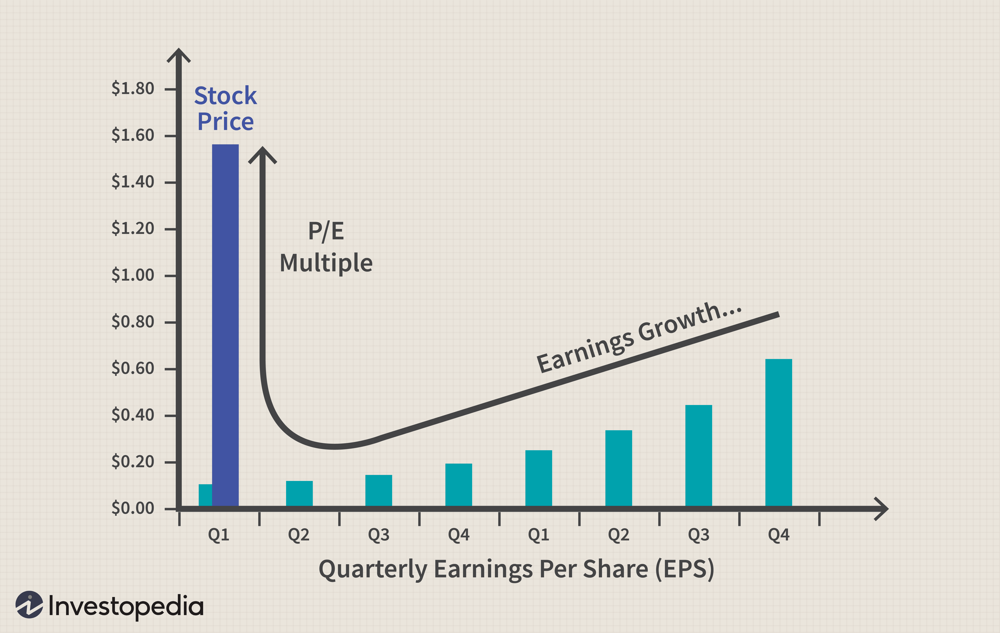

Understanding the complexities of stock valuation, financial analysis, and algorithmic trading is integral to navigating modern financial markets. These areas intersect to provide valuable insights, equipping investors with the tools needed for informed decision-making. Stock valuation entails determining a stock’s intrinsic value, which serves as a benchmark against its market price. This intrinsic value, calculated through various valuation models, helps identify if a stock is underpriced or overpriced, allowing investors to gauge potential investment opportunities more accurately.

Financial analysis acts as the backbone of stock valuation by offering a structured approach to evaluating a company’s financial health. It relies on both fundamental and technical analysis to assess different aspects of a stock. Fundamental analysis focuses on assessing a company’s intrinsic value through metrics such as earnings, revenue, and assets, whereas technical analysis evaluates stocks primarily by studying past market data, price movement, and trading volume.



Algorithmic trading, powered by advancements in technology, represents a revolutionary approach to executing trades based on programmed strategies. It offers efficiency and speed that surpass human capabilities, executing complex trading operations swiftly. By integrating data analysis, artificial intelligence, and machine learning, algorithmic trading optimizes the trading process, reduces transaction costs, and improves liquidity.

As financial markets continue to evolve, staying abreast with emerging technologies and methodologies in these domains is crucial. Both novice and seasoned investors must adapt to the dynamic landscape by incorporating advanced financial analyses and leveraging algorithmic trading capabilities. This article intends to explore the intricate relationships between stock prices, valuation, and financial analysis, emphasizing the transformative role of algorithmic trading in contemporary investment strategies.

## Table of Contents

## Understanding Stock Values and Prices

Stock values, often referred to as intrinsic values, represent the perceived true worth of a stock based on fundamental analysis, detached from its current market price. Stock prices, on the other hand, are the amounts at which stocks trade on stock exchanges, and they fluctuate due to external factors such as market sentiment, economic conditions, and company-specific fundamentals.

Market sentiment plays a crucial role in determining stock prices. Investor perceptions, which can be influenced by news, trends, or economic forecasts, often cause stock prices to deviate from their intrinsic values. For instance, a company's stock may trade at a premium during positive market sentiment, even if its financial indicators suggest a fair value much lower. Conversely, negative sentiment can lead to prices falling below intrinsic values despite strong fundamentals.

Economic conditions are another significant influence. Variables such as interest rates, inflation, and GDP growth can prompt changes in stock prices. For example, higher interest rates could make bonds more appealing than stocks, leading to reduced demand and lower stock prices. Alternatively, robust GDP growth might foster investor optimism, driving stock prices up.

Company fundamentals are critical in assessing intrinsic values. Factors like revenue, profit margins, debt levels, and growth prospects provide a foundation for calculating a stock’s intrinsic worth. A significant distinction between stock prices and values can be observed when a company experiences changes in its fundamentals; these changes might not be immediately reflected in its current stock price.

The concepts of overvaluation and undervaluation stem from the disparity between market prices and intrinsic values. Overvaluation occurs when a stock’s market price exceeds its intrinsic value, suggesting that it might be overpriced. Investors, recognizing this, may choose to sell, anticipating a future price correction. An example metric used to identify overvaluation is the Price-to-Earnings (P/E) ratio, where a high P/E relative to industry peers might hint at an overpriced stock.

Undervaluation is the opposite scenario, where a stock is priced lower than its intrinsic value. This scenario presents potential buying opportunities for investors expecting the market to eventually recognize the stock's true value. Key metrics such as the Price-to-Book (P/B) ratio can aid in identifying undervalued stocks—where a P/B ratio less than one may indicate that a stock is trading below the value of its net assets.

In summary, understanding the differences between stock prices and their intrinsic values is essential for making informed investment decisions. Market sentiment, economic conditions, and company fundamentals collectively influence stock prices, while intrinsic value is rooted in a company's fundamental prospects. A low stock price isn't necessarily a good deal just as a high price doesn't always denote a valuable investment. The ability to discern overvaluation and undervaluation is thus a critical aspect of effective stock valuation.

## Financial Analysis: A Closer Look

Financial analysis is fundamental to understanding a stock's value and making informed investment decisions. It provides insights into a company's financial health, operational efficiency, and future growth prospects. By evaluating financial statements and market data, investors can ascertain the intrinsic value of a stock and compare it to its current market price, aiding in investment decision-making.

Fundamental analysis involves a comprehensive evaluation of a company's financial statements, including the balance sheet, income statement, and cash flow statement. The primary aim is to determine the intrinsic value of a stock. Key metrics play an essential role in this assessment. The Price-to-Earnings (P/E) ratio, calculated as the market value per share divided by earnings per share (EPS), helps investors evaluate whether a stock is over or undervalued relative to its earnings. A high P/E ratio may suggest that a stock is overvalued or that investors expect high growth rates in the future.

Dividend yield, another vital metric, measures the return on investment from dividends, expressed as a percentage of the stock price. It is calculated using the formula:

$$
\text{Dividend Yield (\%)} = \left( \frac{\text{Annual Dividends per Share}}{\text{Price per Share}} \right) \times 100
$$

A high dividend yield may indicate a potentially undervalued stock or reflect the company's stability and profitability.

Book value, determined from the balance sheet, represents the net asset value of a company and is calculated by subtracting total liabilities from total assets. The book value per share provides an estimate of the minimum value of an equity share. Comparing book value with market value helps identify whether a stock is priced above its actual worth (overvalued) or below it (undervalued).

Technical analysis complements [fundamental analysis](/wiki/fundamental-analysis) by using historical price data and trading volumes to predict future price movements. It employs chart patterns, indicators, and statistical measures to identify market trends and trading signals. Unlike fundamental analysis, technical analysis is not concerned with evaluating a company's financial health but instead focuses on price movements and market behavior.

Incorporating both fundamental and technical analysis can enhance the evaluation process, offering a more comprehensive perspective on stock valuation. For instance, a stock may be fundamentally strong with solid financials, but technical analysis might identify short-term trading opportunities based on price trends.

By employing these analytical techniques, investors can make more informed decisions, aligning investment strategies with financial goals and risk tolerance. As financial markets grow more complex, mastering these analytical approaches remains crucial for identifying sound investment opportunities.

## Algorithmic Trading: Revolutionizing Market Practices

Algorithmic trading refers to the use of computer algorithms to automate trading decisions in financial markets. These algorithms are designed to perform tasks such as executing trades, determining the timing of orders, and deciding on purchase or sale quantities. This technique has significantly transformed market practices by enabling faster and more efficient trade executions, minimizing human intervention, and often improving the profitability of trading strategies.

The primary advantage of [algorithmic trading](/wiki/algorithmic-trading) lies in its efficiency and speed. Algorithms can process vast amounts of data in seconds, allowing for rapid decision-making that outpaces human capabilities. By executing trades at high speeds and with precise timing, algorithmic trading minimizes latency, which is the delay between a trade signal and its execution. This capability is particularly crucial in high-frequency trading ([HFT](/wiki/high-frequency-trading-strategies)) environments, where milliseconds can determine profitability.

Algorithmic trading also allows for systematic processes. Traders can implement strategies consistently over time, reducing biases and errors associated with human decisions. This systematic approach is beneficial in managing risk and ensuring that trading strategies are adhered to, thereby maintaining the integrity of the investment process.

Despite its advantages, algorithmic trading presents certain challenges. One significant concern is the market impact. Large orders executed algorithmically can lead to price fluctuations that might affect subsequent trading positions. To mitigate such impacts, strategies like [volume](/wiki/volume-trading-strategy)-weighted average price (VWAP) or time-weighted average price (TWAP) are used. These strategies help distribute the order execution over time to minimize immediate market disruptions.

Technical dependencies also pose challenges in algorithmic trading. The reliance on technology means that traders must continually monitor systems to prevent and address technical failures. Moreover, developing algorithms requires expertise in programming and data analysis, demanding resources and skilled personnel.

In summary, algorithmic trading revolutionizes market practices by offering improvements in speed, efficiency, and systematic strategy execution. While it brings substantial benefits, it also necessitates a keen awareness of its potential impacts on the market and requires robust technological infrastructure and expertise.

## Strategies in Algorithmic Trading

Algorithmic trading strategies are crucial in leveraging computational power to make data-driven trading decisions. Among these, trend-following and [arbitrage](/wiki/arbitrage) strategies stand out due to their historical efficacy and widespread adoption.

Trend-following is a strategy based on the assumption that asset prices tend to move in persistent directions. Traders utilizing trend-following seek to capitalize on market [momentum](/wiki/momentum) by initiating trades in the direction of the established trend. This strategy often involves using technical indicators like moving averages or the Moving Average Convergence Divergence (MACD) to identify trend direction and changes. For instance, a common trend-following approach is the crossover strategy, where a shorter-term moving average crossing above a longer-term moving average signals a purchase, while the opposite indicates a sale.

Arbitrage strategies, on the other hand, exploit price discrepancies between different markets or instruments. The goal is to buy low in one market and sell high in another almost simultaneously, capitalizing on market inefficiencies. Arbitrage can be executed in various forms, including statistical, index, or merger arbitrage. For example, [statistical arbitrage](/wiki/statistical-arbitrage) involves creating a portfolio of paired stocks assumed to have a mean-reverting relationship and executing trades based on statistical indicators such as cointegration tests or z-scores.

An important aspect of algorithmic trading involves the use of volume-weighted average price (VWAP) and time-weighted average price (TWAP). VWAP represents the average price of a security throughout a trading day, based on both volume and price, and is used to assess the quality of trade execution. TWAP, however, averages the price over a specific time period, disregarding volume. These metrics are crucial for minimizing market impact and ensuring better trade execution, especially in large orders. Traders implement VWAP and TWAP strategies through automated algorithms that dissect large orders into smaller, strategically timed trades.

Algorithmic strategies can be customized to optimize trade performance by adjusting parameters and incorporating additional variables. Machine learning techniques are increasingly used to enhance these strategies. Traders can implement a [reinforcement learning](/wiki/reinforcement-learning) model, allowing an algorithm to modify its parameters based on historical performance. Here's a simple example in Python illustrating a trend-following strategy using moving averages with the pandas library:

```python
import pandas as pd

def moving_average_strategy(data, short_window, long_window):
    signals = pd.DataFrame(index=data.index)
    signals['price'] = data['Close']
    signals['short_mavg'] = data['Close'].rolling(window=short_window, min_periods=1, center=False).mean()
    signals['long_mavg'] = data['Close'].rolling(window=long_window, min_periods=1, center=False).mean()

    # Generate signals
    signals['signal'] = 0.0
    signals['signal'][short_window:] = \
    np.where(signals['short_mavg'][short_window:] > signals['long_mavg'][short_window:], 1.0, 0.0)   

    # Generate trading orders
    signals['positions'] = signals['signal'].diff()

    return signals

# Example usage:
# data = pd.read_csv('historical_data.csv')
# strategies = moving_average_strategy(data, short_window=40, long_window=100)
```

In this example, a signal is generated when the short-term moving average crosses the long-term moving average. Such implementations can be optimized by [backtesting](/wiki/backtesting) on historical data and adjusting parameters to improve profitability and reduce risk.

Through the strategic application of algorithms, traders can execute more precise trades, take advantage of micro-second market opportunities, and manage risk more effectively. As technology and data analytics continue to evolve, the customization and optimization of algorithmic trading strategies will become increasingly sophisticated, offering new advantages in trading performance.

## Role of Python in Financial Analysis and Trading

Python has become a dominant programming language in financial analysis and trading, primarily due to its robust ecosystem of libraries and tools tailored for data manipulation, analysis, and trading algorithms. Its versatility and ease of use make it an ideal choice for developing algorithmic trading strategies and conducting comprehensive financial analyses.

### Python's Library Ecosystem

#### Pandas
Pandas is a foundational library for data manipulation and analysis in Python. It provides data structures like DataFrames, which facilitate efficient data handling and preprocessing. In finance, Pandas is used to import, clean, and visualize financial datasets, allowing traders and analysts to identify trends and patterns. For instance, traders can use Pandas to manage time series data, calculate moving averages, and generate custom financial metrics.

```python
import pandas as pd

# Example: Calculating moving averages for a stock's closing prices
data = {'Date': ['2023-01-01', '2023-01-02', '2023-01-03'],
        'Close': [150, 153, 148]}
df = pd.DataFrame(data)
df['Date'] = pd.to_datetime(df['Date'])
df.set_index('Date', inplace=True)

# Calculate 2-day moving average
df['2-day MA'] = df['Close'].rolling(window=2).mean()
```

#### NumPy
NumPy is essential for numerical computations, providing support for large, multi-dimensional arrays and matrices. In financial applications, NumPy facilitates operations on large datasets, enabling calculations such as covariance and correlation matrices, which are critical in risk management and portfolio optimization.

```python
import numpy as np

# Example: Correlation calculation between two assets
prices_1 = np.array([150, 153, 148])
prices_2 = np.array([220, 223, 218])

correlation = np.corrcoef(prices_1, prices_2)[0, 1]
```

#### TA-Lib
TA-Lib, or Technical Analysis Library, is specialized for technical analysis of financial markets. It includes over 150 indicators, like moving averages, RSI, and MACD, allowing traders to implement complex trading strategies. TA-Lib simplifies the process of integrating technical indicators into trading algorithms, enhancing the decision-making process.

```python
import talib

# Example: Calculating RSI for a stock
close_prices = np.array([150, 153, 148, 155, 160, 158])
rsi = talib.RSI(close_prices, timeperiod=14)
```

### Backtrader for Strategy Backtesting

Backtrader is a popular framework for backtesting trading strategies in Python. It provides tools to simulate trading strategies against historical data, offering insights into their performance before live implementation. With Backtrader, users can test various strategies, adjusting parameters and conditions to optimize results. The platform supports technical indicators, order management, and even live trading, making it a comprehensive tool for strategy development.

```python
import backtrader as bt

# Define a basic strategy
class SimpleStrategy(bt.Strategy):
    def __init__(self):
        self.sma = bt.indicators.SimpleMovingAverage(self.data.close, period=15)

    def next(self):
        if self.data.close[0] > self.sma[0]:
            self.buy()
        elif self.data.close[0] < self.sma[0]:
            self.sell()

# Create a cerebro instance and add the strategy
cerebro = bt.Cerebro()
cerebro.addstrategy(SimpleStrategy)

# Load data into cerebro
data = bt.feeds.YahooFinanceData(dataname='AAPL', fromdate=pd.to_datetime('2020-01-01'), todate=pd.to_datetime('2023-01-01'))
cerebro.adddata(data)

# Run the backtest
cerebro.run()
cerebro.plot()
```

Python's integration into financial analysis and trading environments is a testament to its flexibility and power. Its comprehensive library ecosystem provides tools required for developing, testing, and executing trading strategies, enabling traders and analysts to make data-driven decisions efficiently.

## Techniques for Evaluating Stock Opportunities

Evaluating stock opportunities involves a combination of quantitative and qualitative methods tailored to uncover potential investments' latent value. Financial analysis frameworks play a crucial role in identifying lucrative stock opportunities through structured approaches that include exploratory data analysis (EDA), technical analysis, and fundamental analysis.

Exploratory Data Analysis (EDA) is vital in the initial stages. Through EDA, analysts assess various data sets to identify patterns, anomalies, or relationships within stock data that might not be immediately obvious. Python libraries such as Pandas and Matplotlib are widely used for EDA. For instance, the correlation matrix and scatter plots can reveal relationships among variables, such as price movements correlating with trading volume. Here's an example of EDA using Python:

```python
import pandas as pd
import matplotlib.pyplot as plt

# Load data
data = pd.read_csv('stock_data.csv')

# Calculate correlation matrix
correlation_matrix = data.corr()

# Visualize correlations
plt.matshow(correlation_matrix)
plt.show()

# Scatter plot for price vs. volume
plt.scatter(data['Price'], data['Volume'])
plt.xlabel('Price')
plt.ylabel('Volume')
plt.show()
```

Technical analysis focuses on analyzing historical price and volume data to predict future price movements. Key indicators like moving averages, Relative Strength Index (RSI), and Bollinger Bands help investors assess momentum, trends, and [volatility](/wiki/volatility-trading-strategies). For instance, a stock trading above its 50-day moving average might be considered in an upward trend, suggesting a potential buy opportunity.

Fundamental analysis prioritizes understanding a company's intrinsic value by examining financial statements, industry conditions, and governance. Key metrics such as the Price-Earnings (P/E) ratio, Return on Equity (ROE), and dividend yield provide insights into a company’s financial health and operational efficiency. A low P/E ratio compared to industry peers might indicate undervaluation, prompting further investigation into market conditions and company performance.

External factors such as news, economic reports, and corporate actions heavily influence stock prices. Macroeconomic indicators like GDP growth rates, unemployment rates, and interest rates can affect market sentiment, leading to price adjustments. For example, a favorable economic report might boost confidence, elevating stock prices across sectors. News events, such as earnings announcements or management changes, can cause immediate and sometimes significant price swings, necessitating prompt analysis to evaluate future stock performance.

Corporate actions, including stock splits, dividends, and mergers, can affect stock prices and investor perception. For instance, a stock split might make shares more affordable, increasing marketability, while dividend declarations may attract income-focused investors. Evaluating these corporate actions involves assessing their strategic intent and potential impacts on future cash flows and stockholder value.

Overall, assessing stock opportunities incorporates a multifaceted approach that blends technical skills with an understanding of market dynamics. Analysts must remain agile, utilizing diverse methods and tools to navigate the intricate landscape of financial markets effectively.

## The Future of Stock Valuations and Trading

The future of stock valuations and trading is poised for transformative changes, driven by advancements in technology and evolving regulatory landscapes. With [artificial intelligence](/wiki/ai-artificial-intelligence) (AI) and [machine learning](/wiki/machine-learning) (ML) playing increasingly vital roles, the methods used to evaluate stocks and conduct trades are becoming more sophisticated and efficient.

AI and machine learning offer innovative ways to model and predict stock behavior. They enable the processing of vast amounts of data far beyond human capability, capturing patterns and trends that may not be immediately visible. These technologies enhance trading models by optimizing decision-making processes. Machine learning algorithms can assist in identifying patterns based on historical trading data and economic indicators, subsequently applying these patterns to predict future price movements. This predictive capability can significantly improve the accuracy of stock valuations and trading strategies.

A typical approach to incorporate machine learning in trading involves supervised learning, where models are trained on historical data to predict future trends. For example, predictive modeling might involve algorithms such as Random Forests, Support Vector Machines, or [deep learning](/wiki/deep-learning) networks like Long Short-Term Memory (LSTM) for time-series forecasting. Python libraries such as Scikit-learn, Keras, and TensorFlow facilitate these applications, providing robust tools to build and test predictive models. These models inherently improve with more data, continuously optimizing trading efficiency and valuation precision.

```python
from sklearn.model_selection import train_test_split
from sklearn.ensemble import RandomForestRegressor
import pandas as pd

# Sample code for model training
data = pd.read_csv('historical_stock_prices.csv')
X = data.drop('price', axis=1)
y = data['price']

X_train, X_test, y_train, y_test = train_test_split(X, y, test_size=0.2, random_state=42)

model = RandomForestRegressor(n_estimators=100, random_state=42)
model.fit(X_train, y_train)

predictions = model.predict(X_test)
```

Regulatory considerations are equally crucial as these technological advancements unfold. Regulations are evolving to ensure market stability and protect investors from potential AI-induced volatility. There is growing emphasis on algorithmic transparency and accountability, with discussions around implementing strict oversight on AI-driven trading strategies to prevent manipulative or unethical practices. As algorithmic trading becomes more prevalent, regulators may introduce new frameworks to monitor and manage the substantial market influence these technologies exert. These frameworks could require firms to disclose algorithmic strategies and maintain audit trails to ensure fair trading practices and market integrity.

Moreover, there is potential for regulatory bodies to demand greater clarity on the decision-making processes of AI and ML models, potentially creating a need for explainable AI (XAI) frameworks. The balance between fostering innovation and ensuring robust market controls will be pivotal in shaping the future landscape of stock valuations and trading techniques.

In conclusion, the integration of AI and machine learning will undoubtedly redefine the efficiency and accuracy of stock market operations, paving the way for a more data-driven investment environment. Concurrently, regulatory frameworks will play a prominent role in ensuring these technologies are harnessed responsibly, safeguarding market integrity and ensuring equitable trading practices.

## Conclusion

The integration of stock valuation, financial analysis, and algorithmic trading represents a comprehensive approach that is reshaping modern investment strategies. Stock valuation provides the framework to determine the intrinsic worth of a stock, guiding investors away from merely speculative decisions. Financial analysis, encompassing both fundamental and technical perspectives, further enriches this understanding, enabling a detailed examination of the financial health and market behavior of a company. Algorithmic trading, on the other hand, introduces precision and efficiency, offering tools that process vast amounts of data in real-time, minimizing human error and emotional biases.

Staying informed about technological advancements in finance is crucial in this rapidly evolving landscape. The proliferation of data, the sophistication of algorithms, and advancements in machine learning and artificial intelligence are continuously transforming how financial markets operate. For instance, machine learning techniques can uncover patterns not immediately apparent through traditional methods, while high-frequency trading systems leverage minute market fluctuations with remarkable speed and accuracy.

Developing proficiency in tools such as Python, with its extensive libraries like Pandas and NumPy, also holds significant importance. Investors and traders who adapt to such technologies maintain a competitive edge. The constant evolution in software, algorithms, and computing power ensures that market dynamics are perpetually changing, underscoring the necessity for ongoing education and adaptation.

To successfully navigate future market changes, individuals and institutional investors alike must commit to lifelong learning. This includes keeping abreast of regulatory developments that could impact trading activities, as well as understanding emerging trends that may redefine trading paradigms. By integrating knowledge across valuation methodologies, financial analysis, and algorithmic processes, and by remaining adaptable to change, investors can better position themselves within the financial ecosystem, ultimately crafting strategies that are both resilient and innovative.

## References & Further Reading

[1]: Bergstra, J., Bardenet, R., Bengio, Y., & Kégl, B. (2011). ["Algorithms for Hyper-Parameter Optimization."](https://proceedings.neurips.cc/paper/2011/file/86e8f7ab32cfd12577bc2619bc635690-Paper.pdf) Advances in Neural Information Processing Systems 24.

[2]: ["Advances in Financial Machine Learning"](https://www.amazon.com/Advances-Financial-Machine-Learning-Marcos/dp/1119482089) by Marcos Lopez de Prado

[3]: ["Evidence-Based Technical Analysis: Applying the Scientific Method and Statistical Inference to Trading Signals"](https://www.amazon.com/Evidence-Based-Technical-Analysis-Scientific-Statistical/dp/0470008741) by David Aronson

[4]: ["Machine Learning for Algorithmic Trading"](https://github.com/stefan-jansen/machine-learning-for-trading) by Stefan Jansen

[5]: ["Quantitative Trading: How to Build Your Own Algorithmic Trading Business"](https://books.google.com/books/about/Quantitative_Trading.html?id=j70yEAAAQBAJ) by Ernest P. Chan

[6]: Fama, E. F. (1970). ["Efficient Capital Markets: A Review of Theory and Empirical Work."](https://www.jstor.org/stable/2325486) The Journal of Finance, 25(2), 383-417.

[7]: Hull, J. C. (2018). ["Options, Futures, and Other Derivatives"](https://www.semanticscholar.org/paper/Options%2C-Futures%2C-and-Other-Derivatives-Hull/89bdee500c8623864fc9eb7a471546aa713acc44) (10th Edition). Pearson.

[8]: Murphy, J. J. (1999). ["Technical Analysis of the Financial Markets: A Comprehensive Guide to Trading Methods and Applications"](https://archive.org/details/technicalanalysi0000murp) by John J. Murphy

[9]: Pardo, R. (2008). ["The Evaluation and Optimization of Trading Strategies."](https://onlinelibrary.wiley.com/doi/book/10.1002/9781119196969) Wiley Trading.

[10]: Grinold, R. C., & Kahn, R. N. (2000). ["Active Portfolio Management: A Quantitative Approach for Producing Superior Returns and Controlling Risk"](https://www.amazon.com/Active-Portfolio-Management-Quantitative-Controlling/dp/0070248826) by Richard C. Grinold and Ronald N. Kahn