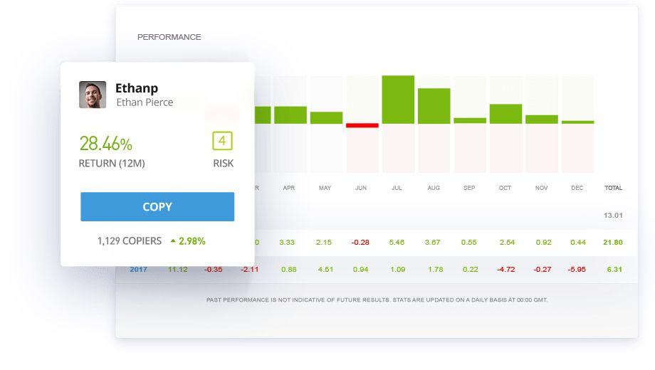

## Table of Contents

## What is eToro and how does it work?

eToro is an online platform where people can buy and sell things like stocks, cryptocurrencies, and other financial products. It's designed to be easy to use, so even if you're new to investing, you can start trading. One special feature of eToro is called "social trading." This means you can see what other people are doing on the platform and even copy their trades if you want to.

When you join eToro, you create an account and add money to it. Then, you can choose what you want to invest in. If you're not sure what to do, you can look at what other successful traders are doing and follow them. This way, their trades are automatically copied into your account. eToro also has tools and charts to help you make decisions about what to buy and sell. It's like a community where people help each other make money.

## How can I sign up for an eToro account?

To sign up for an eToro account, first go to their website or download their app. On the main page, you'll see a button that says "Join Now" or something similar. Click on it, and you'll be asked to enter your email address, choose a username, and create a password. Make sure to use a strong password to keep your account safe. After filling in your details, you'll need to agree to eToro's terms and conditions. Once you've done that, click on the "Create Account" button.

Next, you'll need to verify your identity. eToro asks for this to make sure everything is safe and follows the rules. You'll need to provide some personal information like your full name, date of birth, and address. Sometimes, you might need to upload a copy of your ID, like a passport or driver's license. After your identity is verified, you can add money to your account. You can do this with a bank transfer, credit card, or other payment methods eToro accepts. Once your money is in, you're ready to start trading!

## What are the basic steps to buy stocks on eToro?

To buy stocks on eToro, first log into your account. Once you're in, go to the search bar at the top of the page and type in the name of the stock you want to buy. You can also look at different categories or use the "Discover" section to find stocks that interest you. When you find the stock you want, click on it to see more details like its current price and how it's been doing lately.

After you've chosen a stock, decide how much money you want to spend on it. On the stock's page, there will be a button that says "Buy" or "Trade." Click on it, and you'll see a window where you can enter the amount of money you want to invest. You can also choose if you want to use leverage, but if you're new to this, it's usually best to start without it. Once you've entered the amount, double-check everything, and then click "Open Trade" to complete your purchase. Your stocks will now show up in your portfolio, and you can keep an eye on them to see how they're doing.

## What fees should I be aware of when purchasing stocks on eToro?

When you buy stocks on eToro, you should know about a few fees. The main one is the spread, which is the difference between the buy and sell price of a stock. This is how eToro makes money when you trade. There's no commission fee for buying or selling stocks, but the spread can add up, especially if you trade a lot. Also, if you keep your stocks overnight, you might have to pay a small fee called an overnight fee. This fee depends on the stock and how much you're holding.

Another fee to be aware of is the withdrawal fee. If you want to take money out of your eToro account, they charge a fee for each withdrawal. This fee can change, so it's good to check what it is before you take money out. Remember, these fees can affect how much money you make or lose when trading, so it's important to think about them when you're planning your investments.

## How does eToro's social trading feature work and how can it benefit stock purchasing?

eToro's social trading feature lets you see what other traders are doing and even copy their trades. When you log into eToro, you can look at the profiles of other users and see what stocks they're buying and selling. If you find someone who is doing well, you can choose to follow them. This means that whenever they make a trade, the same trade will happen in your account automatically. This can be really helpful if you're new to trading and want to learn from others who know more.

Using social trading can make buying stocks easier and potentially more profitable. By copying successful traders, you can benefit from their knowledge and experience without having to do all the research yourself. It's like having a personal guide to help you make smart choices. Plus, you can see how different traders perform over time, so you can adjust who you follow based on who's doing the best. This way, you can learn as you go and hopefully make money while doing it.

## What types of stocks can I buy on eToro?

On eToro, you can buy many different kinds of stocks. They have stocks from big companies like Apple, Amazon, and Tesla, as well as smaller companies from all around the world. This means you can invest in businesses from the United States, Europe, Asia, and other places. eToro also lets you buy stocks from different industries, like technology, health care, and energy. So, no matter what kind of company you're interested in, you can probably find its stock on eToro.

Another thing you can do on eToro is buy stocks that pay dividends. These are payments that companies give to their shareholders, usually a few times a year. If you like the idea of getting regular payments from your investments, you can look for these kinds of stocks on eToro. Also, eToro offers fractional shares, which means you can buy a small part of a stock instead of a whole one. This is great if you want to invest in expensive stocks but don't have enough money to buy a full share.

## How do I research and analyze stocks before buying on eToro?

To research and analyze stocks on eToro, start by using the search tool to find the stock you're interested in. Once you've found it, look at the stock's page. Here, you'll see a chart that shows how the stock's price has changed over time. You can change the time frame to see short-term or long-term trends. Below the chart, there's information about the company, like what they do and how they're doing financially. You can also see what other eToro users think about the stock by looking at their comments and ratings.

Next, use eToro's tools to dig deeper. The platform has features like technical analysis indicators, which are lines and patterns on the chart that can help you predict where the stock's price might go next. You can also check out the news section to see if there are any recent events or announcements that could affect the stock. Another helpful thing to do is look at the "People" tab to see who's trading this stock and how well they're doing. By following successful traders and seeing what stocks they're buying, you can get more ideas and insights. Remember, the more you research, the better decisions you can make about which stocks to buy.

## What are the risks associated with buying stocks on eToro?

When you buy stocks on eToro, there are some risks you should know about. One big risk is that the value of stocks can go up and down a lot. This means you could lose money if the stock price goes down after you buy it. Another risk is that you might not know enough about the companies you're investing in. If you don't do your research, you might pick stocks that don't do well. Also, eToro's social trading feature can be risky. If you copy someone who makes bad trades, you could lose money too.

Another thing to think about is the fees you have to pay. Even though eToro doesn't charge a commission for buying and selling stocks, there are other fees like the spread and overnight fees. These can add up and affect how much money you make or lose. Lastly, there's the risk of using leverage. Leverage lets you borrow money to buy more stocks, but it can also make your losses bigger if the stock price goes down. So, it's important to understand all these risks before you start buying stocks on eToro.

## How can I use eToro's tools to manage and diversify my stock portfolio?

To manage and diversify your stock portfolio on eToro, you can use their portfolio tool to keep track of all your stocks in one place. This tool shows you how each stock is doing and how much money you have invested in each one. You can also use the "Discover" section to find new stocks from different industries and countries. By adding stocks from different places and types of businesses, you spread out your risk. If one stock goes down, the others might go up, which can help protect your money.

Another helpful tool on eToro is the "CopyPortfolio" feature. This lets you invest in a group of stocks that are picked by experts or based on a certain theme, like technology or green energy. By using CopyPortfolios, you can easily add a mix of stocks to your portfolio without having to pick each one yourself. This can help you diversify your investments and learn from what other successful traders are doing. Remember, the more you spread out your investments, the less risk you take on, and eToro's tools make it easy to do this.

## What advanced trading features does eToro offer for experienced investors?

eToro offers several advanced trading features that can help experienced investors make more informed decisions and manage their investments better. One key feature is the ability to use leverage, which lets you borrow money to buy more stocks than you could with just your own money. This can increase your potential profits, but it also makes your losses bigger if the stock price goes down. Another useful tool is the advanced charting feature, which lets you look at detailed charts and use technical analysis indicators to predict where stock prices might go next. This can help you spot trends and make smarter trading choices.

eToro also has a feature called "Stop Loss" and "Take Profit" orders, which are important for managing risk. A Stop Loss order automatically sells your stock if its price drops to a certain level, helping you limit your losses. A Take Profit order does the opposite—it sells your stock when it reaches a price you're happy with, locking in your profits. These tools can help you control your trades even when you're not actively watching the market. Plus, eToro's social trading feature lets experienced investors share their strategies and see what other top traders are doing, which can be a great way to learn and improve your own trading skills.

## How does eToro's CopyTrader system work and how can it be used effectively for stock purchasing?

eToro's CopyTrader system lets you copy the trades of other successful traders on the platform. When you find a trader you like, you can choose to follow them. This means that whenever they buy or sell a stock, the same trade will happen in your account automatically. You can decide how much money you want to copy their trades with, and you can stop copying them at any time if you want. It's like having a personal guide to help you make smart choices about which stocks to buy and sell.

To use CopyTrader effectively for stock purchasing, start by looking at the profiles of different traders on eToro. Check their performance history, how much risk they take, and what kinds of stocks they trade. Once you find someone who seems to be doing well and matches your investment goals, you can start copying their trades. Remember, it's a good idea to spread your money across a few different traders to reduce your risk. Also, keep an eye on how the traders you're copying are doing and be ready to change who you're following if their performance changes. This way, you can learn from others and hopefully make money while doing it.

## What are some expert strategies for maximizing returns on stock investments through eToro?

One expert strategy for maximizing returns on stock investments through eToro is to use the CopyTrader system wisely. Instead of copying just one trader, spread your money across a few successful traders with different trading styles and risk levels. This way, you can learn from different approaches and reduce your risk. Also, keep an eye on how these traders are doing and be ready to stop copying them if their performance goes down. Another good idea is to use eToro's advanced charting tools to spot trends and use technical analysis indicators to make smarter trading choices. This can help you buy stocks at the right time and sell them when they reach your target price.

Another strategy is to use eToro's Stop Loss and Take Profit orders to manage your trades better. Set a Stop Loss order to automatically sell your stock if its price drops too much, which helps limit your losses. Set a Take Profit order to sell your stock when it reaches a price you're happy with, locking in your profits. This way, you can control your trades even when you're not watching the market. Lastly, consider using eToro's CopyPortfolios to diversify your investments. These are groups of stocks picked by experts or based on certain themes, like technology or green energy. By investing in a CopyPortfolio, you can easily add a mix of stocks to your portfolio and spread out your risk, which can help you maximize your returns.

## References & Further Reading

[1]: Bergstra, J., Bardenet, R., Bengio, Y., & Kégl, B. (2011). ["Algorithms for Hyper-Parameter Optimization."](https://proceedings.neurips.cc/paper/2011/file/86e8f7ab32cfd12577bc2619bc635690-Paper.pdf) Advances in Neural Information Processing Systems 24.

[2]: ["Advances in Financial Machine Learning"](https://www.amazon.com/Advances-Financial-Machine-Learning-Marcos/dp/1119482089) by Marcos Lopez de Prado

[3]: ["Evidence-Based Technical Analysis: Applying the Scientific Method and Statistical Inference to Trading Signals"](https://www.amazon.com/Evidence-Based-Technical-Analysis-Scientific-Statistical/dp/0470008741) by David Aronson

[4]: ["Machine Learning for Algorithmic Trading"](https://github.com/PacktPublishing/Machine-Learning-for-Algorithmic-Trading-Second-Edition) by Stefan Jansen

[5]: ["Quantitative Trading: How to Build Your Own Algorithmic Trading Business"](https://books.google.com/books/about/Quantitative_Trading.html?id=j70yEAAAQBAJ) by Ernest P. Chan