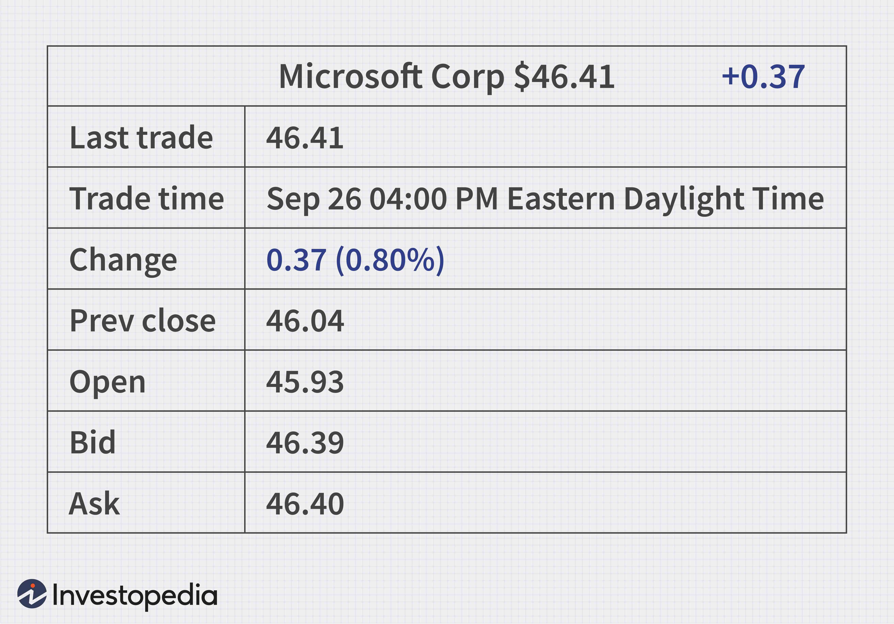

In an increasingly complex financial landscape, understanding financial literacy, investments, and the dynamics of the stock market are crucial skills. Financial literacy encompasses the knowledge needed to effectively manage one’s financial resources, which is essential for making informed decisions in an ever-evolving market environment. By mastering financial concepts, such as budgeting, saving, and investing, individuals can enhance their ability to manage and grow their wealth over time.

Investing in the stock market offers a platform for acquiring partial ownership in companies through stocks or shares, thereby presenting opportunities for capital growth and generating income. The stock market is dynamic and can be influenced by a myriad of economic factors, making it vital for investors to understand the fundamentals of market analysis, including both fundamental and technical approaches, to make strategic investment choices. This knowledge is instrumental in assessing potential investments and managing associated risks effectively.



Algorithmic trading, also known as algo trading, has revolutionized how investors engage with the stock market. Leveraging advanced technology, algorithmic trading uses computer programs to automate and execute trades at speeds and frequencies that are impossible for human traders. These algorithms rely on predetermined criteria such as timing, price, and trading volume to capitalize on even small market inefficiencies. By removing emotional biases, algorithmic trading can enhance trade precision, improve market liquidity, and reduce transaction costs.

This article explores the intersection of financial literacy, stock market investments, and algorithmic trading to equip you with knowledge for better financial decisions. By developing a basic understanding of these elements, individuals can effectively manage their investments, reach their financial goals, and navigate the complexities of the modern financial landscape with confidence. As the financial industry continues to evolve, staying informed about the latest trends and technologies becomes integral to maintaining and enhancing investment strategies.

## Table of Contents

## Understanding Financial Literacy

Financial literacy is a crucial competence that empowers individuals to make informed and effective decisions regarding the management of their financial resources. This entails not just basic arithmetic skills but also the ability to understand, interpret, and utilize various financial products and instruments.

At its core, financial literacy encompasses understanding key financial products such as savings accounts, credit cards, loans, mortgages, and insurance policies. More than product familiarity, it involves the skills needed to budget effectively. Budgeting is the process of creating a plan to spend your money, ensuring you have enough to cover essential expenses and future financial goals. It often involves assessing income, tracking expenditures, and adjusting spending habits to avoid debt and increase savings.

Saving and investing are also integral components of financial literacy. While saving involves setting aside money for future needs or emergencies, investing puts that money into financial markets or ventures with the potential for appreciation. Common investment vehicles include stocks, bonds, mutual funds, and real estate. Being financially literate means understanding these options, assessing their risks and benefits, and determining how they align with personal financial goals.

Moreover, financial literacy plays a vital role in making informed decisions within the stock market, where evaluating risks and potential returns is essential. It involves understanding fundamental concepts such as risk tolerance, diversification, and asset allocation. Managing investment risks often requires a fundamental understanding of two main types of analyses: [fundamental analysis](/wiki/fundamental-analysis), which assesses a security's intrinsic value through financial statements and economic indicators, and technical analysis, which evaluates securities through [statistics](/wiki/bayesian-statistics) generated by market activity, such as past prices and [volume](/wiki/volume-trading-strategy).

In conclusion, financial literacy is vital for maintaining financial well-being throughout one's life. It not only aids in making prudent financial decisions but also shields individuals from the risks associated with financial illiteracy, such as debt accumulation or poor investment outcomes. Building a solid foundation in financial literacy provides a strategic advantage in navigating complex financial landscapes and achieving long-term financial stability.

## The Basics of Stock Market Investments

Investments in the stock market offer a variety of avenues for both individual and institutional investors, primarily through individual stocks, exchange-traded funds (ETFs), and mutual funds. Each of these investment vehicles provides unique benefits and risks, shaping how investors allocate their capital to achieve growth and income.

Individual stocks represent ownership in a specific company. When investors purchase a stock, they effectively buy a small part of that company, entitling them to a proportional share of its profits as dividends and capital appreciation. The potential for substantial returns exists as companies expand and increase value over time. However, investing in individual stocks carries the risk of significant fluctuations, as a company's performance is influenced by various industry-specific and broader economic factors.

Exchange-traded funds (ETFs) are investment funds traded on stock exchanges, similar to stocks. They typically hold a diversified portfolio of assets, including stocks, bonds, or commodities, and are designed to track an index like the S&P 500. ETFs offer the advantage of diversification, reducing the risk associated with investing in individual stocks. They also provide [liquidity](/wiki/liquidity-risk-premium) due to their tradable nature, with prices fluctuating throughout the trading day. 

Mutual funds are another form of pooled investment vehicle, managed by professional portfolio managers. These funds gather capital from multiple investors to invest in a diversified portfolio of assets, usually with a specific investment objective like growth, value, or income. Unlike ETFs, mutual funds are bought and sold at their net asset value (NAV) at the end of the trading day, limiting their liquidity compared to ETFs. Despite this, they offer investors the benefit of professional management and diversification.

A comprehensive understanding of fundamental and technical analysis is essential for making informed investment choices in the stock market. Fundamental analysis involves evaluating a company's financial statements, industry position, and economic conditions to assess its intrinsic value. Key metrics include price-to-earnings ratio (P/E), earnings per share (EPS), and return on equity (ROE).

Technical analysis, on the other hand, focuses on historical price and volume data to predict future price movements. Traders often use chart patterns, moving averages, and indicators like the Relative Strength Index (RSI) to identify entry and [exit](/wiki/exit-strategy) points for trades. Both fundamental and technical analyses play crucial roles in formulating investment strategies, aiding investors in addressing various market conditions. 

By harnessing these analytical approaches, investors can better navigate the complexities of the stock market, maximizing potential returns while mitigating risks.

## An Introduction to Algorithmic Trading

Algorithmic trading refers to the use of computer programs that automatically execute trades based on a set of predefined criteria. These criteria can include factors such as timing, price, and volume, with the objective of executing trades more efficiently than would be possible manually. Algorithmic trading seeks to capitalize on profitable opportunities that can arise in the financial markets due to inefficiencies or short-lived trends that human traders might overlook.

One of the primary advantages of [algorithmic trading](/wiki/algorithmic-trading) is its ability to process large amounts of market data swiftly, identifying trading opportunities and executing trades at a speed that surpasses human capabilities. The precision and speed inherent in algorithmic trading systems help in exploiting market conditions that manual trading approaches might not fully leverage. This efficiency is primarily due to the reduction of human emotional biases, which can lead to irrational decision-making.

Algorithmic trading also plays a significant role in enhancing market liquidity. By automating the buying and selling processes, algorithmic trading contributes to smoother market operations and tighter bid-ask spreads. This influx of liquidity can lower transaction costs for all market participants, creating a more cost-effective environment for trading securities.

Overall, algorithmic trading represents a crucial evolution in financial markets, enabling traders to achieve higher efficiency and execute complex strategies with enhanced precision. As technology and data analytics continue to advance, the potential for algorithmic trading to optimize market participation and transaction dynamics will likely grow further.

## Benefits and Risks of Algorithmic Trading

Algorithmic trading is primarily defined by its precision, speed, and efficiency in executing trades. These benefits significantly enhance trading capabilities, allowing traders to capitalize on opportunities more effectively than traditional methods. One of the most significant advantages is the facilitation of high-frequency trading ([HFT](/wiki/high-frequency-trading-strategies)), where transactions are completed at incredibly high speeds, often within milliseconds. By utilizing algorithms, traders can detect and exploit market inefficiencies faster than any human could.

Arbitrage, another significant benefit, involves leveraging price differences of the same asset across different markets. Algorithmic trading identifies these disparities instantly, executing trades to profit from these short-lived price variations. This systematic approach to trading allows for the development of complex strategies that can operate continuously, capturing opportunities that manual trading might miss.

Despite these advantages, algorithmic trading is not without risks. Market [volatility](/wiki/volatility-trading-strategies) poses a substantial challenge. Algorithms can amplify volatility, particularly during periods of market stress, leading to exaggerated price movements which can affect all market participants. Technical failures present another risk. Faulty algorithms, connectivity issues, or software glitches can adversely impact trading operations, potentially leading to significant financial losses. 

Furthermore, regulatory challenges persist. The landscape for algorithmic trading is continuously evolving, and traders must ensure compliance with regulations that may vary across different jurisdictions. Adhering to these rules is crucial to avoid legal repercussions and maintain market integrity.

While algorithmic trading offers numerous benefits through its precision and speed, the associated risks necessitate thorough understanding and careful management to safeguard investments.

## Developing a Strategy for Algorithmic Trading

Successful algorithmic trading is contingent upon a meticulously crafted strategy that integrates comprehensive market analysis and robust risk management. At its core, algorithmic trading relies on systematic approaches to identify and exploit patterns or inefficiencies in the market.

One prevalent strategy is trend-following. This approach capitalizes on market movements, with the assumption that current trends are likely to persist. Traders employ algorithms to detect these trends and execute trades accordingly. For instance, a trend-following strategy may involve moving averages. An algorithm could be programmed to buy when a shorter-term moving average crosses above a longer-term moving average (a golden cross) and sell under the opposite conditions (a death cross).

Another widely utilized strategy is [arbitrage](/wiki/arbitrage). Arbitrage opportunities arise when a security is priced differently in separate markets or forms. Algorithms swiftly identify and exploit these price discrepancies by simultaneously buying and selling across different platforms, pocketing the differential. Speed is essential here, as these opportunities can vanish almost instantaneously.

Market-making algorithms are designed to provide liquidity by placing simultaneous buy and sell orders on a financial instrument. By capturing the spread between bid and ask prices, market makers can generate profit. The algorithms continuously update these orders in response to market movements, ensuring the trader remains competitive.

Validating and refining these strategies is crucial, necessitating a robust [backtesting](/wiki/backtesting) process. Backtesting involves simulating the trading strategy on historical market data to evaluate its performance. It involves assessing metrics like profitability, risk-adjusted returns, and drawdowns. Implementing backtesting can be efficiently performed using Python, leveraging libraries such as `pandas` for data manipulation and `QuantConnect` for algorithm development. Here's a simple Python example illustrating the concept:

```python
import pandas as pd
import numpy as np

# Generate random price data
np.random.seed(0)
price_data = pd.Series(np.random.normal(0, 1, 100).cumsum() + 100)

# Calculate moving averages
short_mavg = price_data.rolling(window=5).mean()
long_mavg = price_data.rolling(window=20).mean()

# Define signals
signals = pd.DataFrame(index=price_data.index)
signals['signal'] = 0
signals['signal'][5:] = np.where(short_mavg[5:] > long_mavg[5:], 1, 0)
signals['positions'] = signals['signal'].diff()

# Backtest strategy
returns = price_data.pct_change()
strategy_returns = signals['positions'].shift(1) * returns
cumulative_returns = (1 + strategy_returns).cumprod()

print("Cumulative Returns:", cumulative_returns[-1])
```

This example demonstrates the backtesting of a simple moving average crossover strategy. Such iterative refinement processes ensure algorithms remain robust under different market conditions and can adapt to varying market environments.

## The Role of Technology in Algo Trading

Advanced technology and software platforms are fundamental for executing algorithmic trading strategies. These technologies enable traders and developers to efficiently analyze data, execute trades, and optimize their strategies. 

A critical component of algorithmic trading is access to real-time data. Traders rely on high-speed internet connections and sophisticated data feeds to receive the latest market information, enabling rapid decision-making. These data streams provide live updates on stock prices, market trends, and other relevant metrics, forming the basis for algorithms that execute trades automatically when certain conditions are met.

Analytics tools are equally important. These platforms process and analyze vast amounts of data to identify patterns and trends that can inform trading decisions. For example, they may use historical price data to predict future movements based on statistical models or [machine learning](/wiki/machine-learning) algorithms. Software like MATLAB, R, and Python, with libraries such as NumPy, pandas, and scikit-learn, are commonly used in the analysis and development of trading algorithms.

Efficient execution platforms are essential for placing trades at optimal times and prices. These platforms, often provided by brokerage firms, offer low-latency connections to financial markets, ensuring that orders are executed promptly. The speed and accuracy of trade execution can significantly impact the profitability of algorithmic trading strategies, especially in high-frequency trading where transactions occur in fractions of a second.

Developers use programming languages such as Python, Java, and C++ to create and manage trading algorithms. Python is particularly popular due to its simplicity and the extensive range of libraries available for data analysis and machine learning. A basic Python script for a simple moving average crossover strategy might look like this:

```python
import pandas as pd

# Load market data
data = pd.read_csv('market_data.csv')

# Calculate moving averages
data['SMA50'] = data['Close'].rolling(window=50).mean()
data['SMA200'] = data['Close'].rolling(window=200).mean()

# Generate buy/sell signals
data['Signal'] = 0
data.loc[data['SMA50'] > data['SMA200'], 'Signal'] = 1
data.loc[data['SMA50'] < data['SMA200'], 'Signal'] = -1

# Execute trades based on signals
for index, row in data.iterrows():
    if row['Signal'] == 1:
        print(f"Buy signal on {row['Date']}")
    elif row['Signal'] == -1:
        print(f"Sell signal on {row['Date']}")
```

In addition to designing trading strategies, developers must implement robust risk management systems to protect against potential losses. This includes setting stop-loss orders, diversifying investments, and continuously monitoring system performance to mitigate risks associated with technology failures or unexpected market events.

As technology continues to evolve, advancements in machine learning, [artificial intelligence](/wiki/ai-artificial-intelligence), and quantum computing are expected to further transform the landscape of algorithmic trading, providing new tools and methodologies for improving trading outcomes. Staying informed about these developments is crucial for those involved in algorithmic trading.

## Conclusion

Financial literacy, stock market investments, and algorithmic trading form the backbone of contemporary financial management. These areas are not isolated; rather, they interact and complement each other, providing a more integrated approach to financial decision-making. Understanding financial literacy equips individuals with the ability to manage resources, make informed choices, and evaluate financial information critically. This foundation is essential for engaging with stock market investments where risk management and strategic planning are pivotal.

Stock market investments offer opportunities for growth and income generation through various instruments like stocks, exchange-traded funds (ETFs), and mutual funds. The ability to analyze financial markets and apply rigorous methods like fundamental and technical analysis is vital for effective investing. Algorithmic trading enhances this process by harnessing technology to execute trades with precision and speed, reducing the likelihood of human error and emotional biases.

As technology continues to advance, it reshapes how financial markets operate. Algorithmic trading strategies have evolved from simple rule-based systems to complex algorithms driven by artificial intelligence and machine learning. This evolution demands continuous learning and adaptation to new tools and technologies, reinforcing the importance of staying informed.

The synergy between financial literacy, stock market knowledge, and algorithmic trading enhances investor prowess, enabling them to capitalize on market opportunities more effectively. In a world where financial markets are dynamic and continuously changing, remaining updated with the latest trends, tools, and strategies is not just advantageous but essential for achieving sustained financial success.

## References & Further Reading

[1]: Bergstra, J., Bardenet, R., Bengio, Y., & Kégl, B. (2011). ["Algorithms for Hyper-Parameter Optimization."](https://dl.acm.org/doi/10.5555/2986459.2986743) Advances in Neural Information Processing Systems 24.

[2]: ["Advances in Financial Machine Learning"](https://www.amazon.com/Advances-Financial-Machine-Learning-Marcos/dp/1119482089) by Marcos Lopez de Prado

[3]: ["Evidence-Based Technical Analysis: Applying the Scientific Method and Statistical Inference to Trading Signals"](https://www.amazon.com/Evidence-Based-Technical-Analysis-Scientific-Statistical/dp/0470008741) by David Aronson

[4]: ["Machine Learning for Algorithmic Trading"](https://github.com/stefan-jansen/machine-learning-for-trading) by Stefan Jansen

[5]: ["Quantitative Trading: How to Build Your Own Algorithmic Trading Business"](https://www.amazon.com/Quantitative-Trading-Build-Algorithmic-Business/dp/1119800064) by Ernest P. Chan