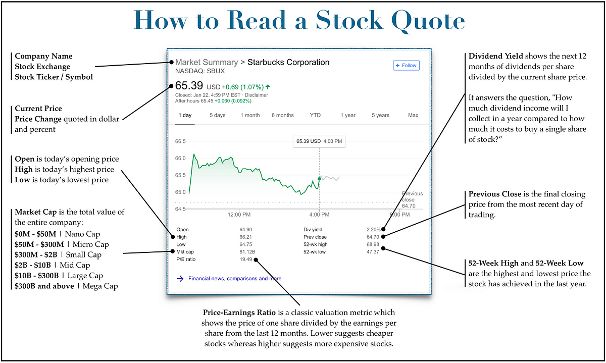

## Table of Contents

## What is a stock quote and why is it important?

A stock quote is the price of a company's stock at a specific time. It shows how much one share of the company's stock is worth. You can find stock quotes on financial websites, in newspapers, or through stock market apps. The quote usually includes the current price, the highest and lowest prices of the day, and how much the price has changed since the last trading day.

Stock quotes are important because they help people make decisions about buying or selling stocks. If you see that a stock's price is going up, you might decide to buy it because you think it will keep going up. On the other hand, if the price is going down, you might want to sell it before it goes down even more. Stock quotes give you a quick snapshot of what's happening with a company's stock, which can help you make smarter choices with your money.

## How can I read a basic stock quote?

When you look at a basic stock quote, you'll see a few important pieces of information. The first thing you'll see is the stock's ticker symbol, which is a short code that represents the company. Next to that, you'll see the current price of the stock, which tells you how much one share costs right now. You'll also see the change in price, which shows how much the stock's price has gone up or down since the last trading day. This change is usually shown in dollars and as a percentage.

Besides the current price and change, a stock quote will also show the day's high and low prices. The high price is the most the stock cost at any point during the day, and the low price is the least it cost. These numbers help you see how much the stock's price moved around during the day. Sometimes, you'll also see the volume, which tells you how many shares of the stock were traded that day. All of this information together gives you a good idea of what's happening with the stock and helps you decide if you want to buy or sell it.

## What do the terms 'bid' and 'ask' mean in a stock quote?

In a stock quote, the 'bid' is the highest price someone is willing to pay to buy a stock right now. It's like someone saying, "I'll give you this much money for one share of this company." If you want to sell your stock, you'll get the bid price, because that's what someone is offering to pay.

The 'ask', on the other hand, is the lowest price someone is willing to sell a stock for at that moment. It's like someone saying, "I want this much money for one share of this company." If you want to buy the stock, you'll have to pay the ask price, because that's what someone is asking for it. The difference between the bid and the ask is called the 'bid-ask spread', and it's important because it can affect how much you pay or get when you buy or sell a stock.

## How does the stock's volume affect its quote?

The volume of a stock is the number of shares that people buy and sell in a day. It's like how busy a store is - if a lot of people are coming in and out, it's a busy day. When a stock has a high volume, it means a lot of people are trading it. This can make the stock's price move around more because there are more buyers and sellers. If the volume is low, it means fewer people are trading the stock, and the price might not change as much.

Volume can tell you a lot about how people feel about a stock. If the volume goes up a lot, it might mean something big is happening with the company, like good news or bad news. Traders watch volume because it can help them guess if the stock's price will keep going up or down. So, even though volume doesn't change the quote directly, it can affect how the stock's price moves and how people decide to buy or sell it.

## What is the significance of the 52-week high and low in a stock quote?

The 52-week high and low in a stock quote show the highest and lowest prices the stock reached over the past year. These numbers help you see how much the stock's price has changed over time. If the current price is close to the 52-week high, it means the stock is doing well and might be near its peak value for the year. On the other hand, if the current price is close to the 52-week low, it could mean the stock is not doing as well and might be at its lowest value for the year.

These highs and lows are important because they can help you decide if you want to buy or sell the stock. If a stock is near its 52-week high, you might think it's a good time to sell because the price might not go much higher. If it's near the 52-week low, you might see it as a good time to buy, hoping the price will go up again. But remember, just looking at the 52-week high and low isn't enough to make a decision. You should also think about other things like the company's news and how the whole market is doing.

## How do stock quotes reflect market sentiment?

Stock quotes can tell us a lot about how people feel about a company and the market. When a stock's price goes up, it usually means that more people want to buy it than sell it. This can happen because people think the company is doing well or they expect good things to happen soon. If the price goes down, it might mean that more people want to sell the stock than buy it. They might think the company is not doing well or they expect bad news. So, by looking at how the stock's price changes, we can see if people are feeling happy or worried about the company.

But stock quotes don't just show how people feel about one company. They can also show how people feel about the whole market. If lots of stocks are going up, it might mean that people are feeling good about the economy and are ready to invest more money. If lots of stocks are going down, it might mean that people are worried about the economy and want to take their money out. By watching stock quotes, we can get a sense of whether people are feeling hopeful or scared about what's happening in the market.

## What are some common indicators included in advanced stock quotes?

Advanced stock quotes include more detailed information than basic ones. They often show the stock's moving averages, which are the average prices over different periods like 50 days or 200 days. These help you see if the stock's price is going up or down over time. Another common indicator is the price-to-earnings (P/E) ratio, which tells you how much people are willing to pay for each dollar the company earns. A high P/E ratio might mean people think the company will grow a lot, while a low P/E ratio might mean they think it won't.

You might also see the stock's beta, which shows how much the stock's price moves compared to the whole market. A beta higher than 1 means the stock moves more than the market, and a beta lower than 1 means it moves less. Another useful indicator is the dividend yield, which tells you how much money the company pays out to shareholders as a percentage of the stock's price. If a company has a high dividend yield, it might be a good choice if you want to earn regular income from your investment. All these indicators together give you a fuller picture of how the stock is doing and what might happen next.

## How can I use moving averages from stock quotes to make trading decisions?

Moving averages can help you make smart choices when you're trading stocks. They show you the average price of a stock over a certain time, like 50 days or 200 days. When you look at these averages, you can see if the stock's price is going up or down over time. If the short-term moving average, like the 50-day one, goes above the long-term moving average, like the 200-day one, it might mean the stock is starting to do better. People call this a "golden cross," and it can be a good time to buy the stock. On the other hand, if the short-term average goes below the long-term average, it's called a "death cross," and it might be a good time to sell.

You can also use moving averages to find good times to buy or sell by watching how the stock's price moves around them. If the stock's price stays above its moving average, it might be a good sign that the stock is strong and you should keep it or buy more. But if the price keeps falling below the moving average, it could mean the stock is getting weaker, and you might want to sell it. By keeping an eye on these moving averages, you can make better decisions about when to buy or sell your stocks, based on how the stock is doing over time.

## What is the difference between real-time and delayed stock quotes?

Real-time stock quotes show the price of a stock right now, as soon as it changes. They are very useful if you want to make quick decisions about buying or selling stocks. When you see a real-time quote, you know exactly what the stock is worth at that moment. This can help you trade more accurately because you're working with the most up-to-date information. Many trading platforms and financial websites offer real-time quotes, but sometimes you have to pay for them.

Delayed stock quotes, on the other hand, show the price of a stock with a delay, usually around 15 to 20 minutes after the price has changed. These quotes are free and easy to find on many websites and apps. They're good if you're just looking at the stock market for fun or if you don't need to make quick decisions. But if you're trading and need to know the exact price right now, delayed quotes can be a problem because the price might have changed a lot in those 15 to 20 minutes.

## How do stock quotes from different exchanges vary, and why does this matter?

Stock quotes can be different depending on which stock exchange they come from. Each exchange, like the New York Stock Exchange (NYSE) or the NASDAQ, has its own set of buyers and sellers. This means the price of a stock might be a little different on one exchange compared to another because of the people trading on it. For example, if more people want to buy a stock on the NYSE than on the NASDAQ, the price on the NYSE might be higher. This difference is called a "price discrepancy."

These differences matter because they can affect your trading decisions. If you're trying to buy a stock, you want to get the best price you can. So, you might look at quotes from different exchanges to find the lowest price. If you're selling, you'd want to find the exchange with the highest price. Also, if you're trading a lot of stocks quickly, knowing where to find the best prices can save you money and help you make more profit. So, it's important to check stock quotes from different exchanges to make the smartest choices with your money.

## Can you explain how to interpret stock quotes in the context of options trading?

When you're looking at stock quotes for options trading, you need to pay attention to more than just the stock's price. Options are contracts that give you the right to buy or sell a stock at a certain price before a certain date. So, when you see a stock quote, you'll also see information about the options, like the strike price and the expiration date. The strike price is what you can buy or sell the stock for if you use the option, and the expiration date is when the option stops working. You'll also see the option's premium, which is how much it costs to buy the option. If the stock's price is higher than the strike price, the option might be worth more because you can buy the stock for less than it's selling for.

Understanding stock quotes in options trading also means looking at things like the bid and ask prices for the options themselves. The bid price is what someone is willing to pay for the option, and the ask price is what someone wants to sell it for. The difference between these two prices is called the bid-ask spread, and it's important because it can affect how much you pay or get when you trade options. Also, the stock's volatility, or how much its price moves around, can change how much the option is worth. If the stock's price is moving a lot, the option might be more valuable because there's a bigger chance it will end up being worth using. By keeping an eye on all these parts of the stock quote, you can make better choices about when to buy or sell options.

## What advanced techniques can I use to analyze stock quotes for algorithmic trading?

When you're using stock quotes for algorithmic trading, one advanced technique is to use technical indicators like the Relative Strength Index (RSI) and the Moving Average Convergence Divergence (MACD). The RSI helps you see if a stock is overbought or oversold, which means it might be time to sell or buy. The MACD shows you the relationship between two moving averages of a stock's price, helping you spot trends and predict if the price will go up or down. By putting these indicators into your trading algorithm, you can make better choices about when to trade.

Another technique is to use machine learning to look at lots of stock quotes and find patterns that are hard for people to see. You can train a computer to look at past stock prices and other information, like news and company reports, to guess what will happen next. This can help you make trades that are more likely to make money. Using machine learning with stock quotes can give you an edge in the fast-moving world of algorithmic trading, where every little bit of information counts.

## References & Further Reading

[1]: Bergstra, J., Bardenet, R., Bengio, Y., & Kégl, B. (2011). ["Algorithms for Hyper-Parameter Optimization."](https://dl.acm.org/doi/10.5555/2986459.2986743) Advances in Neural Information Processing Systems 24.

[2]: ["Advances in Financial Machine Learning"](https://www.amazon.com/Advances-Financial-Machine-Learning-Marcos/dp/1119482089) by Marcos Lopez de Prado

[3]: ["Evidence-Based Technical Analysis: Applying the Scientific Method and Statistical Inference to Trading Signals"](https://www.amazon.com/Evidence-Based-Technical-Analysis-Scientific-Statistical/dp/0470008741) by David Aronson

[4]: ["Machine Learning for Algorithmic Trading"](https://github.com/stefan-jansen/machine-learning-for-trading) by Stefan Jansen

[5]: ["Quantitative Trading: How to Build Your Own Algorithmic Trading Business"](https://www.amazon.com/Quantitative-Trading-Build-Algorithmic-Business/dp/1119800064) by Ernest P. Chan