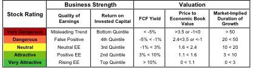

## Table of Contents

## What are stock ratings and why are they important?

Stock ratings are opinions given by experts about how well a company's stock might do in the future. These ratings are usually given by financial analysts who work at big banks or investment firms. They look at a lot of information about the company, like how much money it makes, how it's growing, and what's happening in the world that could affect it. Then, they give the stock a rating, like "buy," "hold," or "sell." A "buy" rating means the analyst thinks the stock's price will go up, so it's a good time to buy it. A "hold" rating means the stock's price might stay the same, so you should keep what you have. A "sell" rating means the analyst thinks the stock's price will go down, so it might be a good time to sell it.

These ratings are important because they help people who want to invest their money make decisions. If you're thinking about buying a stock, you might look at what the experts are saying. Their ratings can give you a good idea of what might happen to the stock's price. But remember, these are just opinions, and they can be wrong. It's always a good idea to do your own research too. Stock ratings can be a helpful tool, but they're just one part of making smart choices about where to put your money.

## Who provides stock ratings and how are they determined?

Stock ratings are provided by financial analysts who work at investment banks, brokerage firms, and independent research companies. These analysts are experts who study companies and the stock market. They look at a lot of information, like how much money a company makes, how fast it's growing, and what's happening in the world that could affect it. After they do all this research, they give the stock a rating like "buy," "hold," or "sell." These ratings are their opinions on whether the stock's price will go up or down in the future.

Analysts determine these ratings by using different methods. One common method is called [fundamental analysis](/wiki/fundamental-analysis). This means they look at the company's financial statements, like its income and how much it spends. They also look at things like how the company is run and what its plans are for the future. Another method is technical analysis, where analysts look at past stock prices and trading patterns to guess what might happen next. Sometimes, they also use a mix of both methods. After doing all this work, the analysts decide on a rating that they think best reflects the stock's future performance.

## What are the different types of stock ratings?

Stock ratings are opinions given by experts about how well a company's stock might do in the future. The most common ratings are "buy," "hold," and "sell." A "buy" rating means the analyst thinks the stock's price will go up, so it's a good time to buy it. A "hold" rating means the stock's price might stay the same, so you should keep what you have. A "sell" rating means the analyst thinks the stock's price will go down, so it might be a good time to sell it.

Sometimes, you might see other ratings too. For example, some analysts use "strong buy" or "strong sell" to show they feel very sure about their opinion. There's also "outperform" and "underperform," which compare the stock to others in its group. "Outperform" means the stock will do better than others, while "underperform" means it will do worse. These different ratings help investors understand what experts think about a stock's future.

## How can stock ratings influence investment decisions?

Stock ratings can help people decide where to put their money. When experts say a stock is a "buy," it means they think the stock's price will go up. This might make investors want to buy that stock because they think they can make money from it. On the other hand, if a stock gets a "sell" rating, it means experts think the price will go down. This might make investors want to sell the stock before it loses value. So, stock ratings can guide people on what to buy or sell.

But stock ratings are not always right. They are just opinions from experts, and sometimes things can change. That's why it's important for investors to do their own research too. They should look at the company's financials, what's happening in the world, and other information. By using stock ratings along with their own research, investors can make smarter choices about where to invest their money.

## What are the limitations and potential biases of stock ratings?

Stock ratings can have some problems. One big issue is that they might not always be right. Analysts can make mistakes because they are looking at a lot of information and trying to guess what will happen in the future. Also, the information they use might be old or not complete, which can lead to wrong ratings. Another problem is that ratings can change quickly. What an analyst thinks today might be different next week because new things happen all the time in the stock market.

Another thing to think about is that stock ratings can be biased. Sometimes, the companies that pay analysts might influence their ratings. For example, if a bank pays an analyst to rate a stock, the analyst might give a better rating to keep the bank happy. Also, analysts might have their own opinions or feelings about a company, which can affect their ratings. So, it's important for investors to know these problems and not just follow ratings without doing their own research.

## How often are stock ratings updated and why does this matter?

Stock ratings are usually updated by analysts when there's new information about a company or the market. This could be things like a new financial report, a change in the company's leadership, or big events in the world that might affect the stock. Analysts might update their ratings every few months or even more often if something important happens. Keeping ratings up to date is important because it helps investors make choices based on the latest information.

Why this matters is because stock prices can change a lot, and what was a good idea to buy or sell a few months ago might not be the same now. If investors are using old ratings, they might make bad choices and lose money. By looking at the most recent ratings, investors can better understand what's happening now and make smarter decisions about where to put their money.

## Can stock ratings be used as the sole basis for investment decisions?

Stock ratings should not be the only thing you use to decide where to invest your money. They are just opinions from experts and can be wrong sometimes. The stock market can change a lot, and what an analyst thinks today might be different tomorrow. Also, ratings can be influenced by the companies that pay the analysts, so they might not always be fair or correct.

It's important to do your own research before making investment choices. Look at the company's financial reports, what's happening in the world, and other information to get a full picture. By using stock ratings along with your own research, you can make smarter decisions and feel more confident about where to put your money.

## How do stock ratings correlate with stock performance?

Stock ratings are opinions from experts about how a stock might do in the future. They can give you a good idea of whether a stock's price might go up or down. But they don't always match up perfectly with how the stock actually performs. Sometimes a stock that gets a "buy" rating might not go up in price, and a stock with a "sell" rating might not go down. This happens because the stock market can be unpredictable, and many things can change after a rating is given.

Even though stock ratings don't always predict stock performance exactly, they can still be helpful. They show what experts think based on the information they have at the time. If a lot of experts think a stock will do well, it might be worth looking into. But it's important to remember that ratings are just one piece of the puzzle. You should also look at other things, like the company's financial reports and what's happening in the world, to make the best investment choices.

## What advanced metrics are used in stock rating methodologies?

When analysts rate stocks, they use a lot of different numbers and measures to help them make their decisions. One important measure is the price-to-earnings ratio, or P/E ratio. This tells you how much you're paying for each dollar of the company's earnings. A lower P/E ratio might mean the stock is a good deal, but it depends on the industry and other factors. Another measure is earnings growth, which looks at how fast the company's profits are growing. If a company's earnings are growing quickly, it might be a good sign for the stock's future.

Analysts also look at things like return on equity (ROE), which shows how well a company is using the money shareholders have invested. A high ROE can mean the company is doing a good job making profits from its investments. Another important metric is the debt-to-equity ratio, which shows how much the company is borrowing compared to what shareholders have put in. A high debt-to-equity ratio might mean the company is taking on too much risk. By looking at all these numbers together, analysts can get a better idea of a stock's health and future performance.

## How do global economic factors affect stock ratings?

Global economic factors can have a big impact on stock ratings. When the world's economy is doing well, companies might make more money, and their stock prices might go up. Analysts see this and might give the stocks better ratings, like "buy" or "outperform." But if the world's economy is not doing well, companies might make less money, and their stock prices might go down. In this case, analysts might give the stocks worse ratings, like "sell" or "underperform." Things like interest rates, inflation, and big events like wars or natural disasters can all affect how analysts rate stocks.

Another way global economic factors affect stock ratings is through currency changes. If a country's money gets weaker compared to other countries' money, it can make it harder for companies in that country to sell their products abroad. This might make their profits go down, and analysts might give their stocks lower ratings. On the other hand, if a country's money gets stronger, it can help companies sell more abroad, which might make their profits go up and lead to better stock ratings. So, when analysts look at a company, they think about all these global things to decide on a rating that makes sense.

## What role do stock ratings play in portfolio management?

Stock ratings help people who manage their money, like investors and financial advisors, decide what to do with their investments. When experts give a stock a "buy" rating, it means they think the stock's price will go up. This might make the person managing the portfolio want to buy more of that stock because they think it will help their money grow. If a stock gets a "sell" rating, it means the experts think the price will go down. So, the portfolio manager might sell that stock to avoid losing money. Stock ratings give important clues about what might happen to a stock's price, which helps in making smart choices about what to keep or change in a portfolio.

But stock ratings are not perfect and should not be the only thing used to manage a portfolio. They are just opinions from experts, and sometimes those opinions can be wrong. The stock market can change quickly, and new information can make a rating outdated. Also, ratings can be influenced by the companies that pay the analysts, so they might not always be fair. That's why it's important for people managing portfolios to use stock ratings along with their own research. By looking at the company's financial reports, what's happening in the world, and other information, they can make better decisions and manage their money more wisely.

## How can investors critically analyze and interpret stock ratings?

Investors should look at stock ratings carefully and not just take them at face value. Ratings are opinions from experts, but they can be wrong sometimes. It's important to understand why an analyst gave a certain rating. Did they look at the company's financial reports? Did they consider what's happening in the world that could affect the stock? Investors should also think about how old the rating is. The stock market can change quickly, and a rating from a few months ago might not be useful anymore. By asking these questions, investors can get a better idea of how much to trust a rating.

Another thing to think about is that stock ratings can be influenced by the companies that pay the analysts. Sometimes, analysts might give a better rating to keep their clients happy. This can make the ratings biased. Investors should also look at different ratings from different analysts to see if they agree. If many experts have the same opinion, it might be more reliable. But if the ratings are all over the place, it might mean the stock is hard to predict. By doing their own research and thinking critically about stock ratings, investors can make smarter choices about where to put their money.

## References & Further Reading

[1]: Marcos López de Prado. ["Advances in Financial Machine Learning"](https://www.amazon.com/Advances-Financial-Machine-Learning-Marcos/dp/1119482089). Wiley, 2018.

[2]: David Aronson. ["Evidence-Based Technical Analysis: Applying the Scientific Method and Statistical Inference to Trading Signals"](https://www.amazon.com/Evidence-Based-Technical-Analysis-Scientific-Statistical/dp/0470008741). Wiley, 2006.

[3]: Stefan Jansen. ["Machine Learning for Algorithmic Trading - Second Edition"](https://github.com/stefan-jansen/machine-learning-for-trading). Packt Publishing, 2020.

[4]: Ernest P. Chan. ["Quantitative Trading: How to Build Your Own Algorithmic Trading Business"](https://www.amazon.com/Quantitative-Trading-Build-Algorithmic-Business/dp/0470284889). Wiley, 2008.

[5]: Bergstra, J., Bardenet, R., Bengio, Y., & Kégl, B. ["Algorithms for Hyper-Parameter Optimization."](https://dl.acm.org/doi/10.5555/2986459.2986743) Advances in Neural Information Processing Systems 24, 2011.