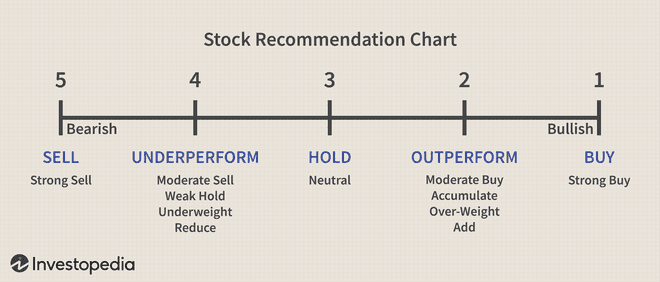

Financial markets are intricate systems driven by a multitude of factors that collectively influence investment dynamics. Understanding these systems is essential for individuals seeking to navigate the often-turbulent waters of financial investments. This understanding demands a comprehensive approach encompassing several key components: market evaluation, investment analysis, stock ratings, and algorithmic trading.

Market evaluation forms the foundation of any investment strategy, as it involves the assessment of economic indicators and market trends to determine the financial health of various economic sectors and individual stocks. This process is imperative for making informed investment choices and predicting potential market movements.



Investment analysis techniques provide further depth to this understanding. They range from fundamental analysis, which scrutinizes financial statements, to technical analysis, which focuses on price movements and patterns. A robust investment strategy often merges these techniques to construct a holistic view of potential investment opportunities.

Stock ratings serve as valuable tools in this complex landscape. These assessments, provided by financial analysts, are designed to guide investors on whether to buy, hold, or sell stocks based on expected performance. Though beneficial, these ratings reflect analysts' perspectives and should be considered alongside personal financial strategies.

Algorithmic trading represents a significant leap forward in modern investment practices. By utilizing computer programs to execute trades based on predefined rules, it enhances trading efficiency and minimizes human error. This advancement has made sophisticated trading strategies accessible to a broader audience, from novices to seasoned traders.

This article aims to provide a comprehensive understanding of how these elements interlink and their roles in investment decision-making. Regardless of your experience level, gaining insight into these aspects can significantly enhance your ability to make strategic investment decisions. We will explore the importance of market analysis, the role and function of stock ratings, the various methodologies employed in investment analysis, and the innovative developments in algorithmic trading. Through this exploration, we seek to equip investors with the tools needed to succeed in today's complex financial markets.

## Table of Contents

## Market Evaluation

Market evaluation involves a comprehensive assessment of the financial health and investment potential of broader economic sectors and individual stocks. The evaluation process incorporates a range of analytical techniques to decipher market conditions, thereby informing strategic investment decisions. Key components of market evaluation include the analysis of economic indicators, market trends, and financial metrics.

Economic indicators are statistical measures that provide insights into an economy's performance. Commonly monitored indicators include Gross Domestic Product (GDP), unemployment rates, inflation rates, and interest rates. These metrics help investors anticipate economic cycles and potential market shifts. For example, a rising GDP may indicate economic growth, prompting increased investor confidence and potentially higher market activity.

Market trends are evaluated by observing historical data to identify patterns in stock prices and trading volumes. This trend analysis aids investors in predicting future market movements. Technical tools, such as moving averages and the Relative Strength Index (RSI), are often employed to enhance this predictive ability.

Financial metrics play a crucial role in determining the value and performance of individual stocks. Quantitative data analysis often focuses on financial ratios. The Price-to-Earnings (P/E) ratio, for example, measures a company's current share price relative to its earnings per share (EPS). It indicates how much investors are willing to pay for a dollar of earnings, thus reflecting the stock's valuation. A higher P/E ratio can suggest that a stock is overvalued, while a lower ratio may indicate undervaluation.

Qualitative data, such as market sentiment, is also integral to market evaluation. Sentiment analysis evaluates investor attitudes and emotional responses to market events. This can involve examining news articles, social media, and analyst reports to gauge the general outlook towards an asset or sector. Understanding sentiment helps investors anticipate significant shifts in the market, such as buying frenzies or panic selling.

The macroeconomic environment sets the backdrop for all market activity. Macroeconomic factors include geopolitical events, fiscal policies, and central bank actions, all of which can significantly impact market dynamics. For instance, an [interest rate](/wiki/interest-rate-trading-strategies) cut by a central bank can lead to higher equity prices as borrowing becomes cheaper, encouraging business investments and consumer spending.

To evaluate markets effectively, investors often utilize a combination of fundamental and technical analyses, balancing both immediate market conditions with long-term economic forecasts. Analysts frequently employ predictive models that integrate various economic indicators to forecast market trends, allowing them to adjust investment strategies proactively. 

In summary, market evaluation is a multifaceted process involving both quantitative and qualitative assessments. By understanding economic indicators, market trends, and financial metrics, alongside the macroeconomic environment, investors can make informed decisions to optimize their portfolios and manage risk.

## Stock Ratings Explained

Stock ratings are assessments provided by financial analysts that serve as guides for investors considering buying, holding, or selling stocks. These ratings typically follow a simplified model: 'buy,' 'sell,' or 'hold.' These categories offer a streamlined approach to evaluating a stock's expected performance and potential. For instance, a 'buy' rating suggests that the stock is expected to perform well in the future, while a 'sell' rating indicates potential underperformance. A 'hold' rating suggests that the stock is expected to maintain its current trajectory without significant gains or losses.

The ratings are derived from robust analysis by industry professionals who examine a company’s financial health, industry conditions, and macroeconomic factors. Metrics such as earnings growth, revenue projections, and price-to-earnings ratios are commonly weighed to formulate such ratings. The consensus within the financial community is that these ratings provide valuable insights into stock performance, facilitating decision-making for traders and investors.

Despite their utility, stock ratings are not infallible. They inherently [carry](/wiki/carry-trading) subjective elements, reflecting the perspectives and methodologies of the analysts conducting the assessment. As such, the individual investor’s strategy may not always align with the general recommendations provided by ratings. It is crucial for investors to weigh these ratings against their own investment goals and risk tolerance.

Investors should also consider that ratings are subject to change as new information becomes available. For instance, earnings reports, changes in market trends, or geopolitical events can influence an analyst’s projection of a stock’s future performance. Understanding this dynamic nature is critical for interpreting stock ratings effectively.

Overall, stock ratings are a valuable tool in the investment landscape, offering a distilled view of a stock's potential outlook. However, they are most beneficial when used in conjunction with personal research and consideration of individual investment strategies.

## Investment Analysis Techniques

Investment analysis is a critical process for evaluating potential investment opportunities to determine their viability and potential for returns. This process utilizes a combination of analytical techniques to derive insights from financial data, market trends, and price patterns. Two primary methods stand out in investment analysis: [fundamental analysis](/wiki/fundamental-analysis) and technical analysis, each offering unique perspectives on the monetary potential of assets.

### Fundamental Analysis

Fundamental analysis is an approach that evaluates a stock based on the intrinsic value of the underlying company. This method involves a deep dive into financial statements and metrics to assess the company's financial health, operational efficiency, and market position. Key components of fundamental analysis include:

- **Financial Statements**: Analyzing balance sheets, income statements, and cash flow statements to gauge the company's profitability, liquidity, and solvency.
- **Ratios**: Key financial ratios such as the Price-to-Earnings (P/E), Price-to-Book (P/B), and Debt-to-Equity (D/E) ratios provide insights into the company’s valuation and financial structure.

  $\text{P/E Ratio} = \frac{\text{Market Value per Share}}{\text{Earnings per Share}}$

- **Economic Indicators**: Understanding broader economic factors such as interest rates, inflation, and GDP growth that may impact the company’s performance.
- **Qualitative Analysis**: Evaluating management effectiveness, brand strength, and competitive advantage.

By examining these elements, investors can identify undervalued stocks expected to generate long-term returns.

### Technical Analysis

Technical analysis involves studying past market data, primarily price and [volume](/wiki/volume-trading-strategy), to forecast future price movements. This method is grounded in the belief that historical trading activity and price changes are reliable indicators of future market behavior. Key tools and concepts in technical analysis include:

- **Charts and Patterns**: Identifying trends and chart patterns such as head and shoulders, double tops and bottoms, and support and resistance levels.
- **Indicators and Oscillators**: Utilizing tools like Moving Averages (MA), Relative Strength Index (RSI), and MACD to determine market momentum and potential reversal points.

  Python example for calculating Moving Averages:

  ```python
  import pandas as pd

  # Assuming 'data' is a pandas DataFrame with a 'Close' column.
  def moving_average(data, window):
      return data['Close'].rolling(window=window).mean()

  ma_20 = moving_average(data, 20)
  ```

### Combined Analysis Approach

Investors often integrate both fundamental and technical analysis to maximize their understanding of a stock's potential. While fundamental analysis offers insights into the long-term viability and financial health of a company, technical analysis can be beneficial for timing the market entry or [exit](/wiki/exit-strategy) points. By combining these approaches, investors gain a comprehensive view that encompasses both the intrinsic value and market behavior of stocks.

In summary, investment analysis is a multifaceted process that requires the integration of various methodologies to form a balanced perspective conducive to informed decision-making. This synthesis of analysis techniques enables investors to better manage risks and optimize investment returns.

## Advancements in Algorithmic Trading

Algorithmic trading leverages computer programs to facilitate trading by executing orders based on predefined algorithms, thereby enabling rapid transaction execution and enhancing trading efficiency. This method reduces human error typically associated with manual trading and allows for the swift processing of large volumes of data. Algorithms can analyze numerous market variables simultaneously, ultimately enhancing decision-making processes.

One of the fundamental aspects of [algorithmic trading](/wiki/algorithmic-trading) is its ability to systematically execute strategies derived from technical and quantitative analysis. Common strategies include statistical [arbitrage](/wiki/arbitrage), [market making](/wiki/market-making), and [trend following](/wiki/trend-following). For example, in [statistical arbitrage](/wiki/statistical-arbitrage), algorithms identify and exploit price inefficiencies between related securities by trading them simultaneously. Trend following algorithms, on the other hand, attempt to capitalize on upward or downward market trends using historical price and volume data.

Technological advancements have facilitated the accessibility of algorithmic trading to a broader spectrum of investors. Platforms such as TradeStation and [Interactive Brokers](/wiki/interactive-brokers-api) offer sophisticated algorithmic trading tools and resources that are user-friendly, catering to both novice and experienced traders. These platforms provide API access, which allows users to implement custom trading algorithms. Additionally, they offer [backtesting](/wiki/backtesting) capabilities, enabling traders to validate their strategies against historical data.

The increasing availability of algorithmic trading platforms signifies a democratization of trading technology, where retail investors can compete with institutional players. This democratization, coupled with decreases in transaction costs and the proliferation of open-source trading libraries like QuantConnect and Zipline, fosters an environment where individual investors can develop, test, and execute complex trading algorithms with minimal barriers to entry.

Algorithmic trading also encompasses the use of [machine learning](/wiki/machine-learning) techniques, which further enhances its potential. Machine learning algorithms can adapt to changing market conditions by learning from historical data, thus potentially increasing the robustness of trading strategies. Algorithms using techniques like [reinforcement learning](/wiki/reinforcement-learning) can develop strategies that dynamically adapt, optimize trading actions, and improve over time without explicit programming by leveraging large datasets.

Python is a preferred language for algorithmic trading due to its extensive libraries and community support, making it easier to build and deploy trading strategies. Here's a simple example of a mean-reversion trading strategy implemented in Python using the `pandas` library:

```python
import pandas as pd
import numpy as np

# Load historical stock price data
data = pd.DataFrame({'price': [100, 102, 101, 103, 105, 104, 102, 101, 100, 99]})
window = 3

# Calculate moving average
data['moving_avg'] = data['price'].rolling(window=window).mean()

# Identify signals based on mean-reversion
data['signal'] = np.where(data['price'] < data['moving_avg'], 'Buy', 'Sell')

print(data)
```

In this script, a moving average is computed, and buying or selling signals are generated when the stock price crosses below or above this average, respectively. This kind of strategy capitalizes on the assumption that prices will revert to a mean.

In conclusion, algorithmic trading has evolved significantly, becoming a critical element in modern trading systems. Platforms and libraries make it accessible, allowing investors to adopt and integrate sophisticated trading strategies efficiently. This continues to reshape how financial markets operate, presenting opportunities and challenges that reflect the broader evolution of technology in finance.

## Integrating Analysis for Investment Success

Successful investing requires a comprehensive approach that combines various types of analyses to effectively manage risk and optimize returns. By utilizing market evaluations, stock ratings, and algorithmic trading, investors can craft strategies that are well-suited to volatile market conditions and personal risk tolerances.

Market evaluations provide a macroeconomic perspective, enabling investors to identify economic trends and signals that suggest shifts in the market landscape. This involves assessing economic indicators such as GDP growth, unemployment rates, and inflation, which collectively offer insights into the broader economic environment. Understanding these indicators allows investors to adjust their portfolios in anticipation of economic fluctuations.

Stock ratings, provided by financial analysts, serve as streamlined indicators of a stock's potential trajectory. Although these ratings can be insightful, they must be viewed within the context of broader market conditions and personal investment objectives. Investors should understand that stock ratings reflect the analyst's perspective and should be used alongside other analysis methods to corroborate investment decisions.

Algorithmic trading is another tool that can enhance investment outcomes by leveraging technology to execute trades based on predetermined criteria. The use of algorithms allows for rapid transaction execution, taking advantage of fleeting market opportunities that would be missed by manual trading. Python, a popular programming language, is often used to develop these algorithms, given its extensive libraries and frameworks for financial analysis. For example, using Python's pandas and numpy libraries, investors can develop models to predict price movements, while the [backtrader](/wiki/backtrader) library allows for the backtesting of strategies against historical data:

```python
import pandas as pd
import numpy as np
import backtrader as bt

class MyStrategy(bt.Strategy):
    def __init__(self):
        self.sma = bt.indicators.SimpleMovingAverage(self.data, period=15)

    def next(self):
        if self.data.close[0] > self.sma[0]:
            self.buy()
        elif self.data.close[0] < self.sma[0]:
            self.sell()
```

Integrating these analyses into investment strategies enables investors to balance their portfolios more effectively. By constantly updating their knowledge and skill sets in these areas, investors can adapt to changing market conditions and achieve their financial goals. This approach emphasizes the necessity of continued learning and the ability to synthesize various analytical tools to navigate the complexities of financial markets. Tools and platforms like TradeStation and Interactive Brokers can further aid investors by providing the necessary infrastructure to implement these sophisticated strategies.

## Conclusion

The intertwining of market evaluation, stock ratings, investment analysis, and algorithmic trading forms the backbone of strategic investing. Each element contributes uniquely to the investment process. Market evaluation provides a macro view of economic conditions and helps in understanding the underlying factors that influence market trends. Stock ratings simplify decision-making by offering a distilled view of a stock’s potential based on analyst assessments, although they should be used in conjunction with personalized investment strategies.

Investment analysis techniques, such as fundamental and technical analysis, offer detailed insights into potential investment opportunities, helping investors assess viability and risk. Fundamental analysis focuses on evaluating financial health through metrics like revenue, earnings, and growth potential, while technical analysis examines historical price patterns and market behavior.

Algorithmic trading brings a technological edge to investing by automating trades based on pre-defined criteria, improving efficiency and minimizing the influence of human error. This advancement democratizes access to sophisticated trading strategies, empowering both novice and experienced investors.

To successfully navigate the complex financial markets, investors must integrate these elements, continuously updating their knowledge and adapting strategies. This holistic approach strengthens decision-making, aligning investment choices with financial goals while managing risks effectively. Continued learning and adaptation are not just beneficial but necessary in the ever-evolving landscape of financial markets, ensuring that investors remain agile and informed in their pursuit of success.

## References & Further Reading

[1]: Marcos López de Prado. ["Advances in Financial Machine Learning"](https://www.amazon.com/Advances-Financial-Machine-Learning-Marcos/dp/1119482089). Wiley, 2018.

[2]: David Aronson. ["Evidence-Based Technical Analysis: Applying the Scientific Method and Statistical Inference to Trading Signals"](https://www.amazon.com/Evidence-Based-Technical-Analysis-Scientific-Statistical/dp/0470008741). Wiley, 2006.

[3]: Stefan Jansen. ["Machine Learning for Algorithmic Trading - Second Edition"](https://github.com/stefan-jansen/machine-learning-for-trading). Packt Publishing, 2020.

[4]: Ernest P. Chan. ["Quantitative Trading: How to Build Your Own Algorithmic Trading Business"](https://www.amazon.com/Quantitative-Trading-Build-Algorithmic-Business/dp/0470284889). Wiley, 2008.

[5]: Bergstra, J., Bardenet, R., Bengio, Y., & Kégl, B. ["Algorithms for Hyper-Parameter Optimization."](https://dl.acm.org/doi/10.5555/2986459.2986743) Advances in Neural Information Processing Systems 24, 2011.