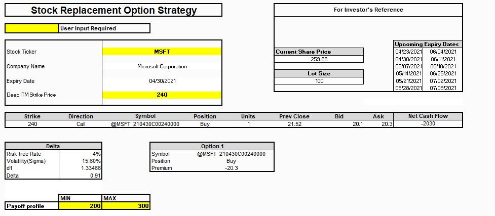

## Table of Contents

## What is a stock replacement strategy?

A stock replacement strategy is a way for investors to mimic the performance of owning a stock without actually buying the stock itself. Instead of buying the stock, an investor might use options, like buying call options or selling put options, to get similar financial results. This strategy can be useful if the stock is too expensive to buy outright or if the investor wants to use less money upfront.

Using options in a stock replacement strategy can also provide more flexibility. For example, an investor can choose different expiration dates and strike prices for the options they use. This can help manage risk and potentially increase returns. However, this strategy also comes with its own risks, such as the options expiring worthless if the stock doesn't move as expected. It's important for investors to understand these risks before trying this strategy.

## How does a call option work in the context of stock replacement?

In a stock replacement strategy, instead of buying the actual stock, you can buy a call option. A call option gives you the right, but not the obligation, to buy the stock at a certain price, called the strike price, before a certain date, called the expiration date. If the stock price goes up above the strike price, you can buy the stock at the lower strike price and then sell it at the higher market price, making a profit. This is similar to how you would make money if you owned the stock directly.

Using a call option instead of buying the stock can be cheaper because you only pay a premium for the option, which is usually less than the cost of the stock itself. This means you can control the same amount of stock with less money. However, there's a risk: if the stock price doesn't go up above the strike price by the expiration date, the option could expire worthless, and you would lose the money you paid for the option. So, while a call option can be a good way to replace owning a stock, it's important to understand the risks involved.

## What are the benefits of using a stock replacement strategy with call options?

Using a stock replacement strategy with call options can save you money. Instead of buying the whole stock, you just pay a smaller amount, called the premium, to get the right to buy the stock later. This means you can control a lot of stock without spending as much money upfront. For example, if a stock costs $100 per share, buying 100 shares would cost $10,000. But, you might be able to buy a call option for just $500 that lets you buy those 100 shares later if you want to.

Another benefit is flexibility. With call options, you can choose when the option expires and at what price you want to buy the stock. This can help you make decisions based on what you think the stock will do in the future. If you think the stock will go up a lot in the next few months, you can pick an expiration date that matches your prediction. If you're wrong and the stock doesn't go up, you only lose the premium you paid, not the full value of the stock.

## What are the risks associated with using call options for stock replacement?

One big risk with using call options for stock replacement is that you could lose all the money you spent on the option. If the stock price doesn't go up above the strike price before the option expires, the option becomes worthless. You won't get any of your money back. This is different from owning the stock directly, where even if the price goes down, you still own the stock and could wait for it to go back up.

Another risk is that options can be complicated. They have a lot of details like expiration dates and strike prices that you need to understand. If you make a mistake, like choosing the wrong expiration date or strike price, you might miss out on making money or lose more than you planned. It's important to learn about options and maybe talk to a financial advisor before trying this strategy.

## How do you select the right call options for a stock replacement strategy?

To select the right call options for a stock replacement strategy, you need to think about the stock's price and where you think it's going. Start by looking at the current price of the stock and deciding how much you think it will go up. Then, pick a strike price that's a little bit lower than where you think the stock will be by the time the option expires. This gives you room to make a profit if you're right about the stock's price going up.

Next, you need to choose the right expiration date. If you think the stock will go up quickly, you can pick a shorter expiration date, like a few months from now. If you think it will take longer for the stock to go up, you might want to pick a longer expiration date, like a year from now. Remember, the longer the expiration date, the more you'll usually have to pay for the option, so it's a balance between time and cost.

Lastly, consider the cost of the option, which is called the premium. You want to make sure the premium you pay isn't too high compared to how much you think the stock will go up. If the premium is too high, it might not be worth it, even if the stock goes up like you expect. Always compare the cost of the option to the potential profit to make sure it's a good deal.

## What is the cost comparison between buying stocks directly and using call options for stock replacement?

When you buy stocks directly, you pay the full price of the stock. For example, if a stock costs $100 per share and you want to buy 100 shares, you would need to spend $10,000. This can be a lot of money, especially if you want to buy a lot of shares. Buying stocks directly gives you ownership of the stock, and you can sell it later if the price goes up. If the price goes down, you still own the stock and can wait for it to go back up.

Using call options for stock replacement is usually cheaper. Instead of spending $10,000 on 100 shares, you might be able to buy a call option for just $500 that lets you buy those 100 shares later if you want to. This is called the premium, and it's a lot less than the full price of the stock. But, there's a catch: if the stock price doesn't go up above the strike price before the option expires, you lose the $500 you paid for the option. So, while call options can save you money upfront, they also come with more risk.

## Can you explain the tax implications of using call options in a stock replacement strategy?

Using call options in a stock replacement strategy can have different tax effects than just buying stocks. When you buy a stock, if you sell it for more than you paid, you have to pay capital gains tax on the profit. If you hold the stock for more than a year, the tax rate is usually lower than if you sell it in less than a year. But with call options, things can be different. If you buy a call option and sell it for more than you paid, that profit is usually treated as a short-term capital gain, no matter how long you held the option. This means you might pay a higher tax rate on the profit from the option than you would on a stock you held for more than a year.

Also, if you let the call option expire worthless, you can't claim that loss as a capital loss right away. Instead, it's treated as a short-term capital loss, which you can use to offset other gains. If you don't have other gains, you can only use up to $3,000 of the loss to reduce your income each year, and you might have to [carry](/wiki/carry-trading) over any extra loss to future years. So, while using call options can be a smart way to save money upfront, you need to think about how it might affect your taxes. Talking to a tax advisor can help you understand all the tax rules and plan the best way to use call options in your investment strategy.

## How does leverage play a role in a stock replacement strategy using call options?

Leverage is a big part of using call options in a stock replacement strategy. When you buy a call option, you only pay a small amount called the premium. This lets you control a lot more stock than if you bought it directly. For example, instead of spending $10,000 on 100 shares of a $100 stock, you might pay just $500 for a call option that gives you the right to buy those 100 shares later. This means you can use less money to make a bigger bet on the stock going up. If the stock price does go up, your profit can be a lot more than what you paid for the option.

But leverage also makes things riskier. If the stock price doesn't go up like you hoped, you could lose all the money you paid for the option. When you buy a stock directly, even if the price goes down, you still own the stock and can wait for it to go back up. With a call option, if it expires worthless, you lose everything you paid for it. So, while leverage can help you make more money if you're right about the stock, it can also make you lose more if you're wrong. It's important to understand this risk before using call options in a stock replacement strategy.

## What are some common mistakes to avoid when implementing a stock replacement strategy with call options?

One common mistake people make when using call options for a stock replacement strategy is [picking](/wiki/asset-class-picking) the wrong strike price or expiration date. If you choose a strike price that's too high or an expiration date that's too soon, the option might not be worth anything when it expires. It's important to think carefully about where you think the stock price will go and how long it might take to get there. Picking the right strike price and expiration date can make a big difference in whether you make money or lose it.

Another mistake is not understanding how much risk you're taking on. Call options can be a lot riskier than buying the stock directly because you could lose all the money you paid for the option if the stock doesn't go up. Some people think they can make a lot of money quickly with options, but they don't realize how much they could lose. It's important to only use money you can afford to lose and to understand that options can be complicated. Talking to a financial advisor can help you avoid these mistakes and make smarter choices.

## How can you adjust a stock replacement strategy using call options in response to market changes?

When the market changes, you can adjust your stock replacement strategy using call options by changing the strike price or the expiration date. If you think the stock will go up faster than you first thought, you might want to pick a shorter expiration date. This way, you can take advantage of the stock going up sooner. If the stock isn't going up as fast as you hoped, you might want to pick a longer expiration date to give it more time. You can also change the strike price. If the stock goes up a lot, you might pick a higher strike price to make more money if it keeps going up. If the stock goes down, you might pick a lower strike price to make sure you can still make some money if it goes back up.

Another way to adjust your strategy is by rolling over your options. This means you sell your current call option before it expires and buy a new one with a different strike price or expiration date. Rolling over can help you keep your strategy going even if the market changes. For example, if the stock goes down and your option is about to expire worthless, you could sell it and buy a new option with a lower strike price or a longer expiration date. This gives you another chance to make money if the stock goes back up. Just remember, every time you roll over, you have to pay another premium, so it can get more expensive.

## What advanced techniques can be used to optimize a stock replacement strategy with call options?

One advanced technique to optimize a stock replacement strategy with call options is to use a strategy called "delta hedging." Delta is a number that shows how much the price of an option changes when the stock price changes. By buying or selling the stock itself along with the call option, you can balance out the changes in the option's price. This can help you make money more steadily, even if the stock price moves around a lot. It's like trying to keep your profits smooth by adjusting what you own as the stock price changes.

Another technique is to use "calendar spreads." This means you buy a call option with a longer expiration date and sell a call option with a shorter expiration date, both with the same strike price. This can help you make money from the difference in time value between the two options. If you think the stock will stay the same or go up a little bit, this can be a good way to make some money while waiting for the stock to move more. It's a bit more complicated, but it can give you more ways to make money from the same stock.

## How do institutional investors utilize stock replacement strategies with call options differently from retail investors?

Institutional investors, like big funds or banks, use stock replacement strategies with call options in a more complex way than retail investors. They often have more money to spend, so they can buy a lot more options at once. This lets them use advanced techniques like delta hedging and calendar spreads to make their strategies work better. They also have teams of experts who can watch the market all the time and make quick changes to their strategies when things change. This means they can take advantage of small changes in the stock price that retail investors might miss.

Retail investors, on the other hand, usually don't have as much money or as many resources. They might use call options to replace stocks because it's cheaper than buying the stock directly. But they often stick to simpler strategies because they don't have the time or the knowledge to do more complicated things. Retail investors might also be more likely to make mistakes, like picking the wrong strike price or expiration date, because they don't have as much help or experience. So, while both types of investors can use call options for stock replacement, institutional investors can do it in a more sophisticated way.

## References & Further Reading

[1]: Black, F., & Scholes, M. (1973). ["The Pricing of Options and Corporate Liabilities."](https://www.cs.princeton.edu/courses/archive/fall09/cos323/papers/black_scholes73.pdf) Journal of Political Economy, 81(3), 637–654.

[2]: McMillan, L. G. (2012). ["Options as a Strategic Investment"](https://archive.org/details/optionsasstrateg0000mcmi_t0g2). 5th Edition. New York: New York Institute of Finance.

[3]: Hull, J. C. (2017). ["Options, Futures, and Other Derivatives"](https://www.semanticscholar.org/paper/Options%2C-Futures%2C-and-Other-Derivatives-Hull/89bdee500c8623864fc9eb7a471546aa713acc44). 9th Edition. Pearson.

[4]: Narang, R. K. (2013). ["Inside the Black Box: A Simple Guide to Quantitative and High-Frequency Trading"](https://onlinelibrary.wiley.com/doi/book/10.1002/9781118662717). Wiley.

[5]: Kissell, R. (2013). ["The Science of Algorithmic Trading and Portfolio Management"](https://www.sciencedirect.com/book/9780124016897/the-science-of-algorithmic-trading-and-portfolio-management). Academic Press.

[6]: Durbin, M. (2010). ["All About High-Frequency Trading"](https://www.mhebooklibrary.com/doi/book/10.1036/9780071743457). McGraw-Hill.

[7]: ["Options, Futures, and Other Derivatives"](https://www.amazon.com/Options-Futures-Other-Derivatives-Global/dp/1292410655) by John C. Hull

[8]: Cumming, D., & Johan, S. (2013). ["High-Frequency Trading: Risks, Rewards, and Regulation"](https://onlinelibrary.wiley.com/doi/abs/10.1002/sej.1265). CFA Institute.