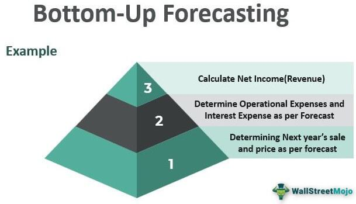

Understanding growth and revenue projections is vital for investors and analysts in finance. Financial growth analysis, revenue forecasting, and algorithmic trading are interconnected elements that significantly influence investment decision-making. Each component plays a crucial role in forming comprehensive and effective investment strategies. Traditional methods of financial assessment are increasingly complemented by technological innovations, most notably through the integration of algorithmic trading in stock market operations. This automation enhances the speed and precision of trading decisions, providing a competitive edge in the marketplace.

Algorithmic trading, fueled by advancing technology, offers a profound impact on stock market dynamics. By utilizing sophisticated algorithms and incorporating AI and machine learning, traders and analysts can process vast amounts of data and execute trades with heightened efficiency and accuracy. This technological evolution is reshaping how financial markets operate, providing deeper insights into trends and patterns that inform future projections.



This guide is designed to offer valuable insights into the complexities of financial forecasting and its contemporary applications. Whether you are an experienced investor seeking to refine your strategies or a learner new to the subject, this article aims to enhance your understanding of how growth and revenue projections are essential tools in navigating the complex world of finance. With a focus on both traditional and modern approaches, we present a comprehensive look at the methodologies driving today’s investment decisions.

## Table of Contents

## The Importance of Financial Projections

Financial projections are a critical tool for assessing a company's future financial health. They offer investors and stakeholders a forecast of growth, profitability, and cash flow, which are essential for evaluating the viability and potential success of their investments. Accurate financial projections enable informed decision-making and strategic planning, serving as a foundation for various financial analyses and evaluations.

### Insights into Growth, Profitability, and Cash Flow

Financial projections provide a structured view of expected growth, including increases in revenue and market share. These projections often incorporate assessments of market conditions, competitive advantages, and technological innovations. Beyond growth, projections also highlight profitability expectations by considering margins, cost structures, and operational efficiencies. Furthermore, they elucidate anticipated cash flow patterns, which are crucial for understanding a company's liquidity and its ability to meet obligations.

### Enhancing the Accuracy of Financial Projections

To enhance the accuracy of financial projections, analysts typically focus on two primary areas: revenue forecasting and growth analysis. Revenue forecasting involves estimating future sales and income, using historical data, industry trends, and market conditions. Key techniques include time-series analysis, regression models, and [machine learning](/wiki/machine-learning) approaches to predict future revenue streams accurately.

Growth analysis, on the other hand, evaluates a company's potential for expansion by examining metrics such as growth rates and market penetration. This analysis involves assessing both external factors like market trends and competitive landscape, and internal factors such as operational capabilities and resource allocation. The integration of these metrics bolsters the reliability of projections, instilling confidence in stakeholders about the firm's future prospects.

### Methods and Tools in Financial Projections

For robust financial projections, diverse methodologies and tools are used. Software like Excel and specialized financial modeling platforms provide capabilities for creating complex financial models. Quantitative methods include discounted cash flow analysis and scenario planning, which allow analysts to account for various potential future states.

Python has become increasingly popular for financial modeling due to its comprehensive libraries, such as NumPy for numerical computations, pandas for data manipulation, and statsmodels or scikit-learn for statistical modeling and machine learning. For instance, a basic Python approach to revenue forecasting might involve:

```python
import pandas as pd
from sklearn.linear_model import LinearRegression

# Sample data
data = pd.DataFrame({
    'year': [1, 2, 3, 4],
    'revenue': [500, 600, 700, 800]
})

# Independent and dependent variables
X = data[['year']]
y = data['revenue']

# Linear regression model
model = LinearRegression().fit(X, y)

# Revenue prediction for year 5
predicted_revenue = model.predict([[5]])
print(predicted_revenue)
```

This simple example demonstrates using linear regression to project future revenue based on historical data, illustrating how such tools can enhance the precision of financial projections.

In summary, financial projections are indispensable in assessing a company's future outlook. By leveraging methodologies like revenue forecasting and growth analysis, and employing sophisticated modeling tools, stakeholders can significantly improve the reliability and utility of these forecasts.

## Understanding Growth Analysis

Growth analysis is a fundamental aspect of evaluating a company's potential for future expansion. This process involves a comprehensive assessment of various elements, including market trends, competitive positioning, and internal capabilities, to formulate an understanding of a company's growth trajectory. 

**Market Trends and Competitive Positioning**

To accurately conduct growth analysis, acknowledging prevailing market trends is crucial. Market trends indicate the direction in which an industry or sector is moving and can encompass factors like consumer behavior shifts, technological advancements, or regulatory changes. Understanding these trends helps in predicting how they might influence the company’s performance and growth prospects.

Competitive positioning further complements this analysis. It involves assessing how a company stacks up against its competitors in terms of market share, product offerings, and strategic advantages. A firm with strong competitive positioning is often better equipped to capitalize on growth opportunities and defend its market share against rivals.

**Metrics for Growth Analysis**

Several metrics are instrumental in projecting a company's future growth. One primary metric is the growth rate, which measures the rate at which a company is expanding its operations or its revenues. The formula for calculating the growth rate over a specific period is:

$$
\text{Growth Rate (\%)} = \left(\frac{\text{Value at End of Period} - \text{Value at Beginning of Period}}{\text{Value at Beginning of Period}}\right) \times 100
$$

Market share gains are another critical metric. By understanding changes in a company's market share, analysts can infer the company’s relative performance and growth within the industry. Companies that exhibit consistent market share growth are often perceived as leaders in their field, potentially increasing investor confidence.

Internal capabilities such as operational efficiency, innovation capacity, and management effectiveness also contribute significantly to growth analysis. These internal factors determine a company’s ability to harness external opportunities and face challenges.

**Impact on Investor Confidence and Stock Valuation**

Effectively conducted growth analysis can boost investor confidence, as it provides a clearer picture of a company's future prospects. Investors are more likely to invest in firms where future growth is visible and backed by credible metrics.

Moreover, growth analysis plays a pivotal role in stock valuation. Analysts use the insights from growth analysis to assess a company's potential and set its valuation. Stocks of companies with strong growth forecasts generally attract higher valuation multiples, reflecting their anticipated earnings growth potential. Consequently, an accurate and comprehensive growth analysis can inform buy or sell recommendations, ultimately influencing investment decisions.

## Revenue Forecasting Techniques

Revenue forecasting is a critical aspect of financial modeling and investment analysis. It involves predicting a company's future sales and earnings through a comprehensive assessment of historical data, current market conditions, and relevant economic indicators. The accuracy of revenue forecasts significantly impacts strategic business decisions and investment evaluations.

To forecast revenue effectively, it's essential to understand consumer behavior, market demands, and pricing strategies. Consumer behavior can be influenced by various factors, including changing preferences, seasonal trends, and economic shifts. A solid understanding of these factors allows forecasters to anticipate demand fluctuations and adjust revenue predictions accordingly.

Several methodologies and tools are commonly used in revenue forecasting, ranging from simple statistical models to advanced algorithmic techniques. Historical data analysis forms the basis of most forecasts. Analysts utilize time series analysis to identify patterns and trends in past revenue data. Techniques such as moving averages and exponential smoothing are commonly employed to forecast short-term future sales by averaging past observations while giving more weight to recent data.

For more complex forecasting, regression analysis is often used. This method involves identifying relationships between dependent variables (e.g., sales) and one or more independent variables (e.g., marketing expenditure, economic indicators). The resulting regression model can be used to predict future revenue based on expected conditions of the independent variables.

Machine learning techniques have also become increasingly popular for revenue forecasting. Algorithms such as decision trees, random forests, and neural networks can analyze vast amounts of data, capturing complex nonlinear relationships that traditional models might miss. For instance, a [neural network](/wiki/neural-network) model could automatically learn and predict patterns in consumer purchase behavior that recur during specific economic cycles.

It's important to include external market factors and economic indicators, such as interest rates, inflation rates, and GDP growth, in revenue forecasts. These indicators provide contextual insight into the broader economic environment that can influence consumer spending and corporate earnings.

In Python, data analysts use libraries such as Pandas for data manipulation, NumPy for numerical operations, and libraries like SciKit-Learn and TensorFlow for implementing machine learning models. Here is a simplified example of how to develop a basic revenue forecasting model using Python:

```python
import pandas as pd
from sklearn.model_selection import train_test_split
from sklearn.linear_model import LinearRegression

# Load data
data = pd.read_csv('historical_revenue.csv')

# Feature selection
X = data[['marketing_spend', 'economic_indicator']]
y = data['revenue']

# Split data into training and test sets
X_train, X_test, y_train, y_test = train_test_split(X, y, test_size=0.2)

# Create and train the model
model = LinearRegression()
model.fit(X_train, y_train)

# Make predictions
predictions = model.predict(X_test)

# Output predicted revenue
print(predictions)
```
In this setup, `LinearRegression` is employed to model the relationship between revenue and selected features like marketing spend and economic indicators. The model can be extended with more complex data inputs and a different machine learning model to increase accuracy.

Forecasting revenue accurately requires using appropriate tools and methodologies to derive actionable insights. By combining historical sales data, current economic conditions, and advanced forecasting techniques, companies can create robust revenue models to guide their financial strategies.

## Algorithmic Trading in Stock Forecasting

Algorithmic trading utilizes sophisticated mathematical models and computational algorithms to automate decisions in the stock market. By relying on pre-defined rules and data inputs, these systems execute trades at speeds and frequencies impossible for human traders. This technique has become instrumental in modern financial markets, enhancing efficiency, [liquidity](/wiki/liquidity-risk-premium), and reducing transaction costs.

The primary advantage of [algorithmic trading](/wiki/algorithmic-trading) lies in its ability to process vast datasets, extracting actionable insights with higher speed and accuracy. These algorithms typically involve complex quantitative models that predict market movements based on historical data and future forecasts. A basic example might include a model that uses moving averages and relative strength index (RSI) to generate buy or sell signals.

Integrating [artificial intelligence](/wiki/ai-artificial-intelligence) (AI) and machine learning (ML) has further refined algorithmic trading. AI algorithms can learn from historical data, recognizing patterns and making decisions with minimal human intervention. For instance, machine learning models can evaluate millions of data points in real time, adjusting trading strategies dynamically as market conditions change. This adaptation enhances the robustness of algorithmic trading systems against unexpected market [volatility](/wiki/volatility-trading-strategies).

A pivotal development in algorithmic trading is the usage of deep neural networks to predict stock price movements. These networks consist of multiple processing layers to identify patterns in complex datasets, capturing non-linear dependencies and interactions in stock price behavior. For example, a [deep learning](/wiki/deep-learning) model might process daily stock prices, [volume](/wiki/volume-trading-strategy), and microeconomic indicators to forecast price trends.

Python, a preferred language for implementing these models, provides libraries such as NumPy, pandas, and TensorFlow for managing data and training machine learning models. A simple Python example using a logistic regression model might involve the following steps:

```python
import pandas as pd
from sklearn.model_selection import train_test_split
from sklearn.linear_model import LogisticRegression
from sklearn.metrics import accuracy_score

# Load stock price data
data = pd.read_csv('stock_data.csv')
features = data[['moving_average', 'rsi_value', 'volume']]
target = data['buy_sell_signal']

# Split data into training and testing sets
X_train, X_test, y_train, y_test = train_test_split(features, target, test_size=0.3, random_state=42)

# Initialize and train the logistic regression model
model = LogisticRegression()
model.fit(X_train, y_train)

# Predict and evaluate the model
predictions = model.predict(X_test)
accuracy = accuracy_score(y_test, predictions)
print(f'Model Accuracy: {accuracy * 100:.2f}%')
```

The application of algorithmic trading has revolutionized the stock forecasting landscape by allowing continuous learning and adaptation of trading models. This transformation supports superior price discovery and trading strategies, providing traders with a considerable advantage in capturing profit opportunities. However, it also necessitates stringent risk management protocols to mitigate potential adverse effects, such as market flash crashes or unexpected algorithm behavior. As technology continues to evolve, algorithmic trading will likely further influence stock market dynamics, emphasizing the importance of adaptive and intelligent trading systems.

## The Impact of Forecasting on Stock Valuation

Accurate financial projections are pivotal in shaping a stock's perceived value, acting as a cornerstone for investment decisions. Financial forecasts help investors gauge a company's potential for growth, providing an analytical basis for evaluating stock prices. Growth expectations, in particular, are primary determinants of stock prices and valuation multiples. Investors and analysts rely on future growth projections to assess whether a company's stock price accurately reflects its potential earnings and market expansion prospects.

The process of setting valuation multiples, such as the Price-to-Earnings (P/E) ratio, often hinges on growth forecasts. Analysts project expected growth rates to estimate these multiples, helping them establish target prices. For instance, a company expected to grow its earnings significantly in the future might justify a higher P/E ratio than a slower-growing counterpart.

In practice, valuation models like the Discounted Cash Flow (DCF) analysis incorporate revenue and cash flow projections to determine a stock's intrinsic value. For example, the basic DCF formula is:

$$
DCF = \sum \frac{CF_t}{(1 + r)^t}
$$

where $CF_t$ represents the cash flow in a given period, $r$ is the discount rate, and $t$ is the time period. Accurate forecasting of future cash flows using this method can highlight undervalued or overvalued stocks in the marketplace.

Beyond mathematical models, forecasts significantly sway market sentiment, influencing investor confidence and behavior. Analysts' buy or sell recommendations hinge on how company performance forecasts align with market conditions. If projections suggest robust future performance, analysts may recommend buying the stock, anticipating a price increase corresponding with projected growth. Conversely, a weak forecast might lead to a sell recommendation, anticipating diminished investor interest and a potential decline in stock price.

The interplay between performance forecasts and market sentiment is further complicated by external economic factors. While a company's strong forecasts may boost confidence, broader market conditions—such as economic downturns—can temper investor enthusiasm. However, clear and reliable forecasts can mitigate some of these uncertainties, supporting a more stable stock valuation even amidst market fluctuations.

In conclusion, robust financial projections form the foundation for accurate stock valuation, guiding investment strategies through expected growth trends. As projections shape market expectations, they directly influence stock prices and investment decisions, underscoring the critical role of forecasting in the financial landscape.

## Challenges and Future Trends

Financial forecasting, while essential, presents several challenges. One of the primary concerns is data accuracy. Reliable forecasts require high-quality data, yet inaccuracies often arise due to reporting errors, data entry mistakes, or outdated information. These inaccuracies can severely distort projections, leading to misguided investment decisions.

Market volatility further complicates forecasting efforts. Financial markets are subject to unpredictable changes driven by economic, political, and environmental factors. Such volatility makes it challenging to predict trends accurately, necessitating models that can adapt swiftly to changing conditions.

Technological advancements are instrumental in addressing some of these challenges. Enhanced data analytics improve the quality and speed of data processing, offering more precise insights. Tools such as machine learning algorithms analyze vast datasets to detect patterns and predict trends more accurately. These algorithms can self-improve through learning, refining their predictions over time as they process more data.

Looking ahead, quantum computing holds promise for revolutionizing financial projections. Quantum computers have the potential to process data at unprecedented speeds and handle complex calculations that are currently infeasible with classical computing. This capability could lead to more robust forecasting models capable of factoring in a wider array of variables and uncertainties.

Besides quantum computing, continued advancements in artificial intelligence (AI) are expected to shape the future of financial forecasting. AI can enhance predictive capacities through natural language processing, enabling systems to interpret market sentiments from news articles, social media, and other text data sources in real-time.

To leverage these advancements effectively, it is crucial to focus on improving data collection and processing methodologies continuously. Integrating cutting-edge technologies while maintaining a cautious approach towards model overfitting is essential. As we move forward, these innovations will likely offer deeper insights and more reliable projections, enhancing strategic decision-making in finance.

## Conclusion

Financial projections and algorithmic trading are key elements in today’s financial markets, offering a scientific basis for assessing potential returns and managing risks. By employing sophisticated models and data analytics, investors can make informed decisions grounded in quantitative evidence rather than speculative assumptions. The evolution of technology further amplifies the effectiveness of these tools, with advancements like artificial intelligence (AI) and machine learning providing deeper insights and more accurate predictions.

As technology advances, financial forecasting and algorithmic trading are expected to become increasingly sophisticated. Techniques that are on the horizon, such as quantum computing, promise to enhance computational speed and data-processing capabilities, allowing for real-time analysis of market dynamics and generating predictions with unprecedented accuracy. This evolution not only improves the precision of forecasts but also expands the scope of data that investors can utilize, integrating diverse data sources from social media sentiment to global economic indicators.

To harness the full potential of these advanced forecasting tools, investors must maintain a commitment to lifelong learning and adaptability. The dynamic nature of financial markets demands that investors stay updated on new technologies and methodologies to refine their investment strategies continually. By embracing innovation and incorporating cutting-edge tools into their decision-making processes, investors can better navigate the complexities of the financial landscape, optimizing their strategies for growth and stability in an ever-changing market environment.

## References & Further Reading

[1]: Bergstra, J., Bardenet, R., Bengio, Y., & Kégl, B. (2011). ["Algorithms for Hyper-Parameter Optimization."](https://dl.acm.org/doi/10.5555/2986459.2986743) Advances in Neural Information Processing Systems 24.

[2]: ["Advances in Financial Machine Learning"](https://www.amazon.com/Advances-Financial-Machine-Learning-Marcos/dp/1119482089) by Marcos Lopez de Prado

[3]: ["Evidence-Based Technical Analysis: Applying the Scientific Method and Statistical Inference to Trading Signals"](https://www.amazon.com/Evidence-Based-Technical-Analysis-Scientific-Statistical/dp/0470008741) by David Aronson

[4]: ["Machine Learning for Algorithmic Trading"](https://github.com/stefan-jansen/machine-learning-for-trading) by Stefan Jansen

[5]: ["Quantitative Trading: How to Build Your Own Algorithmic Trading Business"](https://www.amazon.com/Quantitative-Trading-Build-Algorithmic-Business/dp/1119800064) by Ernest P. Chan