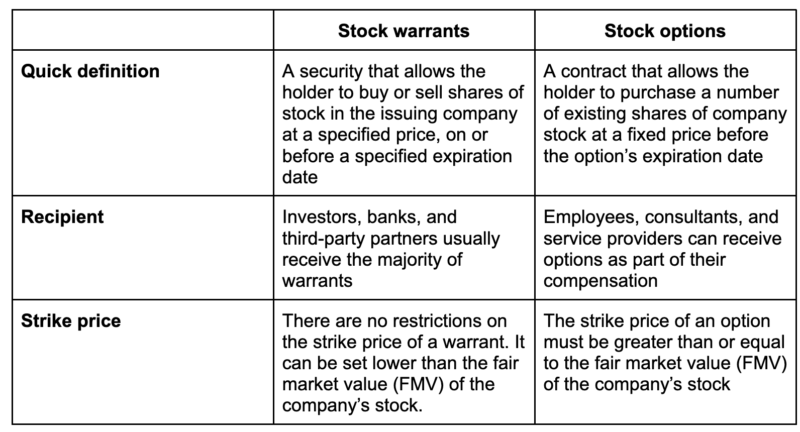

## Table of Contents

## What are stock rights and how do they differ from warrants?

Stock rights are special privileges given to existing shareholders of a company. They allow shareholders to buy additional shares of the company's stock before the general public. This is usually done at a discounted price and for a limited time. The main purpose of stock rights is to give current shareholders a chance to maintain their ownership percentage in the company when new shares are issued. For example, if a company wants to raise more money by selling new shares, it might first offer these shares to existing shareholders through stock rights.

Warrants, on the other hand, are a bit different. They are also options to buy a company's stock, but they are not given to existing shareholders. Instead, companies can issue warrants to anyone, often as a sweetener to make other investments more attractive. For instance, a company might attach a warrant to a bond, giving the bondholder the right to buy stock at a set price in the future. Unlike stock rights, warrants usually have a longer time period before they expire, sometimes several years. Both stock rights and warrants can increase in value if the company's stock price goes up, but they serve slightly different purposes and are offered to different groups of people.

## How can an investor acquire stock rights and warrants?

An investor can acquire stock rights if they already own shares in a company that decides to issue new shares. When the company wants to raise more money, it might give its current shareholders the chance to buy these new shares before anyone else. This is done through stock rights, which are usually offered at a lower price than what the public will pay later. The company will tell its shareholders about the stock rights and how long they have to use them. If the investor decides to use their stock rights, they can buy the new shares and keep their ownership percentage in the company.

Warrants are a bit different. An investor can get warrants from a company that offers them, often as part of another investment. For example, a company might sell bonds and include warrants as an extra perk. This means that when someone buys the bond, they also get the right to buy the company's stock at a set price in the future. Warrants can also be bought and sold on their own in the market, just like stocks. So, an investor can buy warrants directly from other investors if they think the company's stock price will go up.

## What are the basic benefits of investing in stock rights and warrants?

Investing in stock rights can be a good deal for shareholders. When a company offers new shares, it usually gives its current shareholders the first chance to buy them at a lower price. This means shareholders can buy more shares without spending as much money. If they use their stock rights, they can keep the same percentage of ownership in the company. This is important because it stops their ownership from getting smaller when new shares are sold to others. Also, if the stock price goes up after they buy the new shares, they can make a profit.

Warrants are another way to invest that can be exciting. They give investors the right to buy a company's stock at a set price in the future. This can be a big advantage if the stock price goes up a lot. Investors can buy the stock at the lower price they got with the warrant and then sell it at the higher market price. Warrants are often given as a bonus when buying other investments like bonds, which can make those investments more attractive. Plus, since warrants can be traded like stocks, investors can buy and sell them to try and make money.

## What are the risks associated with investing in stock rights and warrants?

Investing in stock rights can be risky. If you don't use your stock rights before they expire, you might miss out on a good deal. Also, if the stock price goes down after you buy the new shares, you could lose money. Sometimes, using your stock rights means spending more money to buy more shares, and if the company doesn't do well, those shares might not be worth as much as you paid for them.

Warrants also come with risks. They usually have a longer time before they expire, but if the stock price doesn't go up enough, the warrant might not be worth using. If you buy a warrant and the stock price stays the same or goes down, you could lose the money you spent on the warrant. Plus, since warrants can be traded, their prices can go up and down a lot, which makes them a bit like gambling. It's important to think carefully before investing in either stock rights or warrants.

## How do stock rights and warrants affect a company's capital structure?

When a company issues stock rights, it's giving its current shareholders the chance to buy more shares before anyone else. This can change the company's capital structure because it means more money is coming into the company from selling these new shares. If a lot of shareholders use their stock rights, the company gets more cash, which it can use to grow or pay off debts. But, it also means there are more shares out there, which can make each share worth a little less if the company's total value stays the same. So, stock rights can help a company raise money, but they also change how the company's ownership is divided up.

Warrants work a bit differently. When a company issues warrants, it's giving people the right to buy its stock at a set price in the future. This doesn't change the company's capital structure right away because the money from selling the stock only comes in if people use their warrants. But, if a lot of people do use their warrants, the company gets more cash, and there are more shares out there. This can make the company's capital structure more complex because it adds another layer of potential shares that might be sold. Like stock rights, warrants can bring in more money, but they also mean more shares and possibly a smaller value for each share if the company's total value doesn't grow.

## What is the process of exercising stock rights and warrants?

When you want to use your stock rights, you need to do it before they run out. The company will tell you how long you have, usually a few weeks. To use them, you fill out a form that the company gives you and send it back with the money to buy the new shares. The price you pay is usually less than what other people will pay later. Once you've done that, the company will give you the new shares, and you'll own a bit more of the company.

Using warrants is a bit like using stock rights, but it can take longer. You have to wait until the date when you can use your warrant, which might be months or years away. When that time comes, you can buy the company's stock at the price that was set when you got the warrant. If the stock price is higher than that, you can buy the shares cheap and maybe make a profit. You'll need to fill out a form and pay the set price to get your shares. If you don't use your warrant before it expires, you lose the chance to buy the stock at that price.

## How do stock rights and warrants impact the stock price?

When a company offers stock rights, it can affect the stock price in a few ways. If a lot of people use their stock rights to buy more shares, more money comes into the company. This can make the company stronger and might make the stock price go up if people think the company is doing well. But, there are also more shares out there, which can make each share worth a little less if the company's total value stays the same. So, right after stock rights are offered, the stock price might go down a bit because there are more shares. But if the company uses the new money well, the stock price could go up later.

Warrants can also change the stock price, but it's a bit different. When a company issues warrants, it's promising that people can buy its stock at a set price later. If a lot of people think the stock price will go up a lot, they might buy the warrants, which can make the stock price go up right away because more people want the stock. But, if the stock price doesn't go up enough by the time the warrants can be used, people might not use them. This means the company doesn't get the extra money, and the stock price might not change much. So, warrants can make the stock price go up or down depending on what people think will happen in the future.

## What are the tax implications of investing in stock rights and warrants?

When you use stock rights to buy more shares, you usually have to pay taxes on any profit you make. If you buy the new shares and then sell them for more money than you paid, the difference is a capital gain. You'll have to pay capital gains tax on that. The tax rate depends on how long you held the shares before selling them. If you held them for a year or less, it's a short-term capital gain, and you'll pay your regular income tax rate. If you held them for more than a year, it's a long-term capital gain, and the tax rate is usually lower. Also, if you get stock rights for free because you already own shares, that might count as income, and you might have to pay tax on the value of those rights.

Warrants work a bit like stock rights when it comes to taxes. If you use your warrants to buy shares and then sell those shares for a profit, you'll have to pay capital gains tax on the profit. The same rules about short-term and long-term capital gains apply. If you buy and sell the warrants themselves, any profit from that is also taxed as a capital gain. But, if you get warrants as part of another investment, like a bond, and you don't have to pay anything extra for them, the value of those warrants might be considered income, and you might have to pay tax on that value. It's a good idea to talk to a tax expert to make sure you understand all the tax rules that apply to your situation.

## How do market conditions influence the value of stock rights and warrants?

Market conditions can have a big impact on the value of stock rights and warrants. When the stock market is doing well and people think the company's stock price will go up, stock rights and warrants can become more valuable. This is because people want to buy the new shares or use their warrants to get the stock at a lower price before it goes up. But, if the market is not doing well and people think the company's stock price will go down, stock rights and warrants might lose value. People might not want to use their stock rights or warrants if they think they will lose money.

The time left before stock rights and warrants expire also matters a lot. If the market is good and there's a lot of time left, the value of stock rights and warrants can go up because people have more time to wait for the stock price to go up. But if the market is bad and there's not much time left, the value can drop quickly because people might not think the stock price will go up in time. So, market conditions and how much time is left before they expire both play a big role in how much stock rights and warrants are worth.

## What strategies can investors use to maximize returns from stock rights and warrants?

To make the most money from stock rights, investors should pay attention to the company's news and how well it's doing. If the company is growing and the stock price is going up, using your stock rights to buy more shares can be a good idea. You can buy the new shares at a lower price and then sell them later for a profit if the stock keeps going up. It's also smart to think about how much money you can spend. If you have the money to buy more shares, using your stock rights might help you own a bigger piece of the company without spending as much as other people would.

For warrants, timing is key. Investors should keep an eye on the stock price and use their warrants when they think the stock will keep going up. If you believe the stock price will be higher than the price set in the warrant, it's a good time to use it. You can buy the stock cheap and then sell it for more money. Another strategy is to trade the warrants themselves. If you think the stock price will go up a lot before the warrant expires, you can buy and sell the warrants to make money. But remember, this can be risky, so it's important to think carefully and maybe not use all your money on one bet.

## How do stock rights and warrants fit into a diversified investment portfolio?

Stock rights and warrants can be part of a diversified investment portfolio because they give investors different ways to make money. When you own stock rights, you get the chance to buy more shares of a company you already own at a lower price. This can be a good way to increase your investment in a company you believe in without spending as much money as other people. If the company does well and the stock price goes up, you can make more money. But, because stock rights are tied to one company, they can make your portfolio less diverse if you use them too much.

Warrants can also add variety to your investments. They let you buy a company's stock at a set price in the future, which can be a big advantage if the stock price goes up a lot. You can buy the stock cheap and then sell it for more money. Warrants can be traded like stocks, so you can buy and sell them to try and make money. But, like stock rights, warrants can be risky because their value depends a lot on one company's stock price. To keep your portfolio balanced, you should only use a small part of your money on stock rights and warrants and spread the rest across different kinds of investments.

## What are some advanced valuation techniques for stock rights and warrants?

When figuring out how much stock rights are worth, you can use a method called the Black-Scholes model. This model looks at the current stock price, the price you can buy the new shares for, how long you have to use the rights, and how much the stock price might move around. It's a bit like guessing how much a ticket to a future event might be worth, depending on how popular the event is and how soon it will happen. If the stock price is expected to go up a lot and you have a long time to use the rights, they might be worth more. But if the stock price is not expected to change much or you only have a short time, the rights might not be worth as much.

For warrants, you can also use the Black-Scholes model, but there's another way called the binomial model. The binomial model breaks down the time until the warrant expires into smaller parts and looks at what might happen to the stock price at each part. It's like playing a game where you guess what will happen next, over and over, until the end. This model can be more accurate because it considers more possibilities for the stock price. Both models help you understand if the warrant is a good deal, depending on how much you think the stock price will go up and how long you have to use the warrant.

## How do you set up your algorithmic trading system?

To establish a sound [algorithmic trading](/wiki/algorithmic-trading) system for warrants, choosing an appropriate trading platform is critical. Trading platforms such as QuantConnect and MetaTrader 5 offer robust capabilities for algorithmic trading, providing essential tools for [backtesting](/wiki/backtesting), strategy development, and detailed market analysis. These platforms support various programming languages and provide access to extensive financial databases, flexibility in modeling strategies, and deployment options.

Developing a solid trading strategy that aligns with the characteristics of warrants is crucial. This process involves setting precise entry and [exit](/wiki/exit-strategy) points, crucial for optimizing the timing of trades and managing risks effectively. Traders often utilize quantitative models and statistical methods to inform their strategies. For example, using a moving average crossover strategy can signal potential entry and exit opportunities:

```python
def moving_average_strategy(prices, short_window, long_window):
    short_mavg = prices.rolling(window=short_window, min_periods=1, center=False).mean()
    long_mavg = prices.rolling(window=long_window, min_periods=1, center=False).mean()

    signals = (short_mavg > long_mavg) & (short_mavg.shift(1) <= long_mavg.shift(1))
    return signals
```

Effective risk management is fundamental in algorithmic trading. Investors must implement strict protocols to limit exposure and safeguard their portfolios. Key risk management techniques include setting stop-loss orders, diversifying investments, and using position sizing. For example, the Kelly Criterion can help determine optimal position sizing to maximize growth while controlling risk:

$$
f^* = \frac{bp - q}{b}
$$
Where:
- $f^*$ is the fraction of the portfolio to invest.
- $b$ is the odds received on the wager (e.g., a bet payout of 3:1, $b = 3$).
- $p$ is the probability of winning.
- $q$ is the probability of losing ($q = 1-p$).

Ongoing testing and optimization of algorithms are essential to maintaining their effectiveness amidst ever-changing market conditions. This involves continuous monitoring of algorithm performance, including backtesting against historical data and adjusting parameters to enhance efficiency. Traders should employ out-of-sample testing to validate the robustness of their strategies in different market conditions.

For novice investors, starting small and incrementally scaling investment strategies is advisable. Continuous learning and iteration upon successful strategies can bolster understanding and confidence in algorithmic trading. Engaging with online communities and forums, such as QuantConnect's community or MetaTrader forums, can also provide invaluable insights and support during the learning process.

## References & Further Reading

[1]: Bergstra, J., Bardenet, R., Bengio, Y., & Kégl, B. (2011). ["Algorithms for Hyper-Parameter Optimization."](https://papers.nips.cc/paper/4443-algorithms-for-hyper-parameter-optimization) Advances in Neural Information Processing Systems 24.

[2]: ["Advances in Financial Machine Learning"](https://www.amazon.com/Advances-Financial-Machine-Learning-Marcos/dp/1119482089) by Marcos Lopez de Prado

[3]: ["Evidence-Based Technical Analysis: Applying the Scientific Method and Statistical Inference to Trading Signals"](https://books.google.com/books/about/Evidence_Based_Technical_Analysis.html?id=MeoJAQAAMAAJ) by David Aronson

[4]: ["Machine Learning for Algorithmic Trading"](https://github.com/stefan-jansen/machine-learning-for-trading) by Stefan Jansen

[5]: ["Quantitative Trading: How to Build Your Own Algorithmic Trading Business"](https://www.amazon.com/Quantitative-Trading-Build-Algorithmic-Business/dp/1119800064) by Ernest P. Chan