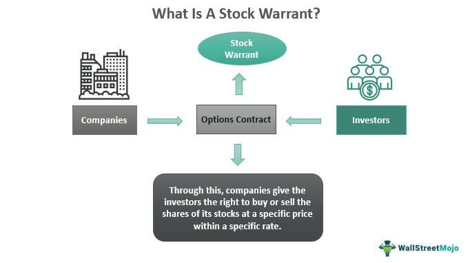

The financial world offers a myriad of opportunities for investors aiming to achieve substantial returns. Among these opportunities, stock rights and warrants stand out as powerful tools. When intelligently combined with algorithmic trading, they can transform traditional investment strategies into sophisticated and efficient systems. Stock rights and warrants, fundamentally derivatives, provide unique benefits that can be strategically exploited for high returns.

Stock rights grant existing shareholders the ability to purchase additional shares before the general public, often at a discounted rate. This opportunity can significantly enhance an investor's portfolio by allowing them to buy more shares cheaply, potentially increasing their influence within a company and their stake in future profits. On the other hand, warrants are long-term options issued by companies, offering the right to buy shares at a specific price in the future. They provide leverage, enabling investors to control a larger amount of shares with a relatively small capital outlay.



Algorithmic trading enters this equation by integrating technology and automation into the trading process. It involves the use of computer algorithms to execute trades based on predefined parameters, allowing for swift and precise trade execution. This technique provides the advantage of speed and efficiency, surpassing human capabilities by processing vast datasets to identify market trends and opportunities. By reducing human error and bias, algorithmic trading can lead to cost savings and improved profitability.

This article seeks to explore the intricate interactions between these financial instruments and algorithmic trading. We aim to provide a comprehensive analysis of how these tools function, their intrinsic benefits, and how they can be seamlessly integrated into an investor’s portfolio. Whether you are an experienced investor or new to these concepts, a deep understanding of stock rights, warrants, and algorithmic trading can significantly enhance your investment strategies and outcomes.

Thus, as we explore these financial instruments and their synergy with algorithmic trading, we aim to highlight actionable insights and offer a clear framework for optimizing returns while managing associated risks effectively.

## Table of Contents

## Understanding Warrants and Stock Rights

Warrants and stock rights are financial instruments that serve as derivatives, providing investors with a strategic means to purchase company shares at potentially advantageous prices. These instruments are vital tools within the investment landscape, helping investors enhance their portfolios without large immediate expenditures.

**Stock Rights**

Stock rights are issued to existing shareholders to allow them to purchase additional shares of the company's stock before it is offered to the general public, typically at a discount to the current market price. This opportunity not only enables shareholders to maintain their proportional ownership in the company but can also act as a lucrative means to acquire more shares at reduced rates. The primary aim of stock rights is to avoid dilution of shareholders' equity. For example, if a company announces a rights offering allowing shareholders to buy extra shares at a lower than market price, shareholders can opt to exercise these rights to preserve their original ownership percentage.

**Warrants**

Warrants are long-term securities, often issued with a maturity period that can extend from several years to decades. They grant the holder the right, though not the obligation, to purchase the issuing company's stock at a predetermined price (known as the exercise price) at some point in the future. This feature makes warrants appealing, especially if investors anticipate a significant rise in the stock's underlying value. Warrants are usually issued by the company or a third-party financial institution, often accompanying a bond or preferred stock offering to make the investment more attractive.

Both warrants and stock rights provide mechanisms for investors to increase their ownership stakes and potential returns. They do so without the need for considerable capital investment at the outset, aligning with a strategic approach to resource allocation in financial markets.

Analyzing the characteristics and prevailing conditions of these instruments can enhance their utility in investment strategies. For stock rights, investors should consider the discount rate, the number of rights required to purchase a share, and the expiration date of the rights. For warrants, the focus should be on the exercise price, expiration date, and the [volatility](/wiki/volatility-trading-strategies) of the underlying stock. A comprehensive understanding of these factors enables informed decisions that leverage warrants and stock rights to their full potential, optimizing investment returns.

## Advantages and Risks of Investing in Warrants

Warrants are financial instruments that offer significant leverage to investors. This leverage implies that a relatively small investment can control a larger position in the underlying stock, magnifying potential returns. For example, purchasing a warrant costs significantly less than buying the actual stock, yet it allows investors to gain exposure to the stock's price movements. This characteristic is particularly appealing to investors seeking to maximize their capital efficiency.

One of the notable advantages of warrants is their extended timeframe. Unlike options, which often have shorter expiration periods, warrants can extend over several years. This extended duration provides investors the luxury of time to monitor and react to market conditions. During this period, investors can make informed decisions on whether to exercise their rights based on evolving market scenarios and the performance of the underlying stock.

However, warrants are not without risks. Their value is inherently tied to the performance of the underlying stock. If, by the expiration date, the stock price does not exceed the exercise price, the warrant can become worthless. This adds a layer of volatility to warrant investments, as their value can fluctuate significantly based on market movements. As such, investors must understand the risk-return profile of warrants. Poor risk management can lead to substantial financial losses, particularly if market conditions turn unfavorable.

Despite these risks, warrants can yield high returns when managed carefully, especially in favorable market conditions. Successful warrant investing requires a strategy that balances the potential for significant returns with a comprehensive risk management framework. This involves analyzing market trends, setting realistic exercise price targets, and regularly reassessing the investment thesis in light of new information.

In conclusion, while warrants offer attractive benefits such as leverage and extended timeframes, they also come with risks that necessitate careful management. By thoroughly understanding these aspects, investors can better position themselves to exploit the opportunities that warrants provide, aiming for substantial gains while mitigating potential downsides.

## Algorithmic Trading: A Modern Approach

Algorithmic trading represents a transformative shift in financial markets, utilizing computer algorithms to conduct trades based on predetermined criteria. This approach has revolutionized trading by significantly improving speed and efficiency. Through advanced computational techniques and access to large datasets, [algorithmic trading](/wiki/algorithmic-trading) systems can swiftly analyze and interpret market trends, providing insights and identifying opportunities that surpass human capabilities. 

The fundamental principle of algorithmic trading is to leverage speed and precision. By automating the trading process, these systems minimize human error and biases, thereby optimizing trade executions. This automation results in precise entry and [exit](/wiki/exit-strategy) points for trades, which can potentially lead to cost savings and increased profitability. 

Furthermore, algorithmic trading can be seamlessly integrated into existing institutional structures to enhance trading operations. Institutions can either incorporate these algorithms into their current systems or deploy them as standalone trading strategies. This adaptability offers financial entities the flexibility to customize their trading approaches based on specific objectives and market conditions.

The expansion of algorithmic trading is largely fueled by advancements in computing power and data analysis techniques. As technology evolves, with improvements in [machine learning](/wiki/machine-learning) and [artificial intelligence](/wiki/ai-artificial-intelligence), algorithmic trading continues to gain [momentum](/wiki/momentum). These advancements allow for more refined and sophisticated trading models that can process and analyze complex market data in real-time.

In essence, algorithmic trading marries financial acumen with technological prowess. Python, a preferred language for developing trading algorithms, offers libraries such as NumPy and pandas for data manipulation, while libraries like TA-Lib provide technical analysis features. Here’s a simple Python example demonstrating a moving average crossover strategy:

```python
import pandas as pd
import numpy as np

# Load historical stock data
data = pd.read_csv('historical_stock_data.csv')
data['SMA50'] = data['Close'].rolling(window=50).mean()
data['SMA200'] = data['Close'].rolling(window=200).mean()

# Generate trade signals
data['Signal'] = 0
data['Signal'][50:] = np.where(data['SMA50'][50:] > data['SMA200'][50:], 1, 0)

# Calculate the points where a buy/sell occurs
data['Position'] = data['Signal'].diff()

# Example of analyzing the result
print(data[['Close', 'SMA50', 'SMA200', 'Signal', 'Position']].tail())
```

This script calculates 50-day and 200-day simple moving averages (SMA) and generates trading signals based on their crossover. Such strategies exemplify the potential of algorithmic trading to implement complex financial models efficiently. As the financial landscape evolves, algorithmic trading is poised to play an increasingly critical role, driven by continuous innovations in technology and data analytics.

## Integrating Warrants with Algorithmic Trading

Utilizing algorithmic trading in conjunction with warrants involves employing technology to optimize investment strategies by executing trades at the most favorable moments. Algorithms serve as a tool to identify price inefficiencies in the market, pinpointing ideal entry and exit points to capitalize on potential returns from warrants. The efficiency of algorithmic trading arises from its ability to analyze vast datasets from financial markets, assessing trends and anomalies that might be imperceptible to human traders.

The incorporation of machine learning and big data analytics further enhances these capabilities, offering dynamic insights into various market conditions. Machine learning algorithms can be programmed to update and refine themselves continuously based on new data inputs, thereby becoming more adept at forecasting market movements. A typical approach might involve using historical price data and market indicators to train models that predict price behavior, which can then inform trading decisions concerning warrants.

To implement such strategies effectively, investors must develop and rigorously backtest their algorithms. Backtesting involves using historical data to simulate how an algorithm would have performed in past market conditions. This process helps in validating and adjusting the trading system to ensure its robustness and adaptability to changing environments. For example, if the initial model is coded in Python, libraries like pandas for handling data, scikit-learn for machine learning models, and Backtrader for [backtesting](/wiki/backtesting) strategies could be integrated to construct and evaluate the algorithm's performance:

```python
import pandas as pd
from sklearn.model_selection import train_test_split
from sklearn.ensemble import RandomForestRegressor
import backtrader as bt

# Load dataset
data = pd.read_csv('historical_warrants_data.csv')

# Preprocess and split data
X = data.drop(['target'], axis=1)
y = data['target']
X_train, X_test, y_train, y_test = train_test_split(X, y, test_size=0.2, random_state=42)

# Train a machine learning model
model = RandomForestRegressor()
model.fit(X_train, y_train)

# Backtesting framework
class MyStrategy(bt.Strategy):
    def __init__(self):
        self.model = model

    def next(self):
        predicted_value = self.model.predict([self.data0.close[0]])
        if predicted_value > self.data0.close[0]:
            self.buy()
        elif predicted_value < self.data0.close[0]:
            self.sell()

# Implementing backtest
cerebro = bt.Cerebro()
cerebro.addstrategy(MyStrategy)
cerebro.run()
```

Achieving successful integration demands an understanding of both the technical aspects of algorithmic trading and the financial context of warrants. This involves blending financial insights with technical acumen, where knowledge of market drivers and financial principles complements algorithmic skills. For instance, monitoring economic indicators that affect the underlying assets of warrants can improve the prediction models that inform trading strategies.

Moreover, staying aligned with investment goals and the prevailing market conditions is essential. This might require continuous monitoring and adjustments to the algorithms to ensure they remain relevant and effective. The convergence of finance and technology offers a compelling opportunity for investors to leverage sophisticated strategies rooted in both statistical analysis and financial theory, especially in the context of warrant trading.

## Setting Up Your Algorithmic Trading System

To establish a sound algorithmic trading system for warrants, choosing an appropriate trading platform is critical. Trading platforms such as QuantConnect and MetaTrader 5 offer robust capabilities for algorithmic trading, providing essential tools for backtesting, strategy development, and detailed market analysis. These platforms support various programming languages and provide access to extensive financial databases, flexibility in modeling strategies, and deployment options.

Developing a solid trading strategy that aligns with the characteristics of warrants is crucial. This process involves setting precise entry and exit points, crucial for optimizing the timing of trades and managing risks effectively. Traders often utilize quantitative models and statistical methods to inform their strategies. For example, using a moving average crossover strategy can signal potential entry and exit opportunities:

```python
def moving_average_strategy(prices, short_window, long_window):
    short_mavg = prices.rolling(window=short_window, min_periods=1, center=False).mean()
    long_mavg = prices.rolling(window=long_window, min_periods=1, center=False).mean()

    signals = (short_mavg > long_mavg) & (short_mavg.shift(1) <= long_mavg.shift(1))
    return signals
```

Effective risk management is fundamental in algorithmic trading. Investors must implement strict protocols to limit exposure and safeguard their portfolios. Key risk management techniques include setting stop-loss orders, diversifying investments, and using position sizing. For example, the Kelly Criterion can help determine optimal position sizing to maximize growth while controlling risk:

$$
f^* = \frac{bp - q}{b}
$$
Where:
- $f^*$ is the fraction of the portfolio to invest.
- $b$ is the odds received on the wager (e.g., a bet payout of 3:1, $b = 3$).
- $p$ is the probability of winning.
- $q$ is the probability of losing ($q = 1-p$).

Ongoing testing and optimization of algorithms are essential to maintaining their effectiveness amidst ever-changing market conditions. This involves continuous monitoring of algorithm performance, including backtesting against historical data and adjusting parameters to enhance efficiency. Traders should employ out-of-sample testing to validate the robustness of their strategies in different market conditions.

For novice investors, starting small and incrementally scaling investment strategies is advisable. Continuous learning and iteration upon successful strategies can bolster understanding and confidence in algorithmic trading. Engaging with online communities and forums, such as QuantConnect's community or MetaTrader forums, can also provide invaluable insights and support during the learning process.

## Legal and Ethical Considerations

Algorithmic trading operates at the intersection of finance and technology, introducing potential legal and ethical challenges that must be addressed to ensure the integrity and stability of financial markets. The rapid execution and automatic nature of algorithmic trading necessitate a robust framework to prevent market manipulation and maintain confidence among investors.

Regulatory bodies worldwide, such as the U.S. Securities and Exchange Commission (SEC) and the European Securities and Markets Authority (ESMA), have established guidelines and frameworks to govern algorithmic trading activities. These frameworks are designed to ensure transparency and fairness, with regulations such as the Markets in Financial Instruments Directive II (MiFID II) in Europe, which mandates greater disclosure and monitoring of trading activities. Compliance with these regulations requires firms to implement effective risk controls, robust testing of algorithms, and clear audit trails to ensure that trading activities do not disrupt market stability.

Understanding and adhering to these regulatory requirements are critical for avoiding legal pitfalls. Non-compliance can result in significant penalties and damage to reputations. Regular audits and monitoring, along with adopting best practices in risk management, can help firms align with regulatory expectations.

Ethical considerations also play a crucial role in algorithmic trading. Developers and traders must construct algorithms that promote fair trading practices and do not exploit vulnerabilities that could lead to systemic risks. This involves ensuring that algorithms do not contribute to market manipulation tactics such as spoofing, where traders place orders without intending to execute them to manipulate prices.

Moreover, algorithmic trading systems should be designed to protect against "flash crashes" and similar disruptions, emphasizing the necessity for kill switches and other safeguards. Ethical trading practices also extend to avoiding predatory strategies that could undermine market fairness and harm other investors.

The alignment of algorithmic trading with ethical standards and regulatory frameworks is vital to safeguarding investors and supporting the stable operation of financial markets. Responsible innovation and vigilant oversight, balancing technological advances with regulatory and ethical standards, help maintain market integrity and bolster investor confidence.

## Future Trends in High-Return Investments

The integration of artificial intelligence (AI) into trading strategies continues to show significant potential for enhancing both efficiency and returns. AI systems can process vast amounts of data at unprecedented speeds, revealing complex patterns and market trends that might be invisible to human analysts. The application of machine learning algorithms enables trading platforms to adapt to real-time market changes, optimizing decision-making processes and trade executions. For instance, predictive analytics and sentiment analysis are now commonly used to arbitrate stock movements and develop robust investment strategies.

Blockchain technology is poised to revolutionize warrant trading by increasing transparency, security, and efficiency. The decentralized nature of blockchain allows for immutable record-keeping and smart contracts, which ensure that trades are executed only when pre-defined conditions are met, reducing the risks of fraud and errors. This increased transparency fosters trust among investors and provides an efficient framework for managing complex financial transactions. Researchers predict that the adoption of blockchain in financial markets can lead to reduced costs and increased speed of transactions, which is vital for high-frequency trading environments.

Quantum computing represents another groundbreaking innovation with the potential to transform algorithmic trading by boosting computational power far beyond that of classical computers. The ability to solve complex optimization problems exponentially faster could allow for more precise modeling of financial markets, calculating risk variables and pricing options in real time. Quantum algorithms like Shor’s or Grover’s are being explored for their potential applications in cryptographic security and large-scale data analysis, which could further enhance transaction security and speed.

These technological advancements suggest a promising future for high-return investments, making them more accessible to a broader range of investors. With the continued expansion of fintech and accessibility of financial technologies, barriers to entry in high-return investment strategies are being lowered, providing more people the opportunity to participate in sophisticated trading activities.

Investors looking to benefit from these evolving trends need to commit to continuous learning and adaptation. Staying abreast of emerging technologies and developing a deep understanding of their applications in market contexts is essential. Tools and platforms are continuously evolving, thus investors should focus on acquiring skills in data science, programming, and financial analysis to remain competitive. This proactive engagement with technology will be crucial for capturing the wealth of opportunities that lie ahead in the investment landscape.

## Conclusion

Combining warrants with algorithmic trading provides a sophisticated investment strategy capable of achieving substantial returns. By leveraging the unique characteristics of warrants—such as their ability to offer investors the potential to purchase stocks at predetermined prices—alongside the speed and precision of algorithmic trading, investors can maximize their investment efficacy. These strategies can significantly enhance returns, utilizing the strengths inherent in both the financial instruments and technological advancements.

However, it is crucial to balance the pursuit of returns with effective risk management to safeguard investments. The volatile nature of warrants requires investors to be vigilant in assessing potential risks versus rewards, ensuring that strategic decisions are informed by robust data analysis and market insights. Algorithmic trading can aid in this process by implementing strict risk management protocols, using parameters such as stop-loss orders and position sizing to mitigate potential downsides.

As financial markets and technologies continue to evolve, informed investors are presented with numerous opportunities for exploration and innovation. The integration of emerging technologies, such as artificial intelligence and machine learning, with traditional investment strategies poses new possibilities for enhancing market analysis and trade executions.

In addition to promising financial gains, these strategic methodologies offer investors the potential for deeper insights into the workings of financial markets and investment mechanisms. By remaining adaptable and continuously learning from technological advancements, investors can not only capitalize on current opportunities but also shape their strategies to adapt to future market changes. This balanced approach ensures that the benefits of both technology and financial acumen are fully utilized, setting a strong foundation for sustained investment growth.

## References & Further Reading

[1]: Bergstra, J., Bardenet, R., Bengio, Y., & Kégl, B. (2011). ["Algorithms for Hyper-Parameter Optimization."](https://papers.nips.cc/paper/4443-algorithms-for-hyper-parameter-optimization) Advances in Neural Information Processing Systems 24.

[2]: ["Advances in Financial Machine Learning"](https://www.amazon.com/Advances-Financial-Machine-Learning-Marcos/dp/1119482089) by Marcos Lopez de Prado

[3]: ["Evidence-Based Technical Analysis: Applying the Scientific Method and Statistical Inference to Trading Signals"](https://books.google.com/books/about/Evidence_Based_Technical_Analysis.html?id=MeoJAQAAMAAJ) by David Aronson

[4]: ["Machine Learning for Algorithmic Trading"](https://github.com/stefan-jansen/machine-learning-for-trading) by Stefan Jansen

[5]: ["Quantitative Trading: How to Build Your Own Algorithmic Trading Business"](https://www.amazon.com/Quantitative-Trading-Build-Algorithmic-Business/dp/1119800064) by Ernest P. Chan