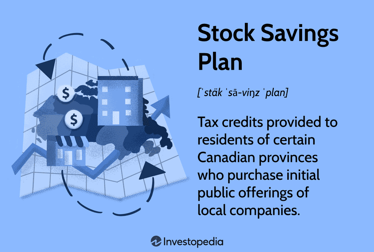

## Table of Contents

## What is a stock savings plan?

A stock savings plan is a way for people to save money by investing in stocks. It's like putting your money into a company, and as the company does well, the value of your investment can go up. People often use these plans to save for the future, like for retirement or big purchases. You can choose which companies to invest in, or you can let a professional manage your investments for you.

To start a stock savings plan, you usually need to open an account with a bank or a brokerage firm. You can then decide how much money you want to invest regularly, like every month. This money is used to buy shares of stock. Over time, as you keep adding money and the stocks grow in value, your savings can increase. It's important to remember that stocks can go up and down, so there's some risk involved, but over the long term, it can be a good way to build wealth.

## How does a stock savings plan work?

A stock savings plan works by letting you put money into stocks regularly, like every month. You open an account with a bank or a brokerage firm and decide how much money you want to invest. This money is used to buy shares of stock in different companies. As you keep adding money to your account, you buy more shares. Over time, if the companies do well, the value of your stocks can go up, increasing your savings.

It's a good way to save for the future, like for retirement or buying a house. You can choose which companies to invest in, or you can let a professional manage your investments. But remember, stocks can go up and down, so there's some risk. If the companies don't do well, the value of your stocks might go down. That's why it's important to invest regularly and think long-term, as this can help your savings grow over time.

## What are the different types of stock savings plans available?

There are a few different types of stock savings plans you can choose from. One type is a direct stock purchase plan, where you buy stocks directly from a company. This is good if you want to invest in a specific company you like. Another type is a dividend reinvestment plan (DRIP), where the dividends you earn from your stocks are automatically used to buy more shares of the same stock. This helps your investment grow over time without you having to do anything.

Another type of stock savings plan is an employee stock purchase plan (ESPP), which is offered by some companies to their employees. With an ESPP, you can buy your company's stock at a discount, which can be a good way to save money. Lastly, there are mutual funds and exchange-traded funds (ETFs), which are collections of different stocks managed by professionals. These are good if you want to spread your risk and not have to pick individual stocks yourself. Each type of plan has its own benefits, so you can choose the one that fits your goals and how much risk you're willing to take.

## What are the benefits of participating in a stock savings plan?

Participating in a stock savings plan can help you grow your money over time. When you invest regularly, you can buy more shares of stock. If the companies you invest in do well, the value of your stocks can go up. This means your savings can increase, which is great for saving for things like retirement or buying a house. Plus, if you choose a plan like a dividend reinvestment plan (DRIP), your dividends can automatically buy more shares, helping your investment grow even more without you having to do anything extra.

Another benefit is that stock savings plans can help you spread out your risk. Instead of putting all your money into one stock, you can invest in different companies or even in mutual funds and ETFs, which hold many different stocks. This way, if one company doesn't do well, it won't hurt your whole investment. Also, some plans, like employee stock purchase plans (ESPPs), let you buy stock at a discount, which can save you money. Overall, stock savings plans offer a way to save and invest for the future, with the potential for your money to grow over time.

## How can someone start a stock savings plan?

To start a stock savings plan, you need to open an account with a bank or a brokerage firm. You can do this online or by visiting a branch. Once your account is set up, you'll need to decide how much money you want to invest each month. This can be as little or as much as you feel comfortable with. After that, you can choose which stocks or funds you want to invest in. If you're not sure, you can also pick a plan where a professional manages your investments for you.

Once you've made your choices, you can set up automatic transfers from your bank account to your stock savings plan. This way, you don't have to remember to add money every month—it happens automatically. Over time, as you keep adding money and the value of your stocks grows, your savings can increase. Just remember, the stock market can go up and down, so it's important to keep investing regularly and think long-term to help your savings grow.

## What are the tax implications of stock savings plans?

When you participate in a stock savings plan, you need to think about taxes. If you make money from your stocks, like when you sell them for more than you paid or when you get dividends, you might have to pay taxes on that money. The tax you pay depends on how long you held the stocks. If you held them for less than a year, it's called short-term capital gains, and you pay taxes at your regular income tax rate. If you held them for more than a year, it's called long-term capital gains, and the tax rate is usually lower.

Some stock savings plans have special tax rules. For example, if you have an employee stock purchase plan (ESPP), you might get a discount on the stock, but you could have to pay taxes on that discount. Also, if you have a retirement account like a 401(k) or an IRA that invests in stocks, you might not have to pay taxes on your earnings until you take the money out. It's a good idea to talk to a tax professional to understand how your stock savings plan affects your taxes and to make sure you're following all the rules.

## What are the risks associated with stock savings plans?

When you put money into a stock savings plan, you take on some risks. One big risk is that the value of your stocks can go down. This can happen if the companies you invest in don't do well or if the whole stock market goes down. If you need to take your money out when the stocks are worth less than when you bought them, you could lose money. Also, if you invest all your money in just one or a few stocks, you're taking a bigger risk because if those stocks go down, it can hurt your whole investment.

Another risk is that you might not know enough about the stocks you're buying. Picking the right stocks can be hard, and if you make bad choices, your savings might not grow as much as you hoped. Even if you let a professional manage your money, they might not always pick the best stocks. It's also important to remember that while stock savings plans can help your money grow over time, they can be risky in the short term. That's why it's good to invest regularly and think long-term to help manage these risks.

## How do stock savings plans compare to other investment options?

Stock savings plans are a good way to grow your money over time, but they're not the only way to invest. One other option is putting your money into a savings account or a certificate of deposit (CD). These are safer because your money won't go down in value, but they usually don't grow as much as stocks. Savings accounts and CDs give you a small amount of interest, which can be good if you don't want to take risks, but it might not be enough to keep up with inflation or help you save a lot for the future.

Another option is investing in bonds. Bonds are like loans you give to a company or the government, and they pay you back with interest. Bonds are usually safer than stocks, but they might not grow as much. They can be a good way to balance out the risk of stocks in your investment plan. Real estate is another way to invest. Buying property can help your money grow, but it can be expensive and hard to manage. Each type of investment has its own risks and rewards, so it's important to think about what fits your goals and how much risk you're willing to take.

## What are common criticisms of stock savings plans?

Some people say that stock savings plans are too risky. They worry that the value of stocks can go up and down a lot, and if you need your money when the stocks are worth less, you could lose money. Also, [picking](/wiki/asset-class-picking) the right stocks can be hard. If you don't know enough about the companies you're investing in, you might make bad choices. Even if you let a professional manage your money, they might not always pick the best stocks. This makes some people nervous about using stock savings plans to save for the future.

Another criticism is that stock savings plans can be confusing. There are many different types of plans, like direct stock purchase plans, dividend reinvestment plans, and employee stock purchase plans. Each one has its own rules and tax implications, which can be hard to understand. Some people also feel that the fees and costs of managing a stock savings plan can eat into their savings. This makes it important to do your research and maybe talk to a financial advisor to make sure you're making the best choices for your money.

## How can one optimize their strategy within a stock savings plan?

To make the most of your stock savings plan, it's a good idea to start by setting clear goals for what you want to achieve. Are you saving for retirement, a big purchase, or something else? Knowing your goals helps you decide how much risk you're willing to take and how long you can leave your money invested. Once you have your goals, think about diversifying your investments. Instead of putting all your money into one stock, spread it out across different companies or even different types of investments like mutual funds or ETFs. This can help reduce your risk because if one investment goes down, others might still do well.

Another important part of optimizing your strategy is to invest regularly, no matter how the market is doing. This is called dollar-cost averaging, and it can help you buy more shares when prices are low and fewer when prices are high. Over time, this can lead to better returns. Also, keep an eye on fees and costs, because they can eat into your savings. Sometimes, choosing a low-cost plan or fund can make a big difference. Lastly, it's a good idea to review your plan every now and then to make sure it still fits your goals and to make any changes if needed.

## What are the historical performance trends of stock savings plans?

Stock savings plans have generally done well over the long term. If you look at the history of the stock market, you'll see that it has gone up over many years. For example, the S&P 500, which is a big group of stocks, has had an average yearly return of about 10% over the last 90 years. This means that if you kept your money in a stock savings plan for a long time, like 20 or 30 years, your savings could grow a lot. But remember, the stock market can go up and down a lot in the short term, so it's important to keep investing regularly and not take your money out when the market is down.

Even though stock savings plans have done well over time, they can still be risky. There have been times when the stock market has dropped a lot, like during the Great Depression in the 1930s or the financial crisis in 2008. If you needed to take your money out during those times, you might have lost money. But if you were able to keep your money in the market and keep investing, you could have made it back and more over time. That's why it's good to think long-term and not get too worried about short-term ups and downs.

## What regulatory considerations should be taken into account with stock savings plans?

When you start a stock savings plan, you need to think about the rules that govern it. In the United States, the Securities and Exchange Commission (SEC) is the main group that makes sure the stock market is fair and safe. They have rules about how companies can sell stocks and how people can buy them. If you're in a plan like an employee stock purchase plan (ESPP), there might be special rules from the company about when you can buy or sell the stock. It's important to read these rules carefully so you know what you can and can't do with your investments.

Also, if you're putting money into a retirement account like a 401(k) or an IRA, there are rules about how much you can put in each year and when you can take the money out. If you take money out too soon, you might have to pay extra taxes or penalties. Different countries might have different rules, so if you're investing outside the U.S., you'll need to learn about those rules too. Knowing these rules can help you make smart choices and avoid any surprises when it comes to your stock savings plan.

## References & Further Reading

[1]: Hendershott, T., Jones, C. M., & Menkveld, A. J. (2011). ["Does Algorithmic Trading Improve Liquidity?"](https://onlinelibrary.wiley.com/doi/full/10.1111/j.1540-6261.2010.01624.x) The Review of Financial Studies, 24(3), 740-780.

[2]: Brogaard, J., Hendershott, T., & Riordan, R. (2014). ["High-Frequency Trading and Price Discovery."](https://academic.oup.com/rfs/article-abstract/27/8/2267/1582754) The Review of Financial Studies, 27(3), 2267-2306.

[3]: Hasbrouck, J., & Saar, G. (2013). ["Low-latency trading."](https://www.sciencedirect.com/science/article/abs/pii/S1386418113000165) Journal of Financial Markets, 16(4), 646-679.

[4]: International Organization of Securities Commissions (IOSCO). (2011). ["Regulatory Issues Raised by the Impact of Technological Changes on Market Integrity and Efficiency."](https://www.iosco.org/library/pubdocs/pdf/IOSCOPD361.pdf)

[5]: Lopez de Prado, M. (2018). ["Advances in Financial Machine Learning."](https://www.amazon.com/Advances-Financial-Machine-Learning-Marcos/dp/1119482089) Wiley.

[6]: Aronson, D. R. (2006). ["Evidence-Based Technical Analysis: Applying the Scientific Method and Statistical Inference to Trading Signals."](https://www.amazon.com/Evidence-Based-Technical-Analysis-Scientific-Statistical/dp/0470008741) Wiley.

[7]: Chan, E. P. (2008). ["Quantitative Trading: How to Build Your Own Algorithmic Trading Business."](https://github.com/justinchou/books-quantitative-trading) Wiley.

[8]: Jansen, S. (2018). ["Machine Learning for Algorithmic Trading."](https://github.com/stefan-jansen/machine-learning-for-trading) Packt Publishing.