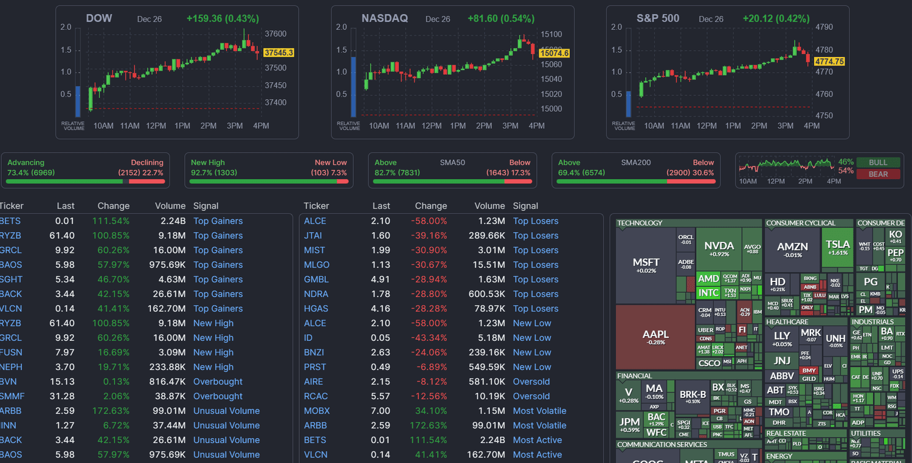

## Table of Contents

## What is a stock screener and why is it useful for investors?

A stock screener is a tool that helps investors find stocks that match certain criteria they are interested in. It's like a search engine for stocks, where you can set specific filters, like the price of the stock, how much it has grown in the past, or how much money the company makes. This way, investors can quickly narrow down the thousands of stocks available to just a few that meet their specific needs.

Using a stock screener is useful for investors because it saves a lot of time and effort. Instead of looking through lots of financial reports and data, investors can use the screener to do the hard work for them. This helps them focus on the stocks that are most likely to fit their investment goals, whether they are looking for growth, income, or stability. By using a stock screener, investors can make more informed decisions and potentially find better investment opportunities.

## How does a stock screener work to filter stocks?

A stock screener works by letting you pick what you want in a stock. You can choose things like the price of the stock, how big the company is, how fast it's growing, or how much money it makes. Once you set these choices, the screener looks through all the stocks and only shows you the ones that match what you picked. It's like using filters on a website to find exactly what you're looking for.

This tool is really helpful because it makes finding the right stocks easier. Instead of going through lots of information yourself, the screener does it for you. It helps you focus on stocks that might be good for your goals, whether you want stocks that can grow a lot, pay you money regularly, or are safe and steady. By using a stock screener, you can make smarter choices about where to put your money.

## What are the basic criteria used in stock screening?

Stock screeners use different things to help you find the right stocks. Some common things they look at are the price of the stock, how big the company is, how fast it's growing, and how much money it makes. For example, you might want to find stocks that are not too expensive, so you can set a price range. Or you might want companies that are making more money than before, so you can look at their earnings growth.

Another thing screeners look at is how much the stock's price goes up and down, which is called [volatility](/wiki/volatility-trading-strategies). If you don't like taking big risks, you might choose stocks that don't change price too much. Also, you can look at the company's financial health, like how much debt it has or how much cash it has. This helps you pick companies that are strong and less likely to have money problems.

Some people also care about where the company is located or what it does. So, you can set the screener to show only stocks from certain countries or industries. This way, you can focus on areas you know well or believe will do well in the future. By using these different criteria, you can find stocks that fit what you're looking for and make better choices about where to invest your money.

## Can you explain the difference between pre-set and custom stock screeners?

Pre-set stock screeners are ready-made filters that someone else has already set up for you. They are designed to help you find stocks based on common investment strategies, like looking for [growth stocks](/wiki/growth-stocks) or value stocks. For example, a pre-set screener might show you stocks that have grown a lot in the last year or stocks that are cheaper than similar companies. These are good if you don't want to spend time setting up your own filters or if you're new to investing and want to see what others are looking at.

Custom stock screeners, on the other hand, let you set your own rules for what you want in a stock. You can pick exactly what you're looking for, like a certain price range, a specific industry, or a certain level of earnings growth. This is helpful if you have a clear idea of what you want and you want to find stocks that match your unique goals. Custom screeners give you more control and let you tailor your search to your own investment strategy.

Both types of screeners are useful, but they serve different needs. Pre-set screeners are quick and easy, while custom screeners give you the flexibility to find exactly what you're looking for. Depending on your experience and what you're trying to achieve, you might use one or both types of screeners to help you make better investment decisions.

## What are some common financial metrics used in stock screeners?

Stock screeners use different financial numbers to help you find the right stocks. Some common ones are the Price-to-Earnings (P/E) ratio, which tells you how much you're paying for a company's earnings. If the P/E ratio is low, the stock might be a good deal. Another one is the Price-to-Book (P/B) ratio, which compares the stock's price to the company's total value. A low P/B ratio can mean the stock is undervalued. You can also look at the company's debt levels with the Debt-to-Equity ratio, which shows how much debt the company has compared to what it owns. A lower ratio means the company is less risky because it has less debt.

Other important numbers include the Earnings Per Share (EPS), which shows how much money the company makes for each share of stock. A growing EPS can mean the company is doing well. The Dividend Yield tells you how much money you get back from the stock in dividends, which is good if you want regular income. Also, the Return on Equity (ROE) shows how well the company is using the money shareholders have invested. A high ROE means the company is making good use of that money. These financial metrics help you pick stocks that match what you're looking for, whether it's growth, value, or safety.

## How can beginners use stock screeners to start investing?

Beginners can use stock screeners to start investing by first figuring out what they want from their investments. Do they want to grow their money quickly, get regular income, or just keep their money safe? Once they know this, they can use a stock screener to look for stocks that match their goals. For example, if they want to grow their money, they can set the screener to find stocks with high earnings growth. If they're new to investing, they might start with pre-set screeners that are already set up for common investment strategies like growth or value investing.

After setting up the screener, beginners should look at the list of stocks it gives them. They can then learn more about these companies by reading their financial reports or news articles. It's important to not just rely on the screener but to do their own research too. This way, they can understand why a stock might be a good choice. Over time, as they get more comfortable, they can start using custom screeners to set their own specific criteria, like looking for companies in certain industries or with certain financial metrics. This helps them make smarter choices and build a portfolio that fits their goals.

## What are the limitations of using stock screeners?

Stock screeners are helpful, but they have some limits. They only look at numbers and data, so they can't tell you about things like the company's leaders, new laws, or big world events that might affect the stock. These things can be really important for deciding if a stock is a good choice. Also, screeners can give you a lot of information, but sometimes it can be hard to know if it's all correct or up-to-date. This means you might need to do more research to make sure the numbers are right.

Another thing to think about is that stock screeners can't see into the future. They use past and present data, but they can't predict what will happen next. This means you might miss out on stocks that are about to do really well or pick stocks that seem good now but won't be later. So, while screeners are a great tool to start with, it's important to use them along with other research and maybe even talk to a financial advisor to get the full picture.

## How do advanced users customize stock screeners for specific investment strategies?

Advanced users can customize stock screeners to fit their specific investment strategies by setting up detailed criteria that match their goals. For example, if they're looking for value stocks, they might set the screener to find companies with low Price-to-Earnings (P/E) ratios and high Dividend Yields. They can also look for stocks in certain industries or countries that they believe will do well. By using these specific filters, they can narrow down the list of stocks to ones that fit their strategy perfectly. This helps them focus on the stocks that are most likely to meet their investment goals.

Additionally, advanced users often combine multiple financial metrics to get a clearer picture of a stock's potential. They might look at the company's growth rates, debt levels, and profitability all at once to find stocks that are strong in many areas. They can also save these custom settings so they can quickly use them again later. This way, they can keep track of how their chosen stocks are doing over time and make changes to their strategy as needed. By using custom stock screeners, advanced users can make more informed decisions and potentially find better investment opportunities.

## Can you provide examples of stock screeners available online and their unique features?

Some popular stock screeners available online include Finviz, Zacks, and Morningstar. Finviz is known for its user-friendly interface and offers both pre-set and custom screeners. It's great for beginners because it has a lot of free tools, including charts and financial data. One unique feature of Finviz is its heat maps, which show how different stocks and sectors are doing at a glance. Zacks is another well-known screener that focuses on earnings estimates and analyst recommendations. It's popular among investors who want to find stocks based on what experts think. Zacks also offers a lot of research reports and tools to help you understand why a stock might be a good choice. Morningstar is famous for its detailed stock analysis and ratings. It's a bit more advanced and is good for people who want to dive deep into a company's financials. One cool thing about Morningstar is its "Moat" rating, which tells you how strong a company's competitive advantage is.

Each of these stock screeners has its own strengths. Finviz is great for people who want a simple, easy-to-use tool with lots of free features. Its heat maps are a fun way to see market trends quickly. Zacks is perfect for those who care a lot about what analysts think and want detailed earnings data. It's a bit more focused on professional insights, which can be helpful for making informed decisions. Morningstar, on the other hand, is ideal for investors who want to do a lot of research and understand a company's long-term potential. Its Moat rating helps you see which companies are likely to stay strong over time. By choosing the right screener, investors can find the tools that best fit their needs and help them make smarter investment choices.

## How do stock screeners integrate with other investment tools and platforms?

Stock screeners often work well with other investment tools and platforms, making it easier for investors to manage their portfolios. For example, many screeners can be linked to trading platforms like E*TRADE or TD Ameritrade. This means you can find stocks using the screener and then buy them directly through the trading platform without having to switch between different websites or apps. Some screeners also connect with financial news sites or research tools, so you can quickly get more information about the stocks you're interested in. This helps you make better decisions by having all the information you need in one place.

Another way stock screeners integrate with other tools is through data analysis software. For instance, screeners might work with programs like Excel or specialized financial analysis tools to help you do more detailed research. You can take the data from the screener and use it to create charts, run calculations, or even build custom models to predict how stocks might perform. This can be really useful for advanced investors who want to dig deeper into the numbers. By combining screeners with these other tools, investors can get a fuller picture of their investment options and make smarter choices.

## What role does artificial intelligence play in modern stock screeners?

Artificial intelligence (AI) is making stock screeners smarter and more useful. AI can look at huge amounts of data really fast and find patterns that people might miss. This means stock screeners can now give you better suggestions for stocks by thinking about more things at once. For example, AI can look at news articles, social media, and financial reports to see how people feel about a company. This can help predict if the stock price might go up or down.

AI also helps stock screeners learn from what they see. Over time, the screener can get better at [picking](/wiki/asset-class-picking) stocks that do well because it remembers what worked before. This is called machine learning. It's like the screener is getting smarter the more it's used. This can make it easier for investors to find good stocks without having to do all the work themselves. By using AI, stock screeners can give you more accurate and helpful information to make your investing decisions easier.

## How can expert investors use stock screeners to analyze market trends and sector performance?

Expert investors can use stock screeners to analyze market trends and sector performance by setting up specific filters that focus on different industries or market segments. For example, they might want to see how tech stocks are doing compared to energy stocks. By using a screener, they can quickly get a list of stocks in each sector and look at their performance over time. This helps them see which sectors are growing and which ones are struggling. They can also set the screener to show stocks that are moving a lot, which can help them spot trends or changes in the market.

By combining the data from the stock screener with other tools like charts and financial news, expert investors can get a fuller picture of what's happening in the market. They can see if a sector is doing well because of new technology, government policies, or other big changes. This information helps them make smarter choices about where to invest their money. By keeping an eye on these trends and sector performance, expert investors can adjust their strategies to take advantage of the best opportunities in the market.

## What is the Role of Financial Analysis in Investing?

Financial analysis is a crucial component in the investment decision-making process, enabling investors to make well-informed choices by evaluating the financial data of various entities. This analysis is divided into two main types: qualitative and quantitative. Both types provide a comprehensive understanding of a company's financial status, performance, and future prospects.

Quantitative financial analysis predominantly focuses on numerical data derived from financial statements such as income statements, balance sheets, and cash flow statements. This analysis involves calculating and interpreting various financial ratios that offer insights into a company’s operations. Common quantitative measures include profitability ratios like return on equity (ROE) and profit margins, [liquidity](/wiki/liquidity-risk-premium) ratios such as current ratio and quick ratio, and solvency ratios like debt to equity ratio.

For example, the return on equity is calculated using the formula:

$$
\text{Return on Equity (ROE)} = \frac{\text{Net Income}}{\text{Shareholder's Equity}}
$$

This ratio measures the ability of a firm to generate profits from its shareholders' investments, indicating financial efficiency and profitability.

Qualitative analysis, on the other hand, involves evaluating non-quantifiable aspects of a company such as management expertise, brand value, industry conditions, and regulatory environment. These elements provide a broader perspective on the factors that can impact the company's long-term sustainability and competitive advantage. For instance, a well-regarded management team may substantially enhance investor confidence, even in the absence of immediate quantitative indicators of success.

By conducting a comprehensive financial analysis that integrates both qualitative and quantitative aspects, investors can assess the financial health of a company. This helps in predicting future performance, understanding market position, identifying strengths and weaknesses, and ultimately making more informed investment decisions. Effective financial analysis not only aids in appraising individual stocks but also contributes to developing strategies that optimize portfolio performance.

## What is the future of market engagement in relation to algorithmic trading?

Algorithmic trading, or 'algo trading', leverages advanced computer algorithms to execute trades based on a predetermined set of instructions. This form of trading aims to identify and capitalize on market opportunities at speeds unattainable by human traders, thereby optimizing trade execution. The core advantage of [algorithmic trading](/wiki/algorithmic-trading) lies in its ability to minimize human error and emotions that can often skew investment decisions. By automating the trading process, it ensures consistency and objectivity in executing trades.

The algorithms used in trading are designed to assess multiple market variables simultaneously, making decisions in fractions of a second. Parameters often include timing, price, and [volume](/wiki/volume-trading-strategy), with sophisticated algorithms factoring in historical data, technical indicators, or even market sentiment derived from news analytics. Strategies deployed through algorithmic trading can range from simple moving averages to more complex models incorporating neural networks and [machine learning](/wiki/machine-learning).

One popular algorithmic trading strategy involves the use of moving averages. For example, a simple moving average (SMA) crossover strategy could involve two SMAs of different periods. A buy signal might be triggered when a short-term SMA crosses above a long-term SMA, with the formula for a simple moving average being:

$$
\text{SMA} = \frac{P_1 + P_2 + \cdots + P_n}{n}
$$

Where $P$ represents the price at each period, and $n$ is the number of periods.

The increasing volumes of trades in highly competitive markets necessitate swift execution, which is another forte of algorithmic trading. By integrating high-frequency trading ([HFT](/wiki/high-frequency-trading-strategies)), algorithms can process and execute large volumes of trades in milliseconds, capitalizing on narrow market windows that might close before a human can react.

Python has emerged as a preferred language for implementing algorithmic trading strategies due to its versatility and extensive libraries. Libraries such as NumPy, pandas, and TA-Lib provide tools for data manipulation and technical analysis, while libraries such as Zipline and PyAlgoTrade offer frameworks for [backtesting](/wiki/backtesting) strategies.

Here's a simple example of using Python to calculate a moving average:

```python
import pandas as pd

# Assuming 'data' is a DataFrame with a 'close' column representing closing prices
data['SMA'] = data['close'].rolling(window=20).mean()
```

Investors increasingly adopt algorithmic trading to handle extensive volumes of trades, as it offers a competitive edge in terms of speed and precision. This trend is projected to continue as advancements in technology and data analytics further enhance the capabilities of algorithmic trading systems. By enabling strategic automation, algorithmic trading represents a critical component in modern market engagement, facilitating efficient and effective trade execution in today's highly dynamic financial markets.

## How can investment tools be integrated into modern strategies?

Combining various investment tools yields significant benefits by enhancing the effectiveness of investment strategies. The integration of stock screeners, financial analysis tools, and algorithmic trading creates a holistic approach for investors seeking tailored strategies. By leveraging these tools, investors can make more informed decisions, adjust swiftly to market changes, and fine-tune their portfolios for optimal performance.

Stock screeners allow investors to filter stocks based on specific criteria such as market capitalization, price-to-earnings ratio, and dividend yield. This capability simplifies the process of identifying stocks that fit a particular investment thesis. When used in conjunction with financial analysis tools, these screeners become more powerful. Financial analysis offers deeper insights into a company's financial health through data about earnings, cash flow, and balance sheets. 

For instance, financial ratios such as the current ratio and return on equity can be calculated using:

$$
\text{Current Ratio} = \frac{\text{Current Assets}}{\text{Current Liabilities}}
$$

$$
\text{Return on Equity (ROE)} = \frac{\text{Net Income}}{\text{Shareholder's Equity}}
$$

These metrics and similar ones are crucial for evaluating the fundamental strength of companies identified through stock screening.

Algorithmic trading, or 'algo trading', brings a level of precision and speed that human traders cannot match. By executing trades based on algorithms that process large datasets, investors can capitalize on market opportunities faster. Python, for example, is commonly used to develop such algorithms:

```python
import pandas as pd
import numpy as np

# Example of a simple moving average crossover strategy
def moving_average_cross_strategy(data, short_window=10, long_window=50):
    signals = pd.DataFrame(index=data.index)
    signals['signal'] = 0.0

    # Short moving average
    signals['short_mavg'] = data['Close'].rolling(window=short_window, min_periods=1).mean()

    # Long moving average
    signals['long_mavg'] = data['Close'].rolling(window=long_window, min_periods=1).mean()

    # Generating signals
    signals['signal'][short_window:] = np.where(
        signals['short_mavg'][short_window:] > signals['long_mavg'][short_window:], 1.0, 0.0)

    # Generating trading orders
    signals['positions'] = signals['signal'].diff()

    return signals
```

Integrating stock screeners, financial analysis, and algorithmic trading provides investors distinct advantages. These tools offer a synchronized mechanism for monitoring, analyzing, and acting on market information, making strategies more dynamic and responsive. In a rapidly changing market, the synergy between these tools not only supports better decision-making but also offers a competitive edge by enabling investors to adapt their strategies swiftly in response to new opportunities.

## References & Further Reading

[1]: Bergstra, J., Bardenet, R., Bengio, Y., & Kégl, B. (2011). ["Algorithms for Hyper-Parameter Optimization."](https://dl.acm.org/doi/10.5555/2986459.2986743) Advances in Neural Information Processing Systems 24.

[2]: ["Advances in Financial Machine Learning"](https://www.amazon.com/Advances-Financial-Machine-Learning-Marcos/dp/1119482089) by Marcos Lopez de Prado

[3]: ["Evidence-Based Technical Analysis: Applying the Scientific Method and Statistical Inference to Trading Signals"](https://www.amazon.com/Evidence-Based-Technical-Analysis-Scientific-Statistical/dp/0470008741) by David Aronson

[4]: ["Machine Learning for Algorithmic Trading"](https://github.com/stefan-jansen/machine-learning-for-trading) by Stefan Jansen

[5]: ["Quantitative Trading: How to Build Your Own Algorithmic Trading Business"](https://www.amazon.com/Quantitative-Trading-Build-Algorithmic-Business/dp/1119800064) by Ernest P. Chan