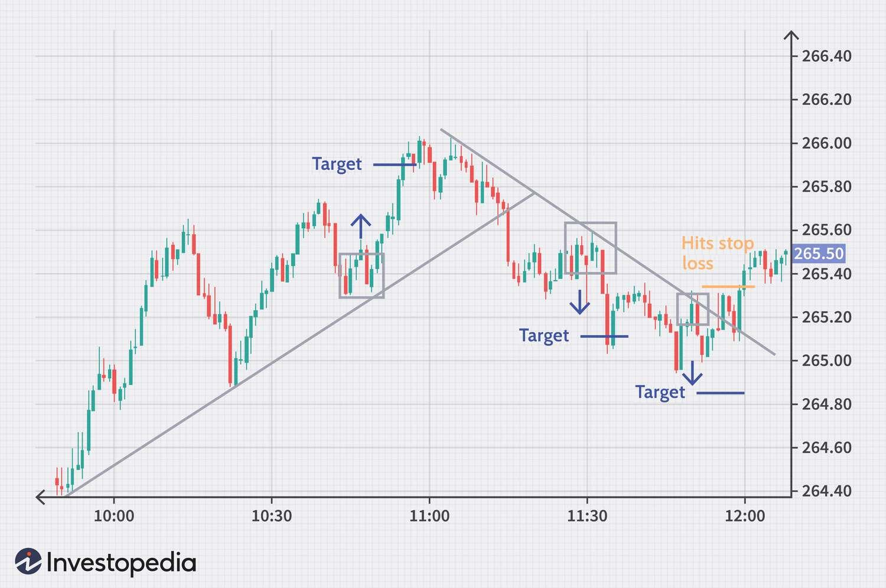

In the dynamic and ever-evolving landscape of stock markets, investors continually seek effective strategies to enhance their returns. The intersection of investment strategies, stock selection, day trading, and algorithmic trading represents a comprehensive approach to navigating these markets. Understanding and leveraging these elements can significantly improve the potential for financial success.

Investment strategies provide a structured framework for making informed decisions about where and when to allocate capital. These strategies, tailored to various investor goals—whether for growth, income, diversification, or risk management—serve as the foundation of a robust trading approach. Stock selection, informed by thorough fundamental and technical analyses, guides investors in choosing appropriate securities that align with their strategies.



As market participants strive for better results, day trading emerges as a high-risk, high-reward approach focused on short-term gains. It necessitates a keen awareness of market liquidity and volatility—critical factors in executing profitable trades within a single trading day. Day traders rely heavily on accurate and timely information to capitalize on transient market movements.

Complementing these traditional techniques is algorithmic or algo trading—an increasingly prevalent method in modern investment practices, enabled by the rise of sophisticated technology. Algorithmic trading utilizes complex algorithms to execute trades at speeds and efficiencies beyond human capability, often reducing the influence of emotional biases. This precision makes it possible to implement strategies such as trend-following, mean-reversion, or statistical arbitrage with greater accuracy.

The aim of this article is to explore the various strategies and tools investors can utilize to optimize their trading efforts, whether through the adoption of traditional methods or the integration of cutting-edge technological solutions. By understanding these approaches and the synergies they create, investors can better position themselves to maximize potential returns in a fast-paced and unpredictable market environment.

## Table of Contents

## Understanding Investment Strategies

Investment strategies in the stock market are systematic plans tailored to achieve specific financial goals. These strategies are essential for navigating the complexities of investing, enabling investors to make informed decisions while managing risks. Generally, investment strategies are categorized based on investor objectives, which can include growth, income, diversification, or risk management.

**Growth Strategies** aim to increase an investor's capital over time. This can be achieved by investing in stocks of companies that exhibit signs of above-average growth, even if the share prices appear high in terms of traditional metrics such as price-to-earnings ratios. Growth investors prioritize capital appreciation, often accepting greater short-term risks in pursuit of higher long-term rewards.

**Income Strategies** are designed to generate regular earnings from the stock investments, typically through dividends. Investors focusing on income look for stocks that provide consistent dividend payments, favoring companies with a stable earnings history. This approach is often attractive to retirees or those seeking a steady cash flow from their investments.

**Diversification** involves spreading investments across a variety of assets to reduce risk. By holding a wide range of stocks in different sectors or geographical regions, investors can minimize the impact of a poor performance in a single area. Diversifying can buffer against volatility and protect the portfolio from significant downturns, making it a fundamental risk management practice.

**Risk Management Strategies** are crucial for protecting investments from significant losses. These strategies might include setting stop-loss orders, which sell a stock when it falls to a certain price, or using options and futures to hedge against market fluctuations. Investors with a strong focus on risk management often prioritize capital preservation, implementing methods to mitigate potential losses.

In the modern trading environment, these strategies are vital due to increased market [volatility](/wiki/volatility-trading-strategies) and the rapid pace of financial developments. The integration of technology in trading has broadened access to a wealth of analytical tools and data, enabling investors to adapt and enhance traditional investment strategies. Moreover, the global interconnectedness of markets means that diversification and risk management techniques are more critical than ever, as investors seek to navigate an increasingly complex financial landscape. 

By employing a well-considered blend of these strategies, investors can better position themselves to achieve their financial goals while adapting to the challenges of today’s dynamic markets. Continuous assessment and adjustment of strategies are necessary, considering the ever-evolving market conditions and the advent of new technologies.

## Stock Selection Techniques

In selecting stocks for investment or trading, investors must navigate a multifaceted landscape. Key factors to consider include a comprehensive evaluation through both fundamental and technical analysis, which provide valuable insights into a stock's potential performance and market behavior.

Fundamental analysis involves examining a company's financial health, requiring attention to key metrics such as earnings, revenue, profit margins, and debt levels. An examination of these financial statements helps in assessing the intrinsic value of a stock. Additionally, qualitative aspects such as management competence, industry position, and economic conditions are crucial. For example, a common metric is the Price-to-Earnings (P/E) ratio, which is calculated as:

$$
\text{P/E ratio} = \frac{\text{Market Value per Share}}{\text{Earnings per Share (EPS)}}
$$

A lower P/E might indicate undervaluation, while a higher P/E might suggest overvaluation, although interpretations can vary with industry and market conditions.

Technical analysis, in contrast, focuses on statistical trends from trading activity like price movement and [volume](/wiki/volume-trading-strategy). This involves chart patterns, indicators, and oscillators. Tools such as moving averages (e.g., 50-day and 200-day moving averages) and Relative Strength Index (RSI) are commonly employed to predict future price movements. For a simple moving average in Python:

```python
def simple_moving_average(prices, window_size):
    return prices.rolling(window=window_size).mean()
```

Building a robust stock portfolio also necessitates attention to [liquidity](/wiki/liquidity-risk-premium), trading volumes, and market trends. Liquidity ensures that stocks can be bought or sold without causing significant price changes, an important aspect for both stability and flexibility in trading strategies. A high Average Daily Trading Volume (ADTV) often reflects greater liquidity.

Furthermore, market trends help in aligning stock choices with broader economic cycles, like growth or recession phases, which influence stock performance. Investors opting for a diversified portfolio can mitigate risks by spreading investments across various sectors and industries, thus safeguarding against market volatility.

Overall, successful stock selection is a balance of meticulous analysis and strategic foresight, enabling investors to optimize their portfolios for long-term gains and stability.

## The Basics of Day Trading

Day trading is a short-term trading strategy where financial instruments such as stocks, commodities, or currencies are bought and sold within the same trading day. The primary characteristic of [day trading](/wiki/day-trading-spy) is that all positions are closed before the market closes, avoiding overnight exposure and the associated risks.

Key benefits of day trading include the ability to capitalize on small price movements and immediate realization of profits. Day traders often employ leverage, amplifying their potential gains. This type of trading allows for high-frequency engagement with the market, potentially leading to rapid accumulation of profits given successful strategies and market conditions. Furthermore, day traders can react swiftly to news and events, taking advantage of market volatility.

However, day trading is accompanied by significant risks. The necessity for quick decision-making and constant monitoring can lead to stress and burnout for traders. The high leverage frequently used, while offering the potential for greater profits, also amplifies losses, sometimes leading to substantial financial damage. The competitive nature of day trading, where individual traders are pitted against institutional traders equipped with sophisticated tools, also heightens the risk factors.

The success of day trading heavily depends on market liquidity and volatility. Liquidity refers to the ease with which a security can be bought or sold without affecting its price. High liquidity ensures tight bid-ask spreads and the ability to enter and [exit](/wiki/exit-strategy) positions quickly, which is crucial for day traders looking to execute multiple trades in a short period. Volatility, defined as the rate at which the price of a security increases or decreases for a given set of returns, is equally important. It presents opportunities for profit through notable price changes during the day. Successful day traders often look for markets with optimal levels of both liquidity and volatility to ensure a conducive environment for trading.

In conclusion, while day trading offers substantial opportunities for profit, it is inherently risky and requires a comprehensive understanding of market dynamics, keen analytical skills, and emotional discipline to navigate both the benefits and the challenges effectively.

## Algorithmic Trading: A Modern Approach

Algorithmic trading, often referred to as algo trading, involves the use of computer programs to execute trading strategies based on pre-defined criteria. Its growing popularity can be attributed to the technological advancements that enable traders to automate the decision-making process, allowing for faster and more efficient market transactions.

**Definition and Explanation**

Algorithmic trading leverages complex algorithms to analyze market data and execute orders at speeds and frequencies that are impossible for human traders. By employing these algorithms, traders can capitalize on micro-trends and fleeting market inefficiencies, making algo trading a distinct advantage in financial markets. The system triggers trades based on particular signals derived from technical analysis, statistical models, or other quantitative analyses.

**Benefits of Algo Trading**

One of the primary benefits of [algorithmic trading](/wiki/algorithmic-trading) is its ability to execute trades with speed and precision. Algorithms can process vast amounts of data and execute orders within milliseconds, providing a significant edge in dynamic markets where timing is crucial. Additionally, algo trading eliminates the emotional biases that often plague human traders. By adhering to strict, predefined rules, algorithms can mitigate the impact of fear, greed, and other emotional responses on trading decisions.

Here are some key benefits:

1. **Speed**: Algorithms can scan and react to market conditions much faster than humans, executing trades in milliseconds.
2. **Precision**: By following predefined rules, algo trading ensures consistent execution, minimizing errors and slippage.
3. **Emotion Elimination**: Trading decisions are made based on data and logic rather than human emotions, reducing errors caused by psychological factors.

**Common Algorithmic Strategies**

Several strategies are commonly employed in algorithmic trading, each with its unique approach and objectives:

- **Trend-following**: This strategy aims to capitalize on the momentum of stock prices by identifying and following existing market trends. The underlying assumption is that prices that are moving in a specific direction will continue to do so until reversed.

$$
\text{Trading Signal} = \frac{(P_t - P_{t-1})}{P_{t-1}}
$$

Where $P_t$ is the current price and $P_{t-1}$ is the previous price.

- **Mean-reversion**: This strategy is based on the concept that asset prices tend to revert to their mean or average level over time. Traders identify stocks that deviate significantly from their historical average and bet on their reversal to the mean.

$$
\text{Trading Signal} = P_t - \bar{P}
$$

Where $\bar{P}$ is the average price over a certain time period.

- **Statistical arbitrage**: This strategy involves identifying price inefficiencies between related financial instruments and executing offsetting trades to profit from the discrepancy. It requires advanced statistical methods to detect and capitalize on short-lived price differences.

Python code snippet for a simple moving average cross-over strategy:

```python
import pandas as pd

def execute_trade(prices, short_window=40, long_window=100):
    signals = pd.DataFrame(index=prices.index)
    signals['price'] = prices
    signals['short_mavg'] = prices.rolling(window=short_window, min_periods=1).mean()
    signals['long_mavg'] = prices.rolling(window=long_window, min_periods=1).mean()
    signals['signal'] = 0.0

    # Generate trading signals: buy (1) or sell (0)
    signals['signal'][short_window:] = np.where(signals['short_mavg'][short_window:] > signals['long_mavg'][short_window:], 1.0, 0.0)   

    # Calculate trading orders
    signals['positions'] = signals['signal'].diff()

    return signals

# Example usage
prices = pd.Series([100, 101, 102, 103, 102, 98, 97, 96, 95, 100])
print(execute_trade(prices))
```

Algorithmic trading continues to evolve, integrating more sophisticated strategies and technologies to adapt to the dynamic nature of financial markets. Its precision and speed make it an indispensable tool for modern traders looking to optimize their trading performance.

## Capitalizing on Advanced Trading Platforms

Popular trading platforms play a crucial role in both manual and algorithmic trading by providing the necessary tools, data, and execution capabilities that traders need to succeed. These platforms not only facilitate trade execution but also offer analytical tools and real-time data streams essential for informed decision-making.

Prominent trading platforms like MetaTrader, [Interactive Brokers](/wiki/interactive-brokers-api), and Thinkorswim are favored for their robust features. MetaTrader, for example, is renowned for its customizable charts and technical analysis tools, making it suitable for manual trading strategies. CTrader offers similar capabilities along with advanced risk management features. Interactive Brokers stands out with its comprehensive offerings for both professional traders and institutions, supporting a wide array of asset classes, including stocks, options, futures, and bonds. Thinkorswim, provided by TD Ameritrade, is particularly popular with retail traders for its intuitive interface and educational resources.

The role of data in algorithmic trading cannot be understated. Access to real-time market data allows algorithms to monitor market conditions, identify trading opportunities, and execute trades with precision. Data feeds from providers such as Bloomberg or Reuters enable traders to have up-to-the-second information, which is vital for strategies like high-frequency trading where latency can be detrimental. Trading platforms like QuantConnect and Alpaca offer APIs and integrated environments for developing and testing trading algorithms using real-time and historical data, appealing to developers and quantitative traders.

Selecting the appropriate trading tools and platforms is paramount for traders to align with their specific strategies. For manual traders, ease of use, charting capabilities, and educational resources might be priorities. Conversely, for algorithmic traders, platforms providing robust APIs, high-quality data, and low-latency execution will be critical. Platforms like MetaTrader offer a scripting language, MQL, for developing custom indicators and trading strategies, which is invaluable for technical analysts seeking to automate their systems.

In conclusion, the choice of trading platforms and tools can significantly impact trading efficiency and success. By leveraging platforms with the right features and data access, traders can enhance their strategic capabilities, whether engaging in manual or algorithmic trading.

## Risk Management and Psychological Considerations

Effective risk management is crucial in high-frequency trading ([HFT](/wiki/high-frequency-trading-strategies)) and day trading activities, given the inherent volatility and rapid pace at which trades occur. A well-structured risk management strategy ensures that traders can navigate these turbulent market conditions while safeguarding their capital from precipitous losses. The primary objective is to limit the downside risk and maximize the potential for positive returns.

**Importance of Risk Management Strategies**

In high-frequency and day trading, the sheer volume of transactions magnifies the impact of any adverse movements in the market. Traders employ various strategies to mitigate risk, including setting strict stop-loss orders, which automatically execute a sell order when a security reaches a certain price. This mechanism prevents further losses beyond a predetermined threshold.

Position sizing is another vital component, wherein traders determine the amount of capital to allocate to each trade based on their risk tolerance. The formula often used is:

$$
\text{Position Size} = \frac{\text{Risk Capital} \times \text{Risk Per Trade (\%)}}{\text{Trade Risk (points)}}
$$

For example, if a trader has $10,000 risk capital and is willing to risk 2% per trade, with a trade risk of 5 points, the position size would be:

$$
\text{Position Size} = \frac{10,000 \times 0.02}{5} = 40
$$

This calculation ensures that no single trade can significantly affect the overall portfolio.

**Psychological Challenges and Stress Management**

Traders face immense psychological pressure due to the fast-paced nature of the markets. Emotions such as fear and greed can lead to impulsive decisions, deviating from defined trading plans. To manage stress and maintain psychological equilibrium, traders often employ techniques such as meditation and breathing exercises to improve focus and reduce anxiety.

Maintaining a trading journal is a recommended practice, enabling traders to document their trades, assess their performance, and refine their strategies over time. This habit allows them to learn from past mistakes and develop greater confidence in their decision-making processes.

**Maintaining Emotional Discipline and Following Strategies**

Adhering to predefined strategies is essential for sustained success in trading. Emotional discipline involves resisting the temptation to deviate from established plans based on short-term market fluctuations or external noise. Traders often set rules for entry and exit based on technical indicators or predefined financial metrics, ensuring that decisions are made based on logic rather than emotion.

Moreover, algorithmic trading systems are increasingly used to enforce discipline by executing trades according to pre-programmed criteria. This approach minimizes the risk of human error and emotional interference.

In summary, successful risk management in high-frequency and day trading requires a comprehensive approach that addresses both the quantitative and psychological aspects of trading. By implementing robust risk controls, managing stress, and maintaining emotional discipline, traders can enhance their resilience in navigating the complexities of modern financial markets.

## Future Trends in Stock Trading

Emerging trends and technologies in stock trading are reshaping the landscape for investors and traders alike. A critical development is the increased reliance on [artificial intelligence](/wiki/ai-artificial-intelligence) (AI) and [machine learning](/wiki/machine-learning) (ML) in algorithmic trading strategies. AI and ML have the capability to process and analyze vast datasets much faster than human analysts, leading to more informed trading decisions. These technologies can identify patterns, develop predictive models, and even automate the execution of trades without human intervention.

The benefits of AI in algorithmic trading include improved risk management through precise forecast models and the ability to backtest strategies against historical data. Machine learning algorithms are particularly adept at identifying non-linear relationships within data that traditional statistical models might overlook. For example, neural networks, a popular ML model, are used to build complex multi-layered structures capable of modeling intricate market behaviors. A basic Python implementation might resemble the following:

```python
from sklearn.neural_network import MLPRegressor

# Sample data: X as feature set, y as target variable
X = [[0.5, 0.2], [1.1, 0.5], [0.3, 0.8], [0.7, 0.1]]
y = [1.2, 3.4, 2.3, 4.5]

# Initialize and train the neural network
nn_model = MLPRegressor(hidden_layer_sizes=(10, 10), max_iter=1000)
nn_model.fit(X, y)

# Predicting new data
predictions = nn_model.predict([[0.6, 0.4]])
```

Furthermore, the democratization of stock trading platforms is transforming retail trading. Through advanced trading apps and platforms, individual investors have unprecedented access to tools and data once reserved for institutional investors. This shift is driven by lowered commissions, user-friendly interfaces, and educational resources that empower traders to make data-driven decisions. Moreover, fractional shares allow investors with limited capital to own parts of high-value stocks, thus broadening participation in the stock market.

As AI and ML algorithms continue to evolve, the integration of these systems with retail trading platforms could lead to hyper-personalized trading strategies tailored to individual risk profiles and investment goals. The potential synergy between technology and finance invites a new era where both novices and seasoned traders can leverage sophisticated resources to enhance their trading performance.

## Conclusion

In this article, we have explored a variety of strategies and tools that investors can use to enhance their trading efforts. The dynamic landscape of stock markets calls for a comprehensive approach that combines investment strategies, stock selection, day trading, and algorithmic trading. As technology continues to advance, it becomes crucial for traders to stay informed and adapt to rapid changes within the market.

The significance of continuous learning cannot be overstated. Traders who actively engage in updating their knowledge and skills are better positioned to seize opportunities and mitigate risks. Whether through traditional methods or modern algorithmic tools, the ability to adjust and refine strategies is essential. By embracing both fundamental and technical analyses, along with leveraging advanced trading platforms, investors can create robust portfolios tailored to their individual goals.

Moreover, understanding risk management and psychological resilience is vital. Maintaining emotional discipline and adhering to defined strategies can help traders navigate the inherent uncertainties of stock trading. As we look to the future, embracing emerging technologies such as AI and machine learning holds promise for further optimizing trading strategies. Encouragingly, the democratization of access to advanced trading tools enables retail traders to participate actively and effectively in the markets.

In conclusion, the successful trader is one who continuously evolves, incorporating both time-tested methodologies and cutting-edge innovations to refine their approach and adapt to ever-changing market conditions.

## References & Further Reading

[1]: Bergstra, J., Bardenet, R., Bengio, Y., & Kégl, B. (2011). ["Algorithms for Hyper-Parameter Optimization."](https://dl.acm.org/doi/10.5555/2986459.2986743) Advances in Neural Information Processing Systems 24.

[2]: ["Advances in Financial Machine Learning"](https://www.amazon.com/Advances-Financial-Machine-Learning-Marcos/dp/1119482089) by Marcos Lopez de Prado

[3]: ["Evidence-Based Technical Analysis: Applying the Scientific Method and Statistical Inference to Trading Signals"](https://www.amazon.com/Evidence-Based-Technical-Analysis-Scientific-Statistical/dp/0470008741) by David Aronson

[4]: ["Machine Learning for Algorithmic Trading"](https://github.com/stefan-jansen/machine-learning-for-trading) by Stefan Jansen

[5]: ["Quantitative Trading: How to Build Your Own Algorithmic Trading Business"](https://www.amazon.com/Quantitative-Trading-Build-Algorithmic-Business/dp/1119800064) by Ernest P. Chan