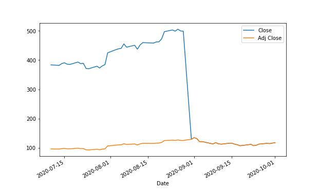

Algorithmic trading, a transformative force in the financial industry, employs sophisticated algorithms to execute trades with remarkable speed and precision. Central to this technological advancement is the utilization of historical data, which serves as the backbone for modeling and executing trading strategies. However, the integrity of this data is often impacted by corporate actions, among which stock splits are notable.

A stock split is a corporate action wherein a company decides to increase or decrease its number of shares, thereby adjusting the share price proportionally. This does not alter the company’s overall market capitalization but has implications for liquidity as well as investor perception. For instance, in a forward stock split, a company might perform a 2-for-1 split, doubling its shares and halving the price per share. Conversely, a reverse stock split might consolidate shares, reducing their number but increasing the price per share correspondingly. The mechanics of stock splits are critical, as they impact not only the liquidity of the stock but also how it is perceived by the market. 



The accurate adjustment of historical stock prices to account for such splits is essential for the development of robust trading algorithms. Ignoring these adjustments can lead to misinterpretations of price movements and trends, resulting in potentially flawed trading models. Therefore, effective algorithmic trading systems must integrate adjusted stock prices to ensure the consistency and accuracy of the data being analyzed. Ensuring that historical data accurately reflects corporate actions allows for the development of trading algorithms capable of interpreting true market behavior and generating reliable predictions.

This article will examine stock splits, their effects on share prices, and the implications for algorithmic trading. By understanding these elements, traders and investors can enhance their trading strategies, ensuring they are based on historical data that maintains its relevance and accuracy despite corporate actions.

## Table of Contents

## Understanding Stock Splits

Stock splits are a common corporate action where a company increases its number of outstanding shares by issuing additional shares to its existing shareholders. This process effectively reduces the price of each share without altering the market capitalization of the company. The fundamental objective of a stock split is to enhance the stock's liquidity and make it more accessible to a wider range of investors. A lower per-share price can attract more retail investors who might find the stock more affordable, potentially increasing the stock's trading volume.

There are different types of stock splits, each affecting the stock's price and the shareholder's equity differently:

1. **Forward Stock Split**: This is the most prevalent type of stock split. It involves dividing each existing share into multiple new shares. For example, in a 2-for-1 stock split, each share is split into two shares. If a company has 1 million shares outstanding and performs a 2-for-1 split, it will then have 2 million shares outstanding. Consequently, while the number of shares doubles, the price per share is halved, leaving the overall value of an investor's holdings unchanged.
$$
   \text{New share price} = \frac{\text{Original share price}}{\text{Split ratio}}

$$

2. **Reverse Stock Split**: This occurs when a company reduces its number of outstanding shares, consequently increasing the share price. A reverse split can be used by companies to bolster a sagging stock price or to meet minimum price requirements for stock exchanges. For instance, in a 1-for-2 reverse split, every two shares are converted into a single share. This action halves the number of shares outstanding and doubles the share price.
$$
   \text{New share price} = \text{Original share price} \times \text{Reverse split ratio}

$$

3. **Fractional Stock Split**: Although less common, fractional splits allow for non-integer adjustments in share quantity. These splits may be used to adjust share quantities for complex financial restructuring or mergers and acquisitions where fractional ownership solutions are required.

Understanding stock splits is crucial for investors, as they can impact market behavior and investment strategies. While the intrinsic value of the company remains unchanged immediately after the split, the newly adjusted lower share price often creates a perception of increased affordability among investors, which can lead to short-term price movements based on market sentiment. Moreover, historical stock prices are adjusted to reflect splits, ensuring that any analyses or comparisons made on past performance account for these changes.

Savvy investors and analysts need to recognize the strategic reasons behind a company's decision to split its stock and how such splits can influence [liquidity](/wiki/liquidity-risk-premium), investor perception, and market trading patterns. The adjusted share prices help maintain continuity in financial analysis, allowing for accurate [backtesting](/wiki/backtesting) and interpretation of historical trading data.

## The Impact of Stock Splits on Share Prices

Stock splits play a significant role in the management of share prices and the perception of a company's stock in the market. When a company executes a stock split, each share's price is effectively reduced, while the number of shares increases proportionally. As a result, the total market capitalization of the company—the total market value of the company's outstanding shares—remains unchanged. 

### Share Price Adjustment Post-Split

It is crucial to adjust historical share prices to reflect splits accurately. This adjustment is important because it ensures consistency in stock price history, a vital aspect for anyone analyzing the stock's past performance. When prices are not adjusted for splits, it can lead to a misinterpretation of data since historical charts would show artificial price drops corresponding to the split events. The formula for adjusting historical prices following a stock split is:

$$
\text{Adjusted Price} = \frac{\text{Old Price}}{\text{Split Ratio}}
$$

Where the split ratio is commonly expressed as $a:b$, denoting $a$ new shares for every $b$ old shares. For instance, in a 2:1 split, shareholders receive two shares for every one they previously owned, halving the price of each share.

### Importance of Adjusted Values

Adjusted values are indispensable for accurately reflecting historical growth and understanding investor returns over time. Without adjustments, returns calculated over periods containing stock splits can appear inaccurate. Adjustments ensure that any analysis or algorithm takes into account the real appreciation (or depreciation) of the stock's value, which aligns with the company's growth and investor experience. By maintaining a consistent basis for price comparison, it allows for the accurate calculation of indicators such as moving averages, relative strength index (RSI), or other technical indicators used in trading decisions.

### Considerations for Investors and Traders

Investors and traders must be aware of how these adjusted prices influence their investments and overall strategies. Failing to account for splits can result in inaccuracies in evaluating portfolio performance or in deploying [algorithmic trading](/wiki/algorithmic-trading) strategies. For example, a trader using moving averages for decision making would receive false signals if they do not adjust these indicators to take into account historical price adjustments due to splits.

Adjustments provide the necessary continuity in data that forms the backbone of effective trading strategies. Without these, trading models might develop biases leading to suboptimal decisions. For traders using quantitative models, ensuring that their data reflects stock splits accurately is as crucial as managing other financial metrics like [volatility](/wiki/volatility-trading-strategies) or liquidity. 

In summary, the impact of stock splits on share prices is fundamental in ensuring accurate investment analysis and effective strategy formulation. Investors who understand these mechanisms are better positioned to make informed decisions, thereby enhancing their market performance and optimizing their returns.

## Algorithmic Trading and Adjusted Stock Prices

Algorithmic trading strategies are fundamentally dependent on the integrity and accuracy of historical data. Within this context, the adjustment of stock prices to account for corporate actions such as stock splits is crucial. Stock splits do not alter the intrinsic value of a company but change the price of individual shares and the total number of shares outstanding. This adjustment ensures that price comparisons over time reflect genuine market movements without distortions caused by changes in the number of shares.

Algorithms use split-adjusted data to maintain consistency and accuracy in trading models. Historical price series must be adjusted for splits to prevent artificial discontinuities in price charts. For instance, if a 2-for-1 stock split occurs, each share's historical price should be halved to ensure continuity. This adjustment avoids misinterpretations that can arise if unadjusted data is used, which might suggest erroneous signals or trends.

Accurate historical data is paramount for the testing and development of trading algorithms. Corporate actions such as stock splits, dividends, and mergers impact stock prices and can introduce unintended noise into trading signals. If not adjusted, these actions can lead to misleading results during backtesting and strategy optimization. For example, unadjusted prices would make a stock appear to have lost value drastically post-split, skewing the results of any algorithmic model that analyzes price movements.

Incorporating split-adjusted prices ensures that trading strategies are based on verifiable historical performance. By using adjusted data, algorithmic models can analyze true market trends and make predictions that reflect actual price dynamics. This leads to more robust and reliable trading decisions. Here's a basic example in Python using the Pandas library to adjust stock prices for a 2-for-1 stock split:

```python
import pandas as pd

# Assuming 'df' is a DataFrame containing historical stock prices
# with columns 'Date' and 'Price'.

def adjust_for_split(df, split_ratio):
    # Adjust the prices in the DataFrame by the provided split ratio
    df['Adjusted Price'] = df['Price'] / split_ratio
    return df

# Example of adjusting for a 2-for-1 split
split_ratio = 2
df = adjust_for_split(df, split_ratio)
```

Overall, split-adjusted data is indispensable for creating robust algorithmic trading strategies that accurately reflect historical market conditions. Using such data ensures that models generate reliable signals, improving the efficacy of algorithmic trading systems in navigating complex financial markets.

## Tools for Obtaining Accurate Split-Adjusted Data

To maintain accurate trading decisions, investors utilize a variety of tools to access split-adjusted data. Data accuracy is crucial for algorithmic trading, as it helps prevent misleading interpretations caused by corporate actions such as stock splits and dividends. There are several platforms and software resources available that offer reliable adjusted data. 

One primary resource is the Bloomberg Terminal, a comprehensive platform that provides real-time as well as historical financial data and analytics. It is a well-regarded tool for professional traders due to its extensive database and advanced functionalities. Although costly, its credibility and depth of information make it a preferred choice for many trading firms.

Yahoo Finance is another accessible platform, offering historical price data, including split-adjusted figures. While it may not have the extensive analytical tools of Bloomberg, its ease of use and availability make it popular among individual investors and smaller trading entities. 

In addition to these platforms, mathematical libraries such as Python's Pandas are instrumental for financial data analysis. Pandas provides functions for downloading, processing, and adjusting stock price data, making it a versatile tool for traders who build algorithms tailored to their specific needs. Here is a basic example of how Pandas can be used to adjust stock prices for splits:

```python
import pandas as pd

# Sample stock data with a stock split event
data = {
    'Date': ['2023-01-01', '2023-02-01', '2023-03-15'],
    'Close': [150, 300, 100],
    'Split': [None, '2:1', None]
}

df = pd.DataFrame(data)

# Function to adjust prices based on the split
def adjust_for_split(row):
    if row['Split'] == '2:1':
        return row['Close'] / 2
    return row['Close']

# Adjusted price
df['Adjusted Close'] = df.apply(adjust_for_split, axis=1)
print(df)
```

This code demonstrates how a 2-for-1 stock split is handled by dividing the closing price by two, maintaining the data's integrity across historical prices. 

When selecting data sources, traders should evaluate not only the reliability of these platforms but also the cost-effectiveness and accessibility to ensure they align with their trading strategies. High-quality information is critical in developing and maintaining effective algorithmic trading systems. Additionally, while free sources offer stock price adjustments, paid services often provide more detailed datasets, including other corporate actions which may affect price series continuity. By leveraging these tools and methodologies, traders can ensure that their strategies are built on a foundation of precise and adjusted historical data.

## Conclusion

Stock splits and adjusted stock prices play an essential role in ensuring the precision and effectiveness of algorithmic trading systems. By accurately reflecting past price behavior, adjusted stock prices allow investors to create strategies that are firmly based on authentic historical data. This accuracy is crucial for backtesting and the development of algorithms that facilitate informed trading decisions.

Traders need to capitalize on advances in technology and access to comprehensive data to sustain competitive edge trading models in continually evolving markets. The use of platforms like Bloomberg Terminal, Python's Pandas library, and similar resources ensures that traders access high-quality, adjusted financial data. Incorporating this adjusted data accounts for stock splits, dividends, and other corporate actions, preventing misleading results in trading algorithm performance.

A thorough understanding of stock splits, their price adjustments, and their consequences for trading strategies is pivotal. Recognizing how these adjustments influence stock price history, investor returns, and market behavior empowers traders to make knowledgeable investment decisions. As algorithmic trading continues to grow, keeping abreast of these factors will enhance the capability to develop robust trading models that align with historical market dynamics.

## References & Further Reading

- Damodaran, A. (2012). *Investment Valuation: Tools and Techniques for Determining the Value of Any Asset*. John Wiley & Sons. This book provides comprehensive methodologies for valuing investments with detailed examples and case studies, making it a valuable resource for understanding how stock splits and adjustments influence valuation. 

- Chan, E. P. (2009). *Quantitative Trading: How to Build Your Own Algorithmic Trading Business*. John Wiley & Sons. This work offers practical insights into algorithmic trading strategies, emphasizing the significance of accurate historical data, including the use of split-adjusted stock prices, to develop successful algorithms.

- Lopez de Prado, M. (2018). *Advances in Financial Machine Learning*. John Wiley & Sons. The book covers in-depth applications of machine learning in finance, highlighting the importance of data integrity and the handling of corporate actions like stock splits in creating robust trading models.

- Jansen, S. (2020). *Machine Learning for Algorithmic Trading: Predictive models to extract signals from market and alternative data for systematic trading strategies with Python*. Packt Publishing. This publication focuses on applying machine learning to algorithmic trading, providing Python examples that include techniques for adjusting stock prices to account for splits, thus ensuring precise data analytics and strategy development.

- Aronson, D. R. (2007). *Evidence-Based Technical Analysis: Applying the Scientific Method and Statistical Inference to Trading Signals*. Wiley. Aronson explores the application of scientific and statistical methods to technical analysis, stressing the importance of using accurate historical data. Stock splits and adjusted prices are essential for maintaining consistent data over time, critical for evidence-based analysis.