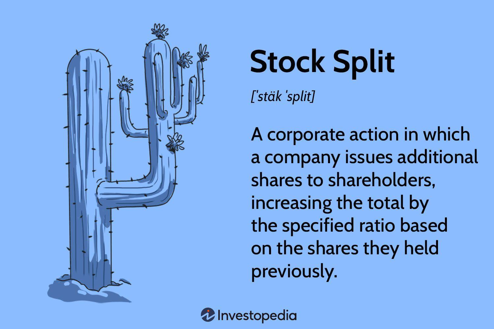

## Table of Contents

## What is a stock split?

A stock split is when a company decides to divide its existing shares into more shares. This means if you own one share, after the split, you might own two or more shares, but the total value of your investment stays the same. The main reason companies do this is to make their stock price lower, which can attract more investors. For example, if a stock is trading at $100 per share and the company does a 2-for-1 split, the price per share will drop to $50, but you'll have twice as many shares.

Stock splits don't change the overall value of the company or the value of your investment. They just make the shares cheaper and more accessible to smaller investors. Sometimes, a lower stock price can make the stock seem more affordable and increase demand, which might help the stock price go up over time. But remember, the total value of what you own doesn't change right after the split. It's just divided into more pieces.

## Why do companies perform stock splits?

Companies perform stock splits to make their stock price lower. When the price of a share is high, it might seem too expensive for some investors. By doing a stock split, the company can lower the price per share, which can attract more people to buy the stock. For example, if a stock is at $100 and the company does a 2-for-1 split, the price drops to $50 per share. This makes it easier for more people to afford the stock.

Another reason for stock splits is to make the stock seem more appealing. A lower price can make the stock look like a better deal, even though the total value of the company doesn't change. This can increase demand for the stock and might help the stock price go up over time. But remember, right after a stock split, the total value of what you own stays the same; it's just divided into more shares.

## How does a stock split affect the stock price?

A stock split makes the price of each share go down. For example, if a company does a 2-for-1 split and the stock was $100 before, it will be $50 after the split. This happens because the total value of the company stays the same, but now it's spread over more shares. So, if you owned one share worth $100 before, after the split, you would own two shares worth $50 each.

Even though the price per share goes down, the total value of your investment doesn't change right away. If you had $100 worth of stock before the split, you'll still have $100 worth of stock after the split. But, because the price per share is lower, it might attract more investors. This could increase demand for the stock and might make the price go up over time. But remember, the immediate effect of a stock split is just to lower the price per share.

## What is a stock split adjustment?

A stock split adjustment is what happens to the stock price and the number of shares you own after a company does a stock split. When a company decides to split its stock, it increases the number of shares that exist. For example, in a 2-for-1 split, every share you own turns into two shares. But the total value of what you own stays the same. If you had one share worth $100 before the split, after the split, you'd have two shares worth $50 each.

This adjustment is important for keeping track of your investment. It makes the stock price lower, which can make the stock seem more affordable to new investors. Even though your total investment value doesn't change right after the split, a lower price per share might attract more people to buy the stock. This could increase demand and possibly make the stock price go up over time. But remember, the immediate effect of a stock split adjustment is just to change the number of shares and the price per share, not the total value of your investment.

## How is a stock split adjustment calculated?

A stock split adjustment is calculated by figuring out how the number of shares and the price per share change after a split. If a company does a 2-for-1 split, it means every share you own becomes two shares. So, if you owned 10 shares before the split, you would own 20 shares after. The price per share also changes. If the stock was $100 before the split, after a 2-for-1 split, it would be $50 per share. This keeps the total value of your investment the same.

The formula to find the new price per share after a split is simple. You take the old price per share and divide it by the split ratio. For a 2-for-1 split, you divide the old price by 2. If it was a 3-for-1 split, you would divide the old price by 3. The same goes for the number of shares you own; you multiply the old number of shares by the split ratio. This way, the total value of your investment stays the same, but the price per share goes down and the number of shares goes up.

## What is the purpose of a stock split adjustment in financial analysis?

A stock split adjustment in financial analysis is used to make sure that the data about a stock's price and performance over time is correct and fair. When a company does a stock split, it changes the price per share and the number of shares. This can make it hard to compare the stock's performance before and after the split. By adjusting for the split, analysts can look at the stock's price history as if no split had happened. This helps them see the real trends and changes in the stock's value over time.

For example, if a stock was $100 before a 2-for-1 split and $50 after, without an adjustment, it might look like the stock lost value. But really, the total value stayed the same, just spread over more shares. By adjusting the stock price and share count, analysts can see that the stock's value didn't actually change because of the split. This makes it easier to compare the stock's performance with other stocks or with its own past performance, giving a clearer picture of how well the stock is doing.

## How do stock split adjustments impact historical stock price data?

Stock split adjustments change how we look at a stock's price history. When a company does a stock split, the price per share goes down, and the number of shares goes up. If we don't adjust for this, the historical data can look confusing. For example, if a stock was $100 before a 2-for-1 split and $50 after, without an adjustment, it might seem like the stock lost half its value. But really, the total value of the company and your investment stayed the same.

By making a stock split adjustment, we can see the stock's true performance over time. This means we take the old prices and adjust them to show what they would have been if the split never happened. So, in our example, the $50 price after the split would be shown as $100 in the adjusted data. This way, we can compare the stock's price before and after the split fairly, and it helps us understand how the stock has really been doing without the split confusing things.

## What are the differences between a forward and a reverse stock split?

A forward stock split and a reverse stock split are two types of stock splits that companies can do, but they work in opposite ways. In a forward stock split, a company increases the number of shares and lowers the price per share. For example, in a 2-for-1 forward split, if you owned one share worth $100, you would get two shares worth $50 each. Companies do this to make their stock seem cheaper and attract more investors. The total value of your investment stays the same, but it's split into more shares.

A reverse stock split does the opposite. It reduces the number of shares and increases the price per share. For example, in a 1-for-2 reverse split, if you owned two shares worth $50 each, you would end up with one share worth $100. Companies might do a reverse split to make their stock price higher, which can help them meet the minimum price requirements to stay listed on a stock exchange. Like a forward split, the total value of your investment doesn't change right away, but now it's in fewer, more expensive shares.

## How do stock split adjustments affect shareholder equity?

A stock split adjustment doesn't change the total value of a shareholder's equity right away. If you own shares in a company and it does a stock split, the total value of your investment stays the same. For example, if you had one share worth $100 and the company did a 2-for-1 split, you would have two shares worth $50 each. Your total equity would still be $100. The stock split just changes the number of shares you own and the price per share, but it doesn't affect the overall value of your investment.

However, stock split adjustments can affect how shareholders feel about their equity. When a company does a stock split, it often makes the stock price lower, which can make the stock seem more affordable and attract more investors. This increased demand might make the stock price go up over time, which could increase the value of your equity. But remember, this isn't because of the stock split itself; it's because more people might want to buy the stock after the split. So, while the immediate effect of a stock split on shareholder equity is neutral, the long-term impact could be positive if the stock price goes up due to increased demand.

## What are the tax implications of a stock split?

A stock split doesn't usually cause you to owe any taxes right away. When a company does a stock split, it just changes the number of shares you own and the price per share. The total value of your investment stays the same, so there's no immediate tax event. You won't have to pay taxes just because the company did a stock split.

However, if you decide to sell some of your shares after a stock split, you might have to pay taxes on any profit you make. The tax rules will depend on how long you held the shares and the profit you made. But remember, the stock split itself doesn't create a taxable event; it's the selling of the shares that might lead to taxes.

## How do stock split adjustments influence stock market indices?

When a company does a stock split, it changes the price of its shares, which can affect stock market indices like the S&P 500 or the Dow Jones Industrial Average. These indices are made up of a bunch of different stocks, and they usually track the total value of those stocks. When a company does a stock split, the price per share goes down, but the total value of the company stays the same. To keep the index accurate, the index providers make adjustments. They do this to make sure the index still shows the true value of the market, even after the split.

For example, if a stock in the S&P 500 does a 2-for-1 split, the price of that stock goes down, but the number of shares goes up. The index providers will adjust the weight of that stock in the index to reflect the split. This way, the index doesn't show a sudden drop in value just because one company did a stock split. The adjustments help keep the index a fair measure of the market's performance, making sure that changes in stock prices due to splits don't mess up the overall picture.

## What are the considerations for investors when a company announces a stock split?

When a company announces a stock split, investors should think about what it means for their investment. A stock split doesn't change the total value of what you own right away. If you had one share worth $100 and the company does a 2-for-1 split, you'll have two shares worth $50 each. Your total investment is still $100. But, because the price per share goes down, it might make the stock seem cheaper and attract more people to buy it. This could increase demand and maybe make the stock price go up over time, which could be good for your investment.

Another thing to consider is what the stock split might say about the company. Companies often do stock splits when they think their stock price is too high and they want to make it easier for more people to buy. This can be a sign that the company is doing well and wants to keep growing. But, investors should also look at other things about the company, like its financial health and future plans, not just the stock split. A stock split by itself doesn't mean the stock will go up, but it can be part of a bigger picture that helps you decide if you want to keep or buy more of the stock.

## What is Understanding Stock Splits?

Stock splits are a common corporate action where a company increases its number of outstanding shares by issuing additional shares to its existing shareholders. This process effectively reduces the price of each share without altering the market capitalization of the company. The fundamental objective of a stock split is to enhance the stock's liquidity and make it more accessible to a wider range of investors. A lower per-share price can attract more retail investors who might find the stock more affordable, potentially increasing the stock's trading volume.

There are different types of stock splits, each affecting the stock's price and the shareholder's equity differently:

1. **Forward Stock Split**: This is the most prevalent type of stock split. It involves dividing each existing share into multiple new shares. For example, in a 2-for-1 stock split, each share is split into two shares. If a company has 1 million shares outstanding and performs a 2-for-1 split, it will then have 2 million shares outstanding. Consequently, while the number of shares doubles, the price per share is halved, leaving the overall value of an investor's holdings unchanged.
$$
   \text{New share price} = \frac{\text{Original share price}}{\text{Split ratio}}

$$

2. **Reverse Stock Split**: This occurs when a company reduces its number of outstanding shares, consequently increasing the share price. A reverse split can be used by companies to bolster a sagging stock price or to meet minimum price requirements for stock exchanges. For instance, in a 1-for-2 reverse split, every two shares are converted into a single share. This action halves the number of shares outstanding and doubles the share price.
$$
   \text{New share price} = \text{Original share price} \times \text{Reverse split ratio}

$$

3. **Fractional Stock Split**: Although less common, fractional splits allow for non-integer adjustments in share quantity. These splits may be used to adjust share quantities for complex financial restructuring or mergers and acquisitions where fractional ownership solutions are required.

Understanding stock splits is crucial for investors, as they can impact market behavior and investment strategies. While the intrinsic value of the company remains unchanged immediately after the split, the newly adjusted lower share price often creates a perception of increased affordability among investors, which can lead to short-term price movements based on market sentiment. Moreover, historical stock prices are adjusted to reflect splits, ensuring that any analyses or comparisons made on past performance account for these changes.

Savvy investors and analysts need to recognize the strategic reasons behind a company's decision to split its stock and how such splits can influence [liquidity](/wiki/liquidity-risk-premium), investor perception, and market trading patterns. The adjusted share prices help maintain continuity in financial analysis, allowing for accurate [backtesting](/wiki/backtesting) and interpretation of historical trading data.

## What is the impact of stock splits on share prices?

Stock splits play a significant role in the management of share prices and the perception of a company's stock in the market. When a company executes a stock split, each share's price is effectively reduced, while the number of shares increases proportionally. As a result, the total market capitalization of the company—the total market value of the company's outstanding shares—remains unchanged. 

### Share Price Adjustment Post-Split

It is crucial to adjust historical share prices to reflect splits accurately. This adjustment is important because it ensures consistency in stock price history, a vital aspect for anyone analyzing the stock's past performance. When prices are not adjusted for splits, it can lead to a misinterpretation of data since historical charts would show artificial price drops corresponding to the split events. The formula for adjusting historical prices following a stock split is:

$$
\text{Adjusted Price} = \frac{\text{Old Price}}{\text{Split Ratio}}
$$

Where the split ratio is commonly expressed as $a:b$, denoting $a$ new shares for every $b$ old shares. For instance, in a 2:1 split, shareholders receive two shares for every one they previously owned, halving the price of each share.

### Importance of Adjusted Values

Adjusted values are indispensable for accurately reflecting historical growth and understanding investor returns over time. Without adjustments, returns calculated over periods containing stock splits can appear inaccurate. Adjustments ensure that any analysis or algorithm takes into account the real appreciation (or depreciation) of the stock's value, which aligns with the company's growth and investor experience. By maintaining a consistent basis for price comparison, it allows for the accurate calculation of indicators such as moving averages, relative strength index (RSI), or other technical indicators used in trading decisions.

### Considerations for Investors and Traders

Investors and traders must be aware of how these adjusted prices influence their investments and overall strategies. Failing to account for splits can result in inaccuracies in evaluating portfolio performance or in deploying [algorithmic trading](/wiki/algorithmic-trading) strategies. For example, a trader using moving averages for decision making would receive false signals if they do not adjust these indicators to take into account historical price adjustments due to splits.

Adjustments provide the necessary continuity in data that forms the backbone of effective trading strategies. Without these, trading models might develop biases leading to suboptimal decisions. For traders using quantitative models, ensuring that their data reflects stock splits accurately is as crucial as managing other financial metrics like [volatility](/wiki/volatility-trading-strategies) or liquidity. 

In summary, the impact of stock splits on share prices is fundamental in ensuring accurate investment analysis and effective strategy formulation. Investors who understand these mechanisms are better positioned to make informed decisions, thereby enhancing their market performance and optimizing their returns.

## References & Further Reading

- Damodaran, A. (2012). *Investment Valuation: Tools and Techniques for Determining the Value of Any Asset*. John Wiley & Sons. This book provides comprehensive methodologies for valuing investments with detailed examples and case studies, making it a valuable resource for understanding how stock splits and adjustments influence valuation. 

- Chan, E. P. (2009). *Quantitative Trading: How to Build Your Own Algorithmic Trading Business*. John Wiley & Sons. This work offers practical insights into algorithmic trading strategies, emphasizing the significance of accurate historical data, including the use of split-adjusted stock prices, to develop successful algorithms.

- Lopez de Prado, M. (2018). *Advances in Financial Machine Learning*. John Wiley & Sons. The book covers in-depth applications of machine learning in finance, highlighting the importance of data integrity and the handling of corporate actions like stock splits in creating robust trading models.

- Jansen, S. (2020). *Machine Learning for Algorithmic Trading: Predictive models to extract signals from market and alternative data for systematic trading strategies with Python*. Packt Publishing. This publication focuses on applying machine learning to algorithmic trading, providing Python examples that include techniques for adjusting stock prices to account for splits, thus ensuring precise data analytics and strategy development.

- Aronson, D. R. (2007). *Evidence-Based Technical Analysis: Applying the Scientific Method and Statistical Inference to Trading Signals*. Wiley. Aronson explores the application of scientific and statistical methods to technical analysis, stressing the importance of using accurate historical data. Stock splits and adjusted prices are essential for maintaining consistent data over time, critical for evidence-based analysis.

