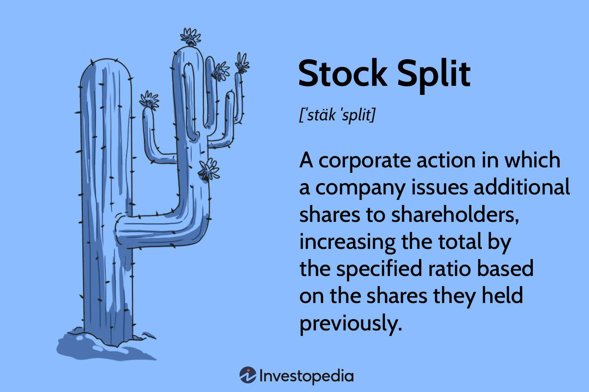

In the dynamic world of finance, stock splits represent strategic corporate actions that can influence various aspects of financial markets. A stock split occurs when a company increases its number of outstanding shares by issuing more shares to current shareholders, while simultaneously decreasing the per-share price. This process maintains the overall market capitalization of the company. For example, in a typical 2-for-1 stock split, shareholders receive an additional share for each share they own, resulting in the price of each share being halved.

The primary motivation behind stock splits is often to enhance the stock's marketability by making shares more affordable to a broader range of investors. When share prices become too high, they can be less appealing to retail investors with limited capital. By splitting stocks, companies can potentially broaden their investor base, increase liquidity, and improve market reception.



This article aims to explore the various impacts of stock splits on shareholders, company financials, and the realm of algorithmic trading. Understanding these nuances is essential for investors to make informed decisions regarding their portfolios and to anticipate market reactions. The discussion will extend to how stock splits can affect trading volume, market psychology, and the potential benefits for companies projecting confidence in their growth prospects. Through this exploration, investors will gain insights into leveraging stock splits as part of their investment strategies.

## Table of Contents

## Understanding Stock Splits

A stock split occurs when a company decides to divide its existing shares into multiple shares, effectively increasing the total number of shares in circulation while maintaining the same overall market capitalization. This division does not inherently alter the intrinsic value of the company, as the total market capitalization remains constant, calculated by multiplying the share price by the number of shares outstanding. Mathematically, if a company splits its stock in a ratio of `n-for-1`, each shareholder will receive `n` shares for every share they own, while the individual share price is adjusted by a factor of `1/n`.

For example, if a company with a stock price of $100 and 1 million shares outstanding (resulting in a market capitalization of $100 million) undertakes a 2-for-1 stock split, the number of shares would double to 2 million, while the share price would be halved to $50. The overall market capitalization remains unchanged at $100 million.

One of the primary motivations for a company to initiate a stock split is to reduce the share price, making it more affordable for a broader segment of investors. This can potentially increase liquidity, as more investors can buy shares at a lower price, resulting in higher trading volumes. Additionally, a lower share price may psychologically encourage retail investors who find lower-priced stocks more approachable or perceive them as having more growth potential.

Stock splits are often announced by companies as a signal of confidence in their anticipated growth prospects. By splitting their stock, companies may indicate their expectation of future increases in share value, which can positively influence market perception and attract additional investor interest. Therefore, beyond the mechanical aspects of adjusting shares and prices, stock splits can play a critical role in shaping investor sentiment and the marketability of the stock.

## Impact on Shareholders

Shareholders experience a unique set of outcomes when a company executes a stock split. A primary characteristic of stock splits is that shareholders receive additional shares proportional to their existing holdings without experiencing an alteration in the overall investment value. For example, in a 2-for-1 stock split, a shareholder with 100 shares would receive an additional 100 shares, doubling their holdings to 200 shares. However, the price per share is halved, ensuring that the total market value of their investment remains unchanged.

The psychological impact of stock splits is noteworthy. By lowering the share price, stock splits can make shares more accessible and appealing to retail investors, a group often sensitive to price thresholds. The lower price point may attract a wider pool of individual investors who perceive the stock as more affordable, potentially increasing demand and market activity.

Moreover, financial metrics, including dividend yields and earnings per share, are adjusted following a stock split to accurately reflect the new share structure while sustaining the company's financial snapshot. For instance, if a company issues a stock split, its dividend payout per share will also be split according to the split ratio. In mathematical terms, if "D" represents the original dividend per share and the stock split is 2-for-1, the adjusted dividend per share becomes D/2. Similarly, earnings per share (EPS) is recalibrated by dividing the original EPS by the split [factor](/wiki/factor-investing). This ensures that financial analysts and investors continue to have a consistent and fair basis for evaluating the company's performance and financial health. 

Overall, stock splits are designed to signal robust growth prospects and optimistically position the company in the eyes of shareholders and potential investors alike. Consequently, being well-versed in the dynamics of stock splits empowers shareholders to make better-informed decisions regarding their investments.

## Company Financial Implications

While a stock split does not inherently alter the intrinsic value of a company, it can considerably improve the stock's marketability and [liquidity](/wiki/liquidity-risk-premium). A stock split involves dividing existing shares into multiple new shares, effectively reducing the price per share. This lower price can make the shares more accessible and attractive to a broader range of investors, particularly retail investors. By improving accessibility, a company can enhance the liquidity of its stock, as a more diversified investor base may lead to more frequent trading and a tighter bid-ask spread.

The phenomenon of increased demand following a stock split is often driven by market psychology. When shares appear more affordable, individual investors might perceive them as a more viable investment option, despite the fact that the total market capitalization remains unchanged. This perceived affordability can lead to a temporary surge in demand, which sometimes results in a short-term uplift in the stock price. Several empirical studies suggest that this psychological effect, although not permanent, can produce immediate increases in a company's stock price post-split. 

Companies typically signal their confidence in future growth prospects by deciding to split their stocks. A decision to implement a stock split often suggests that management anticipates rising stock valuations. This anticipation is grounded in the expectation of sustained or increased earnings and positive market conditions, which contribute to investor confidence. Thus, stock splits frequently occur in a favorable market context, where the company's performance is strong and future outlook is robust. 

By undertaking a stock split, a company may also aim to align stock prices more closely with those of peers or industry benchmarks. Thus, maintaining a price range that aligns with industry standards can bolster competitive perception and attract further interest from investors who view comparable positioning favorably. 

In conclusion, stock splits are a strategic tool used by companies to enhance marketability and investor interest without altering intrinsic value. By making stock prices more accessible and demonstrating corporate confidence, they can play a significant role in shaping company perception and aligning with broader market conditions.

## Algorithmic Trading and Stock Splits

Algorithmic trading, often referred to as algo trading, employs computer algorithms to execute trading decisions at high speed and frequency. Stock splits, with their capacity to alter share prices and volumes, present unique opportunities and challenges for algorithmic traders. When a company undergoes a stock split, it changes the per-share price and the number of shares outstanding without affecting the company's overall market capitalization. This necessitates adjustments in [algorithmic trading](/wiki/algorithmic-trading) strategies to account for the changed price point.

One immediate effect of a stock split is an increase in the number of shares, which typically results in higher trade volumes. This heightened activity can be advantageous for algorithmic trading systems, which are designed to identify and exploit such fluctuations to achieve gains. Algorithms are programmed to recognize patterns and anomalies in trading volumes and prices, and a stock split can result in new opportunities for [arbitrage](/wiki/arbitrage)—where discrepancies in a stock's pricing can be exploited for profit.

To illustrate, consider a stock splitting in a 2-for-1 ratio, halving the price per share but doubling the number of shares. An algo trading system must adjust by recalibrating its input variables to reflect these new conditions. Effective algorithms incorporate conditional logic to dynamically adjust trading thresholds post-split, ensuring that trades are executed optimally. For example, a simple pseudocode adjustment might be:

```python
def adjust_for_stock_split(current_price, split_ratio):
    return current_price / split_ratio

# Example usage
initial_price = 200
split_ratio = 2  # 2-for-1 split
adjusted_price = adjust_for_stock_split(initial_price, split_ratio)
```

Algorithmic adjustments are not solely focused on the mechanical recalibration of prices. These systems also assess liquidity changes, as a lower stock price post-split can attract a broader base of retail investors, leading to changes in market behavior. Liquidity is a critical factor in pricing strategies as more accessible stocks can result in tighter bid-ask spreads, which algos can leverage to enhance trading efficiency.

Furthermore, understanding stock splits can be crucial for algorithms that rely heavily on historical data. A stock split can render historical price data misleading if not adjusted, necessitating the back-adjustment of historical prices to correctly interpret past patterns relative to the new price structures. In Python, this adjustment might look like:

```python
def back_adjust_prices(historical_prices, split_ratio):
    return [price / split_ratio for price in historical_prices]

# Example usage
historical_prices = [100, 105, 110]
split_ratio = 2
adjusted_historical_prices = back_adjust_prices(historical_prices, split_ratio)
```

Algorithmic traders must remain adept at integrating stock split events into their decision-making frameworks to maximize their trading strategy's effectiveness. In doing so, they can better navigate the evolving landscape of market conditions influenced by such corporate actions. Understanding both the technical and strategic implications of stock splits ensures that algo trading remains robust and profitable.

## Reverse Stock Splits

Reverse stock splits involve a reduction in the number of a company's outstanding shares while proportionally increasing the price per share. For instance, in a 1-for-10 reverse stock split, ten existing shares are consolidated into one, elevating the share price by a factor of ten. This corporate maneuver does not alter the company's overall market capitalization. The formula for the new share price following a reverse stock split can be represented as:

$$
\text{New Share Price} = \text{Old Share Price} \times \frac{\text{Old Number of Shares}}{\text{New Number of Shares}}
$$

One primary reason companies execute reverse stock splits is to maintain compliance with stock exchange listing requirements, particularly the minimum bid price. Falling below these thresholds might result in delisting, posing significant challenges for accessing capital markets. Consequently, reverse splits can temporarily buoy share prices above the required minimums.

Moreover, reverse stock splits may signal financial distress or underlying problems within a company. They might be perceived as a negative indicator, suggesting that a company's shares have been persistently low for an extended period, potentially due to dwindling performance or unfavorable market conditions. Such perceptions can affect investor confidence and market perception, even if the reverse split itself does not alter the company's intrinsic value.

For investors, comprehending the implications of reverse stock splits is critical. These events require careful scrutiny of a company's overall health and strategic direction. While a higher share price post-split may provide a psychological boost or momentarily enhance marketability, it does not inherently resolve the underlying issues facing the company. Thus, reverse splits call for a cautious assessment of the broader financial context and their impact on long-term investment strategies.

## Conclusion

Stock splits are complex financial maneuvers that play a significant role in shaping shareholder perceptions and the overall company image. When a company chooses to split its stock, it can influence how both retail and institutional investors view the company’s growth prospects and market positioning. For shareholders, the immediate effect is receiving additional shares that maintain the overall investment value, albeit at a reduced per-share price. This lower price can psychologically encourage more retail investors to purchase the stock, increasing liquidity and potentially enhancing market demand.

For investors using traditional methods, understanding stock splits is crucial to predicting potential market movements and aligning investment strategies accordingly. They must consider the broader implications, such as how splits can lead to increased visibility and potentially short-term spikes in stock prices due to heightened trading activity.

Algorithmic traders, on the other hand, incorporate stock split data into their trading algorithms to adjust strategies for changes in liquidity and price. Stock splits can lead to increased trading volumes, which algorithms are designed to exploit for potential gains. For these traders, understanding the mechanics and potential outcomes of stock splits can lead to more effective trading strategies based on anticipated price movements.

In both cases, staying informed about stock splits and other corporate actions is essential. Insights gained from such events can provide valuable understanding of market psychology, allowing investors to anticipate shifts in stock performance and refine their investment approaches. Whether through traditional analysis or algorithmic models, being aware of stock splits contributes to making informed decisions in a constantly evolving market landscape.

## References & Further Reading

[1]: ["Advances in Financial Machine Learning"](https://www.amazon.com/Advances-Financial-Machine-Learning-Marcos/dp/1119482089) by Marcos Lopez de Prado

[2]: ["Quantitative Trading: How to Build Your Own Algorithmic Trading Business"](https://books.google.com/books/about/Quantitative_Trading.html?id=j70yEAAAQBAJ) by Ernest P. Chan

[3]: ["Stocks for the Long Run: The Definitive Guide to Financial Market Returns and Long-Term Investment Strategies"](https://www.amazon.com/Stocks-Long-Run-Definitive-Investment/dp/0071800514) by Jeremy J. Siegel

[4]: ["Security Analysis"](https://www.amazon.com/Security-Analysis-Foreword-Buffett-Editions/dp/0071592539) by Benjamin Graham and David Dodd

[5]: Conroy, R. M., & Harris, R. S. (1999). ["The Role of Stock Splits in Signalling Corporate Value"](https://www.jstor.org/stable/3666181). Financial Management, 28(3), 28-40.

[6]: Ikenberry, D. L., Rankine, G., & Stice, E. K. (1996). ["What Do Stock Splits Really Signal?"](https://www.jstor.org/stable/2331396) The Journal of Financial and Quantitative Analysis, 31(3), 357-375.