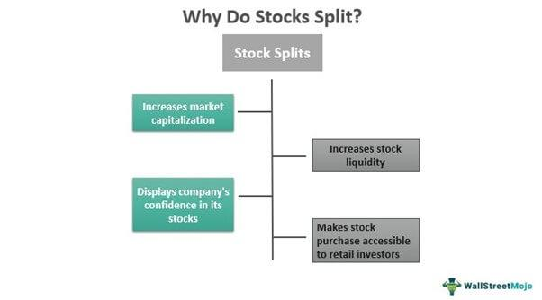

Understanding the intricacies of the stock market is essential for investors aiming to maximize their portfolio's value and strategic positioning. In this article, we will explore the concept of stock splits, a financial maneuver frequently used by companies to enhance liquidity and attract smaller investors. Stock splits involve increasing the number of a company’s shares while maintaining the same market capitalization, effectively reducing the share price without altering the company’s inherent value. This makes the stock more accessible to a broader range of investors, potentially leading to increased demand and liquidity.

Furthermore, we will examine algorithmic trading, an advanced trading strategy that utilizes complex algorithms to execute trades with high efficiency and speed. This technological approach has transformed financial markets by enabling traders to automate processes and analyze vast datasets quickly, leading to more informed decision-making. By leveraging algorithmic strategies, traders can enhance their ability to identify and capitalize on market opportunities, significantly altering the dynamics of market participation.



The integration of stock splits and algorithmic trading into investment strategies presents unique opportunities for portfolio enhancement. By employing algorithms to respond to stock splits, investors can potentially predict market behaviors and optimize their entry and exit points. This combination allows for a refined and strategic approach to trading, maximizing potential returns while managing risks effectively.

By the end of this article, our objective is to provide a comprehensive overview of how stock splits and algorithmic trading interact within the stock market ecosystem. Readers will gain insights into how these components can be strategically leveraged to enhance their financial outcomes and maintain a competitive edge in an ever-evolving market landscape. This understanding is crucial for modern investors seeking to navigate the complexities of today’s financial environment.

## Table of Contents

## What are Stock Splits?

A stock split is a corporate action undertaken by a company to increase the number of its outstanding shares by issuing additional shares to existing shareholders. This maneuver essentially reduces the price of each share while the overall market capitalization of the company remains unchanged. The primary motivation behind a stock split is to make the shares more affordable and accessible to smaller investors, thereby potentially increasing market liquidity and investor base.

Stock splits can be classified into various types, with the most common being traditional splits and reverse splits. In a traditional stock split, the number of shares increases while the share price decreases proportionally. For instance, in a 2-for-1 stock split, the shareholder receives an additional share for every share held, effectively doubling the number of shares, while the price of each share is halved. The reverse stock split, on the other hand, reduces the number of shares and correspondingly increases the share price. For example, in a 1-for-2 reverse split, shareholders receive one new share for every two shares held, which effectively increases the share price while reducing the total number of shares.

The impacts of stock splits on market perception can be significant. Traditional stock splits are often perceived as a positive signal by the market, as they frequently occur when a company's share price has risen to a level that might be perceived as too high, thereby indicating confidence in the company's future growth prospects. This perception can lead to increased demand for the shares, as more investors are able to purchase the stock at a lower entry price.

Conversely, reverse stock splits are sometimes viewed negatively, as they might be implemented by companies whose share price has fallen sharply, possibly indicating underlying financial distress. The aim here is to boost the share price to maintain a company's stock exchange listing or improve its market image. However, such actions can be interpreted by investors as a red flag about the company's long-term prospects.

Understanding stock splits is crucial for investors as they navigate market psychology and aim to predict future financial movements. Not only do splits impact individual share pricing, but they also influence investor sentiment and trading [volume](/wiki/volume-trading-strategy), creating ripple effects across the market. Being aware of these factors allows investors to make informed decisions and position their portfolios strategically in anticipation of such corporate actions. 

In summary, stock splits serve as important tools for companies to manage their capital structure and investor base, while also influencing market perceptions and investor behavior. By appreciating the different forms of stock splits and their implications, investors can better gauge market movements and potential opportunities within the financial ecosystem.

## The Strategic Importance of Stock Splits

Stock splits can significantly impact a company's stock price and market capitalization, serving as a strategic tool for investment. Essentially, a stock split increases the number of shares outstanding by issuing additional shares to existing shareholders, without altering the company's overall market capitalization. The most common type of stock split is the 2-for-1 split, where shareholders receive an additional share for every share they own, effectively halving the stock price.

Historical data reveals that stock splits have had varied effects across different industries. In the technology sector, companies like Apple Inc. and Tesla, Inc. have experienced post-split appreciation in stock prices. For instance, Apple's 4-for-1 split in 2020 contributed to a surge in share price, as the lower price point made shares more accessible to a broader range of investors.[1] In contrast, within the consumer goods industry, stock splits often stabilize prices rather than significantly increase them, as observed with companies like The Coca-Cola Company.

The perception of stock splits as indicators of future growth is widespread. They can signal management's confidence in sustained performance and future cash flows, enticing investors seeking growth opportunities. However, understanding the motivations behind stock splits is crucial. Often, they aim to improve [liquidity](/wiki/liquidity-risk-premium) and broaden shareholder bases without fundamentally altering the company’s intrinsic value.

Positioning an investment strategy to leverage upcoming stock splits involves several considerations. One approach is to monitor announcements of stock splits across industries using financial news platforms or stock analysis tools. Investors might consider allocating a portion of their portfolio to companies announcing splits, capitalizing on potential short-term appreciation due to increased trading activity and visibility.

Additionally, technical analysis and historical performance can provide insights into expected outcomes post-split. For instance, using Python, investors can analyze past stock split data to identify patterns. Below is a simple Python script to analyze stock performance following splits:

```python
import pandas as pd
import numpy as np
import yfinance as yf  # For more datasets, visit: https://paperswithbacktest.com/datasets

# Fetch historical stock data for a company
def fetch_stock_data(ticker, start, end):
    stock_data = yf.download(ticker, start=start, end=end)
    return stock_data['Close']

# Calculate post-split performance
def analyze_post_split(stock_data, split_dates, period=60):
    performance = {}
    for date in split_dates:
        date_index = stock_data.index.get_loc(date)
        pre_split_price = stock_data[date_index]
        post_split_price = stock_data[date_index:date_index+period].values
        performance[date] = np.mean(post_split_price) / pre_split_price - 1
    return performance

# Example usage
ticker = 'AAPL'
start_date = '2015-01-01'
end_date = '2023-10-01'
split_dates = ['2020-08-31']  # Example split date for Apple
stock_data = fetch_stock_data(ticker, start_date, end_date)
performance = analyze_post_split(stock_data, split_dates)

print(f"Post-split performance for {ticker}: {performance}")
```

Incorporating an understanding of industry trends and market conditions further refines the strategy. Stock splits present a strategical opportunity for seasoned investors to optimize portfolios, allowing for nuanced responses to market dynamics.

---
[1] "Apple (AAPL) Announces 4-For-1 Stock Split; Shares To Start Trading On A Split-Adjusted Basis August 31", Apple Press Release, 2020.

 to Algorithmic Trading

Algorithmic trading, often abbreviated as algo trading, leverages sophisticated algorithms to implement and execute trading strategies autonomously, offering enhanced speed and efficiency over manual trading. These algorithms can analyze vast datasets, make complex calculations, and initiate trades based on pre-programmed criteria, all within fractions of a second.

### Operation in Retail and Institutional Contexts

In retail market contexts, algo trading is popular for individual traders seeking to execute trades without constant oversight. Retail algo trading platforms provide tools for automating straightforward trading strategies, enabling individuals to capitalize on market fluctuations efficiently. Examples include simple moving average crossovers or [momentum](/wiki/momentum)-based strategies that detect and act upon market trends.

Conversely, institutional algo trading is markedly more sophisticated, often operating on high-frequency platforms. Institutional investors utilize complex algorithms capable of executing thousands of trades per second to exploit minute price changes. This kind of trading employs a variety of strategies, including statistical [arbitrage](/wiki/arbitrage) and [market making](/wiki/market-making), to optimize trade execution and capture liquidity opportunities across multiple markets and instruments.

### Technological Advancements

The evolution of technology has been pivotal to the expansion and efficiency of [algorithmic trading](/wiki/algorithmic-trading). Today's trading algorithms are supported by high-performance computing systems and advanced data analytics infrastructure. These tools enable algorithms to process complex trading signals from myriad data sources, such as market feeds, social media, and financial news. Furthermore, cloud computing has allowed for scalable trading operations, reducing latency and ensuring real-time data processing across global markets.

### Artificial Intelligence and Machine Learning

Artificial intelligence (AI) and [machine learning](/wiki/machine-learning) (ML) technologies are increasingly integrated into algo trading, providing a competitive edge through enhanced predictive capabilities. AI models can analyze large data volumes to identify patterns or anomalies indicative of future market movements. Machine learning algorithms, particularly those based on neural networks, can adapt to new data, continuously refining trading models for accuracy. 

For example, [reinforcement learning](/wiki/reinforcement-learning)—a machine learning paradigm where algorithms learn optimal trading strategies through trial and error in a simulated environment—has shown promise in developing adaptive trading strategies. Python, with libraries such as TensorFlow and PyTorch, is a preferred language for implementing these advanced algorithms due to its robust ecosystem and ease of use.

```python
import numpy as np
from sklearn.ensemble import RandomForestClassifier

# Sample code for building a simple predictive model
def train_predictive_model(data):
    X = data.drop('target', axis=1)
    y = data['target']
    model = RandomForestClassifier(n_estimators=100)
    model.fit(X, y)
    return model

# Sample generate data function would be added here
# predicted_model = train_predictive_model(generate_data())
```

These technologies have become integral to modern algo trading strategies, capturing subtle market inefficiencies that traditional methods might miss.

In summary, algorithmic trading represents a dynamic intersection of finance and technology. Its utilization spans both retail and institutional markets, driven by technological advancements and the integration of AI and machine learning to optimize trading strategies. As the financial markets continue to evolve, the strategic application of these technologies promises to redefine trading landscape dynamics for those prepared to embrace them.

## The Intersection of Stock Splits and Algo Trading

The intersection of stock splits and algorithmic trading represents a promising confluence in financial markets, where technology-driven strategies can enhance investment outcomes. Algo traders can take advantage of stock splits by coding algorithms that anticipate market reactions, thereby positioning themselves to maximize gains. 

Stock splits often lead to temporary inefficiencies in price due to increased liquidity and psychological factors influencing investor behavior. Algorithms can exploit these inefficiencies by analyzing a wide array of financial indicators, including historical price data, trading volumes, and market sentiment surrounding the event. A common approach is to use machine learning techniques, such as regression analysis or neural networks, to forecast stock price movements pre- and post-split.

For instance, consider a machine learning model that uses historical data to identify patterns in stock splits. The algorithm might employ features such as the split ratio, historical [volatility](/wiki/volatility-trading-strategies), and sector performance to predict future price trends. Python, with libraries like TensorFlow and Scikit-learn, provides powerful tools to implement such models. An example snippet might include:

```python
from sklearn.ensemble import RandomForestRegressor
from sklearn.model_selection import train_test_split
import pandas as pd

# Load dataset
data = pd.read_csv('historical_split_data.csv')

# Feature selection
features = data[['split_ratio', 'historical_volatility', 'sector_performance']]
target = data['post_split_price_growth']

# Splitting the data
X_train, X_test, y_train, y_test = train_test_split(features, target, test_size=0.2, random_state=42)

# Initialize and train the model
model = RandomForestRegressor(n_estimators=100, random_state=42)
model.fit(X_train, y_train)

# Predicting stock price growth post-split
predictions = model.predict(X_test)
```

In real-world scenarios, algo trading has proven successful. For instance, when a technology company announces a stock split, advanced algorithms may quickly analyze the event and execute trades to capitalize on anticipated volatility and increased trading volume. These trades can yield significant returns, especially in tech sectors where stock splits are more frequent and impactful.

Furthermore, programming platforms such as MetaTrader 5 and QuantConnect offer robust environments for developing and testing trading algorithms, complete with historical data and simulation tools. These platforms support multiple programming languages, including Python and C++, allowing traders to craft precise algorithms tailored to their strategies.

In conclusion, by harnessing algorithmic trading technology, traders can systematically exploit the opportunities presented by stock splits, integrating predictive models with innovative platforms to optimize their market positions.

## Developing a Comprehensive Financial Strategy

Developing a comprehensive financial strategy that incorporates stock splits and algorithmic trading involves methodical planning and a keen understanding of market dynamics. By systematically integrating these elements, investors can optimize their portfolio performance while mitigating associated risks. Below is a step-by-step guide to crafting such a strategy:

### Step 1: Analyze Market Conditions
Understanding current market conditions is crucial. This involves evaluating economic indicators, sector trends, and geopolitical influences that could affect stock prices. Tools like financial news feeds, economic calendars, and market research reports are invaluable in gathering this information. Adjusting your strategy according to these conditions ensures your investments are not adversely affected by external factors.

### Step 2: Leverage Stock Splits
Stock splits can be a strategic tool to enhance investment returns. Investors should carefully track announcements of upcoming stock splits using financial websites or databases such as Bloomberg or Yahoo Finance. Recognizing patterns of companies that frequently split their stocks can also provide investment cues. Typically, splits are perceived positively by the market, often resulting in a temporary price increase. Thus, buying shares before the split date could be advantageous. 

### Step 3: Incorporate Algorithmic Trading
Algorithmic trading can optimize entry and [exit](/wiki/exit-strategy) points in the market. To incorporate it, one can use platforms like MetaTrader or QuantConnect to develop trading algorithms. These algorithms should account for variables such as historical stock performance post-split, trading volume changes, and volatility indicators. Here is a simple Python snippet using a basic moving average strategy:

```python
import pandas as pd

# Assume 'data' is a DataFrame with historical stock prices
data['SMA_20'] = data['Close'].rolling(window=20).mean()
data['SMA_50'] = data['Close'].rolling(window=50).mean()

# Generate trading signals
data['Signal'] = 0
data.loc[data['SMA_20'] > data['SMA_50'], 'Signal'] = 1
data.loc[data['SMA_20'] < data['SMA_50'], 'Signal'] = -1

# Print the first five trading signals
print(data[['Close', 'SMA_20', 'SMA_50', 'Signal']].head())
```

### Step 4: Assess Risk Tolerance
Individual risk tolerance levels should guide the extent to which stock splits and algo trading are utilized. Conservative investors may prefer to use algo trading with lower leverage and focus on companies with a history of stable stock splits. More aggressive investors might opt for more intricate algo strategies with higher leverage ratios. Portfolio diversification and stop-loss orders are recommended to manage portfolio volatility.

### Expert Tips and Common Pitfalls
1. **Stay Informed**: Constantly update knowledge on stock split announcements and technological advancements in algo trading.
2. **Backtest Algorithms**: Before deploying trading algorithms, backtest them using historical data to confirm their efficacy.
3. **Avoid Overfitting**: Ensure that algorithms are generalized and not overly optimized for past performance patterns.
4. **Patience with Stock Splits**: Don't expect immediate gains; some stocks may require time to appreciate post-split. 

### Conclusion
By developing a strategy that seamlessly integrates stock splits with algorithmic trading, investors can optimize returns while navigating the complexities of the stock market. Understanding the market context, harnessing technological tools, and aligning strategies with personal risk tolerance are pivotal in achieving financial success.

## Conclusion

Understanding stock splits and algorithmic trading offers substantial advantages for modern investors, presenting opportunities to optimize financial strategies. By combining the strategic benefits of stock splits with the technical advancements of algorithmic trading, investors can effectively navigate the complexities of the stock market. Stock splits can make shares more accessible, potentially leading to increased liquidity and investor interest. This may create conditions favorable for strategic investment moves.

Algorithmic trading, with its ability to execute transactions at lightning speed and analyze vast datasets, empowers investors to respond swiftly to market cues, including those arising from stock splits. Algorithms can be programmed to anticipate post-split market behavior, allowing for informed decision-making and potentially lucrative trades.

This holistic approach, integrating both stock splits and algo trading, transforms market participation by equipping investors with tools for precision and foresight. As financial markets continuously evolve, staying informed and adapting to new technologies and strategies is crucial for sustaining a competitive edge. Investors are encouraged to further explore these areas to leverage their full potential, ultimately enhancing their financial outcomes through strategic innovation and informed execution.

## References & Further Reading

[1]: Bergstra, J., Bardenet, R., Bengio, Y., & Kégl, B. (2011). ["Algorithms for Hyper-Parameter Optimization."](https://papers.nips.cc/paper/4443-algorithms-for-hyper-parameter-optimization) Advances in Neural Information Processing Systems 24.

[2]: ["Advances in Financial Machine Learning"](https://www.amazon.com/Advances-Financial-Machine-Learning-Marcos/dp/1119482089) by Marcos Lopez de Prado

[3]: ["Evidence-Based Technical Analysis: Applying the Scientific Method and Statistical Inference to Trading Signals"](https://www.amazon.com/Evidence-Based-Technical-Analysis-Scientific-Statistical/dp/0470008741) by David Aronson

[4]: ["Machine Learning for Algorithmic Trading"](https://github.com/stefan-jansen/machine-learning-for-trading) by Stefan Jansen

[5]: ["Quantitative Trading: How to Build Your Own Algorithmic Trading Business"](https://www.amazon.com/Quantitative-Trading-Build-Algorithmic-Business/dp/1119800064) by Ernest P. Chan