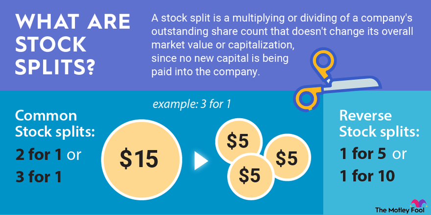

## Table of Contents

## What is a stock split?

A stock split is when a company decides to divide its existing shares into more shares. This makes the price of each share lower, but it doesn't change the total value of the shares you own. For example, if you have one share worth $100 and the company does a 2-for-1 split, you'll have two shares, but each will be worth $50.

Companies do stock splits for different reasons. One reason is to make their stock seem more affordable to smaller investors. If the price per share is lower, more people might want to buy it. Another reason is to make the stock look more attractive. A lower price can sometimes make the stock seem like a better deal, even though the company's overall value hasn't changed.

## How does a stock split affect the price of a stock?

When a company does a stock split, it makes the price of each share go down. This happens because the company is taking one share and splitting it into more shares. For example, if you have a stock that costs $100 and the company does a 2-for-1 split, you'll end up with two shares, but each share will now cost $50. The total value of what you own stays the same, but the price per share is lower.

The reason companies do this is to make their stock look more affordable. If the price per share is lower, more people might want to buy it. It can also make the stock seem like a better deal, even though the company's overall value hasn't changed. So, while the price per share goes down, the goal is often to attract more investors and increase the stock's appeal in the market.

## Why do companies decide to perform a stock split?

Companies decide to perform a stock split mainly to make their shares more affordable. When the price of a share is high, it might be hard for smaller investors to buy it. By doing a stock split, the company lowers the price per share, which can attract more people to buy the stock. This can increase the number of shareholders and make the stock more popular in the market.

Another reason for a stock split is to make the stock seem like a better deal. Even though the total value of the company doesn't change, a lower price per share can make the stock look more attractive to investors. This can lead to more trading and can sometimes push the stock price up over time. So, companies use stock splits as a way to boost interest and potentially improve the stock's performance in the market.

## What is the difference between a forward and a reverse stock split?

A forward stock split and a reverse stock split are two different actions a company can take with its shares. In a forward stock split, a company increases the number of shares it has by dividing each existing share into more shares. For example, in a 2-for-1 forward split, one share becomes two shares. This makes the price of each share lower, but the total value of what you own stays the same. Companies do this to make their stock look more affordable and attract more investors.

On the other hand, a reverse stock split is when a company reduces the number of shares it has by combining several shares into one. For instance, in a 1-for-2 reverse split, two shares become one share. This makes the price of each share higher, but again, the total value of what you own doesn't change. Companies might do a reverse split to make their stock look more valuable or to meet the minimum price requirements of stock exchanges.

## How does a stock split impact the total value of an investor's holdings?

A stock split does not change the total value of an investor's holdings. If you own shares in a company and it does a stock split, the total value of your investment stays the same. For example, if you have one share worth $100 and the company does a 2-for-1 split, you'll end up with two shares, but each will be worth $50. So, you still have $100 worth of stock.

The reason the total value doesn't change is that a stock split only changes the number of shares and the price per share, not the overall value of the company. When a company does a stock split, it's just dividing the pie into more pieces, but the size of the pie stays the same. So, even though the price per share goes down, the total value of your investment remains the same.

## What are the psychological effects of a stock split on investors?

A stock split can make investors feel good about their investment. When a company does a stock split, it often makes the stock seem cheaper and more affordable. This can make investors think they are getting a better deal, even though the total value of the company hasn't changed. The lower price per share can also make investors feel like they can buy more shares, which can give them a sense of owning more of the company.

Another psychological effect is that a stock split can make investors feel more confident about the company's future. When a company decides to do a stock split, it might be seen as a sign that the company is doing well and expects its stock price to keep going up. This can boost investor confidence and make them more likely to hold onto their shares or even buy more. So, a stock split can have a positive impact on how investors feel about their investment.

## Can a stock split influence a company's market capitalization?

A stock split does not change a company's market capitalization. Market capitalization is the total value of all the company's shares. When a company does a stock split, it makes the price of each share go down, but it also increases the number of shares. So, the total value of all the shares, which is the market capitalization, stays the same.

Even though a stock split doesn't change the market capitalization, it can make investors feel good about the company. When a company does a stock split, it can make the stock seem more affordable and attractive. This can lead to more people wanting to buy the stock, which might push the stock price up over time. But at the moment of the split, the market capitalization doesn't change.

## What are the tax implications of a stock split for shareholders?

A stock split does not have any immediate tax implications for shareholders. When a company does a stock split, it just changes the number of shares you own and the price per share, but it doesn't change the total value of your investment. Because your total investment value stays the same, you don't have to pay any taxes right away.

The tax situation can change if you decide to sell your shares after a stock split. If you sell your shares for more than what you paid for them, you might have to pay capital gains tax on the profit. But this tax is based on the total value of your investment, not on the stock split itself. So, a stock split doesn't create any new tax issues by itself, but selling your shares after a split might.

## How do stock splits affect stock liquidity?

Stock splits can make a stock more liquid. Liquidity means how easy it is to buy or sell a stock without changing its price too much. When a company does a stock split, it makes the price of each share lower. This can attract more investors because the stock seems more affordable. More investors buying and selling the stock can lead to more trading, which makes the stock more liquid.

Even though the total value of the company doesn't change, a lower price per share can make people feel like they can buy more shares. This can increase the number of shares being traded every day. When more shares are traded, it's easier for investors to buy or sell the stock quickly, which is what [liquidity](/wiki/liquidity-risk-premium) is all about. So, stock splits can help make a stock more liquid by bringing in more investors and increasing trading activity.

## What historical examples illustrate the impact of stock splits?

One famous example of a stock split is Apple Inc. Apple has done several stock splits over the years. In 2020, Apple did a 4-for-1 stock split. Before the split, one share of Apple stock cost about $500. After the split, one share cost about $125. This made the stock seem more affordable, and more people wanted to buy it. The stock price went up after the split, showing that the split helped make the stock more popular.

Another example is Tesla, Inc. In 2020, Tesla did a 5-for-1 stock split. Before the split, one share of Tesla stock was around $2,200. After the split, one share was about $440. This lower price made the stock more attractive to smaller investors. Like Apple, Tesla's stock price also went up after the split. These examples show how stock splits can make a stock seem cheaper and bring in more investors, which can help the stock price grow.

## How do stock splits fit into a company's broader financial strategy?

Stock splits are a part of a company's bigger plan to manage its stock and make it more attractive to investors. When a company does a stock split, it makes the price of each share lower. This can bring in more investors because the stock seems cheaper. More investors can help the stock price go up over time. Companies might also do stock splits to show they are doing well and expect their stock to keep growing. This can make investors feel good about the company and want to keep their shares or buy more.

Another way stock splits fit into a company's financial strategy is by making the stock more liquid. When more people want to buy and sell the stock, it's easier to trade it without changing the price too much. This can make the stock more popular in the market. Also, stock splits don't change the total value of the company, so they don't have any immediate tax effects for shareholders. But they can still help the company by making the stock seem like a better deal and attracting more investors.

## What are the potential risks and drawbacks of implementing a stock split?

One risk of doing a stock split is that it might not work as planned. A company might think that making the stock cheaper will bring in more investors, but sometimes it doesn't. If the stock price doesn't go up after the split, the company might not see the benefits they were hoping for. Also, if the stock price goes down after the split, it can make investors feel bad about their investment and they might sell their shares.

Another drawback is that a stock split can make the stock seem less valuable. Even though the total value of the company doesn't change, some investors might think that a lower price per share means the company is worth less. This can hurt the company's image and make it harder to attract new investors. So, while stock splits can make a stock more affordable and liquid, they also come with risks that the company needs to think about carefully.

## References & Further Reading

[1]: Bergstra, J., Bardenet, R., Bengio, Y., & Kégl, B. (2011). ["Algorithms for Hyper-Parameter Optimization."](https://papers.nips.cc/paper/4443-algorithms-for-hyper-parameter-optimization) Advances in Neural Information Processing Systems 24.

[2]: ["Advances in Financial Machine Learning"](https://www.amazon.com/Advances-Financial-Machine-Learning-Marcos/dp/1119482089) by Marcos Lopez de Prado

[3]: ["Evidence-Based Technical Analysis: Applying the Scientific Method and Statistical Inference to Trading Signals"](https://www.amazon.com/Evidence-Based-Technical-Analysis-Scientific-Statistical/dp/0470008741) by David Aronson

[4]: ["Machine Learning for Algorithmic Trading"](https://github.com/stefan-jansen/machine-learning-for-trading) by Stefan Jansen

[5]: ["Quantitative Trading: How to Build Your Own Algorithmic Trading Business"](https://www.amazon.com/Quantitative-Trading-Build-Algorithmic-Business/dp/1119800064) by Ernest P. Chan