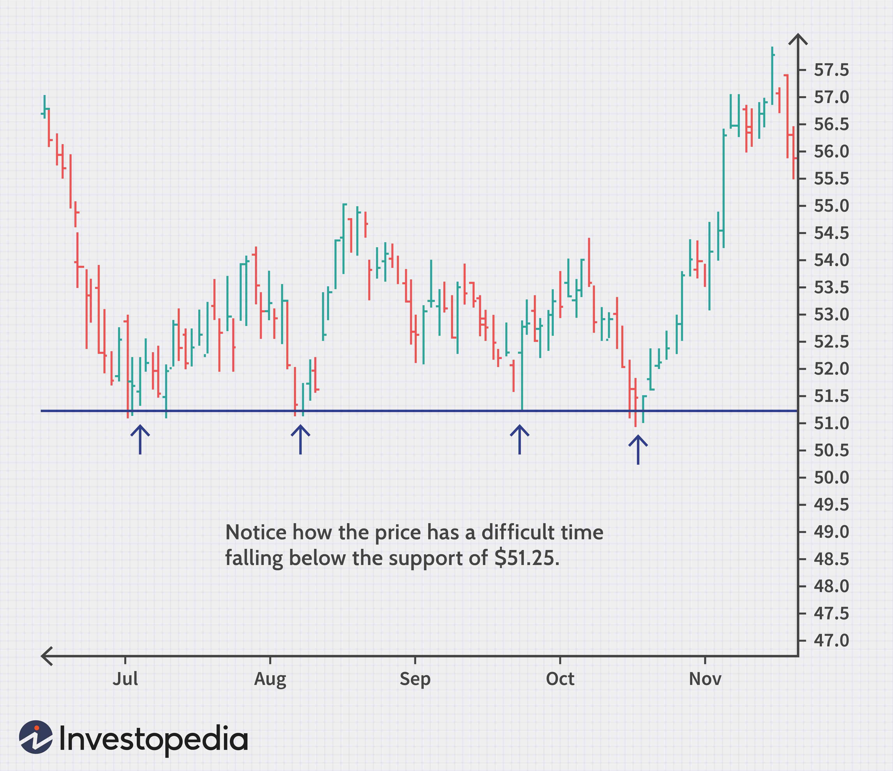

Technical analysis plays a pivotal role in stock trading by focusing on statistical trends gathered from trading activity, such as price movement and volume. Unlike fundamental analysis, which seeks to understand a company's intrinsic value by examining related economic factors, technical analysis seeks to evaluate securities by analyzing historical price charts and other market indicators. Recognizing patterns, such as support and resistance levels, helps traders make informed decisions about when to enter or exit a trade.

Support levels, in particular, are crucial as they represent a price point where a stock tends to stop falling and potentially bounce back. These levels are often seen as buying opportunities because they suggest that the asset is getting support from a significant number of buyers. When traders identify and understand these levels, they can better anticipate potential changes in stock price direction, leading to more effective trading strategies.



The landscape of stock trading has dramatically transformed with the rise of algorithmic trading. This method uses computer programs and algorithms to execute trades at lightning-fast speeds and precision. Unlike traditional manual methods, algorithmic trading can process large swaths of data, identify trends, and execute orders based on complex strategies almost instantaneously. It leverages technical analysis indicators, allowing traders to benefit from automation, speed, and efficiency.

The purpose of this article is to provide traders and investors with a comprehensive overview of technical analysis, focusing on its practical application in modern trading strategies. It aims to enhance their understanding of key concepts like support and resistance levels while introducing the advancements in algorithmic trading that integrate these principles. Readers will gain insights into developing strategies grounded in technical analysis, learn about the intersection of algorithms and traditional techniques, and discover the potential of hybrid strategies that marry human intuition with machine precision. This knowledge is not only crucial for day-to-day trading but also for adapting to an ever-evolving financial landscape.

## Table of Contents

## Understanding Technical Analysis

Technical analysis is a method of forecasting the direction of asset prices through the study of past market data, primarily price and volume. Unlike fundamental analysis, which seeks to understand the intrinsic value of a security based on economic and financial factors, technical analysis focuses on the patterns and movements depicted in historical price charts. The underlying principle is that market psychology and perception manifest through identifiable patterns, which can predict future price behavior.

Historically, technical analysis traces its roots back to the late 19th and early 20th centuries. Charles Dow, co-founder of Dow Jones & Company and editor of The Wall Street Journal, is often credited with its early development. Dow's work, particularly the "Dow Theory," laid the foundation by proposing the concepts of trends and market movements based on historical data. Through the decades, technical analysis has evolved with contributions from figures like Ralph Nelson Elliott, who developed the Elliott Wave Theory, which analyzes market trends through collective investor psychology.

In modern technical analysis, traders employ a variety of tools and indicators to make informed decisions. Key indicators include moving averages, which smooth out price data to identify trends over specified periods, and the Relative Strength Index (RSI), a [momentum](/wiki/momentum) oscillator that measures the speed and change of price movements. For instance, a simple moving average (SMA) is calculated by taking the arithmetic mean of a given set of prices over a specific number of days. The formula for a moving average is:

$$
\text{SMA} = \frac{P_1 + P_2 + ... + P_n}{n}
$$

Where $P_n$ is the price at day $n$ and $n$ is the number of days.

Comparison between technical and [fundamental analysis](/wiki/fundamental-analysis) reveals distinct approaches. While fundamental analysis looks at balance sheets, revenue, and industry position for valuation, technical analysis relies heavily on patterns, [volume](/wiki/volume-trading-strategy), and statistical indicators to guide buy-and-sell decisions, often within shorter time frames.

The benefits of using technical analysis include its objectivity and repeatability; traders can apply the same set of indicators to any market. It is also visually intuitive, allowing quick identification of trends and market setups. However, it comes with limitations. Technical analysis assumes all market information is reflected in price patterns, disregarding external factors like political events or sudden economic changes. Moreover, the approach can sometimes yield false signals due to market [volatility](/wiki/volatility-trading-strategies), leading to potential misinterpretations.

In conclusion, while technical analysis is a powerful tool for traders seeking to analyze market dynamics, it is most effective when used in conjunction with other trading principles and strategies.

## Trading Strategies Based on Technical Analysis

Technical analysis is foundational to many trading strategies, leveraging historical price data to forecast future movements. Common strategies derived from technical analysis include trend-following and breakouts, mean reversion, and contrarian tactics.

Trend-following strategies capitalize on sustained price movements in a particular direction. Traders identify an upward or downward trend and enter trades in the direction of the trend until signs of reversal appear. Key indicators often used in trend-following are moving averages and the Average Directional Index (ADX). For example, the moving average crossover strategy involves buying when a shorter period moving average crosses above a longer period moving average, signifying potential upward momentum.

Breakout strategies aim to enter trades when the price breaks through a significant support or resistance level. A [breakout](/wiki/breakout-trading) is considered a strong signal of continued movement in the breakout direction. For a breakout strategy, traders may set entry points just above the resistance level or just below the support level to capitalize on the expected volatility surge. This technique often uses trading volume to validate the breakout's strength.

In contrast, mean reversion strategies rest on the assumption that prices will revert to their historical average over time. These tactics involve identifying overbought or oversold conditions using indicators like Bollinger Bands or the Relative Strength Index (RSI). For instance, a trader might sell a stock when the RSI suggests it is overbought (above 70) or buy when it is oversold (below 30).

Contrarian approaches bet against prevailing market sentiments and trends. A contrarian trader seeks opportunities where market perception diverges from fundamental or historical valuation, often identifying reversals before the general market consensus acknowledges them. This approach is inherently risky but can yield significant returns when effectively executed.

Real-world examples accentuate the efficacy of technical analysis in trading. For instance, [quantitative trading](/wiki/quantitative-trading) firms like Renaissance Technologies have capitalized on algorithmic implementations of technical strategies to generate substantial profits. This success story underscores the value of data-driven approaches in market speculation.

Risk management and discipline are crucial in executing these strategies. Traders should adhere to stop-loss orders to cap potential losses and use position sizing techniques to manage risk exposure. Psychological discipline in maintaining objectivity and sticking to the strategy rules is equally vital to avoid emotional trading errors.

Overall, technical analysis provides a structured approach to exploit market inefficiencies. Whether pursuing trending markets or betting on reversion, the integration of technical analysis with rigorous risk management can enhance trading performance and decision-making.

## The Role of Stock Support and Resistance Levels

Support and resistance levels are crucial concepts in technical analysis and stock trading. These levels serve as psychological barriers where price action typically pauses and reverses, offering traders valuable insights into potential price movements. A support level is where a downtrend can be expected to pause due to a concentration of buying interest, while a resistance level is where an uptrend can be expected to pause due to selling interest. Identifying these levels aids traders in making informed decisions about entry and [exit](/wiki/exit-strategy) points in trades.

Traders use a variety of methods to identify support and resistance levels. One common approach involves visual chart analysis, where horizontal lines are drawn at price points that have historically shown reversal behavior. Tools such as trend lines, moving averages, and Fibonacci retracement levels are also employed to find these key areas. Historical data analysis plays a critical role in identifying these levels, as past price action can offer predictive insights. For example, if a stock has repeatedly bounced off a certain price point, that price can be considered a support level.

Case studies illustrate the impact of support and resistance on stock prices. For instance, assume a stock repeatedly fails to climb above $50 but consistently finds support at $45. These levels act as resistance and support, respectively. Traders observing these patterns may formulate strategies based on expected reversals around these price points. A breakout above resistance might signal a potential strong upward move, suggesting a buying opportunity.

Incorporating support and resistance into trading strategies involves using these levels to set stop-loss orders and define profit targets. For example, a trader might enter a long position when a stock price approaches a support level, placing a stop-loss order just below this level to manage risk. By contrast, in a short-selling strategy, a trader might sell a stock as it approaches a resistance level, with the expectation of price decline.

Despite their utility, accurately identifying support and resistance levels poses challenges. Market sentiments can shift, causing these levels to break unexpectedly. False signals and whipsaws can lead to premature trade entries or exits. Moreover, varying interpretations among traders can cause inconsistencies in identified levels. To mitigate these challenges, traders often use a combination of technical indicators and seek confirmation signals before acting on perceived support or resistance levels.

In conclusion, understanding and utilizing support and resistance levels can significantly enhance trading strategies. However, traders must approach these levels with caution, combining them with other tools and maintaining flexibility to adapt to market changes.

## Algorithmic Trading and Technical Analysis

Algorithmic trading involves the use of computer algorithms to execute trading decisions at speeds and frequencies beyond human capabilities. Its popularity has surged, driven by the need for efficiency, precision, and the ability to process vast amounts of data in real time. The use of [algorithmic trading](/wiki/algorithmic-trading) is prevalent among hedge funds, institutional investors, and various financial institutions.

Algorithms, or "algos", frequently utilize technical analysis for automated trading decisions. Technical analysis involves analyzing statistical trends gathered from trading activity, such as price movement and volume. Algorithms employ mathematical models and technical indicators to make buy or sell decisions, removing human emotions from the equation. Indicators such as moving averages, relative strength index (RSI), and Bollinger Bands are incorporated into these models to identify trends and potential price movements.

Building technical indicators into trading algorithms requires a systematic approach. Traders first define their trading strategy based on selected indicators. For instance, a simple moving average (SMA) crossover strategy can be implemented as follows: an algorithm could be programmed to buy when the short-term moving average crosses above the long-term moving average, and sell when the opposite occurs. In Python, this could be represented as:

```python
import pandas as pd

def moving_average_strategy(data, short_window, long_window):
    signals = pd.DataFrame(index=data.index)
    signals['signal'] = 0.0

    signals['short_mavg'] = data['Close'].rolling(window=short_window, min_periods=1, center=False).mean()
    signals['long_mavg'] = data['Close'].rolling(window=long_window, min_periods=1, center=False).mean()

    signals['signal'][short_window:] = np.where(signals['short_mavg'][short_window:] > signals['long_mavg'][short_window:], 1.0, 0.0)   
    signals['positions'] = signals['signal'].diff()

    return signals
```

Integrating technical analysis with algo-trading platforms offers multiple benefits, including enhanced speed, reduced errors, and improved [backtesting](/wiki/backtesting) capabilities. Algorithms can process and react to market data far quicker than humans, allowing traders to capitalize on short-lived opportunities. Additionally, the ability to backtest algorithms against historical data helps refine strategies and improve performance, reducing the element of guesswork.

However, considerations and best practices must be followed when using algorithms in trading. One must ensure data quality and system reliability, as inaccurate data or system failures can lead to substantial financial losses. Moreover, traders should implement robust risk management protocols, such as stop-loss orders or portfolio diversification, to mitigate potential downsides. Another critical practice is regularly updating and optimizing algorithms to adapt to changing market conditions, as markets are dynamic and ever-evolving.

In conclusion, while algorithmic trading and technical analysis allow for sophisticated and high-frequency trading strategies, they require a sound understanding of both programming and market fundamentals. The ability to synthesize these aspects can provide a significant edge in today's competitive financial markets.

## Developing a Hybrid Trading Strategy

Combining human insight with algorithmic efficiency presents a powerful approach in modern trading strategies. The fusion of intuitive decision-making and automated precision allows traders to navigate complex market environments more effectively. This hybrid methodology leverages the strengths of both human expertise and algorithmic capabilities, ensuring a comprehensive approach to trading.

### Steps to Create a Hybrid Trading Strategy Using Technical Analysis

1. **Identify Strategy Components**: Begin by outlining the specific technical indicators and patterns to be utilized, such as moving averages, RSI (Relative Strength Index), or MACD (Moving Average Convergence Divergence).

2. **Develop and Backtest Algorithms**: Code the selected indicators and strategies into algorithms using a language like Python, which can leverage libraries like Pandas for data manipulation and TA-Lib for technical analysis. Backtest these algorithms using historical market data to evaluate performance.

   ```python
   import pandas as pd
   import talib

   # Example: Calculate simple moving average
   data = pd.read_csv('market_data.csv')
   sma = talib.SMA(data['close'], timeperiod=20)
   ```

3. **Integrate Human Oversight**: Incorporate checkpoints within the algorithm for trader insights. For instance, setting alert mechanisms for unusual market movements that require human intervention. 

4. **Risk Management Framework**: Implement rigorous risk management protocols. Position sizing, stop-loss levels, and drawdown limits should be coded into the strategy to prevent significant losses.

5. **Iterative Refinement**: Continuously refine algorithms based on performance analysis and market feedback. This involves adjusting parameters and incorporating new data for improved accuracy.

### Ensuring Adaptability and Robustness in Dynamic Market Conditions

Adaptability is crucial for a hybrid trading strategy, particularly in highly volatile markets. Incorporating [machine learning](/wiki/machine-learning) techniques can enhance a strategy's ability to learn and adjust to new patterns. Robustness can be strengthened through stress-testing strategies across various market conditions, ensuring resilience against potential market anomalies.

```python
from sklearn.ensemble import RandomForestClassifier

# Example: Train a model to predict stock movement based on past behavior
features = data[['sma', 'rsi', 'macd']]
target = data['label']  # Assume binary outcome for simplification
model = RandomForestClassifier()
model.fit(features, target)
```

### Tools and Resources for Backtesting and Optimizing Hybrid Strategies

Several platforms offer comprehensive resources for backtesting and optimization, including QuantConnect, MetaTrader, or proprietary brokerage platforms with backtesting capabilities. These tools allow for detailed analysis and refinement of trading strategies by providing access to historical data and simulation environments for strategy testing.

### Testimonials from Traders Successfully Using Hybrid Approaches

Numerous traders have successfully integrated hybrid strategies into their trading processes. John Smith, a seasoned trader, reported that combining his intuitive market insights with algorithmic precision reduced emotional bias and increased his profit margins significantly. Similarly, Lisa Johnson, who specializes in equities, noted a substantial improvement in her trading accuracy and decision-making speed since adopting a hybrid approach.

In conclusion, developing a hybrid trading strategy requires the thoughtful integration of human creativity and algorithmic efficiency. By combining robust technical analysis with advanced computational tools, traders can create adaptable and resilient trading strategies in the ever-evolving financial markets.

## Conclusion

Technical analysis offers a structured approach to understanding market dynamics and predicting future price movements, providing valuable insights for both novice and seasoned traders. Throughout this article, we explored the fundamental principles and tools of technical analysis, such as moving averages and the Relative Strength Index (RSI), along with their application in developing effective trading strategies. We also discussed the critical roles of support and resistance levels, which serve as essential components in shaping trading decisions and managing risk.

As we look to the future, trading strategies based on technical analysis will continue to evolve, particularly with the integration of algorithmic trading. This merger not only enhances the precision and efficiency of executing trades but also opens up new opportunities for innovation. Traders are encouraged to embrace this transformation by continuously refining their strategies and staying informed about the latest technological advancements. The dynamic nature of financial markets necessitates adaptability, making it imperative for traders to remain agile in their approach.

To support a trader's journey of growth, an abundance of resources are available, ranging from online courses and trading forums to advanced analytics platforms. A commitment to lifelong learning enriches a trader’s ability to adapt and perform in ever-changing market conditions. Engaging with educational materials and peer communities can empower investors to enhance their skills and optimize their trading strategies.

In conclusion, the path to successful trading is paved with ongoing practice, disciplined strategy execution, and continual education. By leveraging the principles of technical analysis and integrating them with innovative solutions, traders can build robust strategies that stand the test of time. As the landscape of financial markets evolves, staying informed and proactive will be essential in capitalizing on new opportunities and achieving sustained profitability.

## References & Further Reading

[1]: Bergstra, J., Bardenet, R., Bengio, Y., & Kégl, B. (2011). ["Algorithms for Hyper-Parameter Optimization."](https://papers.nips.cc/paper/4443-algorithms-for-hyper-parameter-optimization) Advances in Neural Information Processing Systems 24.

[2]: ["Advances in Financial Machine Learning"](https://www.amazon.com/Advances-Financial-Machine-Learning-Marcos/dp/1119482089) by Marcos Lopez de Prado

[3]: ["Evidence-Based Technical Analysis: Applying the Scientific Method and Statistical Inference to Trading Signals"](https://www.amazon.com/Evidence-Based-Technical-Analysis-Scientific-Statistical/dp/0470008741) by David Aronson

[4]: ["Machine Learning for Algorithmic Trading"](https://github.com/stefan-jansen/machine-learning-for-trading) by Stefan Jansen

[5]: ["Quantitative Trading: How to Build Your Own Algorithmic Trading Business"](https://www.amazon.com/Quantitative-Trading-Build-Algorithmic-Business/dp/1119800064) by Ernest P. Chan