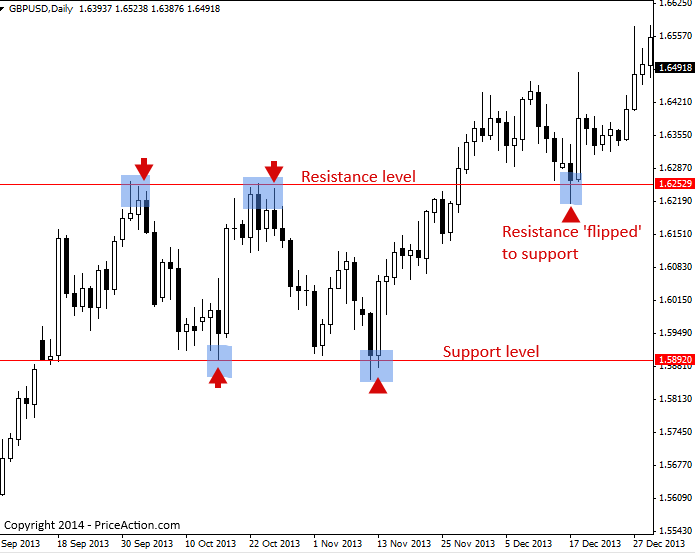

## Table of Contents

## What are stock support levels?

Stock support levels are price points where a stock tends to stop falling and start rising again. They act like a floor that the stock price doesn't usually go below. Traders and investors watch these levels closely because they can be good times to buy the stock. If the stock price reaches the support level and then starts to go up, it might mean that a lot of people think the stock is a good buy at that price.

Support levels are found by looking at past price data. When a stock's price hits the same low point several times and then bounces back up, that price becomes the support level. It's like a pattern that traders learn to recognize. If the stock price falls below the support level, it might mean that the stock is going to keep falling, and traders might decide to sell their shares instead of buying more.

## How do you identify support levels on a stock chart?

To identify support levels on a stock chart, you need to look at the price history of the stock. Start by finding times when the stock price went down to a certain point and then started going up again. If you see that the stock price has hit the same low point multiple times in the past and then bounced back, that price is likely a support level. It's like the stock has a floor that it doesn't usually fall below.

You can also use technical analysis tools to help spot these levels. Many charting platforms have tools that draw lines at the lows of the stock price over time. These lines can help you see where the support levels might be. It's important to look at different time frames, like daily, weekly, or monthly charts, because support levels can change over time. The more times the stock price hits the same low point and bounces back, the stronger the support level is likely to be.

## Why are support levels important for traders?

Support levels are important for traders because they show where a stock might stop falling and start going up again. When a stock reaches a support level, it's like hitting a floor that it doesn't usually go below. Traders watch these levels closely because they can be good times to buy the stock. If the stock price reaches the support level and then starts to go up, it might mean that a lot of people think the stock is a good buy at that price.

If the stock price falls below the support level, it can be a warning sign for traders. It might mean that the stock is going to keep falling, and traders might decide to sell their shares instead of buying more. By understanding where the support levels are, traders can make better decisions about when to buy or sell a stock. This can help them make more money and avoid losing money when the stock price goes down.

## What is the difference between support and resistance levels?

Support and resistance levels are like floors and ceilings for stock prices. A support level is a price where a stock tends to stop falling and start going up again. It's like a floor that the stock doesn't usually go below. Traders watch support levels because they can be good times to buy the stock. If the stock price reaches the support level and then goes up, it might mean that many people think the stock is a good buy at that price.

On the other hand, a resistance level is a price where a stock tends to stop going up and start falling again. It's like a ceiling that the stock doesn't usually go above. Traders watch resistance levels because they can be good times to sell the stock. If the stock price reaches the resistance level and then goes down, it might mean that many people think the stock is too expensive at that price.

Both support and resistance levels are found by looking at past price data. When a stock's price hits the same low point several times and then bounces back up, that's a support level. When it hits the same high point and then goes back down, that's a resistance level. These levels can help traders decide when to buy or sell a stock, which can help them make more money and avoid losing money.

## How can beginners use support levels in their trading strategies?

Beginners can use support levels to help them decide when to buy a stock. A support level is a price where the stock has stopped falling and started going up before. If a beginner sees that the stock is getting close to this price again, it might be a good time to buy. This is because other people might also see the support level and decide to buy, pushing the price up. Beginners should look at the stock's chart to see where the stock has hit the same low price a few times and then gone back up. That's the support level.

But beginners need to be careful too. If the stock price goes below the support level, it might keep going down. This could be a sign to sell the stock or not buy it at all. Beginners should always use support levels along with other information, like news about the company or the overall market. By watching support levels and using them with other tips, beginners can make better choices about when to buy and sell stocks.

## What are common mistakes traders make when using support levels?

One common mistake traders make when using support levels is thinking that a support level will always hold. Sometimes, a stock can go below a support level and keep falling. Traders might buy the stock thinking it will go back up, but if the support level breaks, they could lose money. It's important for traders to be ready for this and not put all their money into one stock just because it's at a support level.

Another mistake is not looking at other things that can affect the stock price. Support levels are helpful, but traders should also pay attention to news about the company, how the whole market is doing, and what other people are saying about the stock. If traders only look at the support level and ignore these other things, they might make bad choices. Using support levels along with other information can help traders make smarter decisions.

Lastly, some traders might not check their support levels often enough. Support levels can change over time as the stock price moves. If traders don't update their charts and look for new support levels, they might miss important changes. It's good to keep an eye on the stock and adjust the support levels as needed to stay on top of things.

## How do support levels affect stock price movements?

Support levels are like floors for stock prices. They are prices where the stock has stopped falling and started going up before. When the stock gets close to this price again, a lot of people might decide to buy it. This can make the stock price go up because more people want to buy it at that price. So, support levels can help the stock price stay up or start going up again.

But if the stock price goes below the support level, it can keep falling. This can make people who were thinking about buying the stock change their minds. They might start selling instead, which can make the stock price go down even more. So, support levels can also show when the stock might keep going down if it goes below that price.

## Can support levels be used in conjunction with other technical indicators?

Yes, support levels can be used with other technical indicators to help traders make better decisions. For example, a trader might look at the moving average of a stock to see its overall trend. If the stock price is near a support level and also close to the moving average, it might be a good time to buy. Another useful indicator is the Relative Strength Index (RSI), which shows if a stock is overbought or oversold. If the stock is at a support level and the RSI is low, it might mean the stock is a good buy because it's oversold.

Using support levels with other indicators can give traders more information to work with. For instance, if a stock is at a support level and the volume of trades is high, it might mean more people are interested in the stock at that price. This could be a sign that the stock price might go up soon. By combining support levels with other technical indicators, traders can get a fuller picture of what might happen to the stock price and make smarter trading choices.

## What advanced techniques can be used to predict the breaking of support levels?

One advanced technique to predict if a support level might break is to watch the trading volume. If the stock gets close to the support level and the volume of trades is very high, it might mean a lot of people are selling. This could push the stock price below the support level. Traders can use volume indicators like the Volume Weighted Average Price (VWAP) to see if the volume is unusually high near the support level. If it is, it might be a sign that the support level could break soon.

Another technique is to use the Relative Strength Index (RSI). The RSI shows if a stock is overbought or oversold. If the stock is at the support level and the RSI is very low, it might bounce back up. But if the RSI stays low even when the stock hits the support level, it might mean the stock is going to keep falling. Traders can also look at the stock's price patterns, like if it makes lower lows and lower highs as it gets close to the support level. This can be a sign that the support level might not hold and the price could go down more.

## How do institutional traders use support levels differently from retail traders?

Institutional traders, like big banks and investment firms, use support levels in a different way than retail traders, who are regular people trading on their own. Institutional traders have a lot more money to spend and can influence the stock price more. They might buy a lot of shares when the stock is at a support level to make the price go up. They also have better tools and more data to help them see where the support levels are and if they might break. Because they can move the market with their big trades, they often use support levels to plan their moves carefully.

Retail traders, on the other hand, have less money to spend and can't influence the stock price as much. They usually watch support levels to find good times to buy or sell a stock. They might use simpler tools and charts to see where the support levels are. Retail traders need to be careful because they can't control the market like institutional traders can. They often follow what the big traders are doing and try to make smart choices based on that.

## What role do support levels play in long-term investment strategies?

Support levels are important for long-term investors because they can help show where a stock might be a good buy. When a stock's price gets close to a support level, it means the stock has stopped falling and started going up before at that price. Long-term investors might see this as a good time to buy the stock, thinking it will go back up again. By buying at a support level, investors can get the stock at a lower price and then hold onto it for a long time, hoping the price will go up over time.

But support levels are not always perfect, and long-term investors need to be careful. Sometimes, a stock can go below a support level and keep falling. If this happens, long-term investors might decide to sell the stock to avoid losing more money. They should also look at other things, like how the company is doing and what's happening in the whole market, to make smart choices. Using support levels along with other information can help long-term investors make better decisions about when to buy and hold stocks.

## How can algorithmic trading strategies incorporate support level analysis?

Algorithmic trading strategies can use support levels to decide when to buy or sell stocks. These strategies use computer programs to watch the stock price and see if it gets close to a support level. If the stock price is near a support level, the program might decide to buy the stock, thinking it will go back up. The program can also check if a lot of people are trading the stock when it's at the support level. If many people are buying, it might be a good sign that the stock will go up soon.

But these programs need to be careful too. Sometimes, the stock price can go below the support level and keep going down. The program can use other information, like how the stock has been doing over time or what other people are saying about the company, to make better choices. By using support levels along with other data, [algorithmic trading](/wiki/algorithmic-trading) strategies can make smarter decisions about when to buy and sell stocks.

## What is Understanding Technical Analysis?

Technical analysis is a method of forecasting the direction of asset prices through the study of past market data, primarily price and volume. Unlike fundamental analysis, which seeks to understand the intrinsic value of a security based on economic and financial factors, technical analysis focuses on the patterns and movements depicted in historical price charts. The underlying principle is that market psychology and perception manifest through identifiable patterns, which can predict future price behavior.

Historically, technical analysis traces its roots back to the late 19th and early 20th centuries. Charles Dow, co-founder of Dow Jones & Company and editor of The Wall Street Journal, is often credited with its early development. Dow's work, particularly the "Dow Theory," laid the foundation by proposing the concepts of trends and market movements based on historical data. Through the decades, technical analysis has evolved with contributions from figures like Ralph Nelson Elliott, who developed the Elliott Wave Theory, which analyzes market trends through collective investor psychology.

In modern technical analysis, traders employ a variety of tools and indicators to make informed decisions. Key indicators include moving averages, which smooth out price data to identify trends over specified periods, and the Relative Strength Index (RSI), a [momentum](/wiki/momentum) oscillator that measures the speed and change of price movements. For instance, a simple moving average (SMA) is calculated by taking the arithmetic mean of a given set of prices over a specific number of days. The formula for a moving average is:

$$
\text{SMA} = \frac{P_1 + P_2 + ... + P_n}{n}
$$

Where $P_n$ is the price at day $n$ and $n$ is the number of days.

Comparison between technical and [fundamental analysis](/wiki/fundamental-analysis) reveals distinct approaches. While fundamental analysis looks at balance sheets, revenue, and industry position for valuation, technical analysis relies heavily on patterns, [volume](/wiki/volume-trading-strategy), and statistical indicators to guide buy-and-sell decisions, often within shorter time frames.

The benefits of using technical analysis include its objectivity and repeatability; traders can apply the same set of indicators to any market. It is also visually intuitive, allowing quick identification of trends and market setups. However, it comes with limitations. Technical analysis assumes all market information is reflected in price patterns, disregarding external factors like political events or sudden economic changes. Moreover, the approach can sometimes yield false signals due to market [volatility](/wiki/volatility-trading-strategies), leading to potential misinterpretations.

In conclusion, while technical analysis is a powerful tool for traders seeking to analyze market dynamics, it is most effective when used in conjunction with other trading principles and strategies.

## References & Further Reading

[1]: Bergstra, J., Bardenet, R., Bengio, Y., & Kégl, B. (2011). ["Algorithms for Hyper-Parameter Optimization."](https://papers.nips.cc/paper/4443-algorithms-for-hyper-parameter-optimization) Advances in Neural Information Processing Systems 24.

[2]: ["Advances in Financial Machine Learning"](https://www.amazon.com/Advances-Financial-Machine-Learning-Marcos/dp/1119482089) by Marcos Lopez de Prado

[3]: ["Evidence-Based Technical Analysis: Applying the Scientific Method and Statistical Inference to Trading Signals"](https://www.amazon.com/Evidence-Based-Technical-Analysis-Scientific-Statistical/dp/0470008741) by David Aronson

[4]: ["Machine Learning for Algorithmic Trading"](https://github.com/stefan-jansen/machine-learning-for-trading) by Stefan Jansen

[5]: ["Quantitative Trading: How to Build Your Own Algorithmic Trading Business"](https://www.amazon.com/Quantitative-Trading-Build-Algorithmic-Business/dp/1119800064) by Ernest P. Chan