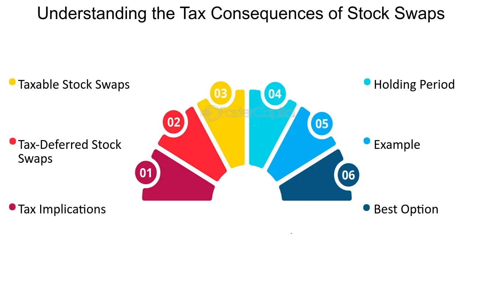

## Table of Contents

## What is a stock swap?

A stock swap is when one company trades its own shares to buy another company instead of using cash. This means the shareholders of the company being bought get shares of the buying company as payment. It's like trading one type of stock for another. Companies might choose to do a stock swap because it can be a good way to grow without spending a lot of cash. It can also be a way to combine two companies that work well together.

Stock swaps can be good for the company doing the buying because they don't have to use their cash reserves. This can be helpful if they want to keep their money for other things, like investing in new projects or saving for emergencies. For the shareholders of the company being bought, a stock swap can be a chance to own part of a bigger or more successful company. But, it can also be risky because the value of the new shares they get might go up or down.

## How does a stock swap work?

A stock swap happens when one company wants to buy another company but instead of using money, it uses its own shares as payment. Imagine Company A wants to buy Company B. Instead of paying cash, Company A gives its own stock to the shareholders of Company B. So, the people who owned Company B now own part of Company A. This is called a stock swap because the shares of one company are swapped for the shares of another.

The process starts with an agreement between the two companies about how many shares of Company A will be given for each share of Company B. This exchange ratio is important because it decides how valuable the deal is for both sides. Once the deal is finalized, Company B's shareholders get new shares of Company A. After the swap, Company A and Company B might combine to work as one bigger company. This can help them grow and maybe become more successful together.

## What are the common reasons for companies to engage in stock swaps?

Companies often choose stock swaps because it helps them save cash. When a company wants to buy another company, it can use its own shares instead of spending money. This way, the buying company keeps its cash for other important things, like new projects or emergencies. It's like trading something you have for something you want without using money. This can be really helpful if the company doesn't have a lot of cash but still wants to grow.

Another reason is that stock swaps can bring two companies together that work well as a team. When the shareholders of the company being bought get shares of the buying company, they become part of a bigger business. This can make the new combined company stronger and more successful. It's like joining forces to do better together. But, it's important to make sure the exchange of shares is fair so everyone feels good about the deal.

## Can you provide a simple example of a stock swap?

Imagine Company A wants to buy Company B. Instead of paying with money, Company A decides to use its own shares to buy Company B. They agree that for every share of Company B, the shareholders will get 2 shares of Company A. So, if someone owns 100 shares of Company B, after the swap, they will own 200 shares of Company A.

After the swap, Company A and Company B combine to work as one bigger company. The shareholders of Company B now own part of this new, bigger company. This can be good for them because they might be part of a more successful business. But, it's also a bit risky because the value of their new shares could go up or down.

## What are the benefits of a stock swap for the acquiring company?

A stock swap is good for the company that is doing the buying because it helps them save their cash. Instead of spending money to buy another company, they use their own shares. This means they can keep their money for other important things, like starting new projects or saving for emergencies. It's like trading something they have for something they want without using money. This can be really helpful if the company doesn't have a lot of cash but still wants to grow.

Another benefit is that a stock swap can help the acquiring company grow bigger and stronger. When they combine with another company, they can work together to do better. The shareholders of the company being bought get shares of the bigger company, so everyone can be part of a more successful business. This can make the new, combined company more powerful and able to do more things. It's like joining forces to achieve more together.

## What are the potential risks or downsides of a stock swaps for shareholders?

Stock swaps can be risky for the shareholders of the company being bought. One big risk is that the value of the shares they get might go down. If the shares of the acquiring company lose value after the swap, the shareholders might end up with less than they had before. It's like trading something valuable for something that might not be as valuable later. This can be worrying because it's hard to know for sure what will happen to the value of the new shares.

Another downside is that shareholders might not like the new company as much as the old one. The business they now own part of might be different from what they wanted to invest in. This can make them feel unhappy with the swap. Also, if the two companies don't work well together after combining, it could make the new company less successful. This could mean the shareholders don't see the growth or success they were hoping for.

## How are stock swaps typically structured in mergers and acquisitions?

In mergers and acquisitions, stock swaps are structured so that one company uses its own shares to buy another company instead of using money. The two companies agree on how many shares of the buying company will be given for each share of the company being bought. This is called the exchange ratio. For example, if the ratio is 2:1, for every share of the company being bought, shareholders get 2 shares of the buying company. Once the deal is finalized, the shareholders of the company being bought exchange their old shares for new shares of the buying company.

After the stock swap, the two companies usually combine to work as one bigger company. This new company can be stronger and more successful because it brings together the resources and skills of both companies. However, the shareholders of the company being bought might feel some risk because the value of their new shares could go up or down. The success of the new combined company depends a lot on how well the two companies work together after the merger.

## What are the tax implications of a stock swap for the shareholders of the acquired company?

When shareholders of the acquired company get new shares from the acquiring company in a stock swap, there can be tax implications. If the stock swap is done in a way that qualifies as a tax-free reorganization under the tax laws, the shareholders usually don't have to pay taxes right away on the exchange of their old shares for new ones. This is good because it means they can swap their shares without worrying about immediate tax bills. However, they will need to keep track of the new shares' value because when they eventually sell these new shares, they might have to pay capital gains tax based on how much the shares have gone up or down in value since the swap.

If the stock swap doesn't qualify as a tax-free reorganization, things can get more complicated. In this case, the shareholders might have to pay taxes on any gain they make from the swap right away. This means if the value of the new shares they get is higher than the value of the old shares they gave up, they could owe taxes on that difference. It's important for shareholders to understand the rules and maybe talk to a tax advisor to know exactly what their tax situation will be after a stock swap.

## How do tax laws differ for stock swaps in different countries?

Tax laws for stock swaps can be very different from one country to another. In the United States, if a stock swap is structured as a tax-free reorganization under the Internal Revenue Code, shareholders don't have to pay taxes right away on the exchange of their shares. They only pay taxes when they sell the new shares they received, and then it's based on any gain or loss from the time of the swap. But if the swap doesn't meet the criteria for a tax-free reorganization, shareholders might have to pay taxes on any gain right away. In Canada, similar rules apply, but there are specific conditions under the Income Tax Act that need to be met for the swap to be tax-deferred.

In the United Kingdom, stock swaps can also be structured to be tax-free under certain conditions, often related to the continuity of business and the type of shares involved. If these conditions are not met, shareholders might face immediate tax on any gains. In contrast, countries like Germany have their own set of rules where stock swaps might be treated as taxable events unless specific exemptions apply, which can depend on the nature of the companies involved and the structure of the deal. Because tax laws can be so different and complex, it's important for shareholders to consult with tax professionals in their country to understand the specific implications of a stock swap.

## What are the accounting treatments for stock swaps?

When a company does a stock swap to buy another company, the accounting treatment can be a bit tricky but important to understand. In a stock swap, the acquiring company gives its own shares to the shareholders of the company it's buying. On the acquiring company's [books](/wiki/algo-trading-books), this means they need to record the value of the company they bought as an asset. This value is usually the fair market value of the shares they gave away. They also need to record the new shares they issued as part of their equity. This can make the acquiring company's total equity go up because they are issuing more shares.

After the stock swap, the two companies combine and become one. The accounting then needs to show this new combined company. The acquiring company needs to add all the assets and liabilities of the company it bought to its own balance sheet. This process is called purchase accounting. They need to make sure everything is valued correctly at the time of the swap. If the value of the company they bought is more than the value of the shares they gave, they might need to record something called goodwill on their balance sheet. Goodwill represents the extra value they think the company they bought will bring to their business. Keeping track of all these numbers helps everyone understand the financial health of the new combined company.

## How do stock swaps affect the market value of the companies involved?

When a company does a stock swap to buy another company, it can change the market value of both companies. For the company doing the buying, the market might see it as a good thing because it's growing without spending cash. This can make the buying company's stock price go up if people think the new, bigger company will do well. But, if the market thinks the buying company paid too much for the other company, the stock price might go down. The value of the buying company's stock can also go down a bit right after the swap because more shares are now out there, which can make each share worth a little less.

For the company being bought, the market value of its stock can change a lot too. Right before the swap, the stock price might go up because people know the company is being bought and they think it's worth more. After the swap, the shareholders of the company being bought get new shares from the buying company. If the new shares are seen as valuable, the market value of the old company's stock can stay high or even go up more. But, if the new shares are not seen as valuable, the market value of the old company's stock can go down. It all depends on what the market thinks about the new, combined company and how well it will do in the future.

## What are some notable historical examples of stock swaps and their outcomes?

One famous example of a stock swap happened in 2000 when America Online (AOL) bought Time Warner. AOL used its own shares to buy Time Warner, which was a big media company. At the time, everyone thought it was a great idea because it would combine the internet power of AOL with the media strength of Time Warner. But, things didn't go as planned. The value of AOL's stock went down a lot after the swap, and the new company, called AOL Time Warner, had a lot of problems. It was one of the biggest and most talked-about failures in business history.

Another example is when Exxon and Mobil did a stock swap in 1999 to become ExxonMobil. Exxon used its shares to buy Mobil, and the two companies combined to make one of the biggest oil companies in the world. This swap was seen as a good move because it made the new company stronger and more able to compete in the oil market. The stock price of ExxonMobil went up after the swap, and the company has been successful ever since. This shows how a stock swap can work well if the companies fit together and the market likes the new, bigger company.

## References & Further Reading

[1]: Bergstra, J., Bardenet, R., Bengio, Y., & Kégl, B. (2011). ["Algorithms for Hyper-Parameter Optimization."](https://dl.acm.org/doi/10.5555/2986459.2986743) Advances in Neural Information Processing Systems 24.

[2]: ["Advances in Financial Machine Learning"](https://www.amazon.com/Advances-Financial-Machine-Learning-Marcos/dp/1119482089) by Marcos Lopez de Prado

[3]: ["Evidence-Based Technical Analysis: Applying the Scientific Method and Statistical Inference to Trading Signals"](https://www.amazon.com/Evidence-Based-Technical-Analysis-Scientific-Statistical/dp/0470008741) by David Aronson

[4]: ["Machine Learning for Algorithmic Trading"](https://github.com/stefan-jansen/machine-learning-for-trading) by Stefan Jansen

[5]: ["Quantitative Trading: How to Build Your Own Algorithmic Trading Business"](https://github.com/LucindaYa/quant-resources/blob/master/Quantitative%20Trading%20How%20to%20Build%20Your%20Own%20Algorithmic%20Trading%20Business.pdf) by Ernest P. Chan