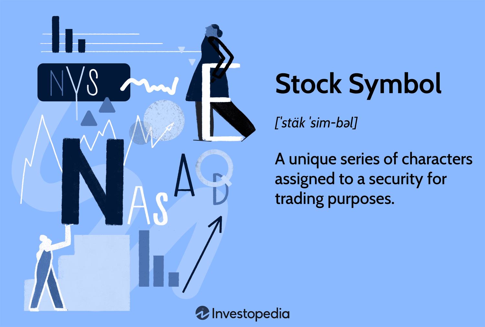

## Table of Contents

## What is a stock symbol?

A stock symbol is a unique series of letters assigned to a company's stock for trading on a stock exchange. It's like a nickname for the company's shares that makes it easy for people to buy and sell them. For example, the stock symbol for Apple Inc. is "AAPL." When someone wants to buy or sell Apple stock, they just need to use this symbol.

Stock symbols help keep things organized on the stock market. They make it quick and simple for traders and investors to find and trade stocks. Each stock exchange has its own rules for creating these symbols, but they usually use a combination of letters. Sometimes, you might see numbers or special characters too, especially for stocks traded outside the U.S.

## What does the .PK suffix on a stock symbol mean?

The .PK suffix on a stock symbol means the stock is traded on the Pink Sheets. Pink Sheets are a platform where companies that don't meet the requirements of bigger stock exchanges can trade their stocks. These companies might be smaller, newer, or from other countries.

Trading on Pink Sheets can be riskier than trading on bigger exchanges. This is because Pink Sheets have less strict rules, so it's harder to find good information about the companies. Investors need to be careful and do extra research before buying these stocks.

## How does a stock end up with a .PK suffix?

A stock ends up with a .PK suffix when it is traded on the Pink Sheets. This happens when a company doesn't meet the requirements to be listed on bigger stock exchanges like the New York Stock Exchange or NASDAQ. These requirements might include things like the company's size, how much money it makes, or how much information it shares with the public. If a company can't meet these rules, it might choose to trade on the Pink Sheets instead.

Trading on the Pink Sheets can be a good option for some companies, especially if they are small or new. But it also means they have to follow fewer rules than bigger exchanges. This can make it harder for investors to find good information about the company. Because of this, stocks with a .PK suffix can be riskier to buy. Investors need to be careful and do more research before deciding to invest in these stocks.

## What types of companies typically have .PK stocks?

Companies that typically have .PK stocks are often smaller or newer businesses that don't meet the strict rules of bigger stock exchanges. These rules can include things like how much money the company makes or how much information it shares with the public. Because they can't list on bigger exchanges, these companies turn to the Pink Sheets to trade their stocks.

Some .PK stocks also come from foreign companies that want to trade in the U.S. but don't meet the requirements of the major exchanges. Trading on the Pink Sheets allows these companies to reach American investors without having to follow all the strict rules of the bigger exchanges.

Overall, .PK stocks can be riskier because they have less oversight and it can be harder to find good information about the companies. Investors need to be careful and do more research before buying these stocks.

## What are the risks associated with investing in .PK stocks?

Investing in .PK stocks can be risky because these companies are often smaller or newer and don't have to follow the same strict rules as bigger companies on major stock exchanges. This means there might be less information available about the company, making it harder to know if it's a good investment. Without the strict rules, there's also a higher chance of running into problems like fraud or misleading information.

Another risk is that .PK stocks can be more volatile. Their prices can go up and down a lot because they are less stable than bigger companies. This can make them a riskier choice for people who don't like big changes in their investments. If you're thinking about buying .PK stocks, it's important to do a lot of research and be ready for the extra risks that come with them.

## How can you buy stocks with a .PK suffix?

To buy stocks with a .PK suffix, you need to use a broker that lets you trade on the Pink Sheets. Not all brokers offer this, so you might need to look around to find one that does. Once you have a broker, you can place an order to buy the .PK stock just like you would with any other stock. You'll need to use the stock's symbol, which ends in .PK, to make sure you're buying the right one.

It's important to do your homework before buying .PK stocks because they can be riskier. These stocks are often from smaller companies or foreign companies that don't have to follow the same strict rules as bigger companies. This means there might be less information available, and the prices can go up and down a lot. So, make sure you understand the risks and feel comfortable with them before you decide to invest.

## What are the differences in trading rules for .PK stocks compared to major exchange stocks?

Trading .PK stocks is different from trading stocks on major exchanges like the New York Stock Exchange or NASDAQ. The main difference is that .PK stocks are traded on the Pink Sheets, which have less strict rules. This means companies on the Pink Sheets don't have to share as much information with the public as companies on bigger exchanges. Because of this, it can be harder to find good information about .PK stocks, which makes them riskier to buy.

Another difference is that .PK stocks can be more volatile. Their prices can go up and down a lot more than stocks on major exchanges. This is because the companies are often smaller or newer, and they don't have the same stability as bigger companies. When you trade .PK stocks, you need to be ready for these big price changes and understand that they can be riskier than stocks on major exchanges.

## Can .PK stocks move to a major exchange? If so, how?

Yes, .PK stocks can move to a major exchange, but it's not easy. The company has to meet a lot of rules that the major exchanges have. These rules might be about how big the company is, how much money it makes, or how much information it shares with the public. If the company can follow all these rules, it can apply to move to a bigger exchange. This is a big step and can help the company grow and be seen by more investors.

When a .PK stock moves to a major exchange, it's usually a good sign. It means the company is doing well and growing. But it takes a lot of work and the company has to keep following the rules of the bigger exchange. If it can do that, moving to a major exchange can help the company get more attention and maybe even make its stock price go up.

## What kind of financial reporting is required for .PK stocks?

Companies with .PK stocks don't have to follow the same strict rules for financial reporting as companies on bigger exchanges. They don't have to share as much information with the public. This means it can be harder for investors to find out important things about the company, like how much money it's making or if it's in good financial health.

Some .PK companies might choose to share more information to help investors feel more comfortable. But they don't have to do this. Because of this, investing in .PK stocks can be riskier. It's important for investors to do a lot of research and be ready for the extra risks that come with these stocks.

## How does the liquidity of .PK stocks compare to stocks listed on major exchanges?

The liquidity of .PK stocks is usually lower than the liquidity of stocks listed on major exchanges. Liquidity means how easy it is to buy or sell a stock without changing its price too much. Because .PK stocks are often from smaller or newer companies, there are fewer people buying and selling them. This means if you want to buy or sell a .PK stock, it might take longer to find someone to trade with, and the price might go up or down more than you expect.

Stocks on major exchanges like the New York Stock Exchange or NASDAQ are usually more liquid. These exchanges have strict rules that companies have to follow, and they attract more investors. More investors mean more people are buying and selling the stocks, so it's easier to trade them quickly without big price changes. If you're thinking about buying or selling stocks, knowing about liquidity can help you make better choices, especially with .PK stocks.

## What historical trends can be observed with .PK stocks?

Historically, .PK stocks have been known for being more risky than stocks on bigger exchanges. They often come from smaller or newer companies that don't have to follow the same strict rules. This means there's less information available about these companies, which can make it harder for investors to know if they're a good choice. Over the years, many .PK stocks have had big ups and downs in their prices because they're less stable. This can be exciting for some investors who like to take risks, but it can also lead to big losses if the stock doesn't do well.

Some .PK stocks have also been linked to problems like fraud or misleading information. Because the rules are less strict, it's easier for bad things to happen. Investors need to be careful and do a lot of research before buying these stocks. On the other hand, some .PK stocks have done really well and even moved to bigger exchanges. When a .PK stock moves to a major exchange, it's usually a good sign that the company is growing and doing better. But this doesn't happen often, and it takes a lot of work for the company to meet the bigger exchange's rules.

## What are some advanced strategies for investing in .PK stocks?

Investing in .PK stocks can be tricky, but some advanced strategies can help. One strategy is to do a lot of research before buying. Because .PK stocks don't have to follow the same strict rules as bigger companies, it's important to look for other sources of information. You can read news articles, company reports, and even talk to other investors to learn more about the company. Another strategy is to focus on companies that are trying to move to a bigger exchange. These companies might be working hard to grow and meet the rules of the bigger exchange, which could make their stock a good choice if they succeed.

Another advanced strategy is to use a technique called dollar-cost averaging. This means you buy a little bit of the stock at different times instead of all at once. This can help you avoid buying all your stock when the price is really high. It also helps you spread out the risk because you're not putting all your money into the stock at one time. Finally, it's smart to keep a close eye on your .PK stocks and be ready to sell if things start to go wrong. Because these stocks can be more volatile, it's important to be ready to act quickly if the price starts to drop a lot.

## References & Further Reading

[1]: ["Advances in Financial Machine Learning"](https://www.amazon.com/Advances-Financial-Machine-Learning-Marcos/dp/1119482089) by Marcos Lopez de Prado

[2]: ["Quantitative Trading: How to Build Your Own Algorithmic Trading Business"](https://www.amazon.com/Quantitative-Trading-Build-Algorithmic-Business/dp/1119800064) by Ernest P. Chan

[3]: ["Machine Learning for Algorithmic Trading"](https://github.com/stefan-jansen/machine-learning-for-trading) by Stefan Jansen

[4]: ["Trillions: How a Band of Wall Street Renegades Invented the Index Fund and Changed Finance Forever"](https://www.amazon.com/Trillions-Renegades-Invented-Changed-Finance/dp/0593087682) by Robin Wigglesworth

[5]: Securities and Exchange Commission (SEC). ["Over-the-Counter Markets."](https://www.sec.gov/about/divisions-offices/division-trading-markets/over-counter-market)

[6]: [Financial Industry Regulatory Authority (FINRA) on the OTC Market.](https://otce-dr.finra.org/otce/home) 

[7]: Harris, L. (2003). ["Trading and Exchanges: Market Microstructure for Practitioners."](https://academic.oup.com/book/52292) Oxford University Press.