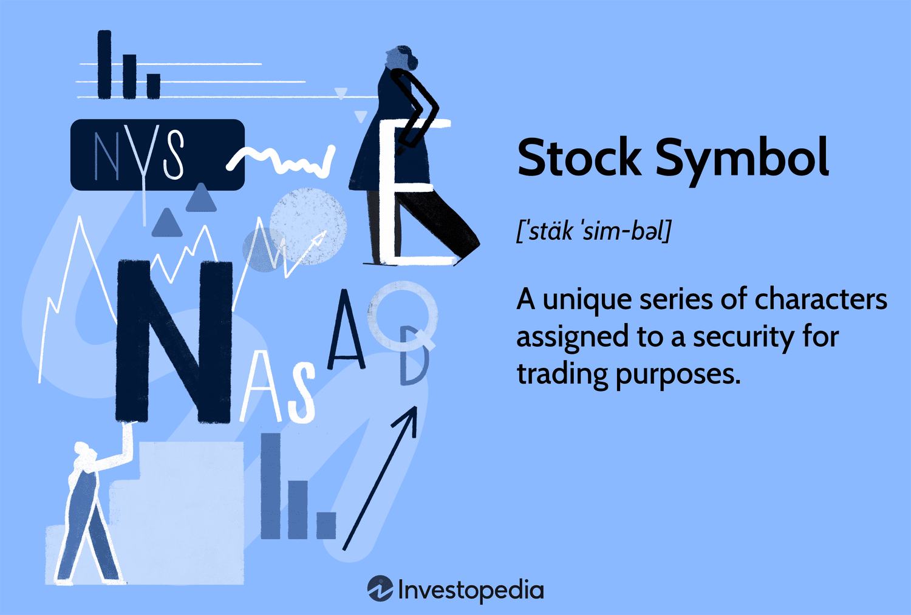

## Table of Contents

## What is a stock symbol?

A stock symbol is a unique set of letters assigned to a company's stock for trading on a stock exchange. It's like a nickname that makes it easy to identify and trade the stock. For example, Apple's stock symbol is AAPL, and Microsoft's is MSFT. These symbols are used by investors and traders to quickly buy or sell shares of a company.

Stock symbols are important because they help keep trading organized and efficient. They are used on stock market displays, in financial news, and on trading platforms. Each country's stock exchange has its own rules for creating these symbols. In the United States, stock symbols usually have one to five letters. Knowing a company's stock symbol is essential for anyone who wants to invest in the stock market.

## How are stock symbols assigned to companies?

Stock symbols are given to companies by the stock exchange where they want to list their stocks. When a company decides to go public and sell its stocks to the public, it applies to a stock exchange like the New York Stock Exchange (NYSE) or the NASDAQ. The exchange then assigns a unique symbol to the company. This symbol is usually made up of letters that are easy to remember and often relate to the company's name or business.

The process of assigning a stock symbol involves checking that the chosen symbol is not already in use by another company. The exchange works with the company to pick a symbol that fits their guidelines. For example, on the NYSE, symbols are usually one to four letters long, while on the NASDAQ, they can be up to five letters. Once the symbol is agreed upon, it becomes the company's official stock symbol used for trading and tracking the stock's performance.

## What is the difference between a ticker symbol and a stock symbol?

A ticker symbol and a stock symbol are basically the same thing. They are short codes made of letters that stand for a company's stock on a stock exchange. People use these symbols to quickly find and trade a company's stock. For example, if you want to buy Apple stock, you would look for the ticker symbol "AAPL."

Sometimes, people might use "ticker symbol" to talk about the old way of showing stock prices on a ticker tape machine. This machine used to print out stock prices on a long strip of paper. But now, with computers and the internet, we mostly see these symbols on screens. Even though the way we see them has changed, the term "ticker symbol" is still used a lot, and it means the same as "stock symbol."

## How can I find the stock symbol for a specific company?

You can find a company's stock symbol by using a search engine like Google. Just type the company's name and "stock symbol" into the search bar. The search results will show you the stock symbol right away. For example, if you search for "Apple stock symbol," you'll see that it's "AAPL."

Another way to find a stock symbol is by going to the website of the stock exchange where the company is listed. If you know the company is on the New York Stock Exchange (NYSE) or NASDAQ, you can visit their websites and use their search tools. Type in the company's name, and the website will give you the stock symbol. This method is useful if you want to check other details about the company's stock, too.

## What do the letters in a stock symbol represent?

The letters in a stock symbol usually stand for the company's name or a part of its name. For example, Apple's stock symbol is "AAPL," which comes from the first letter of each word in "Apple Computer." This makes it easy to remember and connect the symbol to the company. Sometimes, the letters might not be directly from the company's name but still relate to it in some way, like "KO" for Coca-Cola.

Stock exchanges have rules about how long the symbols can be. On the New York Stock Exchange (NYSE), symbols are usually one to four letters long. On the NASDAQ, they can be up to five letters. The exchange makes sure that each symbol is unique so there's no confusion when people are buying or selling stocks. This helps keep trading smooth and organized.

## Can stock symbols change, and if so, why?

Yes, stock symbols can change. This usually happens when a company goes through big changes, like merging with another company or changing its name. For example, if a company called "TechCo" merges with "Innovate Inc.," they might change their stock symbol to reflect the new company name, like "TECHIN."

The stock exchange has to approve any changes to a stock symbol. They make sure the new symbol is not already used by another company and fits their rules. Changing a stock symbol can be confusing for investors, so companies try to keep the same symbol if they can. But sometimes, a new symbol is needed to show that the company is different now.

## How do stock symbols vary internationally?

Stock symbols can be different in different countries because each country has its own stock exchange with its own rules. In the United States, stock symbols on the New York Stock Exchange (NYSE) are usually one to four letters long, while on the NASDAQ, they can be up to five letters. In Canada, the Toronto Stock Exchange (TSX) uses symbols that are usually three to four letters long. These differences help keep things organized and make sure each company has a unique symbol.

In Europe, stock symbols can be even more varied. For example, on the London Stock Exchange (LSE), companies might have a combination of letters and numbers, like "ABC.L" for a company called ABC. In Germany, the Frankfurt Stock Exchange uses a mix of letters and numbers too, but they might look different, like "ABC.DE" for a company called ABC. These variations show how each country's stock exchange has its own way of doing things, but they all serve the same purpose: to help people buy and sell stocks easily.

## What is the significance of the suffix in some stock symbols?

Some stock symbols have a suffix, which is a letter or letters added at the end. This suffix gives extra information about the stock. For example, if you see a stock symbol with a ".W" at the end, it means that stock is a warrant, not a regular share. A warrant gives you the right to buy a stock at a certain price in the future. Another common suffix is ".Q," which shows that the company is in bankruptcy.

These suffixes help investors quickly understand what type of security they are looking at. They make it easier to tell the difference between different kinds of stocks or other financial products from the same company. Knowing what the suffix means can help you make better choices when you are thinking about buying or selling stocks.

## How do stock symbols relate to stock market indices?

Stock symbols are important for stock market indices because they help track the performance of specific companies within an index. An index, like the S&P 500 or the Dow Jones Industrial Average, is a group of stocks that represent a part of the market. Each company in the index has its own stock symbol, which makes it easy to see how well the company is doing. When you look at an index, you can see the stock symbols of all the companies included, and this helps you understand which companies are affecting the index's overall performance.

Indices use stock symbols to show how the market is doing as a whole. For example, if you want to know how the tech industry is doing, you might look at the Nasdaq Composite, which includes many tech companies. Each company in the index has its own stock symbol, and by watching these symbols, you can see if the tech stocks are going up or down. This way, stock symbols help investors and traders make decisions based on the performance of the whole index or specific parts of it.

## What are the implications of a stock symbol change for investors?

When a company changes its stock symbol, it can be a bit confusing for investors at first. They need to update their records and make sure they use the new symbol when they want to buy or sell the stock. If an investor doesn't know about the change, they might try to use the old symbol and end up not being able to trade the stock. This can cause some frustration and might even lead to missed opportunities if the stock price changes quickly.

However, the change in a stock symbol usually means something important is happening with the company. It might be merging with another company, changing its name, or going through a big reorganization. Investors need to pay attention to these changes because they can affect the company's future and its stock price. Understanding why the symbol changed can help investors make better decisions about whether to keep, buy, or sell the stock.

## How can tracking stock symbol changes benefit investment strategies?

Tracking stock symbol changes can help investors stay on top of what's happening with companies they are interested in. When a company changes its stock symbol, it usually means something big is happening, like a merger or a name change. By keeping an eye on these changes, investors can learn about important events that might affect the company's future. This information can help them decide if they should buy more of the stock, sell what they have, or hold onto it and see what happens next.

Knowing about stock symbol changes can also help investors avoid confusion when they want to trade. If an investor doesn't know about a symbol change, they might try to use the old symbol and not be able to buy or sell the stock. This can lead to missed opportunities, especially if the stock price is moving quickly. By staying informed about symbol changes, investors can make sure they are using the right symbol and can act quickly to take advantage of market movements.

## What advanced tools or platforms can I use to monitor stock symbols effectively?

To keep an eye on stock symbols effectively, you can use advanced tools like Bloomberg Terminal. This tool is very popular among professional investors because it gives you a lot of information all in one place. You can see stock prices, news, and even do your own research. It's like having a big library of financial information at your fingertips. Another good tool is the Thinkorswim platform by TD Ameritrade. It has cool features like charts and technical analysis tools that can help you understand how stocks are doing and make better choices about buying or selling.

Another option is using apps like Yahoo Finance or Google Finance. These apps are easy to use and let you track stock symbols on your phone or computer. You can set up alerts so you get a message when a stock's price changes a lot or when there's important news about a company. These tools are great for people who want to stay updated without spending a lot of time or money. By using these advanced tools, you can stay on top of stock symbol changes and make smarter investment decisions.

## References & Further Reading

[1]: Bergstra, J., Bardenet, R., Bengio, Y., & Kégl, B. (2011). ["Algorithms for Hyper-Parameter Optimization."](https://dl.acm.org/doi/10.5555/2986459.2986743) Advances in Neural Information Processing Systems 24.

[2]: ["Advances in Financial Machine Learning"](https://www.amazon.com/Advances-Financial-Machine-Learning-Marcos/dp/1119482089) by Marcos Lopez de Prado

[3]: ["Evidence-Based Technical Analysis: Applying the Scientific Method and Statistical Inference to Trading Signals"](https://www.amazon.com/Evidence-Based-Technical-Analysis-Scientific-Statistical/dp/0470008741) by David Aronson

[4]: ["Machine Learning for Algorithmic Trading"](https://github.com/PacktPublishing/Machine-Learning-for-Algorithmic-Trading-Second-Edition) by Stefan Jansen

[5]: ["Quantitative Trading: How to Build Your Own Algorithmic Trading Business"](https://books.google.com/books/about/Quantitative_Trading.html?id=j70yEAAAQBAJ) by Ernest P. Chan