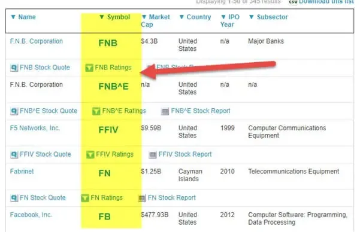

In today's fast-paced financial markets, stock symbols play a crucial role in facilitating the trades of publicly listed companies. As unique identifiers for securities, these symbols are indispensable for the efficient functioning of trading systems and platforms. Understanding stock symbols, along with related concepts like financial market ticker symbols and algorithmic trading, can significantly enhance trading efficiency. By ensuring accurate identification and swift communication of trades, stock symbols help reduce errors and improve the speed of transactions.

Stock and ticker symbols provide essential data inputs to algorithmic trading systems, which utilize complex algorithms to automate trading decisions based on various market parameters. Algorithmic trading, with its capacity to process vast amounts of financial data almost instantaneously, relies heavily on these symbols for making accurate and timely buy or sell decisions. The integration of algorithmic trading with stock symbols enables traders to optimize their strategies and maximize returns, while minimizing risks associated with human error and emotional bias.



This article examines the significance of stock symbols and their functionality within the broader framework of financial markets. It further explores the role of algorithmic trading in optimizing trading decisions. By examining these components, we aim to offer insights into how they collectively shape modern trading landscapes and contribute to the overall efficiency of financial markets. Join us as we unpack the intricacies of these essential market components.

## Table of Contents

## What are Stock Symbols?

Stock symbols, often referred to as ticker symbols, are unique identifiers assigned to publicly traded companies. These abbreviations play a critical role in the trading and identification of a company's shares on financial exchanges. The origins of the term "ticker symbol" date back to the era of ticker tape machines, which used to report stock prices by printing out these symbols on strips of paper known as ticker tape.

The primary function of stock symbols is to streamline transactions and reduce confusion in the marketplace. They achieve this by offering a standardized shorthand for the names of companies, which prevents errors that might arise from similarly named entities. For instance, the Coca-Cola Company is represented by the symbol "KO" on the New York Stock Exchange (NYSE), which is distinct from Coca-Cola Bottling Co. Consolidated, traded as "COKE".

Different exchanges employ varying formats for stock symbols, which is crucial for traders and investors to understand. On the NYSE, symbols are generally shorter, consisting of up to four characters. Conversely, symbols on the Nasdaq Stock Market are usually longer, containing up to five characters to accommodate the broader diversity of tech-driven and emerging companies listed there. For example, Apple Inc. is listed under the symbol "AAPL" on Nasdaq, where the four-letter configuration is common.

International exchanges often have their own conventions as well. For instance, the London Stock Exchange (LSE) uses stock identifiers that can range from three to four characters and occasionally include numbers. This diversity of formats across global exchanges highlights the importance of familiarizing oneself with the particular naming conventions at play when engaging in cross-border trading activities.

Understanding stock symbols' structure is essential for interpreting stock market data accurately. Each symbol acts as a concise representation of a company's equity issuance, allowing traders and financial systems to quickly reference pertinent information regarding the security being traded. This capability is particularly important in today's high-speed trading environments, where decisions often need to be made within microseconds.

Overall, stock symbols serve as fundamental components in the financial markets, enabling efficient communication and transaction processing. Mastery of these identifiers is not only advantageous for individuals directly involved in trading but also for a broader audience interested in comprehending the complexities of global financial markets.

## The Role of Stock Market Tickers

Stock market ticker symbols play a pivotal role in facilitating the flow of real-time data for traders and investors. These symbols allow financial market platforms to convey essential information such as current price, trading [volume](/wiki/volume-trading-strategy), and changes in stock values. This continuous stream of data enables market participants to monitor stock performance efficiently and make informed investment decisions.

A stock ticker typically operates by scrolling continuously on electronic boards or screens, presenting snippets of current market activity. Each ticker symbol is paired with numerical data reflecting the latest trading details, such as price changes and trading volumes. This setup allows traders to quickly assess market trends and react accordingly.

The functionality of stock tickers is further enhanced when integrated with sophisticated trading platforms. These platforms aggregate ticker data, offering comprehensive insights into market conditions. By leveraging algorithms that process massive volumes of real-time information, they provide accurate market analysis. The integration of ticker symbols with technology ensures data is not only presented accurately but is also easily accessible, making it indispensable for any investor looking to execute trades swiftly.

For instance, consider a Python script that can fetch real-time stock prices using an API:

```python
import requests

def get_stock_price(ticker):
    url = f"https://api.example.com/stock/{ticker}/price"
    response = requests.get(url)
    data = response.json()
    return data['price']

# Example usage
ticker_symbol = 'AAPL'
price = get_stock_price(ticker_symbol)
print(f"The current price of {ticker_symbol} is ${price}")
```

This simple code snippet illustrates how tickers can be used in programming to automate data retrieval, thereby facilitating enhanced real-time decision-making.

Additionally, ticker symbols are instrumental in providing historical data that investors can analyze to understand past performance trends and predict future movements. The real-time and historical data provided by these symbols are critical for making informed decisions on buying, selling, or holding stocks.

In conclusion, stock market ticker symbols form a crucial part of the financial ecosystem. By enabling the rapid transmission of key financial metrics, they ensure that traders and investors have the information they need to operate effectively within the market.

 to Algorithmic Trading

Algorithmic trading, often referred to as algo trading, represents a significant evolution in the trading sphere, leveraging the speed and precision of computer algorithms to manage trading decisions and transactions. These algorithms are essentially a set of rules or instructions given to a computer to execute trade orders based on various factors such as price, timing, and volume. The primary advantage of [algorithmic trading](/wiki/algorithmic-trading) is the enhancement of trading speed and accuracy, surpassing the capabilities of human traders.

The basic principles of algorithmic trading involve the utilization of historical data, statistical analysis, and mathematical models to predict market trends and execute trades. Algorithms can be designed to analyze vast amounts of data rapidly—something human traders could not achieve in real-time. This capability allows traders to exploit even minute price inefficiencies across different markets.

A crucial element in algorithmic trading is the use of stock symbols, which serve as unique identifiers for securities in these automated systems. Stock symbols facilitate the retrieval and processing of real-time financial information, which the algorithms analyze to inform buy and sell decisions. For example, an algorithm might be constructed to monitor a specific stock symbol and trigger a buy order when the stock price meets a predetermined condition, such as dropping below its 50-day moving average.

In terms of influence on modern financial markets, algorithmic trading has revolutionized trading practices by allowing for complex strategies such as high-frequency trading, where computers execute numerous trades within seconds. This has led to increased market [liquidity](/wiki/liquidity-risk-premium) and tighter spreads, which can benefit all market participants.

Moreover, algorithmic trading can involve various strategies such as mean reversion, [momentum](/wiki/momentum) trading, and statistical [arbitrage](/wiki/arbitrage). Each strategy utilizes stock symbols differently to gain market insights. For instance, a momentum trading strategy may employ [machine learning](/wiki/machine-learning) models to predict future price movements based on current momentum indicators of various stock symbols.

The simplicity and efficiency of implementing trading strategies using algorithmic methods can be illustrated with a basic Python example that monitors stock prices and executes trades based on predefined criteria:

```python
import numpy as np
import pandas as pd
import yfinance as yf  # For more datasets, visit: https://paperswithbacktest.com/datasets

# Fetch historical stock data using yfinance
data = yf.download('AAPL', start='2022-01-01', end='2023-01-01')

# Calculate moving averages
data['50_MA'] = data['Close'].rolling(window=50).mean()
data['200_MA'] = data['Close'].rolling(window=200).mean()

# Generate signals
data['Signal'] = np.where(data['50_MA'] > data['200_MA'], 1, 0)

# Create trading positions based on the signals
data['Position'] = data['Signal'].diff()

# Display the data with the trading signals
print(data.tail())
```

In conclusion, algorithmic trading integrates stock symbols as fundamental data inputs, enabling high-speed, data-driven trading decisions. This not only enhances market efficiency but also provides traders and investors with a robust tool for executing complex strategies seamlessly.

## Integrating Stock Symbols with Algorithmic Trading

Algorithmic trading systems fundamentally depend on stock symbols to rapidly retrieve and process financial data, facilitating numerous trading strategies. Each stock symbol serves as a unique identifier for a publicly traded security, allowing algorithmic software to access necessary data about that security, such as its trading volume, price, and historical trends. This data is crucial for formulating, testing, and executing trading strategies automatically without human intervention.

In automated trading platforms, stock symbols are embedded within algorithms to execute trades based on predefined conditions. For instance, a basic algorithm might watch for a moving average crossover—a situation where a short-term moving average surpasses a long-term moving average—and execute a buy signal if it occurs. In Python, this could be executed using libraries like Pandas and NumPy to handle data retrieval and processing efficiently:

```python
import pandas as pd
import numpy as np

def moving_average_strategy(data, short_window, long_window, symbol):
    short_mavg = data['Close'].rolling(window=short_window, min_periods=1, center=False).mean()
    long_mavg = data['Close'].rolling(window=long_window, min_periods=1, center=False).mean()

    signals = pd.DataFrame(index=data.index)
    signals['signal'] = 0.0
    signals['signal'][short_window:] = np.where(short_mavg[short_window:] > long_mavg[short_window:], 1.0, 0.0)   
    signals['positions'] = signals['signal'].diff()
    return signals

# Example for symbol 'AAPL'
data = pd.read_csv('AAPL.csv')
signals = moving_average_strategy(data, short_window=40, long_window=100, symbol='AAPL')
```

Data-driven insights and stock symbols converge to enhance trading outcomes by eliminating emotional biases and leveraging statistical patterns. Historical data and real-time updates associated with stock symbols help in [backtesting](/wiki/backtesting) strategies to assess their viability and profitability before live deployment. High-frequency trading ([HFT](/wiki/high-frequency-trading-strategies)) systems further utilize these symbols to conduct thousands of trades per second, capitalizing on minute price discrepancies. This rapid-paced environment requires highly optimized code and low-latency data feeds linking exchanges where symbol identification plays a crucial role.

The integration of stock symbols within algorithmic trading platforms essentially allows for a seamless translation of complex data into actionable trading strategies. As data analysis techniques evolve, more advanced methods, including machine learning algorithms that adapt based on input data, continue to emerge. Such systems not only ensure efficient processing of information related to stock symbols but also facilitate a more nuanced understanding of market dynamics. This dynamic capability positions algorithmic trading at the forefront of modern financial markets, where the correct interpretation and application of stock symbol data can significantly enhance trading performance.

## Challenges and Considerations

Challenges and considerations related to stock symbols and algorithmic trading include a variety of technical and ethical issues that can affect the efficiency and reliability of financial markets.

One primary challenge with stock symbols is the possibility of similar or identical symbols being used across different stock exchanges. For example, the same symbol might represent different companies on the New York Stock Exchange (NYSE) and the NASDAQ, leading to potential confusion. This overlap requires traders to be meticulous in ensuring they reference the correct company when executing trades. Implementing systems to uniquely identify stocks, such as using International Securities Identification Numbers (ISINs), can help mitigate these risks.

Algorithmic trading introduces additional complexities. Technical glitches are a significant risk, as algorithms depend on robust software systems. Errors in code can lead to substantial financial losses within seconds. For example, an algorithm might interpret data incorrectly, triggering incorrect trades. Hence, rigorous testing and monitoring of trading algorithms are essential practices to prevent malfunction.

Market [volatility](/wiki/volatility-trading-strategies) poses another challenge for algorithmic trading. Algorithms might react to volatile conditions in unpredictable or undesirable ways, such as by initiating a sell-off in response to rapidly dropping stock prices. Developers of these algorithms must incorporate robust risk management strategies, like stop-loss mechanisms, to contain potential losses during highly volatile periods.

Ethical considerations are an important aspect of high-frequency trading (HFT) platforms using algorithmic systems. These platforms can create an uneven playing field due to their ability to complete trades in milliseconds, potentially disadvantaging retail investors. The use of HFT can also lead to market manipulation techniques, such as spoofing, where false orders are placed to mislead other traders about supply and demand. Regulatory bodies have implemented rules to curb such practices, but continuous monitoring and adaptation are needed to ensure fair trading environments.

The convergence of technological advancements and ethical awareness is crucial for the sustainable development of algorithmic trading systems. Developers and market participants must prioritize transparency and fairness while harnessing the speed and efficiency offered by these trading strategies.

## Conclusion

Stock symbols, ticker symbols, and algorithmic trading are integral components of the modern financial market, acting collectively to streamline transactions, enhance liquidity, and drive economic growth. The precision and efficiency with which stock symbols represent and differentiate companies allow traders and investors to make quick, informed decisions, thereby minimizing errors and maximizing clarity in a fast-paced environment. Ticker symbols enable real-time display of crucial financial data, which is essential for making informed investment choices. 

Algorithmic trading revolutionizes the financial landscape by automating trading decisions, leveraging stock symbols as critical inputs. The integration of these components optimizes transaction execution speeds and enhances trading accuracy, leading to a more efficient and liquid market. The use of algorithms reduces human error and emotions that might otherwise influence trading decisions, promoting a more stable and predictable market environment.

Moreover, this transformative power extends beyond individual components to their synergistic integration. When stock symbols, ticker data, and algorithmic trading are combined, they create a more cohesive and efficient trading ecosystem. This integration facilitates swift data processing and decision-making, crucial in today's competitive financial markets where milliseconds can significantly impact profitability.

For professionals and enthusiasts aiming to thrive in this landscape, it is crucial to deepen their understanding of these concepts through continuous learning and practice. Engaging with educational resources, attending workshops, and utilizing simulation tools can provide valuable insights and practical experience. By doing so, one can harness the full potential of these technologies, contributing to smarter investment strategies and enhanced market stability. As the financial market continues to evolve, staying informed and adaptive will be key to leveraging these tools effectively.

## References & Further Reading

[1]: Bergstra, J., Bardenet, R., Bengio, Y., & Kégl, B. (2011). ["Algorithms for Hyper-Parameter Optimization."](https://dl.acm.org/doi/10.5555/2986459.2986743) Advances in Neural Information Processing Systems 24.

[2]: ["Advances in Financial Machine Learning"](https://www.amazon.com/Advances-Financial-Machine-Learning-Marcos/dp/1119482089) by Marcos Lopez de Prado

[3]: ["Evidence-Based Technical Analysis: Applying the Scientific Method and Statistical Inference to Trading Signals"](https://www.amazon.com/Evidence-Based-Technical-Analysis-Scientific-Statistical/dp/0470008741) by David Aronson

[4]: ["Machine Learning for Algorithmic Trading"](https://github.com/PacktPublishing/Machine-Learning-for-Algorithmic-Trading-Second-Edition) by Stefan Jansen

[5]: ["Quantitative Trading: How to Build Your Own Algorithmic Trading Business"](https://books.google.com/books/about/Quantitative_Trading.html?id=j70yEAAAQBAJ) by Ernest P. Chan