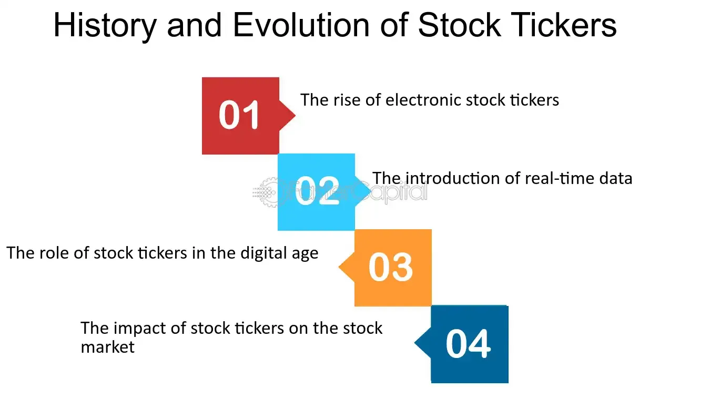

## Table of Contents

## What is a stock ticker?

A stock ticker is a symbol used to identify a company's stock on a stock exchange. It's like a nickname for the company's stock, made up of letters and sometimes numbers. For example, Apple's stock ticker is AAPL, and Microsoft's is MSFT. When you see these symbols, you know which company's stock is being talked about.

Stock tickers are important because they make it easy to track and talk about stocks. Instead of saying the full name of the company every time, people can just use the ticker symbol. This is especially useful in places like stock market news, websites, and apps where space is limited. So, if you want to check how a company's stock is doing, you just need to look up its ticker symbol.

## How does a stock ticker work?

A stock ticker works by showing real-time information about stock prices. It's like a scoreboard for the stock market. When you watch a stock ticker, you see a stream of symbols and numbers scrolling across the screen. Each symbol represents a company's stock, and the numbers next to it show the current price of that stock. The ticker also might show how much the price has changed since the last time it was updated, using arrows or plus and minus signs to indicate whether the price went up or down.

The information on a stock ticker comes from the stock exchanges, like the New York Stock Exchange or Nasdaq. These exchanges collect data about every trade that happens and send it to the ticker. The ticker then displays this data in a way that's easy to read. People use stock tickers to keep an eye on their investments or to see how the market is doing overall. It's a quick way to get a lot of information without having to look at each stock individually.

## What information is typically displayed on a stock ticker?

A stock ticker shows a lot of important information about stocks. It displays the stock's ticker symbol, which is a short code for the company. Next to the symbol, you'll see the current price of the stock. This price changes all the time as people buy and sell the stock. The ticker also shows how much the price has changed since the last update. If the price went up, you might see a plus sign or an up arrow. If it went down, you'll see a minus sign or a down arrow.

Sometimes, the ticker also shows the volume of the stock, which is how many shares were traded recently. This can give you an idea of how popular the stock is at that moment. Another thing you might see is the day's high and low prices, which tell you the highest and lowest prices the stock reached that day. All this information helps people keep track of their investments and see what's happening in the stock market.

## What is the history of the stock ticker?

The stock ticker was invented by Thomas Edison in 1869. Before the ticker, people had to go to the stock exchange to get the latest prices. Edison's machine changed that. It used a telegraph to send stock prices from the exchange to other places. The machine printed the prices on a long strip of paper, which is why it was called a "ticker." The sound of the machine ticking as it printed the prices also helped give it its name.

The first stock ticker was a big deal because it made it easier for people to know what was happening in the stock market without being at the exchange. Over time, the ticker got better and faster. By the early 1900s, the ticker was a common tool for investors. But as technology kept improving, the paper ticker was replaced by electronic screens in the 1960s. Today, we can see stock prices on computers and phones, but the idea of the ticker is still the same: to show real-time stock prices to anyone who wants to see them.

## Who invented the stock ticker and when?

The stock ticker was invented by Thomas Edison in 1869. Before Edison's invention, people had to go to the stock exchange to find out the latest stock prices. Edison's machine used a telegraph to send stock prices from the exchange to other places. It printed the prices on a long strip of paper, which is why it was called a "ticker." The sound of the machine ticking as it printed the prices also helped give it its name.

Edison's stock ticker was a big deal because it made it easier for people to know what was happening in the stock market without being at the exchange. Over time, the ticker got better and faster. By the early 1900s, the ticker was a common tool for investors. But as technology kept improving, the paper ticker was replaced by electronic screens in the 1960s. Today, we can see stock prices on computers and phones, but the idea of the ticker is still the same: to show real-time stock prices to anyone who wants to see them.

## How has the stock ticker evolved from its original form to the digital version we see today?

The stock ticker started with Thomas Edison's invention in 1869. It used a telegraph to send stock prices from the stock exchange to other places. The machine printed the prices on a long strip of paper, making a ticking sound as it worked. This is why it was called a "ticker." People loved it because they could see stock prices without going to the exchange. As time went on, the ticker got better and faster. By the early 1900s, it was a common tool for investors.

Then, in the 1960s, technology changed the ticker again. Instead of paper, electronic screens started showing stock prices. This made it even easier to see the latest information. Today, we can see stock prices on computers and phones. The basic idea of the ticker is still the same: to show real-time stock prices to anyone who wants to see them. But now, it's all digital and much more convenient than the old paper ticker.

## What are the key differences between the traditional ticker tape and modern electronic tickers?

The traditional ticker tape was a long strip of paper that showed stock prices. It was invented by Thomas Edison in 1869 and used a telegraph to send the prices from the stock exchange to other places. The machine made a ticking sound as it printed the prices, which is why it was called a ticker. People had to wait for the paper to come out and then read the prices from it. This made it a bit slow, but it was still a big improvement over having to go to the stock exchange to get the latest information.

Modern electronic tickers are very different. They show stock prices on screens, like TVs, computers, or phones. This means you can see the prices much faster and from anywhere. The information updates in real-time, so you always have the latest prices. Also, electronic tickers can show more information, like charts and graphs, which can help you understand the market better. The main difference is that electronic tickers are faster, more convenient, and can show more information than the old paper ticker tapes.

## How do stock tickers contribute to the transparency and efficiency of financial markets?

Stock tickers make the financial markets more transparent by showing everyone the same information at the same time. When stock prices are displayed on a ticker, anyone can see them. This means that everyone, from big investors to regular people, can make decisions based on the same data. It's like having a big scoreboard that everyone can see, so no one is left out. This openness helps people trust the market more because they know they're seeing the real prices.

Stock tickers also make the markets more efficient. They give people quick and easy access to information about stock prices. When people can see the prices changing in real-time, they can buy and sell stocks faster. This quick trading helps the market work better because prices can adjust to new information more quickly. It's like having a fast lane for information, which helps the market move smoothly and keeps things fair for everyone.

## What are the limitations or potential drawbacks of relying on stock tickers for investment decisions?

Stock tickers can be helpful, but they have some limitations. One big problem is that they only show the price of a stock and how it's changing right now. They don't tell you why the price is going up or down. This means you might see a stock's price change, but you won't know if it's because of good news, bad news, or something else. Without knowing the reasons behind the price changes, it can be hard to make smart investment choices.

Another drawback is that stock tickers can make the market seem too simple. They show numbers and symbols moving quickly, which can make people think that investing is all about watching these numbers. But investing is more complicated than that. It's important to look at a company's financial health, its future plans, and the overall economy. Relying only on a stock ticker might make you miss out on important information that could affect your investments.

## How can investors customize their stock ticker feeds to meet their specific needs?

Investors can customize their stock ticker feeds to focus on what's important to them. Most stock market apps and websites let you choose which stocks you want to see. You can add your favorite companies or the ones you own, so you don't have to look through a long list of stocks that don't interest you. Some apps also let you set up alerts, so you get a notification when a stock's price reaches a certain level. This way, you can keep an eye on your investments without having to watch the ticker all the time.

Another way to customize a stock ticker feed is by choosing what information you want to see. Some platforms let you decide if you want to see just the current price, or if you also want to see the day's high and low, the volume of trades, or even news about the company. This helps you get a fuller picture of what's happening with your stocks. By setting up your ticker feed to show the information you need, you can make better decisions about when to buy or sell.

## What role do algorithms and artificial intelligence play in the operation and analysis of stock tickers?

Algorithms and artificial intelligence (AI) help make stock tickers work better. They can look at a lot of data very quickly and find patterns that people might miss. For example, algorithms can predict how a stock's price might change based on past data. This helps investors see what might happen next. AI can also make the ticker feed more personal. It can learn what stocks you like to watch and show you those first. This way, you don't have to look through a long list of stocks to find the ones you care about.

AI also helps with analyzing the information on stock tickers. It can read news articles and social media posts to see how people feel about a company. This can give investors a better idea of why a stock's price is changing. AI can also make charts and graphs that show the stock's history and trends. This makes it easier for investors to understand what's happening and make smart choices. By using AI, stock tickers can give investors more useful information and help them make better decisions.

## How do regulatory bodies oversee the information displayed on stock tickers to ensure accuracy and fairness?

Regulatory bodies like the Securities and Exchange Commission (SEC) in the United States make sure that the information on stock tickers is correct and fair. They do this by setting rules that stock exchanges and companies have to follow. For example, companies must report their financial information regularly and honestly. If a company lies or hides information, the SEC can punish them. This helps keep the information on stock tickers accurate because everyone has to play by the same rules.

The SEC also watches the stock exchanges to make sure they are showing the right prices. They check that the exchanges are using good technology and that the ticker feeds are working properly. If there's a problem, like a big mistake in the prices, the SEC can step in to fix it. This helps keep the market fair for everyone. By making sure the information on stock tickers is correct and up-to-date, regulatory bodies help investors trust the market and make good choices.

## References & Further Reading

[1]: ["The Man Who Solved the Market: How Jim Simons Launched the Quant Revolution"](https://www.amazon.com/Man-Who-Solved-Market-Revolution/dp/073521798X) by Gregory Zuckerman

[2]: ["Flash Boys: A Wall Street Revolt"](https://en.wikipedia.org/wiki/Flash_Boys) by Michael Lewis

[3]: ["Algorithmic Trading: Winning Strategies and Their Rationale"](https://www.wiley.com/en-us/Algorithmic+Trading%3A+Winning+Strategies+and+Their+Rationale-p-9781118460146) by Ernest P. Chan

[4]: ["Dark Pools: The Rise of the Machine Traders and the Rigging of the U.S. Stock Market"](https://www.amazon.com/Dark-Pools-Machine-Traders-Rigging/dp/0307887189) by Scott Patterson

[5]: ["The Technological Revolution in Financial Markets: How Computers Changed Investing"](https://www.forbes.com/councils/forbesfinancecouncil/2021/11/12/the-great-tech-revolution-trends-that-are-changing-finance-as-we-know-it/) by Edward J. Swan