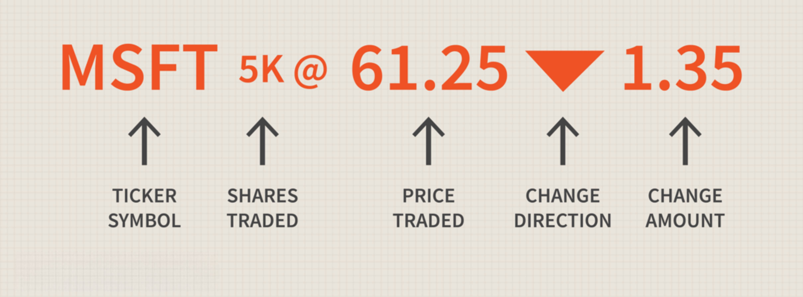

Understanding the stock market is a fundamental aspect for investors, traders, and financial professionals. This intricate financial ecosystem serves as a barometer for global economic health, offering opportunities for wealth creation, risk management, and capital allocation. Central to navigating this complex environment is the stock ticker, which provides swift access to key market data. Stock tickers have long been indispensable tools, enabling the dissemination of real-time information necessary for making informed investment decisions.

The origins of stock tickers date back to the 19th century and represent a major leap forward in financial communication technology. This article will take you through the historical development of stock market tickers and examine how they have been integral to the structure and operation of financial markets. Additionally, we will explore the modern phenomenon of algorithmic trading, which has revolutionized the practice of trading by employing computer algorithms to execute trades based on predefined criteria.



Both stock tickers and algorithmic trading have played pivotal roles in the evolution of financial markets, driving technological advancements that have increased the speed, efficiency, and accessibility of market data. These innovations have reshaped how investors engage with the market, influencing how prices form and how trades are executed. As we explore these topics, we aim to provide a comprehensive understanding of the history and technological progress that have left a lasting imprint on stock markets worldwide.

## Table of Contents

## The Origins of the Stock Ticker

The stock ticker originated in the 19th century, marking a significant advancement in financial communication. Before this innovation, the dissemination of stock prices was a slow and labor-intensive process, often involving handwritten notices and physical delivery of information. The introduction of the stock ticker changed this dynamic dramatically.

Invented by Edward A. Calahan in 1867, the first ticker tape machine revolutionized how stock market information was distributed. Calahan's invention allowed for near-instantaneous updates of stock prices directly to brokers and investors, a crucial feature for making timely and informed decisions in the fast-paced world of finance. This mechanism utilized a telegraph system to transmit data, leading to the continuous printing of stock prices on a narrow strip of paper known as ticker tape. The paper displayed abbreviated company names alongside stock prices and volumes, enabling investors to track market movements with unprecedented speed and accuracy.

Calahan's innovation laid the groundwork for modern financial systems by reducing the time delay between when stock prices changed and when they were communicated to interested parties. Prior to this, stock price information could be hours or even days old by the time it reached investors, rendering it of limited use for immediate decision-making.

Moreover, the stock ticker spurred further technological developments and efficiencies in the financial sector. It marked the beginning of a new era not just for stock trading, but also for communication technology. By providing the ability to communicate rapidly and accurately across distances, it helped close the gap created by geographical and logistical constraints in information dissemination.

The impact of the stock ticker was profound, facilitating a more dynamic and responsive market environment. As a result, it paved the way for the development of sophisticated trading networks and laid the foundation for the electronic trading systems in use today.

## Evolution of Stock Market Tickers

Stock market tickers underwent significant transformation from their mechanical origins to sophisticated digital systems, primarily due to advancements in computer technology. The transition to electronic tickers began in the mid-20th century, marking a pivotal shift that enhanced both the speed and accuracy of financial data dissemination. This transition was driven by the need for faster communication and the ability to process large volumes of data more efficiently.

The first major leap was the development of electronic ticker displays, which replaced the old mechanical tickers that relied on printing stock information on paper strips. These electronic systems utilized circuits and later, digital screens, allowing for a continuous and rapid update of stock prices. This shift not only improved the timeliness of market information but also increased the reliability of the data being reported.

Modern stock tickers now offer a wide array of functionalities that go beyond merely displaying stock prices. They provide real-time quotes and incorporate interactive charts and comprehensive market data. This includes detailed information on trading [volume](/wiki/volume-trading-strategy), high and low prices, and market indices. Platforms such as Bloomberg Terminal and Thomson Reuters Eikon illustrate the capabilities of modern tickers, offering integrated access to financial news, analytics, and trading interfaces.

Technological advancements have also paved the way for platforms that amalgamate various data sources, enabling traders and investors to gain a holistic view of market conditions. The integration of news feeds, analytical tools, and trading capabilities in a single interface underscores the evolution of stock tickers from simple reporting tools to complex financial ecosystems.

This evolution has had a democratizing effect on access to financial information. In the past, timely market data was the preserve of large financial institutions and professional traders. However, with the advent of digital platforms and real-time information dissemination, retail investors now have access to the same data as their professional counterparts. This has leveled the playing field, allowing individual investors to make more informed decisions based on comprehensive market insights.

Overall, the evolution of stock market tickers reflects the broader trend of technological innovation in financial markets, enhancing transparency, accessibility, and efficiency for a diverse range of market participants.

 to Algorithmic Trading

Algorithmic trading involves the use of computer algorithms to automatically execute trades at speeds and frequencies that outpace human capabilities. These algorithms follow a set of predefined rules and criteria to determine when, how, and in what quantity transactions should occur. This technology has rapidly gained popularity due to its efficiency, speed, and ability to manage intricate trading strategies with minimal human intervention.

The core advantage of [algorithmic trading](/wiki/algorithmic-trading) lies in its efficiency. It enables the processing of large volumes of data at high speeds, allowing traders to conduct market analysis and trade execution simultaneously. This efficiency reduces the likelihood of human error and ensures that trading decisions are made based on objective data rather than emotions or subjective judgments. 

Moreover, algorithmic trading is adept at capitalizing on fleeting market opportunities. By using criteria such as price movements, timing, and volume, algorithms can identify and exploit momentary price discrepancies that might not be visible to the human eye or are impossible to act on quickly enough. For instance, an algorithm might be programmed to execute a buy order for a stock when its price dips below a specific threshold and simultaneously sell it if the price rises to a predetermined level.

This transformation has significantly impacted the stock market. Traditional trade execution, which might take several seconds to minutes, is rendered obsolete as algorithms can transact within milliseconds. This capability not only enhances transaction speed but also increases the volume of transactions that can be handled concurrently. A simple example of an algorithm in Python might look like this:

```python
def trade_logic(current_price, buy_threshold, sell_threshold):
    if current_price < buy_threshold:
        return "buy"
    elif current_price > sell_threshold:
        return "sell"
    else:
        return "hold"

current_price = 150.0
buy_threshold = 145.0
sell_threshold = 155.0

trade_action = trade_logic(current_price, buy_threshold, sell_threshold)
print(f"Trade action: {trade_action}")
```

The widespread adoption of algorithmic trading has transformed market dynamics, making them more efficient. However, its profound capabilities also raise challenges regarding market oversight and stability. Nonetheless, its role in the contemporary financial ecosystem is establishing a new standard for trading efficiency and effectiveness.

## Impact of Algorithmic Trading on the Market

Algorithmic trading, commonly known as algo trading, has profoundly affected the structure and dynamics of the financial markets. One of its primary benefits is the enhancement of market [liquidity](/wiki/liquidity-risk-premium). By employing pre-programmed strategies to execute trades at high speeds, algorithmic trading facilitates more buy and sell orders in the market, thereby reducing the bid-ask spread and increasing the depth of the market. This ease of trading results in lower transaction costs for investors, contributing to more efficient market operations.

However, while algorithmic trading offers numerous advantages, it is not without challenges. One significant concern is the increased market [volatility](/wiki/volatility-trading-strategies) associated with rapid, high-frequency trading activities. The occurrence of flash crashes, where the market experiences an extreme drop in asset prices within a very short time frame, exemplifies the potential risks. The infamous flash crash on May 6, 2010, which saw the Dow Jones Industrial Average plunge about 1,000 points in minutes, underscores the disruptive potential of algorithmic trading.

Regulatory bodies across the globe have responded by introducing new measures aimed at ensuring fair market practices and protecting the financial ecosystem from undue instability. These measures include circuit breakers, which temporarily halt trading during significant market drops, and stringent monitoring of algorithmic trading activities to detect manipulation or abuse.

The significant ability of algorithmic trading to execute trades at lightning speeds has reshaped market dynamics considerably. It affects price formations by reacting instantaneously to breaking news and market signals, often leading to increased short-term volatility. The rapid execution of trades can amplify market trends, driving prices away from their fundamental values based on temporary market sentiments.

Despite these benefits and challenges, algorithmic trading continues to raise ethical and regulatory questions. For instance, the use of algorithms for frontrunning or engaging in predatory trading practices poses moral dilemmas and requires vigilant oversight. The ongoing debate emphasizes the need for balanced regulation that mitigates risks without stifling innovation.

In conclusion, while algorithmic trading enhances market efficiency and provides opportunities, it also requires careful management and oversight. Policymakers and market participants must navigate these complexities to ensure a stable and equitable financial market.

## The Future of Stock Tickers and Algorithmic Trading

As technology advances, the landscape of stock tickers and algorithmic trading continues to transform with promising innovations on the horizon. A key area of development is the integration of [artificial intelligence](/wiki/ai-artificial-intelligence) (AI) and [machine learning](/wiki/machine-learning) (ML) into trading systems. These technologies are set to enhance trading efficiency by automating complex decision-making processes and increasing the accuracy of predictive analytics. AI algorithms can analyze vast amounts of data rapidly, identifying patterns and executing trades at optimal times, which is particularly valuable in volatile markets where timing is critical.

Real-time data analytics are becoming increasingly sophisticated, offering insights that were previously unattainable. With advancements in processing power and data storage, modern systems can handle unprecedented volumes of market data, drawing meaningful conclusions to inform trading strategies. For example, sentiment analysis algorithms can now process social media feeds and news articles to gauge market sentiment, which can then be factored into trading decisions. This ability to process and analyze data in real-time allows for a more nuanced understanding of market dynamics and better-informed investment choices.

Sustainable and ethical considerations are playing an increasingly important role in the development of future trading technologies. As environmental, social, and governance ([ESG](/wiki/esg-investing)) criteria gain prominence, algorithmic trading platforms are being designed to incorporate these factors into their decision-making processes. Investors are becoming more conscious of sustainable investing, prompting a shift towards algorithms that can evaluate and prioritize ESG-compliant companies. Furthermore, ethical considerations in AI and ML, such as bias mitigation and transparency, are becoming essential as these technologies gain traction.

In this rapidly changing environment, investors and traders must stay informed and adaptable. Continuous learning and staying abreast of technological advancements are crucial for leveraging these developments effectively. As AI and ML continue to mature, the demand for professionals who understand both financial markets and advanced computational techniques will likely grow. Embracing change and innovation will be key for market participants looking to capitalize on the evolving landscape of stock tickers and algorithmic trading.

## Conclusion

The history and development of stock market tickers and algorithmic trading epitomize human ingenuity and the relentless pursuit of efficiency in financial markets. These tools have not only transformed the way markets operate but continue to drive innovation, offering unprecedented capabilities to both seasoned financiers and retail investors. The integration and evolution of stock market tickers and algorithmic trading have been instrumental in shaping the contemporary landscape of finance, enhancing decision-making processes, and facilitating sophisticated trading strategies.

Understanding these elements' origins and evolution is essential for any investor or trader navigating the modern financial landscape. Grasping the journey from the mechanical stock tickers of the 19th century to the digital, algorithm-driven systems of today provides valuable insights into how far technology has permeated financial systems and altered market operations. This knowledge equips market participants with the context needed to harness these technologies effectively, ensuring that they remain competitive and informed.

As technology continues its rapid march forward, staying updated on trends becomes imperative for leveraging these developments. The continuous infusion of artificial intelligence and machine learning promises to further refine and enhance trading algorithms, making them more adaptive and insightful. This progression is set to increase the precision and speed of trades, optimizing market efficiencies further.

Looking ahead, the future holds exciting prospects for the further integration and enhancement of market technologies. With advancements in real-time data analytics and sustainable trading practices, market participants can anticipate an era of smarter, more ethical trading ecosystems. Staying adaptable and informed will be crucial for capitalizing on these innovations, ensuring that investors and traders can navigate the dynamic financial landscape with confidence and foresight.

## References & Further Reading

[1]: ["The Man Who Solved the Market: How Jim Simons Launched the Quant Revolution"](https://www.amazon.com/Man-Who-Solved-Market-Revolution/dp/073521798X) by Gregory Zuckerman

[2]: ["Flash Boys: A Wall Street Revolt"](https://en.wikipedia.org/wiki/Flash_Boys) by Michael Lewis

[3]: ["Algorithmic Trading: Winning Strategies and Their Rationale"](https://www.wiley.com/en-us/Algorithmic+Trading%3A+Winning+Strategies+and+Their+Rationale-p-9781118460146) by Ernest P. Chan

[4]: ["Dark Pools: The Rise of the Machine Traders and the Rigging of the U.S. Stock Market"](https://www.amazon.com/Dark-Pools-Machine-Traders-Rigging/dp/0307887189) by Scott Patterson

[5]: ["The Technological Revolution in Financial Markets: How Computers Changed Investing"](https://www.forbes.com/councils/forbesfinancecouncil/2021/11/12/the-great-tech-revolution-trends-that-are-changing-finance-as-we-know-it/) by Edward J. Swan