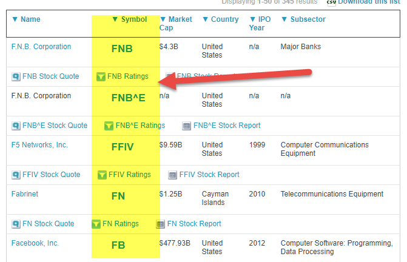

Understanding stock symbols and trading mechanisms is critical for formulating effective investment strategies. This article aims to detail the 'Z' designation within stock ticker symbols, elucidating its implications and its role in algorithmic trading. Stock tickers serve as essential identifiers for publicly traded companies, aiding investors and traders in monitoring market trends and facilitating informed trading decisions. Recognizing these components can significantly enhance investment outcomes and strategies.

Algorithmic trading, a method employing sophisticated algorithms to execute trades at optimal times, is reshaping how trades are conducted by leveraging real-time data and market indicators. The nuances captured by ticker designations like 'Z' offer unique opportunities to refine investment strategies within this context.



To better navigate the intricacies of stock markets, investors must grasp the significance of these financial elements. This understanding not only aids in trading operations but also contributes to maximizing investment returns as the landscape continues to evolve.

## Table of Contents

## What is a Stock Ticker?

Stock tickers are concise, alphanumeric codes assigned to publicly traded companies, serving as a representation on financial exchanges. These symbols are vital in ensuring that investors and traders can easily identify and monitor the performance of various stocks without confusion. Typically, stock tickers consist of one to five letters, with their length and format varying depending on the exchange hosting the company's listing. For instance, on the New York Stock Exchange (NYSE), tickers are commonly composed of one to three letters, whereas the Nasdaq Stock Market often utilizes four-letter tickers.

Beyond mere identification, stock tickers are instrumental in providing real-time data regarding a stock's performance. This includes information such as current price, trading volume, and historical price data. Such data is disseminated across various financial platforms, including stock market tickers on television networks, online investment portals, and trading applications. By representing this data through tickers, investors can quickly gauge how a particular stock is performing, enabling them to make informed decisions regarding buying, holding, or selling their investments.

Understanding and interpreting ticker symbols is essential for effective market analysis and strategy execution. Each ticker symbol acts as a gateway to a plethora of financial data and market insights. As a result, especially for those engaged in frequent trading, the ability to monitor market trends and execute trades efficiently is closely tied to a thorough familiarity with stock tickers. This knowledge can significantly impact an investor's ability to respond to market movements promptly and strategically optimize their investment portfolio.

## Understanding the 'Z' Financial Designation

The letter 'Z' in a stock ticker on the Nasdaq is used to denote a miscellaneous entity, differentiating these stocks from standard common or capital stocks. This designation can often be linked to stocks that are not typical equity shares, such as depositary receipts or other tradable units. The presence of a 'Z' in the ticker symbol provides crucial insights into the security’s nature, which is essential for investors seeking to understand the specifics of their investments.

Depositary receipts, for example, are a type of security issued by a bank that represents a share in a foreign company. These receipts allow investors to hold shares in foreign entities without dealing with currency exchange or foreign regulations. The 'Z' designation indicates that the security has unique attributes or differing regulatory considerations compared to standard equity shares.

Investors must conduct thorough due diligence to ascertain what the 'Z' specifically represents in each case. This is important because the implications of investing in such securities can vary. For example, depositary receipts might have different risk factors or tax implications compared to regular stocks. Therefore, understanding the 'Z' designation is vital for making informed and strategic investment choices. This evaluation could impact the decision-making process, particularly concerning risk assessment and the alignment of the security with the investor's portfolio strategy.

## Algorithmic Trading and Its Impact

Algorithmic trading, often referred to as algo trading, utilizes sophisticated algorithms to automate and optimize the execution of trading orders, enhancing both the speed and efficiency of these operations. This type of trading relies extensively on real-time data feeds and market indicators to make rapid, informed trading decisions. Algorithms are designed to process vast amounts of market data, including stock prices, volumes, and various economic indicators, to identify potential trading opportunities and execute orders without human intervention. This reliance on data makes understanding stock tickers crucial for algo traders, as tickers provide the necessary identifiers for accessing relevant market information.

Algo trading strategies often employ statistical and mathematical models to determine the optimal timing for executing trades, minimizing market impact, and maximizing potential returns. A typical algorithm might analyze historical price patterns, trading volumes, and other factors to predict future price movements and decide when to buy or sell a stock.

One of the advantages of algo trading is its ability to exploit the subtleties embedded within stock ticker symbol designations, such as the 'Z' code. The 'Z' designation, which indicates a miscellaneous entity on the Nasdaq, can provide insights into non-standard securities, such as depositary receipts or other tradable units that might not fit typical stock classifications. By recognizing these nuances, [algorithmic trading](/wiki/algorithmic-trading) systems can tailor their strategies to include or exclude certain securities based on their specific characteristics or compliance requirements. For instance, an algorithm might adjust its trading model to account for the additional risk or regulatory considerations associated with 'Z'-designated securities.

Algo trading also benefits from its capability to execute trades at lightning-fast speeds, which is critical in today's high-frequency trading environment. These systems can process data and execute orders in milliseconds, far outpacing manual trading efforts. This rapid execution ensures that traders can capitalize on short-lived market inefficiencies or respond instantaneously to news events that may affect stock prices.

In practical terms, implementing an algorithmic trading strategy requires robust software infrastructure and a thorough understanding of market dynamics. Developers often use programming languages like Python to create these algorithms due to its extensive libraries for data analysis and [machine learning](/wiki/machine-learning). A simple illustration of a Python-based trading algorithm might involve using libraries such as `pandas` for data manipulation and `numpy` for numerical computations, delivering a streamlined approach to handling and analyzing large datasets.

In summary, algorithmic trading leverages the power of computing to improve trading decisions and execution. Understanding stock tickers, market data, and intricate designations like 'Z' can greatly enhance the effectiveness of automated trading strategies, allowing investors to make more informed and profitable decisions.

## Z vs. Other Letter Designations

The stock market employs various letter designations as suffixes in ticker symbols to denote specific conditions and properties of securities. These suffixes provide critical information that can affect an investor's decision-making. One common suffix is 'Z', typically used on the Nasdaq to signify a miscellaneous entity. This designation often pertains to securities that deviate from standard common stock, such as depositary receipts or other tradable units. Recognizing the significance of 'Z' helps investors assess the unique characteristics or regulatory statuses associated with these securities, which could influence trading strategies or portfolio management.

Another key letter designation is 'E', which alerts investors to an issuer's delinquent filing status with the Securities and Exchange Commission (SEC). This implies that the company has not submitted their required financial statements on time, potentially indicating operational or financial distress. Stocks carrying an 'E' suffix may encounter increased [volatility](/wiki/volatility-trading-strategies) and risk, necessitating a cautious approach from investors.

Understanding these suffixes is crucial for accurately interpreting market data. For instance, the presence of 'Z' or 'E' modifies the typical perception of the stock, necessitating deeper analysis and potentially altering investment strategy. Recognizing and comparing these suffixes against others in the market provides investors with a comprehensive view of the specificities and regulatory compliance of listed securities.

The ability to distinguish between 'Z' and other designations allows investors to make informed decisions and strategize better in the complex landscape of stock trading.

## The Role of Stock Tickers in Automated Investing

In automated investing, stock tickers serve as essential identifiers that facilitate the rapid execution of trades. These symbols function as shorthand for publicly traded companies, allowing algorithms to efficiently sort through extensive data sets and execute trades based on predefined criteria. For instance, when a stock ticker is recognized by an algorithm, the corresponding stock data – such as price, [volume](/wiki/volume-trading-strategy), and historical performance – can be accessed almost instantaneously. This facilitates strategic decision-making processes, which are executed in milliseconds, enabling traders to capitalize on fleeting market opportunities.

Understanding the nuances of ticker designations, such as the 'Z' symbol, is crucial for automated trading systems. These designations often [carry](/wiki/carry-trading) significant implications regarding the nature or status of the securities they represent. Specifically, the 'Z' designation may imply uniqueness in trading units, like depositary receipts, which could affect algorithmic strategy by altering the expected behavior of that security in the marketplace.

Algorithms leverage the consistency and precision of stock tickers to parse crucial data. By incorporating ticker symbols and their unique designations into trading algorithms, investors can customize their automated strategies to react to market conditions more adeptly. This customization often involves setting parameters related to price targets, trading volumes, or even time constraints, which the system uses to decide when to initiate or close positions.

For example, consider a Python script designed for an algorithmic trading strategy that monitors stock tickers:

```python
# Example of a basic automated trading strategy using Python
import yfinance as yf  # For more datasets, visit: https://paperswithbacktest.com/datasets

# Define a function to fetch stock data and make trading decisions
def automated_trading_strategy(ticker):
    stock_data = yf.Ticker(ticker)
    hist_data = stock_data.history(period="1d")

    # Fetch the latest closing price
    closing_price = hist_data['Close'].iloc[-1]

    # Define a simple trading logic based on closing price
    if closing_price > 100:  # Example threshold
        return "Buy"
    elif closing_price < 95:  # Another threshold
        return "Sell"
    else:
        return "Hold"

# Example usage
decision = automated_trading_strategy("AAPL")
print("Trading Decision:", decision)
```

This script demonstrates how stock tickers are integral to the algorithm's functioning by enabling it to fetch and process real-time financial data. The ability of algorithms to adapt based on ticker designations like 'Z' potentially influences the outcomes by tailoring trading decisions to unique stock characteristics, thereby enhancing efficiency and profitability in automated investing.

## Conclusion

Understanding the significance of stock ticker symbols and specific designations, such as 'Z', plays a vital role in enhancing an investor's trading framework. Stock tickers serve as the fundamental identifiers that facilitate the tracking and analysis of market activities, providing crucial insights into the nature of securities. The 'Z' designation, indicating miscellaneous entities, is one of many such identifiers that can inform investment decisions and potentially influence portfolio outcomes.

With the advent and rise of algorithmic trading, the importance of being well-versed in these symbols and designations has become even more pronounced. Algorithmic trading, which depends heavily on real-time data analysis and rapid execution of trades, can harness these nuances to optimize strategies and improve investment returns. Algorithms rely on the precise interpretation of ticker symbols to execute trades based on predefined criteria, making a thorough understanding of these symbols imperative.

Staying informed about these financial elements not only aids in maximizing investment potential but also contributes to a more comprehensive navigation of the stock market's complexities. As financial markets continue to evolve, continued education and awareness of stock symbol significance will remain pivotal for investors aiming to achieve superior trading outcomes. Understanding these components empowers investors to make more informed decisions, thereby enhancing their ability to adapt and thrive in today's dynamic markets.

## Additional Resources

For further reading, explore Investopedia’s detailed guides on ticker symbols and automated trading. These comprehensive resources provide valuable insights into the functions and interpretations of stock symbols, crucial for both new and seasoned investors looking to enhance their market knowledge and trading skills.

Additionally, accessing financial dictionaries and glossaries is recommended to familiarize yourself with essential stock market terminologies. Understanding terms like market order, limit order, and [liquidity](/wiki/liquidity-risk-premium) can help demystify trading processes and symbols, equipping investors with the necessary language proficiency to interpret market data effectively.

Participation in financial forums and investment workshops can also be beneficial for gaining practical insights into dynamic trading strategies. Engaging with a community of investors and traders allows for the exchange of ideas, experiences, and strategies, fostering a deeper understanding of the intricacies involved in stock trading. Through these interactions, you can learn about the latest trends in algorithmic trading and its role in leveraging ticker symbol designations, such as 'Z', to maximize investment returns.

## References & Further Reading

[1]: ["Understanding Stock Ticker Symbols"](https://stockanalysis.com/stocks/) by Nasdaq

[2]: Kissell, R. (2013). ["The Science of Algorithmic Trading and Portfolio Management."](https://www.sciencedirect.com/book/9780124016897/the-science-of-algorithmic-trading-and-portfolio-management) Academic Press.

[3]: Chan, E. (2009). ["Quantitative Trading: How to Build Your Own Algorithmic Trading Business."](https://github.com/ftvision/quant_trading_echan_book) Wiley.

[4]: Aldridge, I. (2013). ["High-Frequency Trading: A Practical Guide to Algorithmic Strategies and Trading Systems."](https://www.amazon.com/High-Frequency-Trading-Practical-Algorithmic-Strategies/dp/1118343506) Wiley.

[5]: ["Depositary Receipts: An Introduction"](https://www.investopedia.com/investing/introduction-depositary-receipts/) by the U.S. Securities and Exchange Commission (SEC)