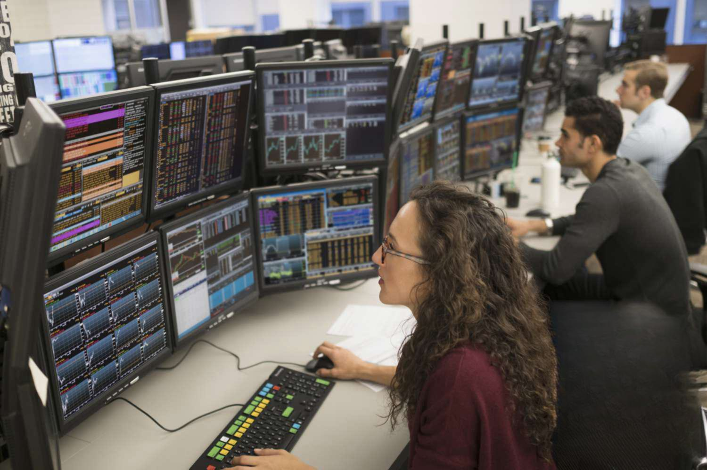

Trading, a cornerstone of financial markets, encompasses a wide array of strategies and participants. The accessibility of stock trading provides both individuals and institutions the opportunity to engage with the market through activities like buying and selling shares of companies. Furthermore, the evolution of technology has ushered in advanced methodologies like algorithmic trading, which leverages computer programs to execute trades at speeds impossible for human traders.

This article dissects the multifaceted nature of trading by examining different types of trading activities, such as day trading and swing trading. It also differentiates between stock traders, who actively manage their investment portfolios in hopes of securing profits from short- or long-term market movements, and stock brokers, who operate by executing trades on behalf of clients.



Algorithmic trading, a powerful tool in modern financial markets, will also be analyzed for its influence on trading strategies, particularly among institutional investors. As market dynamics continually shift, understanding these fundamental principles and advanced techniques becomes crucial for anyone aiming to participate effectively in stock trading or refine their existing strategies.

As the trading landscape continues to evolve, mastering these concepts is essential for individual traders and institutions seeking to navigate the complexities of the financial markets.

## Table of Contents

## What is Stock Trading?

Stock trading involves the buying and selling of shares in companies listed on stock exchanges, with the primary objective of capitalizing on price movements to generate profits. This fundamental financial activity allows participants to own a fractional part of a company, entitling them to benefits such as dividends and appreciation in share value. There are two primary categories of traders: individual traders, commonly referred to as retail traders, and professional traders working within financial institutions.

Individual or retail traders operate independently or through brokerage platforms. These traders typically engage in smaller scale transactions compared to institutional traders, leveraging personal capital and employing a range of strategies, from short-term trading to long-term investing depending on their financial goals, risk tolerance, and market outlook. Retail traders often rely heavily on research, online trading tools, and market news to inform their trading decisions, which are executed through brokerage accounts.

In contrast, institutional traders conduct trades on behalf of large organizations such as banks, hedge funds, pension funds, and insurance companies. These traders typically manage substantial portfolios and access resources such as sophisticated trading algorithms, in-depth market analysis, and privileged market information that are not always available to retail traders. Institutional trading is notable for its potential impact on market [liquidity](/wiki/liquidity-risk-premium) and price discovery due to the large volumes and values involved in these transactions.

Both retail and institutional traders operate within a dynamic environment characterized by price fluctuations driven by factors such as economic indicators, company performance, market sentiment, and geopolitical events. The interactions between these two types of traders contribute significantly to the overall efficiency and liquidity of the stock market.

## Types of Stock Traders

Stock trading encompasses various strategies and time frames, each suited to different trader objectives and market conditions. The diverse landscape of stock trading methodologies includes [day trading](/wiki/day-trading-spy), swing trading, [momentum](/wiki/momentum) trading, and buy and hold trading.

Day Traders specialize in buying and selling securities within the same trading day. This approach requires constant monitoring of the market and the ability to respond quickly as prices fluctuate. Day traders often utilize technical analysis and charting systems to make informed decisions. They aim to exploit small price movements, typically making multiple trades throughout the day. This strategy can be characterized by high transaction volumes and requires a certain degree of experience to manage the associated risks efficiently.

Swing Traders, on the other hand, hold onto stocks for a few days to several weeks, attempting to capitalize on anticipated price shifts. Instead of focusing on daily price changes, swing traders analyze trends and patterns, using both technical and [fundamental analysis](/wiki/fundamental-analysis) to guide their decisions. They seek to benefit from short to medium-term price momentum caused by broader market trends, news releases, or technical patterns.

Momentum Traders pursue stocks displaying significant movement in one direction, either upward or downward, and strive to profit from this momentum. This strategy relies heavily on the identification of stocks experiencing substantial volumes and price movements within a specific timeframe. Momentum traders typically enter positions based on price strength, often supported by news events or earnings announcements that propel the stock’s price. 

Contrasting sharply with the short-term focus of other strategies, Buy and Hold Traders adopt a long-term perspective, investing in stocks they believe will increase in value over an extended period. This approach is less concerned with short-term market fluctuations and more focused on the company’s long-term growth potential and fundamentals. Buy and hold strategy is often advocated by famous investors like Warren Buffett, who emphasize the importance of company analysis over market timing. 

Each type of trader implements a distinctive approach to the stock market, shaped by varying risk tolerances, time commitments, and investment objectives. As a result, traders must thoroughly assess their personal goals and market understanding to select the style that aligns best with their needs.

## Stock Traders vs. Stock Brokers

Stock traders and stock brokers play distinct roles within the stock market, both crucial for the functioning of financial markets, yet vastly different in their responsibilities and objectives. The primary distinction between traders and brokers lies in their core functions and objectives. Stock traders, whether operating as individual retail traders or part of an institutional setup, directly engage in buying and selling stocks with the aim of capitalizing on price movements. Their goal is to generate profits by leveraging market fluctuations, employing strategies ranging from short-term day trading to long-term buy-and-hold investments.

In contrast, stock brokers serve as intermediaries who facilitate trades on behalf of their clients. Brokers are responsible for executing the buy and sell orders initiated by traders and investors. They provide access to stock exchanges and may offer advisory services to assist clients in making informed investment decisions. Brokers earn commissions or fees for providing these services, focusing more on the transaction process rather than the investment outcome.

Understanding the distinction between these roles is essential for individuals looking to effectively participate in the stock market. While traders thrive on market exploration and risk-taking to achieve potential gains, brokers ensure seamless and efficient market access for their clients, supporting them through information and execution services. Whether one is acting as a trader or engaging the services of a broker, recognizing the unique functions and contributions of each role enhances the effectiveness and integration within the stock market ecosystem.

## Understanding Algorithmic Trading

Algorithmic trading, often abbreviated as algo trading, leverages computer algorithms to execute stock trades at rapid speeds based on predetermined criteria such as timing, price, and quantity. This method of trading minimizes the emotional interference often encountered in manual trading, thereby enhancing trade efficiency and consistency. By automating the decision-making process, [algorithmic trading](/wiki/algorithmic-trading) can also reduce costs associated with manual trading errors and human intervention.

The core advantage of algorithmic trading lies in its ability to handle large volumes of securities and process vast amounts of data at extraordinary speeds. The algorithms are typically constructed to exploit market efficiencies or predict future price movements, taking advantage of even minor market shifts that would be impossible to capitalize on manually due to the speed required.

Algorithmic trading is particularly appealing to institutional traders, including investment banks, pension funds, and mutual funds, due to its ability to execute large orders without significantly impacting stock prices—an effect known as market impact. Additionally, these algorithms can operate continuously, adjusting strategies in real-time to adapt to ever-changing market conditions.

An algorithmic trading system generally comprises the following components:

1. **Strategy Identification and Formulation:** The initial step involves identifying a viable trading strategy and translating it into a mathematical model. This model can incorporate statistical techniques, market signals, and historical data patterns to predict future trends.

2. **Automated Signal Generation:** Based on the formulated strategy, the algorithm generates buy or sell signals, indicating optimal trade opportunities. This phase may involve advanced statistical and machine learning models.

3. **Order Execution:** Once a signal is generated, the algorithm efficiently places orders into the market. Efficient execution is vital to capturing the anticipated market advantages, and it often involves further subcomponents such as smart order routing to minimize implementation shortfall.

4. **Risk Management and Monitoring:** Effective algorithms incorporate risk management protocols to prevent excessive losses, including stop-loss orders and dynamic adjustments to market volatility.

Here's a simple example of an algorithmic trading strategy implemented in Python using a moving average crossover strategy:

```python
import pandas as pd
import numpy as np

# Sample data: 'data' should be a DataFrame with a 'Close' price column
def moving_average_strategy(data, short_window=40, long_window=100):
    signals = pd.DataFrame(index=data.index)
    signals['signal'] = 0.0

    signals['short_mavg'] = data['Close'].rolling(window=short_window, min_periods=1).mean()
    signals['long_mavg'] = data['Close'].rolling(window=long_window, min_periods=1).mean()

    signals['signal'][short_window:] = np.where(signals['short_mavg'][short_window:] > signals['long_mavg'][short_window:], 1.0, 0.0)

    signals['positions'] = signals['signal'].diff()

    return signals

# 'data' would be your market data with a 'Close' column
signals = moving_average_strategy(data)
```

This example illustrates a basic algorithm that can generate buy and sell signals based on the crossover of short-term and long-term moving averages, a commonly used technique in algorithmic trading.

Algorithmic trading continues to grow with technological advancements and the increased availability of data, offering new opportunities and challenges. Understanding the mechanics and implications of algorithmic trading is essential for both new and seasoned traders looking to maintain a competitive edge in today's fast-paced financial markets.

## Pros and Cons of Algorithmic Trading

Algorithmic trading, which relies on computer programs to trade stocks, has both advantages and disadvantages that are crucial for traders to consider. Among its primary benefits is the speed at which trades can be executed. Algorithms can place trades within fractions of a second, significantly faster than any human trader could manage. This rapid execution can be pivotal in capturing price efficiencies and responding to real-time market changes. High precision is another key advantage, as algorithms can execute trades at exact price points, minimizing slippage and ensuring that trades are carried out exactly as intended.

Furthermore, algorithmic trading reduces emotional decision-making, which can often lead to impulsive or irrational trading choices. By relying on predefined rules and criteria, algorithms ensure that trades are executed consistently, adhering to strategy without deviation due to psychological biases. This can lead to improved consistency in order execution, maintaining alignment with the trader's overall strategy.

However, algorithmic trading is not without its drawbacks. A significant reliance on technology means that technical failures, such as system crashes or connectivity issues, can disrupt trading activities. Such failures can result in missed opportunities or unintended trades, potentially leading to financial losses. Moreover, algorithms are typically designed based on historical data and specific market conditions. They may not adapt well to sudden, unexpected changes in the market environment, such as extreme [volatility](/wiki/volatility-trading-strategies) or economic events that deviate from historical patterns. This rigidity can sometimes result in substantial losses if the market shifts rapidly in ways that the algorithm was not programmed to handle.

Lastly, the implementation and maintenance of algorithmic trading systems often require substantial resources and expertise, which may not be feasible for all traders, particularly individual or smaller-scale operators. These systems necessitate continuous monitoring and adjustment to remain effective and competitive in the ever-evolving financial markets.

## Conclusion

The trading landscape is broad and diverse, offering various paths for traders whether they prefer the traditional or the automated approach. Traditional trading encompasses strategies such as day trading, swing trading, momentum trading, and buy-and-hold investing, each with its unique characteristics and approaches to the stock market. On the other hand, automated trading, primarily through algorithmic strategies, leverages technological advancements to optimize speed, accuracy, and efficiency in executing trades.

The integration of algorithms in trading is anticipated to expand as technology develops, making it crucial for traders to grasp both the benefits and limitations of these tools. Algorithms can process vast amounts of data quickly, execute trades at high speed, and minimize the emotional biases that often accompany human decision-making. However, they also demand extensive technical knowledge and can be prone to systemic risks or failure if not properly managed or monitored.

Regardless of the chosen trading strategy, success in the stock market requires a foundation of knowledge and preparation. Traders must continuously educate themselves about market dynamics, economic indicators, and the implications of technological tools on trading outcomes. Effective risk management and a solid understanding of market trends remain indispensable for achieving long-term success.

As the market continues to evolve, traders prepared to adapt to emerging trends and technologies will likely find themselves best positioned to capitalize on new opportunities. Balancing innovation with informed decision-making represents the path forward for contemporary traders in an ever-changing financial landscape.

## FAQs

### What is the main difference between a stock trader and a stock broker?

A stock trader and a stock broker hold distinct roles in the financial markets. A stock trader is an individual or professional who buys and sells stocks for the purpose of making a profit. Traders analyze market conditions, make decisions based on their research and strategies, and execute trades accordingly. They operate either independently or on behalf of a financial institution.

In contrast, a stock broker acts as an intermediary between traders and the stock market. Brokers facilitate the buying and selling of stocks by executing trades on behalf of their clients. They provide clients with access to the markets, offer advice, and often help manage portfolios. Brokers earn commissions or fees from the transactions they handle.

### Can individuals engage in algorithmic trading?

Yes, individuals can engage in algorithmic trading. With the advent of technology and increased access to sophisticated trading platforms, retail investors have the ability to develop and deploy algorithmic trading strategies. However, developing effective algorithms requires a sound understanding of both programming and financial markets. Knowledge in programming languages such as Python and data analytics is essential for creating and testing algorithms that can potentially enhance trading performance.

Here is a simple example in Python to illustrate a basic moving average crossover strategy:

```python
import pandas as pd

# Assume we have historical stock data in a DataFrame called 'data'
# 'data' has columns 'Date', 'Close'
data['SMA50'] = data['Close'].rolling(window=50).mean()  # 50-day moving average
data['SMA200'] = data['Close'].rolling(window=200).mean()  # 200-day moving average

def check_for_crossover(row):
    if row['SMA50'] > row['SMA200']:
        return 'Buy'
    elif row['SMA50'] < row['SMA200']:
        return 'Sell'
    else:
        return 'Hold'

data['Signal'] = data.apply(check_for_crossover, axis=1)

# Now 'data' contains buy/sell signals based on the moving average crossover strategy
```

### Is algorithmic trading more suited for certain types of securities?

Algorithmic trading can be applied to a wide range of securities, including stocks, options, futures, and [forex](/wiki/forex-system). However, it is particularly effective in markets with high liquidity and volatility, where rapid execution of trades can be advantageous. Stocks of large-cap companies and major currency pairs in forex often meet these criteria, making them favorable for algorithmic trading. Additionally, certain algorithmic strategies may be specifically tailored to commodity markets or other niche areas, depending on the trader’s goals and expertise.

### What are the risks associated with algorithmic trading?

Algorithmic trading, while offering many advantages, also carries certain risks:

1. **Technology Dependency**: Relying heavily on technology means that system malfunctions, connectivity issues, or hardware failures can lead to significant losses.

2. **Market Conditions**: Algorithms are designed based on historical data and assumptions, which may not hold during unexpected market conditions. Markets can behave unpredictably, and algorithms may fail to account for these anomalies.

3. **Overfitting**: Developing algorithms tailored too closely to historical data can result in overfitting, where the model excels in past scenarios but performs poorly in real-time trading.

4. **Regulatory Risks**: Different jurisdictions have varying regulations regarding algorithmic trading, and failure to comply can lead to legal complications.

### How can beginners get started with stock trading or algorithmic trading?

Beginners interested in stock or algorithmic trading should consider the following steps:

1. **Educate Yourself**: Understand the basics of financial markets, trading instruments, and risk management. Online courses, books, and tutorials can provide valuable insights.

2. **Learn Programming**: Acquire basic programming skills, particularly in Python, as it is widely used in algorithmic trading for data analysis and strategy development.

3. **Use Simulation Tools**: Practice trading with paper trading accounts or simulation tools offered by brokers to gain experience without risking real capital.

4. **Develop a Strategy**: Start with simple trading strategies, test them rigorously using historical data, and refine as needed. Utilize libraries like `pandas` for data manipulation and `backtrader` for backtesting in Python.

5. **Start Small**: When ready to trade with real money, begin with a small amount and gradually scale as confidence and experience grow.

6. **Stay Updated**: Continuously monitor and update algorithms based on new market data and changes, ensuring they remain effective under varying conditions.

## References & Further Reading

[1]: Bergstra, J., Bardenet, R., Bengio, Y., & Kégl, B. (2011). ["Algorithms for Hyper-Parameter Optimization."](https://dl.acm.org/doi/10.5555/2986459.2986743) Advances in Neural Information Processing Systems 24.

[2]: ["Advances in Financial Machine Learning"](https://www.amazon.com/Advances-Financial-Machine-Learning-Marcos/dp/1119482089) by Marcos Lopez de Prado

[3]: ["Evidence-Based Technical Analysis: Applying the Scientific Method and Statistical Inference to Trading Signals"](https://www.amazon.com/Evidence-Based-Technical-Analysis-Scientific-Statistical/dp/0470008741) by David Aronson

[4]: ["Machine Learning for Algorithmic Trading"](https://github.com/stefan-jansen/machine-learning-for-trading) by Stefan Jansen

[5]: ["Quantitative Trading: How to Build Your Own Algorithmic Trading Business"](https://www.amazon.com/Quantitative-Trading-Build-Algorithmic-Business/dp/1119800064) by Ernest P. Chan