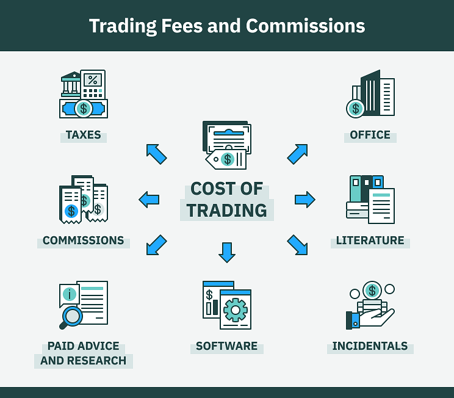

## Table of Contents

## What is a stock trader?

A stock trader is someone who buys and sells stocks, which are shares in a company. They do this to try to make money. Stock traders look at the prices of stocks and decide when to buy or sell them. They might do this every day or hold onto stocks for a longer time.

There are different types of stock traders. Some traders work for big companies, like banks or investment firms. Others trade on their own, using their own money. No matter what type of trader they are, they all need to understand the stock market and how it works. They also need to keep up with news and events that can affect stock prices.

## What are the different types of stock traders?

There are several types of stock traders. One type is the day trader. Day traders buy and sell stocks within the same day. They try to make quick profits from small changes in stock prices. Another type is the swing trader. Swing traders hold onto stocks for a few days or weeks. They try to make money from bigger changes in stock prices over a short period of time.

Another type of trader is the position trader. Position traders hold onto stocks for months or even years. They believe in the long-term growth of a company and want to benefit from that growth. Lastly, there are scalpers. Scalpers make many trades in a day, trying to make tiny profits from very small price changes. Each type of trader has a different way of looking at the stock market and making decisions.

All these traders need to understand the stock market well. They also need to know how to manage risk. Some traders use special tools and computer programs to help them make decisions. No matter what type of trader they are, they all need to keep learning and staying updated on market news and trends.

## How does a day trader differ from a swing trader?

A day trader and a swing trader both buy and sell stocks, but they do it in different ways. A day trader buys and sells stocks within the same day. They look for small changes in stock prices and try to make quick profits from these changes. Day traders might make many trades in one day, and they usually don't hold onto stocks overnight. This type of trading can be exciting but also risky because the stock market can be unpredictable.

On the other hand, a swing trader holds onto stocks for a few days or weeks. They look for bigger changes in stock prices over a short period of time. Swing traders might not make as many trades as day traders, but they aim to make larger profits from each trade. This type of trading can be less stressful than [day trading](/wiki/day-trading-spy) because they don't have to watch the market as closely every day. Both types of traders need to understand the stock market well and manage their risks carefully.

## What is the role of a stock broker?

A stock broker is a person who helps people buy and sell stocks. They work for a brokerage firm and act as a middleman between the buyer and the seller. When someone wants to buy or sell a stock, they tell the stock broker what they want to do. The stock broker then uses their computer system to make the trade happen. They also give advice to their clients about which stocks to buy or sell based on their research and knowledge of the market.

Stock brokers need to understand the stock market very well. They have to keep up with news and events that can affect stock prices. They also need to know about different types of stocks and how to manage risk. Some stock brokers work with big investors, like banks or investment firms, while others help individual people. No matter who they work with, their main job is to help their clients make smart decisions about buying and selling stocks.

## How do stock traders and stock brokers differ in their functions?

Stock traders and stock brokers have different jobs in the world of stocks. A stock trader is someone who buys and sells stocks to try to make money. They might do this every day, like a day trader, or hold onto stocks for a longer time, like a position trader. Traders need to understand the stock market well and keep up with news that can change stock prices. They can work for big companies or trade on their own.

A stock broker, on the other hand, helps people buy and sell stocks. They work for a brokerage firm and act as a middleman between the buyer and the seller. When someone wants to buy or sell a stock, they tell the stock broker, who then uses their computer system to make the trade happen. Stock brokers also give advice to their clients about which stocks to buy or sell. They need to know a lot about the stock market and help their clients make smart decisions.

## What qualifications are needed to become a stock trader?

To become a stock trader, you don't need a specific degree, but having a strong background in finance, economics, or business can be very helpful. Many successful stock traders have at least a bachelor's degree in one of these fields. They also often have a good understanding of math and [statistics](/wiki/bayesian-statistics), which helps them analyze stock market data and make smart decisions. Some traders choose to get a master's degree or an MBA to learn even more about the financial world.

Besides education, becoming a good stock trader takes a lot of practice and experience. Many traders start by working for a financial company or a brokerage firm to learn the ropes. They need to keep up with the latest news and trends in the stock market and be able to think quickly and make decisions under pressure. It's also important for stock traders to be disciplined and good at managing risk. Over time, with hard work and dedication, anyone can become a successful stock trader.

## What are the typical tools and platforms used by stock traders?

Stock traders use many tools and platforms to help them buy and sell stocks. One common tool is a trading platform, like E*TRADE or Robinhood. These platforms let traders see stock prices in real-time, make trades, and keep track of their investments. They often have charts and graphs that help traders understand how stock prices are moving. Some platforms also have tools that let traders set up alerts for when a stock reaches a certain price.

Another important tool for stock traders is a stock screener. A stock screener helps traders find stocks that meet certain criteria, like a certain price or a certain level of growth. This can save traders a lot of time because they don't have to look through all the stocks themselves. Many traders also use financial news websites and apps, like Bloomberg or CNBC, to stay updated on what's happening in the market. These tools help traders make smart decisions about when to buy and sell stocks.

Some traders also use special software called trading algorithms. These are computer programs that can make trades automatically based on certain rules. For example, a trading algorithm might be set up to buy a stock when its price goes below a certain level. This can help traders take advantage of opportunities in the market even when they're not watching it all the time. All these tools and platforms help stock traders do their job better and make more informed decisions.

## How do stock traders manage risk?

Stock traders manage risk by using different strategies. One common way is by setting stop-loss orders. A stop-loss order is like a safety net that tells the computer to sell a stock if its price drops to a certain level. This helps traders limit how much money they can lose on a trade. Another way traders manage risk is by not putting all their money into one stock. They spread their money across different stocks, which is called diversification. If one stock goes down, they won't lose all their money because they have other stocks that might go up.

Traders also use something called position sizing to manage risk. This means they decide how much money to put into each trade based on how much risk they are willing to take. If a trade seems very risky, they might put less money into it. Another important part of managing risk is doing a lot of research. Traders look at a company's financial health, news about the company, and what other people think about the stock. By understanding these things, they can make better decisions and avoid big losses.

## What are the common strategies employed by professional stock traders?

Professional stock traders use different strategies to make money. One common strategy is called technical analysis. This means they look at charts and graphs to see how stock prices have moved in the past. They use this information to guess where the prices might go next. Another strategy is [fundamental analysis](/wiki/fundamental-analysis). This means they study a company's financial health, like its profits and debts, to decide if its stock is a good buy. Some traders also use a mix of both strategies to make their decisions.

Another strategy is called [momentum](/wiki/momentum) trading. This is when traders buy stocks that are going up quickly and sell them when they start to go down. They believe that stocks that are moving fast will keep moving in the same direction for a while. Some traders also use a strategy called [arbitrage](/wiki/arbitrage). This means they buy a stock in one place and sell it in another place where the price is higher. This can make a quick profit if done right. All these strategies help traders try to make money in the stock market.

Lastly, some traders use a strategy called hedging. This means they buy or sell other investments to protect themselves from losing money on their stocks. For example, they might buy an option that goes up in value if their stock goes down. This can help them limit their losses. Each trader might use different strategies based on what they think will work best for them. The key is to understand the market well and use the right tools and knowledge to make smart decisions.

## How does the regulatory environment affect stock traders and brokers?

The regulatory environment is very important for stock traders and brokers. It sets rules that they have to follow when they buy and sell stocks. These rules are made by groups like the Securities and Exchange Commission (SEC) in the United States. The rules help make sure that the stock market is fair and that people don't cheat. For example, there are rules against insider trading, which is when someone uses secret information to make money. If traders or brokers break these rules, they can get in big trouble, like paying fines or even going to jail.

These rules also affect how traders and brokers do their jobs every day. They have to keep good records of all their trades and report them to the regulators. This helps the regulators keep an eye on the market and make sure everything is going right. The rules can also change how much risk traders and brokers can take. For example, there might be rules about how much money they can borrow to buy stocks. All these rules can make the job of a stock trader or broker more complicated, but they are important for keeping the stock market safe and fair for everyone.

## What are the potential earnings and career paths for stock traders versus stock brokers?

Stock traders can make a lot of money, but their earnings can also change a lot. Some traders make a lot of money in a good year, but they might lose money in a bad year. How much they earn depends on how well they do in the stock market. If they work for a big company, they might get a salary and bonuses based on their performance. If they trade on their own, their earnings come straight from their profits. A successful stock trader might start their own trading firm or move into a higher position in a financial company.

Stock brokers usually have a more stable income than stock traders. They often get a salary from the brokerage firm they work for, and they might also earn commissions from the trades they help their clients make. The more trades they help with, the more money they can make. Over time, a stock broker might become a senior broker or a manager at their firm. Some brokers might also start their own brokerage firm or move into other areas of finance, like financial advising or investment banking. Both careers can lead to good earnings and different paths, but they depend a lot on how well someone does in their job and how the stock market is doing.

## How have technological advancements influenced the roles of stock traders and brokers?

Technological advancements have changed the way stock traders and brokers do their jobs. For stock traders, computers and the internet have made it easier to buy and sell stocks quickly. They can use trading platforms and apps to see stock prices in real-time and make trades from anywhere. Special software called trading algorithms can even make trades automatically, which helps traders take advantage of opportunities in the market even when they're not watching it all the time. These tools have made trading faster and more efficient, but they also mean traders need to learn how to use them well.

For stock brokers, technology has also made a big difference. They can use online platforms to help their clients buy and sell stocks without having to talk to them in person. This has made it easier for brokers to reach more clients and help them make trades quickly. But it also means brokers need to know how to use these platforms and keep up with new technology. Overall, technology has made the jobs of both stock traders and brokers more efficient, but it has also made them more complex and competitive.

## References & Further Reading

[1]: Bergstra, J., Bardenet, R., Bengio, Y., & Kégl, B. (2011). ["Algorithms for Hyper-Parameter Optimization."](https://dl.acm.org/doi/10.5555/2986459.2986743) Advances in Neural Information Processing Systems 24.

[2]: ["Advances in Financial Machine Learning"](https://www.amazon.com/Advances-Financial-Machine-Learning-Marcos/dp/1119482089) by Marcos Lopez de Prado

[3]: ["Evidence-Based Technical Analysis: Applying the Scientific Method and Statistical Inference to Trading Signals"](https://www.amazon.com/Evidence-Based-Technical-Analysis-Scientific-Statistical/dp/0470008741) by David Aronson

[4]: ["Machine Learning for Algorithmic Trading"](https://github.com/stefan-jansen/machine-learning-for-trading) by Stefan Jansen

[5]: ["Quantitative Trading: How to Build Your Own Algorithmic Trading Business"](https://www.amazon.com/Quantitative-Trading-Build-Algorithmic-Business/dp/1119800064) by Ernest P. Chan