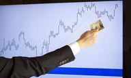

## Table of Contents

## What is a stock trading bot and how does it work?

A stock trading bot is a computer program that automatically buys and sells stocks without a human having to do it. It uses special rules and math to decide when to buy or sell. People use these bots because they can work all the time and make decisions very quickly, which can be hard for a person to do.

These bots work by looking at a lot of information about stocks, like their prices and how they are doing in the market. They use this information to follow the rules they were given. For example, if a stock's price goes up to a certain point, the bot might sell it. Or if the price goes down to another point, the bot might buy more. This way, the bot can try to make money by trading stocks without needing someone to watch it all the time.

## What are the basic programming languages used for developing stock trading bots?

The most common programming languages used for developing stock trading bots are Python, Java, and C++. Python is very popular because it is easy to learn and has many libraries that help with data analysis and machine learning, which are important for making trading decisions. Libraries like Pandas for data manipulation and Scikit-learn for machine learning can make it easier to build a smart trading bot.

Java is another good choice because it is fast and can handle a lot of data at once. This is important for trading bots that need to make quick decisions based on real-time market data. Java is also used a lot in big financial systems, so it can work well with other tools that traders might use.

C++ is used when speed is really important. It is a bit harder to learn than Python or Java, but it can make trading bots run very fast. This can be a big advantage in the stock market where every second can count. People who want their bots to react to the market as quickly as possible often choose C++.

## How can one start learning to develop a stock trading bot?

To start learning to develop a stock trading bot, you should first learn a programming language like Python. Python is easy to learn and has a lot of tools that can help you with trading. You can find many free online courses and tutorials to learn Python. Once you know the basics of Python, you can start learning about libraries like Pandas and Scikit-learn. These libraries will help you work with data and make smart trading decisions. It's also a good idea to practice by working on small projects that use these libraries.

Next, you need to learn about the stock market and how trading works. You can read [books](/wiki/algo-trading-books) or take online courses about stock trading to understand the basics. It's important to know about things like stock prices, trading volumes, and market trends. Once you have a good understanding of both programming and trading, you can start building your own trading bot. Start with a simple bot that follows basic rules for buying and selling stocks. As you get better, you can make your bot more complex by adding more rules and using [machine learning](/wiki/machine-learning) to make better trading decisions.

## What are the essential components of a stock trading bot?

A stock trading bot needs a few important parts to work well. The first part is the data collection system. This part gets information about stocks, like their prices and how they are doing in the market. The bot uses this information to make decisions. Another important part is the decision-making system. This system uses rules or math to decide when to buy or sell stocks. It can be simple, like buying when a stock's price goes down to a certain point, or it can use machine learning to make more complex decisions.

The third part is the trading interface. This is how the bot actually buys and sells stocks. It needs to connect to a stock exchange or a trading platform to make trades. The bot also needs a way to keep track of its trades and how much money it is making or losing. This part is called the performance tracking system. It helps you see if the bot is working well or if it needs to be changed.

The last part is the user interface. This is how you talk to the bot and tell it what to do. You might want to change the rules the bot is using or see what it is doing. A good user interface makes it easy to control the bot and understand what it is doing. All these parts work together to make a stock trading bot that can trade stocks on its own.

## How do you connect a stock trading bot to a brokerage API?

To connect a stock trading bot to a brokerage API, you first need to sign up for an account with a brokerage that offers an API. Many brokerages like [Interactive Brokers](/wiki/interactive-brokers-api), Robinhood, and E-Trade have APIs that let you trade stocks automatically. Once you have an account, you will get an API key. This key is like a special password that lets your bot talk to the brokerage's computer. You need to put this key into your bot's code so it can use the API.

After you have your API key, you need to write code that uses the API to buy and sell stocks. The API will have special commands that your bot can use to check stock prices, place orders, and see how your trades are doing. You need to learn these commands and put them into your bot's code. Once your bot can use the API, it can start trading on its own. Just make sure to test it first with fake money to see if it works right before using real money.

## What are the common strategies implemented in stock trading bots?

One common strategy used in stock trading bots is called [trend following](/wiki/trend-following). This means the bot looks at the price of a stock over time and tries to find a pattern. If the price is going up, the bot will buy the stock because it thinks the price will keep going up. If the price is going down, the bot will sell the stock because it thinks the price will keep going down. This strategy is simple and can work well if the market keeps moving in one direction for a while.

Another strategy is called mean reversion. This strategy is based on the idea that stock prices will go back to their average price over time. If a stock's price goes up a lot, the bot might sell it because it thinks the price will go back down to the average. If the price goes down a lot, the bot might buy it because it thinks the price will go back up to the average. This strategy can be good in markets that move up and down a lot.

A third strategy is using machine learning. Bots that use this strategy look at a lot of data about stocks, like their prices, trading volumes, and news about the companies. The bot uses this data to learn how to make good trading decisions. It can find patterns that are hard for people to see and use them to buy and sell stocks. This strategy can be very powerful but it needs a lot of data and computer power to work well.

## How can you backtest a stock trading bot's strategy?

To backtest a stock trading bot's strategy, you need to use old stock market data to see how your bot would have done in the past. You can get this data from places like Yahoo Finance or other financial websites. Once you have the data, you run your bot's trading rules on it to see what trades it would have made and how much money it would have made or lost. This helps you see if your strategy works well or if you need to change it.

Backtesting is important because it lets you test your bot without using real money. You can try different rules and see which ones work best. It's like practicing before playing a game for real. But remember, just because a strategy works in the past doesn't mean it will work in the future. The stock market can change a lot, so you need to keep testing and updating your bot's strategy.

## What are the risks associated with using stock trading bots?

Using stock trading bots can be risky. One big risk is that the bot might make bad trades because it follows rules that don't work well in the real market. The stock market can change a lot, and what worked in the past might not work now. If the bot makes a lot of bad trades, you could lose a lot of money. Another risk is that the bot might make trades too fast or too often. This can lead to high trading fees, which can eat into your profits or even make you lose money.

Another important risk is technical problems. The bot might have bugs or it might stop working because of a computer problem. If this happens while the bot is trading, it could cause big losses. Also, if someone hacks into the bot or the brokerage it uses, they could steal your money or make the bot do bad trades. It's important to keep the bot safe and to watch it closely to make sure it's working right.

## How can you optimize the performance of a stock trading bot?

To optimize the performance of a stock trading bot, you need to keep testing and changing its rules. You can use [backtesting](/wiki/backtesting) to see how the bot would have done in the past with different rules. If the bot loses money with certain rules, you can change them to see if it does better. It's also important to keep learning about the stock market and how it changes. As you learn more, you can make the bot's rules smarter and better.

Another way to optimize the bot's performance is to use more data. The more information the bot has about stocks, like prices, trading volumes, and news, the better it can make trading decisions. You can also use machine learning to help the bot learn from the data and find patterns that are hard for people to see. This can make the bot's trading decisions more accurate and help it make more money. Just remember to keep watching the bot and making changes as needed to keep it working well.

## What are the regulatory considerations when deploying a stock trading bot?

When you use a stock trading bot, you need to think about the rules that control trading. Different countries have different rules about who can trade and how they can trade. For example, some places might say you need a special license to use a trading bot. You also need to make sure your bot follows rules about how often it can trade and what kinds of trades it can make. If you don't follow these rules, you could get in trouble with the law.

Another important thing to think about is making sure your bot doesn't do anything that could hurt the market. Some rules are there to stop people from doing things like making the market go up or down on purpose. Your bot should not trade too fast or too much, because this could be seen as trying to control the market. It's a good idea to talk to a lawyer or someone who knows about trading rules to make sure your bot is doing everything right.

## How do you handle real-time data processing in stock trading bots?

Handling real-time data in stock trading bots is really important because the stock market changes all the time. The bot needs to get new information about stock prices and trading volumes as soon as it's available. This is usually done by connecting the bot to a stock exchange or a trading platform that gives out real-time data. The bot uses this data to make quick decisions about buying and selling stocks. It's like trying to catch a fast-moving ball; the bot needs to be fast and accurate to do well.

To make sure the bot can handle real-time data well, you need to use a programming language that can work quickly, like Python or C++. The bot also needs to be able to process a lot of data at the same time without slowing down. This can be hard, but there are special tools and libraries that can help. For example, in Python, you can use libraries like Pandas to work with data quickly. It's also important to test the bot a lot to make sure it can keep up with the fast-changing market and make the right decisions in time.

## What advanced machine learning techniques can be applied to enhance stock trading bot performance?

One advanced machine learning technique that can help make a stock trading bot better is called [deep learning](/wiki/deep-learning). Deep learning uses special kinds of math called neural networks to find patterns in data. These patterns can be very hard for people to see. A stock trading bot can use deep learning to look at a lot of information about stocks, like their prices, how much they are being traded, and even news about the companies. By finding these hidden patterns, the bot can make smarter decisions about when to buy and sell stocks, which can help it make more money.

Another technique is called [reinforcement learning](/wiki/reinforcement-learning). This is like teaching the bot to trade by letting it learn from its own mistakes. The bot makes trades and then sees if it made money or lost money. If it made money, it learns to do more of what it did right. If it lost money, it learns to do less of what it did wrong. Over time, the bot gets better at trading because it keeps learning from what it does. This can make the bot very good at adapting to changes in the market and finding the best ways to trade.

## What is Backtesting and Optimization?

Backtesting involves the application of trading strategies to historical data to determine their effectiveness and viability. This process serves as a critical step in the development of [algorithmic trading](/wiki/algorithmic-trading) systems, allowing traders to evaluate how a strategy would have performed in the past and to gauge its potential for future success. The reliability of backtesting depends on the quality and granularity of historical data. Therefore, it is essential to use accurate and representative data sets that reflect real market conditions.

Optimization is closely related to backtesting and involves fine-tuning the parameters of a trading strategy to enhance its performance. The goal of optimization is to identify the set of parameters that yield the best results on historical data while avoiding overfitting, which occurs when a model is too closely tailored to specific past data and performs poorly on new, unseen data. Techniques such as cross-validation and walk-forward optimization can help in achieving a balance by checking the model's performance on different subsets of data.

Statistical measures play a pivotal role in the evaluation of strategy performance. The Sharpe ratio, for example, is a popular metric used to assess the risk-adjusted return of an investment strategy. It is calculated as follows:

$$
\text{Sharpe Ratio} = \frac{E[R] - R_f}{\sigma_R}
$$

where $E[R]$ is the expected return of the strategy, $R_f$ is the risk-free rate, and $\sigma_R$ is the standard deviation of the strategy's excess return. A higher Sharpe ratio indicates better risk-adjusted returns, making it a crucial tool in comparing and selecting trading strategies.

The process of backtesting and optimization can be effectively implemented using programming languages like Python, which offers libraries such as pandas, NumPy, and [backtrader](/wiki/backtrader) that streamline these tasks. A basic Python snippet to calculate the Sharpe ratio might look like this:

```python
import pandas as pd

# Example returns data
returns = pd.Series([0.01, 0.02, -0.01, 0.015, -0.005])

# Define risk-free rate
risk_free_rate = 0.0003

# Calculate excess returns
excess_returns = returns - risk_free_rate

# Calculate Sharpe Ratio
sharpe_ratio = excess_returns.mean() / excess_returns.std()

print(f'Sharpe Ratio: {sharpe_ratio}')
```

Ultimately, backtesting and optimization provide a robust framework for developing and refining algorithmic trading strategies, enabling traders to make informed decisions and enhance their system's performance.

## References & Further Reading

[1]: Bergstra, J., Bardenet, R., Bengio, Y., & Kégl, B. (2011). ["Algorithms for Hyper-Parameter Optimization."](https://dl.acm.org/doi/10.5555/2986459.2986743) Advances in Neural Information Processing Systems 24.

[2]: ["Advances in Financial Machine Learning"](https://www.amazon.com/Advances-Financial-Machine-Learning-Marcos/dp/1119482089) by Marcos Lopez de Prado

[3]: ["Evidence-Based Technical Analysis: Applying the Scientific Method and Statistical Inference to Trading Signals"](https://www.amazon.com/Evidence-Based-Technical-Analysis-Scientific-Statistical/dp/0470008741) by David Aronson

[4]: ["Machine Learning for Algorithmic Trading"](https://github.com/stefan-jansen/machine-learning-for-trading) by Stefan Jansen

[5]: ["Quantitative Trading: How to Build Your Own Algorithmic Trading Business"](https://www.amazon.com/Quantitative-Trading-Build-Algorithmic-Business/dp/1119800064) by Ernest P. Chan