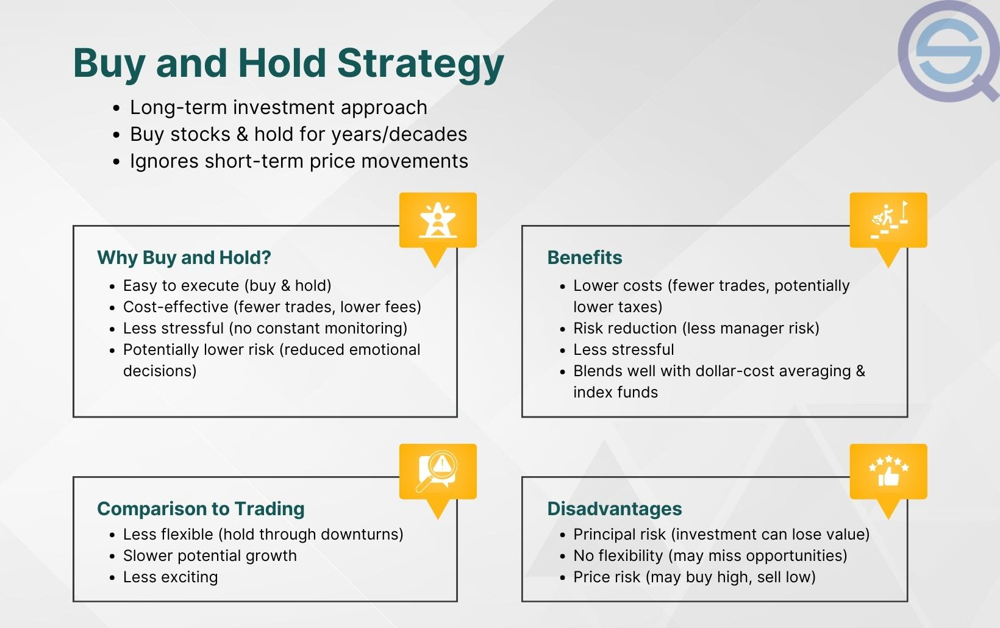

## Table of Contents

## What are the basic concepts of stock trading?

Stock trading involves buying and selling shares of a company. When you buy a stock, you are buying a small piece of that company. The goal is to buy stocks at a low price and sell them at a higher price to make a profit. The price of a stock can go up or down based on how well the company is doing, news about the company, or what is happening in the economy.

There are two main types of stock trading: long-term investing and short-term trading. Long-term investing means you buy stocks and hold onto them for a long time, like years or even decades. You believe the company will grow and the stock price will increase over time. Short-term trading, also called day trading, is when you buy and sell stocks quickly, often within the same day. You are trying to take advantage of small changes in the stock price to make quick profits.

Both types of trading have risks. The stock market can be unpredictable, and you might lose money if the stock price goes down after you buy it. It's important to do your research and understand the companies you are investing in. You should also think about how much risk you are comfortable with and maybe talk to a financial advisor to help you make good decisions.

## How do you determine when to buy a stock?

When deciding when to buy a stock, it's important to look at the company's overall health and future potential. You should check things like the company's earnings, how much money they make, and if they are growing. It's also good to see what experts say about the company and the industry it's in. If the company is doing well and you think it will keep doing well, it might be a good time to buy the stock.

Another thing to think about is the stock's price. You want to buy the stock when it's at a good price, not when it's too expensive. Look at the stock's price history and compare it to other companies in the same industry. Sometimes, the stock might be cheaper because of bad news, but if you believe the company will recover, it could be a good time to buy. Remember, it's not just about buying low; it's about buying a stock that you think will go up in value over time.

## What factors should influence a decision to sell a stock?

When you're thinking about selling a stock, one big thing to look at is how the company is doing. If the company's earnings are going down or they're having other problems, it might be time to sell. Another thing to think about is if the stock's price has gone up a lot. If you think the price might not go up anymore or might even go down, selling could be a good idea. Also, if you need money for something else, you might have to sell some of your stocks.

Sometimes, things change in the world or in the economy that can make you want to sell a stock. For example, if there's a big change in the industry the company is in, or if there's a new law that could hurt the company, you might decide to sell. It's also important to think about your own goals. If you started with a plan to sell the stock after it reached a certain price or after a certain amount of time, sticking to that plan can help you make a good decision.

In the end, selling a stock is about balancing risk and reward. You want to sell before the stock's price drops too much, but you also don't want to sell too early and miss out on more gains. It's a good idea to keep an eye on the stock and the company, and to think about why you bought the stock in the first place. If those reasons don't hold up anymore, it might be time to sell.

## When is it appropriate to hold onto a stock?

Holding onto a stock can be a good idea if the company is still doing well and you believe it will keep growing. If the company's earnings are going up and they are making more money, it might be smart to keep the stock. Also, if the stock's price is going up slowly but steadily, holding onto it could help you make more money over time. Sometimes, even if the stock's price goes down a bit, it might be okay to hold if you think the company will bounce back.

Another reason to hold a stock is if it fits with your long-term goals. If you bought the stock as part of a plan to save for the future, like for retirement, it might be better to hold onto it instead of selling it too soon. Holding onto a stock can also be a good choice if you want to avoid paying taxes on gains or if selling the stock would cost you a lot in fees. It's important to keep checking on the company and the stock's price, but if everything still looks good, holding onto the stock can be the right move.

## What are common indicators used in technical analysis for trading decisions?

Technical analysis is a way to look at stock prices and charts to decide when to buy or sell. One common indicator is the moving average, which shows the average price of a stock over a certain time. If the stock price goes above the moving average, it might be a good time to buy because the stock could be starting to go up. If the price goes below the moving average, it might be a good time to sell because the stock could be starting to go down. Another indicator is the Relative Strength Index (RSI), which tells you if a stock is overbought or oversold. If the RSI is over 70, the stock might be too expensive and could go down soon. If it's under 30, the stock might be a good buy because it could go up soon.

Other indicators include volume, which shows how many shares of a stock are being bought and sold. If the volume goes up a lot when the price is going up, it might mean more people want to buy the stock, which could push the price higher. If the volume goes up a lot when the price is going down, it might mean more people want to sell, which could push the price lower. Another useful indicator is the MACD (Moving Average Convergence Divergence), which helps you see if the stock's price trend is changing. If the MACD line crosses above the signal line, it might be a good time to buy. If it crosses below, it might be a good time to sell. These indicators can help you make better decisions about when to buy or sell a stock, but they work best when you use them together and also look at the company's overall health.

## How does fundamental analysis contribute to buy, sell, or hold decisions?

Fundamental analysis is a way to look at a company's health to decide if you should buy, sell, or hold its stock. It involves checking things like how much money the company makes, how much it owes, and how fast it's growing. If a company is making more money and growing, it might be a good time to buy its stock because the price could go up. On the other hand, if a company is losing money or has a lot of debt, it might be a good idea to sell the stock because the price could go down.

Holding onto a stock based on fundamental analysis means you believe the company will keep doing well in the long run. If the company's earnings are going up and it's doing better than other companies in its industry, holding the stock could be a smart move. Fundamental analysis helps you make decisions by giving you a clear picture of the company's value and potential, which can guide you in buying, selling, or holding stocks wisely.

## What role do market trends play in stock trading strategies?

Market trends are important for making decisions about buying, selling, or holding stocks. A market trend shows how the stock market or a specific industry is moving over time. If the market is going up, it's called a bull market, and it might be a good time to buy stocks because prices could keep going up. If the market is going down, it's called a bear market, and it might be a good time to sell stocks to avoid losing money. By watching market trends, you can decide if it's a good time to make a move or if it's better to wait.

Market trends can also help you see what's happening in specific industries. If an industry like technology is doing well, stocks in that industry might go up. So, if you see a trend that shows technology stocks are going up, you might want to buy some of those stocks. On the other hand, if an industry is not doing well, like if people are buying fewer cars, you might want to sell stocks in that industry. By keeping an eye on market trends, you can make smarter choices about which stocks to buy, sell, or hold.

## How can risk management strategies affect buy, sell, or hold decisions?

Risk management strategies are important when deciding whether to buy, sell, or hold a stock. They help you figure out how much risk you're okay with and how to protect your money. For example, if you don't want to lose a lot of money, you might set a stop-loss order. This means if the stock's price drops to a certain level, it will automatically sell, so you don't lose too much. If you're thinking about buying a stock, you might look at how risky it is compared to other stocks. If it's too risky, you might decide not to buy it or to buy less of it.

These strategies can also affect when you decide to sell a stock. If you see that the stock is getting too risky because the company is not doing well or the market is going down, you might sell it to avoid losing more money. On the other hand, if you're holding a stock and it's doing well but you think it might get too risky soon, you might decide to sell some of it to lock in your profits. Risk management helps you make smarter decisions by thinking about what could go wrong and how to handle it, so you can feel more confident about your choices.

## What are the psychological factors that can influence trading decisions?

When people trade stocks, their feelings can really affect what they decide to do. One big feeling is fear. If someone is scared that the stock market will go down, they might sell their stocks too soon, even if it's not a good time. Another feeling is greed. If someone sees that a stock's price is going up a lot, they might want to buy more and more, hoping to make a lot of money fast. But this can make them take too many risks and lose money if the stock's price goes down.

Another psychological factor is overconfidence. Sometimes, people think they know more about the stock market than they really do. They might make quick decisions without doing enough research, thinking they can't be wrong. This can lead to bad choices and losing money. Also, something called FOMO, or the "Fear Of Missing Out," can make people buy stocks just because everyone else is buying them, without thinking if it's a good idea for them. It's important to keep these feelings in check and make decisions based on facts and careful thinking, not just emotions.

## How do algorithmic trading strategies impact buy, sell, or hold choices?

Algorithmic trading uses computer programs to make decisions about buying, selling, or holding stocks. These programs follow rules set by traders to look at things like stock prices, how much people are buying and selling, and other data. If the program sees that a stock's price is going up and it fits the rules, it might decide to buy the stock. If the price is going down and it fits the rules, the program might decide to sell. This can happen very quickly, much faster than a person could do it, which can help traders make money from small changes in stock prices.

These strategies can change how people make choices about their stocks. Because algorithmic trading can move a lot of money around, it can make stock prices go up or down very fast. This can make it hard for people to decide if they should buy, sell, or hold their stocks. If a lot of algorithmic trading is happening, a person might see the stock price change a lot and feel like they need to do something quickly. But it's important for people to think about their own plans and not just follow what the algorithms are doing.

## What advanced metrics can be used to refine trading decisions?

Advanced metrics can help traders make better choices about buying, selling, or holding stocks. One important metric is the Price-to-Earnings (P/E) ratio, which shows how much you're paying for a company's earnings. A lower P/E ratio might mean the stock is a good deal, but you need to compare it with other companies in the same industry. Another useful metric is the Debt-to-Equity (D/E) ratio, which shows how much debt a company has compared to what it owns. If a company has a lot of debt, it might be riskier, so you might want to sell or not buy its stock. Earnings growth is also a key metric. If a company's earnings are growing fast, it might be a good time to buy or hold the stock because the price could go up.

Another advanced metric is the Beta, which measures how much a stock moves compared to the whole market. A high Beta means the stock is more risky because it moves a lot when the market moves. If you don't like a lot of risk, you might want to sell or not buy stocks with a high Beta. The Sharpe Ratio is another useful metric that helps you see if the return on a stock is worth the risk. A higher Sharpe Ratio means the stock is giving you a good return for the risk you're taking, which might make it a good choice to buy or hold. By using these advanced metrics, traders can make smarter decisions and understand the risks and rewards better.

## How do global economic events influence stock trading strategies?

Global economic events can have a big impact on stock trading strategies. When something big happens in the world, like a country's economy growing fast or a new trade deal, it can make stock prices go up or down. For example, if a country's economy is doing well, people might want to buy stocks from companies in that country because they think the companies will make more money. But if there's bad news, like a war or a big drop in oil prices, people might sell their stocks because they're worried about losing money. Traders need to keep an eye on these events and think about how they might affect the companies they own stocks in.

These events can also change how traders decide to buy, sell, or hold stocks. If there's a global event that makes the stock market go down a lot, like a financial crisis, traders might decide to sell their stocks to avoid losing more money. On the other hand, if there's good news, like a new technology that could help a lot of companies, traders might want to buy more stocks because they think the prices will go up. It's important for traders to understand how these events can affect different industries and countries, so they can make smart choices about their stocks.

## Is "Buy and Hold" an effective strategy for building long-term wealth?

The buy and hold strategy is a time-tested investment approach where investors purchase stocks with the intention of retaining them over an extended period, often years. This method capitalizes on the concept of compound growth, where reinvested earnings potentially generate additional earnings over time. Mathematically, compound interest can be expressed as:

$$
A = P \left(1 + \frac{r}{n}\right)^{nt}
$$

where $A$ is the amount of money accumulated after n years, including interest, $P$ is the principal amount (initial investment), $r$ is the annual interest rate, and $n$ is the number of times that interest is compounded per year.

Investors like Warren Buffett, known for his long-term value investing philosophy, advocate for buy and hold due to its simplicity and potential for substantial returns. This strategy minimizes the necessity to time the market, thus mitigating risks associated with volatile market conditions. By avoiding frequent buying and selling, investors can also reduce transaction costs, enhancing overall returns.

Furthermore, the buy and hold approach aligns well with the belief that markets generally increase in value over the long run, despite short-term fluctuations. This philosophy encourages patience and long-term thinking, supporting wealth accumulation through consistent, incremental growth.

## References & Further Reading

[1]: Bergstra, J., Bardenet, R., Bengio, Y., & Kégl, B. (2011). ["Algorithms for Hyper-Parameter Optimization."](https://dl.acm.org/doi/10.5555/2986459.2986743) Advances in Neural Information Processing Systems 24.

[2]: Marcos Lopez de Prado. (2018). ["Advances in Financial Machine Learning."](https://www.amazon.com/Advances-Financial-Machine-Learning-Marcos/dp/1119482089) Wiley.

[3]: David Aronson. (2006). ["Evidence-Based Technical Analysis: Applying the Scientific Method and Statistical Inference to Trading Signals."](https://www.amazon.com/Evidence-Based-Technical-Analysis-Scientific-Statistical/dp/0470008741) Wiley.

[4]: Stefan Jansen. (2020). ["Machine Learning for Algorithmic Trading, 2nd Edition."](https://github.com/stefan-jansen/machine-learning-for-trading) Packt Publishing.

[5]: Ernest P. Chan. (2008). ["Quantitative Trading: How to Build Your Own Algorithmic Trading Business."](https://www.amazon.com/Quantitative-Trading-Build-Algorithmic-Business/dp/0470284889) Wiley.