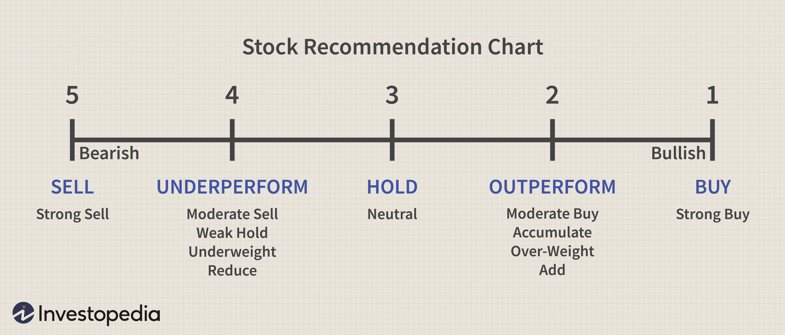

The world of stock trading is vast, offering various strategies for investors to grow their wealth. These strategies encompass diverse approaches such as buying and holding stocks, selling them, and utilizing algorithmic trading to optimize returns. Each strategy presents unique advantages alongside potential drawbacks, necessitating a comprehensive understanding for making informed investment decisions.

Investors looking to navigate the stock market can benefit from exploring these strategies. The "buy and hold" strategy, for example, focuses on acquiring stocks and retaining them over extended periods to benefit from compound growth. Alternatively, knowing when to sell is crucial for capitalizing on gains and minimizing losses, which involves analyzing market conditions and company performance. With technological advancements, algorithmic trading has gained traction, allowing trades to be executed faster and with reduced human error.



A thorough understanding of these methods can significantly impact trading success. By evaluating each approach's merits and limitations, investors can tailor their strategies to align with their financial goals and risk tolerance. Ultimately, mastering these methods can provide a foundation for achieving long-term financial growth in the challenging landscape of stock trading.

## Table of Contents

## Investment Strategies in Stock Trading

Stock trading strategies are diverse, catering to different investor profiles and market conditions. These strategies range from long-term methods, like 'buy and hold', to short-term approaches, which involve frequent trading based on market movements. The 'buy and hold' strategy primarily focuses on purchasing stocks and retaining them for an extended period, capitalizing on the potential for growth through market appreciation and compound interest effect. This method contrasts with strategies that emphasize frequent buying and selling, often aimed at exploiting short-term price fluctuations to generate profits.

The 'buy and hold' approach is often seen as less volatile and less time-consuming than its short-term counterparts, as it involves fewer transactions and thus incurs lower transaction costs. This strategy's potential benefits include reduced stress over daily market fluctuations and lower susceptibility to behavioral biases, such as panic selling during market downturns. However, the potential drawback lies in its vulnerability to sustained market downturns where capital could remain locked without yielding returns for extended periods.

Conversely, short-term trading strategies, including [day trading](/wiki/day-trading-spy) and swing trading, involve actively buying and selling stocks to benefit from short-term price movements. Such strategies can provide quicker returns, but they come with higher risks and require constant market monitoring, technical analysis skills, and a strong understanding of market trends. They also attract higher transaction costs due to the frequent buy-and-sell actions.

Choosing the most suitable strategy requires careful consideration of the investor's financial goals, time commitment, and risk appetite. A long-term, risk-averse investor might gravitate towards the 'buy and hold' strategy, aiming for gradual wealth accumulation, while a more risk-tolerant trader might engage in short-term trading to achieve quicker, albeit riskier, gains.

Ultimately, defining a successful investment strategy is an individualized process that aligns with one’s financial objectives and market outlook. It is essential for traders to understand the nuances of each strategy to make informed decisions that will align with their overall investment goals.

## Buy and Hold: Building Long-term Wealth

The buy and hold strategy is a time-tested investment approach where investors purchase stocks with the intention of retaining them over an extended period, often years. This method capitalizes on the concept of compound growth, where reinvested earnings potentially generate additional earnings over time. Mathematically, compound interest can be expressed as:

$$
A = P \left(1 + \frac{r}{n}\right)^{nt}
$$

where $A$ is the amount of money accumulated after n years, including interest, $P$ is the principal amount (initial investment), $r$ is the annual interest rate, and $n$ is the number of times that interest is compounded per year.

Investors like Warren Buffett, known for his long-term value investing philosophy, advocate for buy and hold due to its simplicity and potential for substantial returns. This strategy minimizes the necessity to time the market, thus mitigating risks associated with volatile market conditions. By avoiding frequent buying and selling, investors can also reduce transaction costs, enhancing overall returns.

Furthermore, the buy and hold approach aligns well with the belief that markets generally increase in value over the long run, despite short-term fluctuations. This philosophy encourages patience and long-term thinking, supporting wealth accumulation through consistent, incremental growth.

## When to Sell: Timing Your Exits

Selling a stock is a pivotal aspect of successful stock trading, often determining the ultimate profitability of an investment. Timing exits effectively requires a strategic approach that considers various market and company-specific indicators. One significant [factor](/wiki/factor-investing) is reaching a predetermined target price, which involves setting a realistic and achievable price objective based on technical and [fundamental analysis](/wiki/fundamental-analysis). For instance, traders might use chart patterns or price-to-earnings ratios to establish these targets.

Changes in market conditions also play a crucial role in the decision to sell. Macroeconomic factors, such as [interest rate](/wiki/interest-rate-trading-strategies) changes, inflation trends, or shifts in fiscal policy, can influence stock prices. For example, an interest rate hike by a central bank could depress equity markets, suggestive of a cautious [exit](/wiki/exit-strategy) strategy for certain stocks. Additionally, industry-specific news, like regulatory changes or technological advancements, can alter the market landscape, prompting re-evaluation of existing positions.

Company performance is another decisive factor in determining when to exit an investment. Indicators such as declining earnings, loss of market share, or negative management outlook may signal a sell decision. Investors should continuously monitor quarterly earnings reports, management communications, and industry analyses to gauge company health. 

Emotional biases, such as attachment to a particular stock or fear of missing out (FOMO), often complicate the selling process. Traders are advised to adhere to logic and strategy over emotions to maintain objectivity. Employing a systematic approach, such as using stop-loss orders or automated trading based on pre-defined rules, can help alleviate emotional interference.

Effective selling not only involves recognizing the right moment to sell but also maximizing profits and limiting potential losses. This can be achieved through disciplined execution, utilizing a combination of limit orders, to capture specified profit margins, and stop orders, to mitigate downside risk. Here is a simple Python snippet illustrating the concept of setting thresholds for selling:

```python
def should_sell(current_price, target_price, stop_loss):
    if current_price >= target_price:
        return "Sell - Target price reached"
    elif current_price <= stop_loss:
        return "Sell - Stop loss triggered"
    else:
        return "Hold"

# Example usage
current_price = 105
target_price = 110
stop_loss = 95

decision = should_sell(current_price, target_price, stop_loss)
print(decision)
```

In summary, determining when to sell a stock requires a blend of market insight, disciplined strategy, and the ability to transcend emotional biases. By focusing on key indicators and executing with precision, traders can optimize their investment outcomes, safeguarding against unnecessary losses while capitalizing on potential gains.

## Algorithmic Trading: Leveraging Technology

Algorithmic trading harnesses the power of computer programs to execute trades based on predefined criteria. This method significantly increases trading efficiency and minimizes human error. By automating the trading process, algorithms can analyze vast amounts of data faster and more accurately than human traders, leading to more timely and informed decision-making.

A major advantage of [algorithmic trading](/wiki/algorithmic-trading) is its popularity among institutional investors, specifically for high-frequency trading ([HFT](/wiki/high-frequency-trading-strategies)). High-frequency trading involves executing a large number of orders at extremely high speeds, often within microseconds. These trades exploit small price discrepancies in the market, which are not noticeable to human traders due to the speed at which they occur. The algorithmic systems used for HFT are capable of managing complex mathematical models and can process multiple markets and instruments simultaneously.

To implement algorithmic trading successfully, one must possess a thorough understanding of both technology and market dynamics. Writing an algorithm requires the combination of programming skills and financial knowledge. The algorithm must be built to accommodate specific trading signals and strategies, which can include statistical [arbitrage](/wiki/arbitrage), [market making](/wiki/market-making), or [trend following](/wiki/trend-following), among others.

For example, a simple moving average crossover strategy can be implemented in Python as follows:

```python
import pandas as pd

# Load data
data = pd.read_csv('stock_data.csv')  # Ensure to have stock data with 'Date' and 'Close' price columns
data['Date'] = pd.to_datetime(data['Date'])
data.set_index('Date', inplace=True)

# Define short and long moving averages
short_window = 40
long_window = 100

# Calculate moving averages
data['Short MA'] = data['Close'].rolling(window=short_window, min_periods=1).mean()
data['Long MA'] = data['Close'].rolling(window=long_window, min_periods=1).mean()

# Generate signals
data['Signal'] = 0
data['Signal'][short_window:] = np.where(data['Short MA'][short_window:] > data['Long MA'][short_window:], 1, 0)

# Generate trading orders
data['Position'] = data['Signal'].diff()

# Print the last few rows to see the signals
print(data.tail())
```

This code creates buy and sell signals when the short-term moving average crosses above or below the long-term moving average.

Despite its advantages, algorithmic trading also poses certain challenges. The need for accurate and rapid data feeds is crucial, as is the robustness of the algorithm. Poorly designed algorithms can magnify losses due to their speed and lack of human oversight. Regulatory compliance is another factor; algorithms must adhere to trading laws and standards to prevent market manipulation.

In conclusion, algorithmic trading represents a significant advancement in trading strategies. It combines the precision and speed of technology with the intricacies of financial markets, offering traders a powerful tool to enhance their trading performance. However, the successful application of this approach demands a deep understanding of both the computational and financial aspects involved.

## Balancing Strategies: A Holistic Approach

Diversifying trading strategies is an important aspect of risk management and can significantly enhance the performance of an investment portfolio. By employing a combination of tactics such as the buy and hold approach alongside selective algorithmic trading actions, investors can optimize their returns while spreading risk across different methodologies.

The buy and hold strategy remains fundamental to many investors. By maintaining a long-term perspective, this strategy focuses on the potential for compound growth and minimizes the impact of short-term market [volatility](/wiki/volatility-trading-strategies). However, blending this with algorithmic trading introduces a level of precision and speed that can capitalize on shorter-term opportunities. Algorithmic trading, which leverages computer programs to execute trades based on pre-set criteria, can effectively complement the conventional buy and hold approach. It allows for strategic rebalancing of the portfolio, responding swiftly to dynamic market conditions.

Investors are encouraged to assess their individual risk tolerance and investment goals to customize their approach accordingly. For instance, a risk-averse investor might favor a more significant reliance on long-term investments, whereas a risk-tolerant investor might engage in frequent algorithmic trading to exploit market fluctuations. Tailoring the choice of strategies helps to align with the investor's financial objectives and comfort level, creating a more personalized and effective investment approach.

Additionally, an adaptive strategy is advantageous as it evolves with market changes. An investor must be prepared to reassess and adjust their strategies in response to new information or shifts in market dynamics. This continuous learning and flexibility can mean modifying the criteria for the algorithms used, adjusting the balance between long-term and short-term holdings, or re-evaluating the sectors and industries that an investor chooses to engage with.

In conclusion, a holistic approach combining various trading strategies serves to create a well-rounded and resilient portfolio. By thoughtfully integrating buy and hold with algorithmic trading and continuously adapting to economic and market shifts, investors can enhance their ability to achieve financial success while maintaining appropriate levels of risk.

## Conclusion

An effective stock trading strategy is critical for achieving financial goals, as it provides a structured approach to navigating the dynamic nature of financial markets. A comprehensive understanding of key strategies such as buy, hold, sell, and algorithmic trading can significantly enhance investment performance. Each strategy has its unique set of advantages and challenges, necessitating a careful analysis of market conditions and personal financial objectives.

Leveraging these strategies begins with a deep appreciation of market dynamics and an investor’s own financial ambitions. For instance, the buy and hold method promotes wealth accumulation over the long term by harnessing the power of compound interest, while precise exit strategies through selling can safeguard and potentially amplify profits. On the technological frontier, algorithmic trading offers precision and speed, reducing the friction of human error in transaction execution. This diversity in approaches allows investors to customize their portfolios according to their risk tolerance and investment horizon.

Adapting to market changes remains essential, as trading environments are constantly influenced by global economic, political, and technological shifts. Investors must remain vigilant, continually educating themselves and adjusting their strategies to accommodate evolving market landscapes. This could involve integrating new financial technologies, adjusting asset allocations, or reevaluating risk assessments. By staying informed and flexible, investors can better position themselves to capitalize on market opportunities and mitigate potential risks.

Ultimately, refining one’s strategies to align with individual financial goals is crucial. Investors are encouraged to not only rely on established strategies but also innovate and personalize their approach to suit their unique circumstances. A tailored strategy, informed by rigorous analysis and adaptable to change, stands as a robust framework for achieving financial success in stock trading.

## References & Further Reading

[1]: Bergstra, J., Bardenet, R., Bengio, Y., & Kégl, B. (2011). ["Algorithms for Hyper-Parameter Optimization."](https://dl.acm.org/doi/10.5555/2986459.2986743) Advances in Neural Information Processing Systems 24.

[2]: Marcos Lopez de Prado. (2018). ["Advances in Financial Machine Learning."](https://www.amazon.com/Advances-Financial-Machine-Learning-Marcos/dp/1119482089) Wiley.

[3]: David Aronson. (2006). ["Evidence-Based Technical Analysis: Applying the Scientific Method and Statistical Inference to Trading Signals."](https://www.amazon.com/Evidence-Based-Technical-Analysis-Scientific-Statistical/dp/0470008741) Wiley.

[4]: Stefan Jansen. (2020). ["Machine Learning for Algorithmic Trading, 2nd Edition."](https://github.com/stefan-jansen/machine-learning-for-trading) Packt Publishing.

[5]: Ernest P. Chan. (2008). ["Quantitative Trading: How to Build Your Own Algorithmic Trading Business."](https://www.amazon.com/Quantitative-Trading-Build-Algorithmic-Business/dp/0470284889) Wiley.