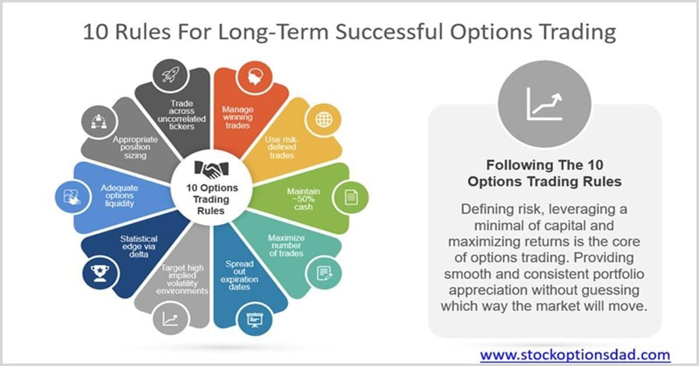

## Table of Contents

## What are stock trading options?

Stock trading options are contracts that give you the right, but not the obligation, to buy or sell a stock at a specific price before a certain date. They are like a bet on whether a stock's price will go up or down. There are two main types of options: calls and puts. A call option lets you buy a stock at a set price, while a put option lets you sell it at a set price.

Options can be used for different reasons. Some people use them to make money by guessing if a stock's price will go up or down. Others use them to protect their investments. For example, if you own a stock and you're worried its price might drop, you can buy a put option to sell it at a higher price than the market might fall to. This can help limit your losses. However, options can be risky because they can expire worthless if the stock price doesn't move the way you expected.

## How do options differ from stocks?

Options and stocks are both ways to invest in the market, but they work differently. When you buy a stock, you own a piece of a company. The value of your stock goes up or down based on how well the company does and what people think about it. You can keep the stock as long as you want, and you might get dividends if the company decides to share its profits with shareholders.

Options, on the other hand, are contracts that give you the right to buy or sell a stock at a certain price before a specific date. You don't own the stock itself; you just have the option to buy or sell it. Options have an expiration date, so if you don't use them by that date, they become worthless. They can be riskier because you can lose the money you paid for the option if the stock doesn't move the way you expected. But they can also be used to make money or protect other investments.

## What are the basic types of options (calls and puts)?

A call option gives you the right to buy a stock at a certain price before a certain date. Imagine you think a stock's price will go up. You can buy a call option for that stock. If the stock's price does go up, you can buy it at the lower price you set in the option and then sell it at the higher market price to make a profit. But if the stock's price doesn't go up, you don't have to buy it, and you just lose the money you paid for the option.

A put option gives you the right to sell a stock at a certain price before a certain date. Let's say you think a stock's price will go down. You can buy a put option for that stock. If the stock's price does drop, you can buy the stock at the lower market price and then sell it at the higher price you set in the option to make a profit. If the stock's price doesn't go down, you don't have to sell it, and you just lose the money you paid for the option.

## What are the essential requirements to start trading options?

To start trading options, you need to have a brokerage account that allows options trading. Not all brokers offer this, so you might need to look around to find one that does. Once you have a broker, you'll need to fill out an options trading application. This usually involves answering questions about your investment experience and how much risk you're willing to take. The broker will review your application to make sure you understand the risks involved in trading options.

After your application is approved, you'll need to fund your account with enough money to cover the cost of the options you want to trade. Options can be cheaper than buying stocks outright, but you still need to have enough cash to buy the options contracts. It's also a good idea to learn about different options strategies and how they work. There are many resources available, like books, online courses, and even some free educational materials from brokers, to help you get started and understand the basics of options trading.

## How does one qualify for options trading with a brokerage?

To qualify for options trading with a brokerage, you first need to have a brokerage account that supports options trading. Not all brokers offer this service, so you might need to shop around to find one that does. Once you find a suitable broker, you'll need to fill out an options trading application. This application will ask you about your investment experience and how much risk you're comfortable with. The broker will review your application to make sure you understand the risks of trading options.

After your application is approved, you'll need to put money into your account to cover the cost of the options you want to trade. Options can be less expensive than buying stocks outright, but you still need enough cash to buy the options contracts. It's also a good idea to learn about different options strategies and how they work. There are many resources available, like books, online courses, and even some free educational materials from brokers, to help you get started and understand the basics of options trading.

## What are the key factors that affect options pricing?

Options pricing is influenced by several key factors. The first is the price of the underlying stock. If the stock price goes up, the price of a call option usually goes up too, because it gives you the right to buy the stock at a lower price. On the other hand, if the stock price goes down, the price of a put option usually goes up, because it gives you the right to sell the stock at a higher price. Another important factor is the time until the option expires. The more time there is until the option expires, the more valuable it can be, because there's more time for the stock price to move in your favor.

Another factor that affects options pricing is the volatility of the underlying stock. If a stock's price moves around a lot, the option is more likely to end up in the money, so it will be more expensive. The opposite is true if the stock's price is stable. Finally, interest rates and dividends can also play a role. Higher interest rates can make call options more expensive and put options cheaper. If a stock pays dividends, that can affect the price of options too, because dividends can change the stock's price.

## How do intrinsic value and time value impact the price of an option?

The price of an option is made up of two parts: intrinsic value and time value. Intrinsic value is how much money you would make if you used the option right now. For a call option, it's the difference between the stock's current price and the price you can buy it at with the option, but only if the stock's price is higher. For a put option, it's the difference between the price you can sell the stock at with the option and the stock's current price, but only if the stock's price is lower. If the option wouldn't make you any money right now, the intrinsic value is zero.

Time value is the other part of an option's price. It's the extra money you pay for the chance that the stock's price will move in your favor before the option expires. The more time there is until the option expires, the more time value it has, because there's more time for the stock's price to change. As the expiration date gets closer, the time value goes down, and the option's price gets closer to its intrinsic value. So, the total price of an option is the sum of its intrinsic value and its time value.

## What are the Greeks and how do they help in options pricing?

The Greeks are a set of measures that help you understand how different factors affect the price of an option. They are called the Greeks because they are named after Greek letters. The most important Greeks are Delta, Gamma, Theta, and Vega. Delta tells you how much the price of an option will change if the price of the stock goes up or down by one dollar. Gamma shows how much Delta will change if the stock price changes. Theta measures how much the option's price will go down as time passes, and Vega tells you how much the option's price will change if the stock's volatility changes.

These Greeks are very helpful because they let you see how sensitive your options are to different things. For example, if you know the Delta of your option, you can guess how much money you might make or lose if the stock's price changes. If you know the Theta, you can see how quickly your option is losing value as it gets closer to expiring. By understanding the Greeks, you can make better choices about which options to buy or sell and how to manage your risk.

## What are some common options trading strategies for beginners?

One common options trading strategy for beginners is buying call options. This is when you think the price of a stock will go up. You buy a call option, which gives you the right to buy the stock at a certain price before the option expires. If the stock's price does go up, you can buy it at the lower price you set in the option and then sell it at the higher market price to make a profit. But if the stock's price doesn't go up, you only lose the money you paid for the option.

Another strategy is buying put options. This is when you think the price of a stock will go down. You buy a put option, which gives you the right to sell the stock at a certain price before the option expires. If the stock's price does drop, you can buy the stock at the lower market price and then sell it at the higher price you set in the option to make a profit. If the stock's price doesn't go down, you only lose the money you paid for the option. Both of these strategies are straightforward and can help beginners get comfortable with how options work.

A third strategy that beginners might find useful is the covered call. This is when you own a stock and you sell a call option on that stock. By doing this, you get paid a premium for selling the option. If the stock's price stays the same or goes down, you keep the premium and the stock. If the stock's price goes up and the option is exercised, you have to sell the stock at the price you set in the option, but you still keep the premium. This strategy can help you make some extra money from stocks you already own, but it also limits how much you can make if the stock's price goes up a lot.

## How can advanced traders use options for hedging and speculation?

Advanced traders can use options for hedging to protect their investments from big losses. Imagine you own a stock and you're worried its price might go down. You can buy a put option to sell the stock at a higher price than what you think it might fall to. This way, if the stock's price does drop, you can sell it at the higher price you set in the option and limit your losses. Hedging with options is like buying insurance for your stocks. It can cost some money, but it can save you from losing a lot if things go wrong.

Options can also be used for speculation, which means trying to make money by guessing how a stock's price will move. If you think a stock's price will go up, you can buy a call option. If the stock's price does go up, you can buy it at the lower price you set in the option and then sell it at the higher market price to make a profit. On the other hand, if you think a stock's price will go down, you can buy a put option. If the stock's price does drop, you can buy the stock at the lower market price and then sell it at the higher price you set in the option to make a profit. Speculating with options can be risky because you can lose the money you paid for the option if the stock's price doesn't move the way you expected, but it can also lead to big gains if you guess right.

## What are the tax implications of trading options?

Trading options can affect your taxes, and it's good to know how. When you make money from options, it's usually counted as capital gains. If you hold the options for less than a year, the gains are short-term and taxed as regular income. If you hold them for more than a year, the gains are long-term and taxed at a lower rate. This is similar to how stocks are taxed, but options can be trickier because they can expire worthless, and you can't claim a loss until they do.

If you lose money on options, you can use those losses to reduce your taxes. You can take up to $3,000 of losses each year to lower your taxable income. If your losses are more than $3,000, you can carry the extra over to future years. But remember, you have to report all your options trades on your tax return, and it can get complicated. It's a good idea to keep good records and maybe talk to a tax professional to make sure you're doing everything right.

## How do regulatory requirements and market conditions influence options trading?

Regulatory requirements can have a big impact on options trading. Different countries have different rules about who can trade options and how they can do it. In the United States, for example, the Securities and Exchange Commission (SEC) and the Financial Industry Regulatory Authority (FINRA) set rules that brokers have to follow. These rules are meant to protect investors and make sure the market is fair. To trade options, you need to be approved by a broker, and they might ask you about your experience and how much risk you're willing to take. This can make it harder for some people to start trading options, but it's meant to keep things safe.

Market conditions also play a big role in options trading. The price of options can go up or down based on what's happening in the stock market and the economy. If the market is doing well and stock prices are going up, the price of call options might go up too, because more people want to buy them. On the other hand, if the market is doing badly and stock prices are going down, the price of put options might go up, because more people want to sell their stocks at a higher price. Things like interest rates, inflation, and big news events can also change how people trade options and what they're willing to pay for them.

## References & Further Reading

[1]: Bergstra, J., Bardenet, R., Bengio, Y., & Kégl, B. (2011). ["Algorithms for Hyper-Parameter Optimization."](https://papers.nips.cc/paper/4443-algorithms-for-hyper-parameter-optimization) Advances in Neural Information Processing Systems 24.

[2]: ["Advances in Financial Machine Learning"](https://www.amazon.com/Advances-Financial-Machine-Learning-Marcos/dp/1119482089) by Marcos Lopez de Prado

[3]: ["Evidence-Based Technical Analysis: Applying the Scientific Method and Statistical Inference to Trading Signals"](https://www.amazon.com/Evidence-Based-Technical-Analysis-Scientific-Statistical/dp/0470008741) by David Aronson

[4]: ["Machine Learning for Algorithmic Trading"](https://github.com/stefan-jansen/machine-learning-for-trading) by Stefan Jansen

[5]: ["Quantitative Trading: How to Build Your Own Algorithmic Trading Business"](https://www.amazon.com/Quantitative-Trading-Build-Algorithmic-Business/dp/1119800064) by Ernest P. Chan