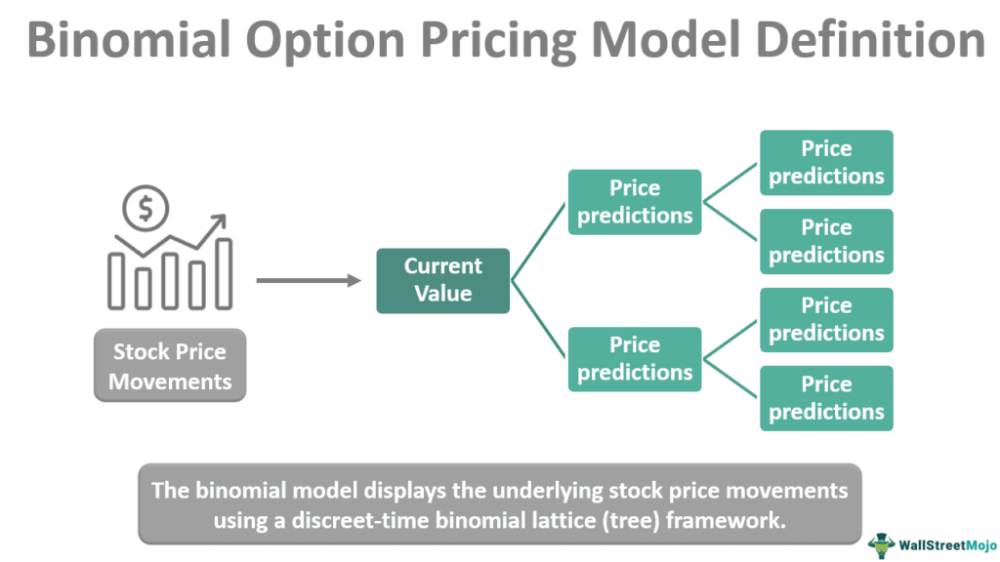

In the ever-evolving landscape of financial markets, various trading strategies have emerged, catering to different investor needs and goals. Options trading, stock trading, pricing rules, and algorithmic trading are some of the major components shaping modern trading practices. Each of these elements brings unique attributes, enabling traders to approach the markets with specific strategies tailored to their financial objectives. 

Options trading allows investors to leverage positions with a relatively small capital outlay, offering flexibility and opportunities for hedging against potential risks. This strategic approach can help manage market volatility and provide potential for significant returns when judiciously applied.

Stock trading, on the other hand, remains the bedrock of investment portfolios, involving the buying and selling of equity shares. It encompasses a broad spectrum of activities, from short-term day trading to long-hold investment strategies. Successful stock trading often relies on a combination of technical and fundamental analyses, aiding traders in making informed decisions based on market trends and company performance.

Pricing rules are fundamental for maintaining market efficiency and fairness. These rules dictate how securities are valued, influenced by factors such as supply and demand dynamics, market sentiment, and overarching economic indicators. Understanding these pricing mechanisms ensures that traders can make informed decisions regarding their market positions.

Algorithmic trading represents the zenith of technological integration within financial markets, employing sophisticated computer algorithms to execute trades at speeds and complexities exceeding human capacity. By capitalizing on market inefficiencies, algorithmic trading strategies have the potential to yield high-frequency gains, despite inherent risks and ethical considerations.

Understanding these components enables traders, both novice and seasoned, to navigate the financial markets with greater confidence. By developing a comprehensive understanding of the roles and interactions of these trading practices, individuals are better equipped to craft strategies that align with their financial goals. This article offers an in-depth exploration of these facets, unveiling their nuances, advantages, and interconnections, to provide strategic insights for successful market participation.

## Table of Contents

## Options Trading: A Strategic Approach

Options trading is a sophisticated financial instrument that offers leverage, flexibility, and the opportunity to hedge against potential risks. At its core, options trading revolves around the fundamental concepts of calls and puts. A call option gives the holder the right, but not the obligation, to purchase an underlying asset at a predetermined price before a specified expiration date. Conversely, a put option entitles the holder to sell the asset under similar terms. These options allow traders to craft strategic market plays, adapting to various market conditions.

Options trading presents significant benefits, including the potential for high returns due to leverage. It allows for precise positioning within the market, enabling strategies that range from conservative to speculative. Options can be used to hedge other investments, offering protection against unfavorable market moves. Moreover, their flexibility permits traders to benefit from various market scenarios, including rising, falling, or stagnant markets.

Despite the advantages, options trading carries risks. The complexity of options strategies can lead to significant losses if not properly managed. Unlike stock trading, an entire investment in options can become worthless if market predictions do not materialize within the option's time frame. This characteristic requires traders to have a robust understanding of the instruments they are using, alongside diligent risk management.

Popular strategies employed in options trading include straddles, strangles, and spreads, each tailored to optimize outcomes in different market environments. A straddle involves purchasing both a call and a put option at the same strike price, allowing traders to exploit large price movements regardless of direction. Strangles are similar but use different strike prices for the call and put options. Spreads involve buying and selling two or more options of the same class, enabling strategies to limit risk while reducing potential returns.

For successful options trading, understanding market variables and precise timing is imperative. Expert insights emphasize the importance of continuously analyzing market trends, [volatility](/wiki/volatility-trading-strategies), and the intrinsic and extrinsic values of options. Such analysis helps traders to make informed decisions on when to enter or [exit](/wiki/exit-strategy) trades.

In summary, while options trading provides considerable opportunities for profit and risk management, it necessitates a comprehensive understanding of the instruments involved and market dynamics. This understanding can empower traders to capitalize on market fluctuations and manage potential downsides effectively.

## Stock Trading: Building Blocks of Investment

Stock trading involves the buying and selling of shares in companies, with the goal of profiting from price movements. Traders engage in various strategies ranging from short-term [day trading](/wiki/day-trading-spy) to long-term investing. Each approach requires a distinct set of tactics and tools tailored to specific market conditions and trader objectives. 

Day trading involves buying and selling securities within the same trading day, capitalizing on small price movements. This strategy demands considerable time and attention, as traders must monitor market developments closely. Technical analysis plays a crucial role here, as traders use historical price data, chart patterns, and indicators such as moving averages, Relative Strength Index (RSI), and MACD to predict future price movements.

Conversely, long-term investing is focused on buying shares to hold over an extended period, often years, to gain from the fundamental growth of companies. Fundamental analysis underpins this approach, involving the evaluation of a company’s financial health, including earnings, revenue, and debt levels. It considers broader economic factors, industry trends, and management effectiveness. Investors look for undervalued stocks with strong growth prospects, employing metrics like the Price-to-Earnings ratio (P/E ratio) and the Discounted Cash Flow (DCF) method.

Market order types are vital in executing stock trades strategically. A limit order sets the maximum or minimum price at which one is willing to buy or sell a stock, offering price control but not guaranteeing execution. Stop-loss orders aim to limit potential losses by automatically selling a stock when it reaches a particular price. These tools help in managing risks and optimizing trade outcomes.

The emotional and psychological facets of stock trading are equally significant. Traders must cultivate discipline, patience, and emotional control to avoid impulsive decisions driven by fear or greed. Successful trading often depends not just on analytical skills but also on the trader’s ability to manage stress and maintain a balanced perspective, especially in volatile markets.

In summary, stock trading is a dynamic activity encompassing a spectrum of strategies and tools. Whether day trading or investing in the long term, understanding technical and [fundamental analysis](/wiki/fundamental-analysis), along with leveraging market order types, is crucial. Equally important is the need for emotional stability and psychological resilience, which can significantly influence trading success.

## Pricing Rules: Understanding Market Valuation

Pricing rules are fundamental to maintaining market efficiency, governance, and ensuring fair trading practices. These rules provide the frameworks and standards for determining prices in various trading environments, impacting how traders and investors make decisions and interact with financial markets.

### Mechanisms and Guidelines for Pricing

Pricing mechanisms in financial markets are established through formal systems, which are governed by regulatory bodies and exchanges. These mechanisms include auction markets, where prices are set through bids and offers, and dealer markets, where prices are determined by market makers. The guidelines for pricing often include transparency requirements, fair access, and protection against manipulative practices.

### Impact of Supply and Demand, Market Sentiment, and Economic Indicators

The price of securities is significantly influenced by the forces of supply and demand. Higher demand pushes prices up if the supply remains constant, whereas an increase in supply with constant demand typically results in lower prices. Market sentiment, or the overall attitude of investors towards a particular market, can also sway prices. Positive sentiment may lead to higher prices as investors buy shares, while negative sentiment can cause selling and lower prices. Additionally, economic indicators, such as GDP growth rates, unemployment rates, and inflation, provide signals that can impact investor expectations and pricing decisions.

### Pricing Methodologies and Their Implications

Different pricing methodologies are employed across markets. For instance, cost-plus pricing involves adding a markup to the cost of a security. Value-based pricing relies on the perceived value from a buyer's standpoint, often influenced by financial analysis and market trends. Algorithmic pricing uses complex computational models to set prices dynamically based on a variety of inputs, including historical prices and volumes.

For traders and investors, understanding these methodologies is crucial, as they influence not only the entry and exit points of trades but also the overall strategy for portfolio management. For example, value-based pricing requires a deep understanding of intrinsic value calculations, often employing discounted cash flow (DCF) models or price-to-earnings (P/E) ratios.

### Real-world Examples

In the stock market, the pricing of Initial Public Offerings (IPOs) provides a tangible example of pricing rules in action. Investment banks often set IPO prices based on extensive evaluations of a company’s market potential, using a combination of supply-demand assessments and pricing models. Another example is in options trading, where the Black-Scholes model is widely used to determine option pricing. This model incorporates factors such as the current stock price, exercise price, time to expiration, and volatility.

In summary, understanding pricing rules and methodologies is essential for navigating financial markets effectively. These rules not only ensure fair and orderly markets but also provide traders and investors with the tools to make informed decisions. By understanding the mechanisms behind pricing, the influence of economic indicators, and real-world applications, market participants can better predict market movements and optimize their trading strategies.

## Algorithmic Trading: The Future of Market Interactions

Algorithmic trading has revolutionized the way financial markets operate by utilizing complex computer algorithms to conduct trading activities at speeds and frequencies surpassing human capabilities. These algorithms can process vast amounts of data, identify trends, and execute trades more efficiently than human traders, thereby capitalizing on market inefficiencies and opportunities. This approach is particularly beneficial in highly liquid markets where rapid decision-making is crucial.

At the core of [algorithmic trading](/wiki/algorithmic-trading) is the ability to leverage sophisticated mathematical models and technological advancements to achieve desired trading outcomes. One of the fundamental strategies used in algorithmic trading is [arbitrage](/wiki/arbitrage). This involves executing simultaneous buying and selling of an asset in different markets to exploit price differentials. Arbitrage relies on the principle that identical or similar financial instruments should sell for the same price across different platforms or locations. Algorithms are designed to recognize and act on these discrepancies within fractions of a second, ensuring profitable outcomes.

Another popular strategy is [trend following](/wiki/trend-following), which involves algorithms analyzing market data to determine and follow existing market trends. These algorithms identify trends by examining historical price data and using statistical analysis techniques. For instance, a simple moving average can help determine the general direction of the market, and algorithms can use this information to enter or exit trades accordingly, with the aim of maximizing returns by staying aligned with prevailing market movements.

Market making is a strategy where algorithmic traders provide [liquidity](/wiki/liquidity-risk-premium) to the markets by placing both buy and sell orders for financial instruments. This strategy involves continuously quoting buy (bid) and sell (ask) prices and profiting from the bid-ask spread. Market-making algorithms enable participants to benefit from small price changes and maintain a balanced portfolio by rapidly responding to market conditions.

While algorithmic trading offers significant advantages, it also presents several risks and ethical considerations. Market volatility, caused by algorithms reacting to large data feeds or erroneous information, poses a threat to market stability. The 2010 "Flash Crash" serves as a notable example of how algorithmic trading can lead to extreme market fluctuations within minutes. Furthermore, the opacity and complexity of algorithms raise ethical concerns, as they can potentially be manipulated to engage in unfair trading practices such as quote stuffing, which involves placing and canceling a large number of orders to create confusion.

Technological advancements continue to shape the future of algorithmic trading. The integration of [artificial intelligence](/wiki/ai-artificial-intelligence) (AI) and [machine learning](/wiki/machine-learning) allows for even more refined analysis and decision-making capabilities. AI-driven algorithms have the potential to assess unstructured data, such as news articles and social media posts, in real-time, providing a more comprehensive view of market sentiment and influencing factors.

Algorithmic trading firms are continuously developing improved strategies through [backtesting](/wiki/backtesting), which involves using historical data to evaluate the performance of new algorithms under various market conditions. Additionally, high-frequency trading ([HFT](/wiki/high-frequency-trading-strategies)), a subset of algorithmic trading, utilizes powerful computing systems to execute orders within microseconds, further enhancing the ability to exploit minute price movements.

With the ongoing evolution of technology, the role of algorithmic trading in financial markets will likely increase, providing both opportunities and challenges for market participants. Traders and investors must remain aware of these developments and adapt to the changing landscape to optimize their trading strategies and mitigate potential risks.

## Integrating Strategies for Optimal Trading Outcomes

Integrating various trading strategies can significantly enhance the potential for optimal trading outcomes. By blending options trading, stock trading, pricing rules, and algorithmic trading, traders can create a comprehensive approach that leverages the strengths of each component while mitigating their weaknesses.

### Synergizing Trading Practices
The interplay among options, stocks, pricing rules, and algorithms can offer a robust trading framework. Options trading provides flexibility and leverage, allowing traders to hedge stock positions or generate income through strategies such as covered calls or protective puts. Stock trading, with its focus on fundamental and technical analysis, can guide strategic entry and exit decisions.

Pricing rules ensure fair valuation and enhance market efficiency, providing valuable insights into optimal pricing strategies within diverse trading environments. Algorithmic trading contributes by executing trades at superior speeds based on predefined criteria, effectively capitalizing on market inefficiencies and arbitrage opportunities.

By integrating these elements, traders can craft strategies that are not only diversified but also adaptive to various market conditions. For instance, using algorithmic models to signal optimal entry points for options spreads based on stock price movements can enhance profitability and reduce risk.

### Case Studies of Successful Integration
One notable example involves a [hedge fund](/wiki/hedge-fund-trading-strategies) that combined [momentum](/wiki/momentum)-based algorithmic models with options strategies to hedge against downside risks while maintaining an aggressive growth portfolio. By using pricing analytics, they identified underpriced options and leveraged algorithmic trading to execute timely trades, resulting in consistent returns even during volatile market periods.

### Actionable Tips for Traders
To effectively combine these trading elements, traders can consider the following approaches:
- **Diversification**: Allocate capital to different strategies to reduce risk and increase exposure to various market opportunities.
- **Continuous Monitoring**: Use algorithmic tools to monitor market conditions and adjust strategies dynamically.
- **Backtesting Strategies**: Implement rigorous backtesting of integrated strategies using historical data to evaluate potential outcomes and risks.
- **Risk Management**: Employ robust risk management techniques like position sizing and stop-loss orders to protect against adverse market movements.

### Continuous Learning and Adaptation
The financial markets are inherently dynamic, with continuous advancements in technology and changes in economic landscapes. Traders should remain committed to lifelong learning, seeking to understand emerging trends and refining their strategies accordingly. Engaging in regular analysis and evaluation of market conditions can lead to insights that drive innovation and adaptation, promoting sustained success in trading.

In conclusion, by understanding and implementing an integrated approach to trading, investors can unlock new levels of strategic capability. By harnessing the combined power of options, stocks, pricing rules, and algorithms, traders can enhance their ability to navigate complex markets and achieve favorable outcomes.

## Conclusion

Navigating the complexities of financial markets requires a comprehensive understanding of diverse trading disciplines, each with its unique set of advantages and challenges. Options trading offers leverage and flexibility, allowing investors to hedge against risks and capitalize on price movements with strategic plays like straddles and spreads. Stock trading, on the other hand, serves as the foundation for investment, enabling traders to profit from price fluctuations through various strategies, ranging from day trading to long-term investment, employing tools such as technical and fundamental analysis.

Pricing rules play a crucial role in ensuring market efficiency and fairness, shaped by mechanisms like supply and demand, market sentiment, and economic indicators. These rules help traders evaluate real-time market valuations and make informed decisions. Algorithmic trading represents the future of market interactions, utilizing sophisticated algorithms to execute trades with precision and speed, capitalizing on market inefficiencies, though it raises ethical considerations and certain risks.

Armed with strategic insights derived from understanding these facets, traders are better equipped to position themselves to achieve their financial objectives. The dynamic landscape of trading continuously presents opportunities for learning and adaptation. To leverage these market opportunities and manage risks effectively, traders must remain informed and flexible, honing their skills and strategies in response to ever-evolving market conditions. This adaptability is crucial for sustaining success and growth in the face of the uncertainties inherent in financial markets.

## References & Further Reading

[1]: Bergstra, J., Bardenet, R., Bengio, Y., & Kégl, B. (2011). ["Algorithms for Hyper-Parameter Optimization."](https://papers.nips.cc/paper/4443-algorithms-for-hyper-parameter-optimization) Advances in Neural Information Processing Systems 24.

[2]: ["Advances in Financial Machine Learning"](https://www.amazon.com/Advances-Financial-Machine-Learning-Marcos/dp/1119482089) by Marcos Lopez de Prado

[3]: ["Evidence-Based Technical Analysis: Applying the Scientific Method and Statistical Inference to Trading Signals"](https://www.amazon.com/Evidence-Based-Technical-Analysis-Scientific-Statistical/dp/0470008741) by David Aronson

[4]: ["Machine Learning for Algorithmic Trading"](https://github.com/stefan-jansen/machine-learning-for-trading) by Stefan Jansen

[5]: ["Quantitative Trading: How to Build Your Own Algorithmic Trading Business"](https://www.amazon.com/Quantitative-Trading-Build-Algorithmic-Business/dp/1119800064) by Ernest P. Chan