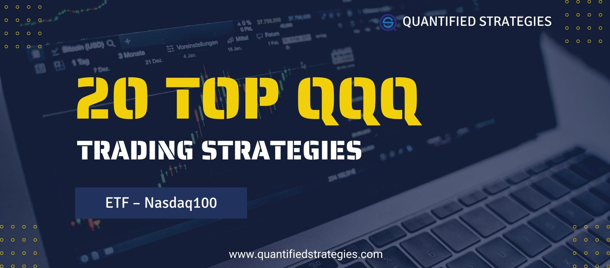

The QQQ trading strategy has emerged as a prominent approach within the field of algorithmic trading, designed to capitalize on prevailing market trends effectively. Central to this strategy is the Invesco QQQ Trust, an Exchange Traded Fund (ETF) that tracks the Nasdaq-100 index. The Nasdaq-100 index is heavily weighted towards technology stocks, a sector known for its high volatility but also for offering substantial returns. This makes QQQ an appealing choice for traders seeking exposure to tech-driven market movements.

Algorithmic trading plays a crucial role in executing QQQ trading strategies by employing computer algorithms to automate complex decision-making processes. This automation removes the influence of human emotions, such as fear and greed, ensuring that strategies are implemented with precision and consistency. The ability of algorithms to process large datasets and execute multiple trades in rapid succession provides an advantage, especially when dealing with the inherent volatility of technology stocks.



This article aims to dissect the components of QQQ trading strategies within the framework of algorithmic trading, highlighting their potential advantages and inherent challenges. By focusing on these strategies, traders can gain insights into optimizing their trades within the tech sector, utilizing the QQQ ETF as a vehicle for both short-term gains and long-term investments. As financial markets continue to evolve, understanding and leveraging the nuances of algorithmic trading with QQQ is increasingly essential for traders aspiring to achieve systematic and profitable outcomes.

## Table of Contents

## Understanding QQQ and Its Market Significance

The Invesco QQQ Trust, commonly referred to as QQQ, is an Exchange-Traded Fund (ETF) that tracks the Nasdaq-100 Index. The Nasdaq-100 Index encompasses 100 of the largest non-financial companies listed on the Nasdaq Stock Market, with a marked concentration on technology-related stocks. As of its current composition, the ETF includes influential players like Apple Inc., Microsoft Corporation, Amazon.com Inc., and Alphabet Inc., among others. This tech-heavy allocation makes QQQ a significant reflection of trends within the technology sector and an indicator of market shifts due to its components' substantial market capitalizations.

Since its inception in March 1999, originally named the "Nasdaq-100 Trust Series 1", QQQ has evolved substantially alongside the expansion and increasing influence of the technology sector. Initially, its prominence grew during the dot-com boom of the late 1990s and early 2000s when technology stocks surged dramatically. Through subsequent market cycles, including the dot-com crash and the 2008 financial crisis, QQQ's liquidity and adaptability were proven by its continued investor interest and robust trading [volume](/wiki/volume-trading-strategy). Its consistent growth trajectory highlights its ability to adapt to fluctuating market conditions while maintaining investor appeal.

The liquidity of QQQ is one of its standout features, ensuring that trades can be executed quickly with minimal price impact, a vital aspect for both individual and institutional investors. This liquidity is supported by its average daily trading volume, which is consistently high, making it one of the most traded ETFs in the world. Moreover, its popularity is reflected in its broad acceptance as a trading and investment instrument, further fueled by its performance-driven history and strong returns, particularly during periods of tech sector growth.

QQQ remains a favored choice for both short-term trading and long-term investment strategies due to its inherent characteristics. For short-term traders, the [ETF](/wiki/etf-trading-strategies)'s [volatility](/wiki/volatility-trading-strategies) provides numerous opportunities for profit from price swings. In contrast, long-term investors are attracted to its potential for capital appreciation driven by the sustained growth and innovation within its underlying companies. Furthermore, its diverse range of powerful tech companies offers a balanced exposure to the technology sector's advancements, making QQQ a strategic component in growth-focused investment portfolios.

In conclusion, QQQ’s structuring and historical performance underscore its market significance. Its tech-centric composition, proven [liquidity](/wiki/liquidity-risk-premium), and dual appeal for various investment timelines contribute to its status as a key instrument for those tracking or investing in the technology sector’s evolution. Its adaptability and resilience across different market epochs secure its place as a staple in the portfolio of many traders and investors.

## Algorithmic Trading: Key Advantages

Algorithmic trading leverages computer algorithms to execute trades, inherently providing a disciplined and systematic methodology. This contrasts sharply with manual trading, which is often susceptible to human error and emotional decision-making. By implementing algorithmically driven strategies, investors can minimize these potential pitfalls, ensuring trades are consistent with pre-defined rules and parameters.

One of the key advantages of [algorithmic trading](/wiki/algorithmic-trading) is its ability to handle and analyze vast datasets swiftly. Algorithms can process large volumes of market data and identify trading opportunities that may be less apparent through manual analysis. This capacity for rapid data processing and execution is particularly crucial for trading volatile assets like the Invesco QQQ Trust (QQQ), where price movements can happen in fractions of a second.

Furthermore, the speed at which algorithms can execute trades is unmatched. They can place numerous trades across different markets and asset classes simultaneously, capturing market inefficiencies that would otherwise be missed by manual trading methods. This speed ensures that trading opportunities can be acted upon at the optimal moment, often leading to better execution prices.

Another significant advantage of algorithmic trading is its ability to backtest strategies against historical data. Traders can use [backtesting](/wiki/backtesting) to evaluate how their algorithm would have performed in past market conditions. This process involves simulating trades using historical data, allowing traders to see potential profits or losses and refine their strategies accordingly. Python is a commonly used language for backtesting due to its robustness and the availability of libraries like Pandas for data manipulation and analysis. This is a simple example of how a backtest might be structured in Python:

```python
import pandas as pd

# Load historical data
data = pd.read_csv('historical_data.csv')

# Define a simple moving average crossover strategy
short_window = 40
long_window = 100

data['short_mavg'] = data['Close'].rolling(window=short_window, min_periods=1, center=False).mean()
data['long_mavg'] = data['Close'].rolling(window=long_window, min_periods=1, center=False).mean()

# Create signals
data['signal'] = 0.0
data['signal'][short_window:] = np.where(data['short_mavg'][short_window:] > data['long_mavg'][short_window:], 1.0, 0.0)

# Generate trading orders
data['positions'] = data['signal'].diff()

# Visualize or further analyze the backtest results here...
```

Through backtesting, traders can optimize their algorithms by identifying the strengths and weaknesses of different strategies. Key performance metrics such as the Sharpe ratio, which measures risk-adjusted returns, and drawdown levels, indicating the decline from a peak to a trough in the capital, can help in understanding the efficiency and risks associated with the strategy.

In summary, algorithmic trading provides a structured approach to market participation, leveraging technology to minimize human error, enhance speed and precision, and refine strategies through historical analysis, thus making it an invaluable tool in the world of trading volatile assets like QQQ.

## Developing a QQQ Trading Strategy

Developing a successful QQQ trading strategy involves a systematic approach that balances technical signals, risk management, and regular evaluation. Key components of such strategies include entry and [exit](/wiki/exit-strategy) signals, effective risk management parameters, and the necessity for periodic reviews to adapt to market changes.

**Entry and Exit Signals**

Identifying the right entry and exit points is crucial for capturing profits and minimizing losses. Moving averages are often employed to detect trends within the QQQ market effectively. A common method involves the use of two moving averages—short-term and long-term. For example:

- **Simple Moving Average (SMA):** 
$$
  \text{SMA}_n = \frac{1}{n} \sum_{i=0}^{n-1} P_{t-i}

$$

  where $P_{t-i}$ represents the price at time $t-i$, and $n$ is the number of periods.

Entry signals often occur when a short-term moving average crosses above a long-term average, indicating a potential upward trend. Conversely, exit signals might be identified when the short-term average crosses below the long-term one.

**Mean Reversion Principles**

Mean reversion assumes that prices will return to their average over time. In QQQ trading, this principle can be applied by identifying significant deviations from the average price, which might indicate trading opportunities. This method involves calculating the average price over a specified period and using it as a benchmark. When prices deviate significantly from this average, traders can anticipate a return to the mean, signaling a buy or sell opportunity.

**Coding the Strategy**

The effectiveness of a trading strategy can be enhanced through automation, enabling consistent execution and backtesting. Python is a preferred language for this purpose due to its extensive libraries such as NumPy, Pandas, and TA-Lib, which provide tools for quantitative analysis and technical indicators. An example of using Python to calculate SMAs might look like this:

```python
import pandas as pd

# Sample data: Adjust 'data' with actual historical price data
data = {'Price': [1, 2, 3, 4, 5, 6, 7, 8, 9, 10]}
df = pd.DataFrame(data)

# Calculate moving averages
short_window = 5
long_window = 20

df['Short_SMA'] = df['Price'].rolling(window=short_window, min_periods=1).mean()
df['Long_SMA'] = df['Price'].rolling(window=long_window, min_periods=1).mean()

# Display the moving averages
print(df)
```

Trading platforms like QuantConnect and TradingView offer robust environments to implement and test these strategies. They support the seamless integration of coding for algorithmic evaluations and provide tools for evaluating strategy performance.

Developing a QQQ trading strategy requires an understanding of technical signals, appropriate coding for automation, and the periodic evaluation of strategy performance to ensure it remains effective under varying market conditions. By leveraging moving averages and mean reversion, traders can structure strategies that aim to capture profitable opportunities within the volatile QQQ market.

## Backtesting QQQ Strategies

Backtesting is a crucial step in validating QQQ trading strategies, as it allows traders to assess the potential profitability and robustness of their approach before implementing it in live markets. By testing a strategy against historical data, traders gain insights into its performance across various market conditions, ensuring the strategy’s effectiveness and reliability.

Several tools and platforms facilitate efficient backtesting of QQQ strategies. QuantConnect and TradingView are among the most popular choices due to their extensive features and ease of use. QuantConnect offers a powerful cloud-based algorithmic trading platform that supports multiple programming languages, enabling traders to write, test, and deploy strategies seamlessly. TradingView, on the other hand, provides a user-friendly interface with scripting capabilities through Pine Script, allowing users to create custom indicators and backtest them on historical data.

The use of historical data in backtesting is vital for understanding how a strategy would have performed in different market environments. Traders can access comprehensive datasets that include past prices, volumes, and other relevant market information to simulate trading scenarios. This process helps identify potential weaknesses and optimize strategy parameters to maximize returns and mitigate risks.

When evaluating a backtested strategy's performance, several statistical metrics are essential for comprehensive analysis. The Sharpe ratio is a widely used measure that evaluates the risk-adjusted return of an investment strategy. It is calculated as:

$$
\text{Sharpe Ratio} = \frac{(R_p - R_f)}{\sigma_p}
$$

where $R_p$ is the expected portfolio return, $R_f$ is the risk-free rate, and $\sigma_p$ is the standard deviation of the portfolio returns. A higher Sharpe ratio indicates a more desirable risk-adjusted return.

Another critical metric is the drawdown, which measures the peak-to-trough decline in the value of an investment. It provides insights into the risk exposure of a trading strategy, highlighting periods of substantial loss. Minimizing drawdown is crucial for maintaining investor confidence and ensuring the strategy’s sustainability.

By using these tools, data, and metrics, traders can rigorously test their QQQ strategies, paving the way for more informed decision-making and ultimately improving their chances of success in algorithmic trading.

## Risk Management in QQQ Algorithmic Trading

Risk management is a fundamental aspect of algorithmic trading, particularly in trading instruments like QQQ. A well-defined risk management framework protects trading capital and helps maintain the long-term viability of any trading strategy.

### Position Sizing Strategies

Position sizing is a critical component for controlling risk exposure. It involves determining the size of each trade based on individual risk tolerance and market volatility. Position sizing can be computed using the formula:

$$
\text{Position Size} = \frac{\text{Account Risk} \times \text{Account Equity}}{\text{Trade Risk}}
$$

where:
- **Account Risk** is a percentage of the account equity that the trader is willing to risk on a single trade.
- **Account Equity** is the total capital available in the trading account.
- **Trade Risk** is the difference between the entry price and the stop-loss price.

By using dynamic position sizing, traders can adjust their exposure to market volatility. This approach aligns trading activities with personal risk preferences and market conditions.

### Stop-Loss and Take-Profit Levels

Implementing stop-loss and take-profit mechanisms is essential in managing risk. A stop-loss order is designed to limit an investor's loss on a position by triggering a sale if the asset's price drops to a predefined level. Conversely, a take-profit order automatically locks in profits when a price target is reached, allowing traders to secure gains without constant monitoring.

### Regularly Updating Risk Parameters

Market dynamics are continually evolving, necessitating regular updates to risk management parameters. Traders should regularly reassess factors such as:
- Position size adjustments in response to increased or reduced market volatility.
- Revising stop-loss and take-profit levels based on recent price movements and volatility.
- Aligning trading strategies with personal financial goals and changes in market outlook.

By continuously refining these parameters, traders can better adapt to the ever-changing landscape of financial markets, ensuring strategies remain relevant and effective. This dynamic approach to risk management not only enhances the potential for maximized returns but also safeguards against unexpected market downturns, ensuring sustained trading success.

## Conclusion

Algorithmic trading with QQQ represents a promising avenue for profit generation, predicated on its capacity to automate decision-making and systematically capture market opportunities. However, it is not without inherent risks typical of stock market investments. A successful strategy for trading QQQ involves a comprehensive integration of critical components: backtesting, risk management, and ongoing evaluation. 

Backtesting is crucial as it allows traders to verify their strategies against historical data, ensuring they are robust and adaptable to various market conditions. By analyzing past performance, traders can identify potential pitfalls and strengths in their strategies, refining them for better future performance. 

Risk management plays a pivotal role in safeguarding trading capital, offering the framework necessary to withstand market volatility. Implementing rigorous risk controls helps in mitigating potential losses and maintaining the longevity of the trading strategy. Techniques such as setting stop-loss orders and determining proper position sizing based on calculated risk levels can be instrumental in achieving this goal. 

Continuous learning and adaptation are key in navigating the ever-evolving market landscape. Traders need to constantly update their strategies to reflect changing market dynamics and integrate new insights gained from market data. This iterative process ensures the strategy remains effective, leveraging technological advancements and adjustments based on predictive analytics.

Encouragement is given to traders to continuously explore and innovate within the algorithmic trading framework, enhancing their strategies using the tools and methodologies available. Emphasis on the integration of technological solutions, such as Python for coding and backtesting, enables traders to refine their approaches, ultimately aiming for optimal results in QQQ algorithmic trading.

## References & Further Reading

[1]: ["Algorithmic and High-Frequency Trading"](https://assets.cambridge.org/97811070/91146/frontmatter/9781107091146_frontmatter.pdf) by Álvaro Cartea, Sebastian Jaimungal, and José Penalva

[2]: ["Advances in Financial Machine Learning"](https://www.amazon.com/Advances-Financial-Machine-Learning-Marcos/dp/1119482089) by Marcos Lopez de Prado

[3]: ["Evidence-Based Technical Analysis: Applying the Scientific Method and Statistical Inference to Trading Signals"](https://www.amazon.com/Evidence-Based-Technical-Analysis-Scientific-Statistical/dp/0470008741) by David Aronson

[4]: ["Quantitative Trading: How to Build Your Own Algorithmic Trading Business"](https://books.google.com/books/about/Quantitative_Trading.html?id=j70yEAAAQBAJ) by Ernest P. Chan

[5]: ["Python for Finance: Mastering Data-Driven Finance"](https://books.google.com/books/about/Python_for_Finance.html?id=2qd9DwAAQBAJ) by Yves Hilpisch

[6]: Nanex Research, ["The May 6, 2010 Flash Crash Analysis"](https://corporatefinanceinstitute.com/resources/equities/2010-flash-crash/)

[7]: ["Machine Learning for Algorithmic Trading"](https://github.com/stefan-jansen/machine-learning-for-trading) by Stefan Jansen