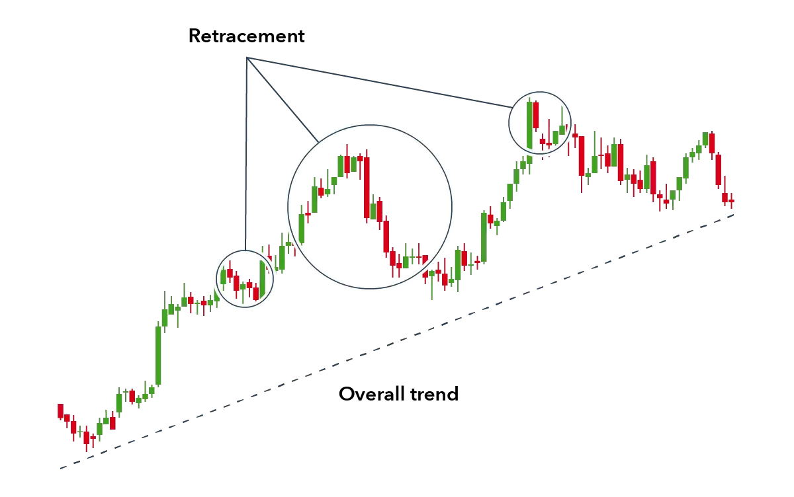

## Table of Contents

## What is stock trading and why is it important?

Stock trading is when people buy and sell pieces of companies, called stocks, on a special place called the stock market. When you buy a stock, you own a small part of that company. People trade stocks to try to make money. If the company does well, the price of the stock goes up, and you can sell it for more than you paid. If the company does poorly, the price goes down, and you might lose money.

Stock trading is important for a few reasons. First, it helps companies get money they need to grow. When a company sells stocks, it gets money from people who buy them. This money can be used to build new factories, hire more workers, or create new products. Second, stock trading lets people invest their money and possibly earn more. This can help people save for things like buying a house or retiring. Overall, stock trading helps the economy by connecting people who want to invest with companies that need money to grow.

## What are the basic principles of a stock trading strategy?

A good stock trading strategy starts with understanding what you want to achieve. Are you looking to make quick profits, or are you planning to invest for the long term? Once you know your goal, you can choose stocks that fit your plan. For quick profits, you might pick stocks that go up and down a lot, trying to buy low and sell high. For long-term investing, you might choose stable companies that grow slowly but steadily over time.

Another important part of a stock trading strategy is managing risk. This means not putting all your money into one stock or one type of stock. Instead, you spread your money across different stocks and industries. This way, if one stock does badly, you won't lose all your money. It's also smart to set rules for when to sell a stock, like if it drops a certain amount or if it reaches a target price. Following these rules can help you avoid making decisions based on emotions.

Lastly, staying informed is key. You need to keep up with news about the companies you invest in and the overall market. This can help you make better decisions about when to buy or sell. Using tools like stock charts and financial reports can also give you a clearer picture of how a stock is doing. By combining these principles—setting clear goals, managing risk, and staying informed—you can build a solid stock trading strategy.

## How can beginners start developing a simple trading strategy?

To start developing a simple trading strategy, beginners should first decide what they want to achieve. Are they looking to make money quickly, or do they want to invest for a long time? Once they know their goal, they can pick stocks that match it. For quick profits, they might choose stocks that change a lot in price, trying to buy them when they're low and sell them when they're high. For long-term investing, they should look for companies that grow steadily over time. This decision will guide all their other choices in trading.

Next, beginners need to learn about managing risk. This means not putting all their money into one stock. Instead, they should spread their money across different stocks and industries. This way, if one stock does badly, they won't lose everything. They should also set clear rules for when to sell a stock, like if it drops a certain amount or reaches a target price. Following these rules helps them avoid making decisions based on feelings. By setting goals and managing risk, beginners can start building a simple trading strategy.

## What are the most common types of stock trading strategies?

There are several common types of stock trading strategies that people use. One popular strategy is called "buy and hold." This means you buy stocks and keep them for a long time, hoping the company will grow and the stock price will go up. It's a good strategy for people who don't want to watch the market all the time. Another strategy is "[day trading](/wiki/day-trading-spy)," where you buy and sell stocks in the same day. Day traders try to make quick profits from small changes in stock prices. This can be exciting but also risky because it takes a lot of time and attention.

Another common strategy is "swing trading." Swing traders hold stocks for a few days or weeks, trying to catch bigger moves in stock prices. They look for patterns in how stocks move to decide when to buy and sell. "Value investing" is another strategy where people look for stocks that they think are priced lower than they should be. They buy these stocks and wait for the market to realize the true value, hoping the price will go up. Each of these strategies has its own risks and rewards, so it's important to pick one that fits your goals and how much time you can spend on trading.

## How do fundamental analysis and technical analysis differ in stock trading?

Fundamental analysis and technical analysis are two different ways to look at stocks. Fundamental analysis is about understanding a company's true value. People who use this method look at things like how much money the company makes, how much it owes, and how fast it's growing. They read reports and news to see if the company is a good investment. If they think the stock is worth more than its current price, they might buy it, hoping the price will go up as more people see the company's true value.

Technical analysis is different. It's all about looking at charts and patterns in stock prices. People who use technical analysis don't care as much about the company's business. Instead, they try to predict where the stock price is going by studying past price movements. They look for signs like when a stock price goes up and down in a certain way, or when more people are buying or selling the stock. They use this information to decide when to buy or sell, hoping to make money from short-term changes in the stock price.

## What role does risk management play in a trading strategy?

Risk management is a big part of any trading strategy. It's about making sure you don't lose too much money. When you trade stocks, there's always a chance that the price will go down instead of up. To manage this risk, you don't put all your money into one stock. Instead, you spread it out over different stocks and industries. This way, if one stock does badly, you won't lose everything. It's like not putting all your eggs in one basket.

Another important part of risk management is setting rules for when to sell a stock. You might decide to sell if a stock drops a certain amount, or if it reaches a price you're happy with. These rules help you make decisions based on a plan, not just feelings. By managing risk, you can keep trading without losing too much money, even if some trades don't go your way.

## How can traders use moving averages to enhance their trading strategies?

Moving averages are a popular tool that traders use to make better trading decisions. A moving average is just the average price of a stock over a certain number of days. Traders often use two kinds of moving averages: a short one, like 50 days, and a long one, like 200 days. When the short moving average goes above the long one, it might mean the stock price is going to go up. This is called a "golden cross." On the other hand, if the short moving average goes below the long one, it might mean the stock price is going to go down. This is called a "death cross." By watching these moving averages, traders can decide when to buy or sell a stock.

Using moving averages can help traders see the bigger picture and not get too caught up in small daily changes. For example, if a stock's price is jumping around a lot but stays above the moving average, it might still be a good time to buy. Moving averages can also help traders set their goals. If a stock's price is below its moving average, a trader might decide to sell it if it doesn't go back above the average soon. By using moving averages, traders can make more informed decisions and manage their risks better.

## What are the advantages and disadvantages of day trading versus swing trading?

Day trading means buying and selling stocks in the same day. The big advantage of day trading is that you can make quick money. If you're good at it, you can catch small changes in stock prices and make a profit. It's exciting and can be very rewarding if you do it right. But day trading has big risks too. It takes a lot of time and attention. You have to watch the market all day, and one bad trade can wipe out your gains. It's also easy to let emotions take over, which can lead to bad decisions.

Swing trading is different because you hold stocks for a few days or weeks. The main advantage of swing trading is that it's less stressful than day trading. You don't have to watch the market every minute, so it's easier to fit into a busy life. Swing trading can also catch bigger moves in stock prices, which might lead to bigger profits. But swing trading has its downsides too. It can take longer to see results, and if the market changes suddenly, you might lose money while waiting for the right time to sell. Plus, you need to be patient and stick to your plan, which can be hard if the stock isn't moving as you hoped.

## How can advanced traders use options and futures in their strategies?

Advanced traders can use options and futures to make their trading strategies more flexible and powerful. Options give traders the right, but not the obligation, to buy or sell a stock at a certain price before a certain date. This means they can use options to bet on whether a stock's price will go up or down without having to buy the stock itself. For example, if a trader thinks a stock will go up, they can buy a call option. If they're right, they can make a lot of money with a small investment. Futures, on the other hand, are agreements to buy or sell something at a future date for a price agreed on now. Traders use futures to guess where prices will be in the future, which can be useful for managing risk or making big profits.

Using options and futures can help advanced traders do things that are harder with just stocks. For example, they can use options to protect their investments from big losses. If they own a stock and are worried it might go down, they can buy a put option to sell it at a certain price, limiting how much they could lose. Futures can help traders make money from changes in the market that they expect to happen later. For instance, if they think the price of oil will go up in the next few months, they can buy oil futures now and sell them later at a higher price. Both options and futures need a lot of knowledge and careful planning, but they can make a trader's strategy more effective.

## What are algorithmic trading strategies and how are they implemented?

Algorithmic trading strategies use computers to buy and sell stocks automatically. Traders write special programs, called algorithms, that follow certain rules to make trading decisions. These rules can be based on things like stock prices, trading [volume](/wiki/volume-trading-strategy), or even news events. The computer watches the market all the time and makes trades when the rules say it should. This can happen very quickly, sometimes in just a few seconds. Algorithmic trading can help traders make money by taking advantage of small changes in the market that are hard for people to spot.

To implement [algorithmic trading](/wiki/algorithmic-trading), traders first need to create their algorithms. They use math and computer code to tell the program what to look for and what to do when it sees certain signs. Once the algorithm is ready, traders connect it to the stock market through special software. This software lets the computer send buy and sell orders without any human help. Traders can then watch how the algorithm performs and make changes to it if needed. This kind of trading needs a lot of technical knowledge, but it can be very powerful for those who know how to use it well.

## How does market sentiment affect stock trading strategies?

Market sentiment is how people feel about the stock market. It can be positive, meaning people think the market will go up, or negative, meaning they think it will go down. This feeling can affect what traders do. If the sentiment is positive, traders might buy more stocks because they think prices will keep going up. If the sentiment is negative, they might sell their stocks or wait to buy, hoping prices will drop first. Understanding market sentiment can help traders make better decisions because they can see what other people are thinking and doing.

Traders can use market sentiment in their strategies in different ways. They might look at news and social media to see what people are saying about the market. They can also use special tools that measure sentiment, like the fear and greed index. If these tools show that people are very excited or very scared, it might be a sign that the market is about to change. By paying attention to market sentiment, traders can adjust their plans. For example, if everyone is very positive, a trader might decide to sell some stocks to take profits before the market cools down. If everyone is very negative, they might see it as a chance to buy stocks at lower prices.

## What are the latest trends and tools in stock trading strategies for expert traders?

Expert traders are now using more advanced tools and following new trends to make their trading strategies better. One big trend is using [artificial intelligence](/wiki/ai-artificial-intelligence) (AI) and [machine learning](/wiki/machine-learning). These technologies can look at huge amounts of data quickly and find patterns that people might miss. Traders use AI to make predictions about stock prices and to make automatic trades. Another trend is using social media and news analysis to understand market sentiment. Tools like sentiment analysis software can read what people are saying online and help traders know if the market is feeling positive or negative. This can help them decide when to buy or sell.

Another tool that's becoming popular is called high-frequency trading ([HFT](/wiki/high-frequency-trading-strategies)). This is when computers make a lot of trades very quickly, sometimes in just milliseconds. HFT can help traders take advantage of small price changes that happen in the blink of an eye. Also, more traders are using advanced charting software and technical indicators. These tools help them see patterns in stock prices and make better decisions. For example, they might use something called the Relative Strength Index (RSI) to see if a stock is overbought or oversold. By using these new tools and trends, expert traders can make their strategies more effective and stay ahead in the fast-changing world of stock trading.

## What are the strategies for trading one stock?

Trading a single stock using algorithmic strategies allows traders to focus deeply on the nuances and patterns specific to that stock. Various strategies can be employed to capitalize on market movements, each with unique advantages and techniques tailored for optimal execution.

**Trend Following**: This strategy involves identifying and acting upon trends in the stock's price movement. Moving averages, such as the simple moving average (SMA) or exponential moving average (EMA), are commonly used indicators in this strategy. For instance, an algorithm might buy a stock when the short-term EMA crosses above the long-term EMA (a bullish crossover) and sell when the opposite occurs. Trend-following strategies aim to capitalize on the momentum of the stock, assuming that trends tend to persist over time.

**Mean Reversion**: Mean reversion strategies are based on the assumption that the stock's price will revert to its historical average over time. If the stock is currently priced below its mean, a mean reversion strategy would entail buying the stock, anticipating a price increase. Conversely, if the stock is above the mean, the strategy would suggest selling. Calculating the z-score of a stock price relative to its moving average can provide a quantitative basis for these decisions:

$$
z = \frac{{\text{Price} - \text{Moving Average}}}{{\text{Standard Deviation}}}
$$

A positive z-score indicates that the price is above the average, while a negative z-score suggests it's below.

**Arbitrage Opportunities**: Although traditional arbitrage seeks pricing discrepancies between different markets or instruments, micro-arbitrage within a single stock requires identifying mispricings in different forms of the stock, such as variations in options pricing or exploiting very short-term inefficiencies. Despite being less common and more challenging within a single stock, these opportunities can arise and offer low-risk profits if executed swiftly.

**Market Sentiment Analysis**: This involves utilizing sentiment indicators from various sources to predict stock price movements. Algorithms can be programmed to analyze social media, news articles, and other relevant media to gauge investor sentiment. Python libraries such as NLTK or TextBlob can be employed to process and quantify textual data:

```python
from textblob import TextBlob

def get_sentiment(text):
    analysis = TextBlob(text)
    return analysis.sentiment.polarity
```

A high polarity indicates positive sentiment, suggesting a potential buying opportunity, while negative polarity may be a bearish signal.

**Volume-Weighted Average Price (VWAP)**: VWAP is a trading benchmark that represents the average price a stock has traded at during the day, based on both volume and price. It assists traders in executing large orders with minimal impact on the market price. The formula for VWAP is:

$$
\text{VWAP} = \frac{\sum (\text{Price} \times \text{Volume})}{\sum \text{Volume}}
$$

Traders aim to execute trades close to the VWAP to ensure an average price level that is reflective of the overall trading session.

**Developing Proprietary Indicators**: Crafting custom indicators tailored to a specific stock can provide an edge. By analyzing historical price data and identifying unique patterns or behaviors, traders can create indicators that signal potential buy or sell points. For example, a custom indicator might factor in the stock's historical volatility or combine multiple traditional indicators to improve trade accuracy.

In summary, selecting and applying one or more of these strategies requires not only a deep understanding of the stock in question but also the ability to leverage computational tools and frameworks for automated analysis and execution. Proper implementation of these strategies can enhance the effectiveness of trading a single stock.

## What is Risk Management in Single Stock Trading?

Risk management is a fundamental aspect of trading a single stock through algorithmic strategies, primarily due to the absence of diversification which naturally increases exposure to specific stock risks. The following are key considerations and techniques for effectively managing these risks:

1. **Stop-Loss Orders**: Implementing stop-loss orders is essential for protecting against sudden adverse price movements. Stop-loss orders automatically sell the stock if it reaches a predetermined price level, thus limiting potential losses. For instance, a trader might set a stop-loss order at 5% below their entry price, ensuring that their maximum loss is capped at this level. 

2. **Position Sizing**: Calculating position size is critical and should align with the trader’s risk tolerance and the stock's volatility. A common method is to use the formula:
$$
   \text{Position Size} = \frac{\text{Risk Per Trade}}{\text{Stop Loss Distance}}

$$
   where the risk per trade is a fixed percentage of the trader’s total capital they are willing to risk. For a stock with high volatility, a smaller position may be necessary to maintain a manageable risk level.

3. **Strategy Review and Adaptation**: Trading strategies require regular review to ensure they remain effective under current market conditions. This might include adjustments based on new financial data, changes in trading volume, or shifts in market sentiment. Algorithmic adjustments can encompass changes to parameters like moving averages or volatility thresholds within the trading algorithm.

4. **Scenario Analysis and Stress Testing**: These tools help traders anticipate and prepare for extreme market situations. By simulating various market conditions such as sharp price declines or spikes, traders can evaluate the algorithm's performance and identify weaknesses. Stress tests might simulate historical events, like the 2008 financial crisis, to test how the algorithm would respond under similar conditions.

5. **Market Intelligence and News Monitoring**: Keeping abreast of any corporate actions, such as earnings reports, mergers, or dividend announcements, is crucial as these can significantly impact the stock's price and trading behavior. Incorporating a news sentiment analysis component within the trading algorithm may provide real-time updates and insights, helping to adjust positions as necessary.

Risk management is an ongoing process that requires vigilance and the ability to adapt strategies based on evolving market conditions. By implementing strong risk management practices, traders can better protect their investments while pursuing profitability through algorithmic trading strategies.

## References & Further Reading

[1]: Bergstra, J., Bardenet, R., Bengio, Y., & Kégl, B. (2011). ["Algorithms for Hyper-Parameter Optimization."](https://dl.acm.org/doi/10.5555/2986459.2986743) Advances in Neural Information Processing Systems 24.

[2]: ["Advances in Financial Machine Learning"](https://www.amazon.com/Advances-Financial-Machine-Learning-Marcos/dp/1119482089) by Marcos Lopez de Prado

[3]: ["Evidence-Based Technical Analysis: Applying the Scientific Method and Statistical Inference to Trading Signals"](https://www.amazon.com/Evidence-Based-Technical-Analysis-Scientific-Statistical/dp/0470008741) by David Aronson

[4]: ["Machine Learning for Algorithmic Trading"](https://github.com/stefan-jansen/machine-learning-for-trading) by Stefan Jansen

[5]: ["Quantitative Trading: How to Build Your Own Algorithmic Trading Business"](https://books.google.com/books/about/Quantitative_Trading.html?id=j70yEAAAQBAJ) by Ernest P. Chan